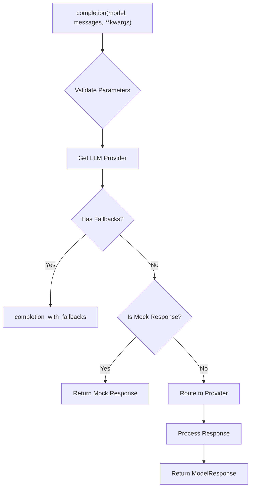
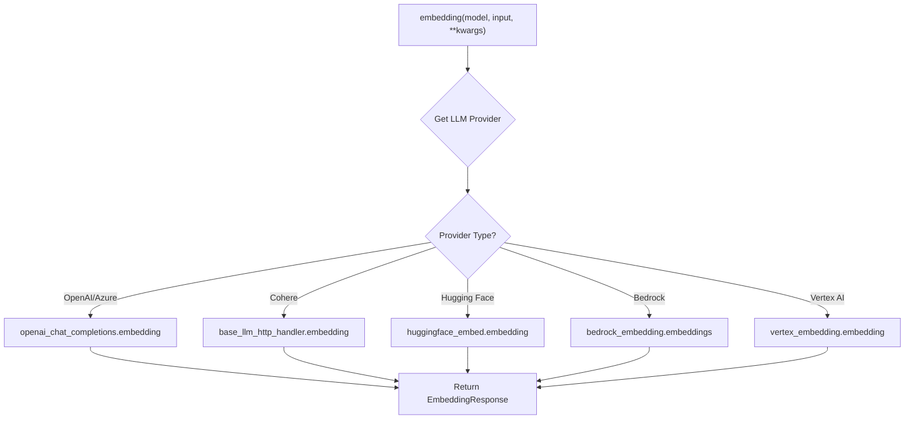
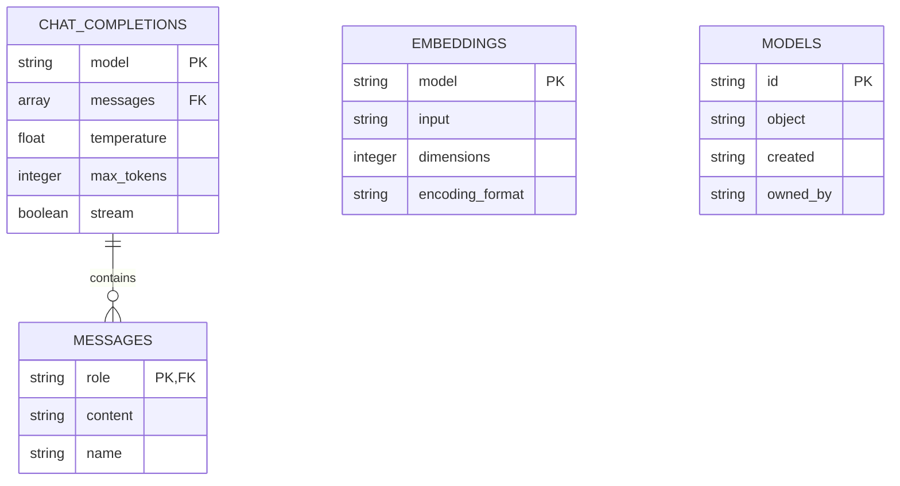
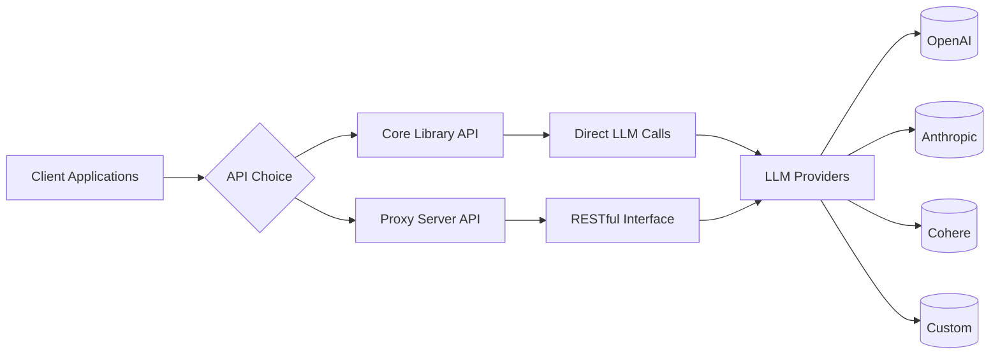

# API Reference

<cite>
**Referenced Files in This Document**   
- [main.py](file://litellm/main.py)
- [openapi.json](file://litellm/proxy/openapi.json)
- [proxy_server.py](file://litellm/proxy/proxy_server.py)
</cite>

## Table of Contents
1. [Introduction](#introduction)
2. [Core API Functions](#core-api-functions)
3. [Proxy API Endpoints](#proxy-api-endpoints)
4. [Client Library Usage](#client-library-usage)
5. [Performance Considerations](#performance-considerations)
6. [Error Handling](#error-handling)
7. [Relationship Between Core and Proxy APIs](#relationship-between-core-and-proxy-apis)

## Introduction
LiteLLM provides a unified interface for accessing multiple large language models through a single API. The library offers both a core Python library for direct integration and a proxy server for RESTful access. This documentation covers the public interfaces of both systems, including completion, embedding, and image generation capabilities.

**Section sources**
- [main.py](file://litellm/main.py#L1-L800)

## Core API Functions

### Completion Functions
The core API provides synchronous and asynchronous completion functions that support 100+ LLM providers. The `completion` function is the primary interface for text generation, while `acompletion` provides asynchronous capabilities.

**Parameters:**
- **model** (str): The name of the language model to use (required)
- **messages** (List): A list of message objects representing the conversation context
- **temperature** (float): Controls randomness of output (default: 1.0)
- **max_tokens** (int): Maximum number of tokens to generate
- **stream** (bool): If True, returns a streaming response
- **tools** (List): Function calling tools to include in the request
- **tool_choice** (Union[str, dict]): Controls how the model responds to function calls
- **timeout** (float): Maximum execution time in seconds
- **api_key** (str): API key for the LLM provider
- **base_url** (str): Base URL for the API endpoint

The function supports all standard OpenAI parameters and extends them with LiteLLM-specific features like model fallbacks, caching, and custom pricing.



**Diagram sources**
- [main.py](file://litellm/main.py#L989-L1599)

**Section sources**
- [main.py](file://litellm/main.py#L989-L1599)

### Embedding Function
The `embedding` function generates vector embeddings for text input across multiple providers.

**Parameters:**
- **model** (str): The embedding model to use (required)
- **input** (Union[str, List[str]]): Text to generate embeddings for
- **dimensions** (int): Number of dimensions for output embeddings
- **encoding_format** (str): Format for returned embeddings ("float" or "base64")
- **timeout** (float): Request timeout in seconds (default: 600)

The function supports providers including OpenAI, Cohere, Hugging Face, Bedrock, and Vertex AI, automatically routing requests based on the model specified.



**Diagram sources**
- [main.py](file://litellm/main.py#L4268-L5000)

**Section sources**
- [main.py](file://litellm/main.py#L4268-L5000)

### Image Generation Function
The `image_generation` function creates images from text prompts using various AI image models.

**Parameters:**
- **model** (str): The image generation model to use
- **prompt** (str): Text description of the desired image
- **n** (int): Number of images to generate
- **size** (str): Dimensions of the generated image (e.g., "1024x1024")
- **quality** (str): Quality level ("standard", "hd")
- **style** (str): Style of the generated image

The function supports providers like Stability AI, DALL-E, and various Vertex AI image models, with provider-specific parameters automatically handled.

**Section sources**
- [main.py](file://litellm/main.py#L5000-L6921)

## Proxy API Endpoints

### OpenAPI Specification
The LiteLLM proxy server exposes a RESTful API documented in OpenAPI 3.0 format. The specification defines endpoints for chat completions, text completions, model listing, and server management.



**Diagram sources**
- [openapi.json](file://litellm/proxy/openapi.json#L1-L238)

### Chat Completions Endpoint
The `/chat/completions` endpoint is the primary interface for text generation through the proxy server.

**HTTP Method:** POST
**URL Pattern:** `/chat/completions`

**Request Schema:**
```json
{
  "model": "string",
  "messages": [
    {
      "role": "string",
      "content": "string",
      "name": "string",
      "function_call": {}
    }
  ],
  "temperature": 0,
  "top_p": 0,
  "n": 0,
  "stream": false,
  "stop": [],
  "max_tokens": 0,
  "presence_penalty": 0,
  "frequency_penalty": 0,
  "logit_bias": {},
  "user": "string"
}
```

**Response Schema (200 OK):**
```json
{
  "id": "string",
  "object": "string",
  "created": 0,
  "model": "string",
  "choices": [
    {
      "index": 0,
      "message": {
        "role": "string",
        "content": "string"
      },
      "finish_reason": "string"
    }
  ],
  "usage": {
    "prompt_tokens": 0,
    "completion_tokens": 0,
    "total_tokens": 0
  }
}
```

**Authentication:** Bearer token via Authorization header

**Section sources**
- [openapi.json](file://litellm/proxy/openapi.json#L9-L180)

### Other Endpoints
The proxy server provides several additional endpoints:

- **/completions**: Traditional text completion endpoint
- **/models**: List available models
- **/ollama_logs**: Retrieve server logs for Ollama models
- **/**: Home endpoint for health checking

Each endpoint follows RESTful principles with appropriate HTTP methods and status codes.

**Section sources**
- [openapi.json](file://litellm/proxy/openapi.json#L184-L238)

## Client Library Usage

### Python Client Examples
```python
# Basic completion
from litellm import completion

response = completion(
    model="gpt-3.5-turbo",
    messages=[{"role": "user", "content": "Hello world"}]
)
print(response.choices[0].message.content)

# Streaming completion
response = completion(
    model="gpt-3.5-turbo",
    messages=[{"role": "user", "content": "Tell me a story"}],
    stream=True
)
for chunk in response:
    print(chunk.choices[0].delta.content)

# Embedding generation
from litellm import embedding

response = embedding(
    model="text-embedding-ada-002",
    input=["Hello world", "How are you?"]
)
print(response.data[0].embedding)
```

### Async Usage
```python
import asyncio
from litellm import acompletion

async def generate_text():
    response = await acompletion(
        model="gpt-3.5-turbo",
        messages=[{"role": "user", "content": "Hello"}]
    )
    return response.choices[0].message.content

result = asyncio.run(generate_text())
```

### Error Handling
```python
from litellm import completion
from litellm.exceptions import RateLimitError, Timeout

try:
    response = completion(
        model="gpt-3.5-turbo",
        messages=[{"role": "user", "content": "Hello"}],
        timeout=30
    )
except RateLimitError as e:
    print(f"Rate limited: {e}")
except Timeout as e:
    print(f"Request timed out: {e}")
except Exception as e:
    print(f"Unexpected error: {e}")
```

**Section sources**
- [main.py](file://litellm/main.py#L364-L632)

## Performance Considerations

### Rate Limits
LiteLLM automatically handles rate limits from various providers by:
- Implementing exponential backoff for retryable errors
- Supporting model fallbacks when primary models are rate limited
- Providing cooldown mechanisms between retries

Configure rate limit handling:
```python
response = completion(
    model="gpt-3.5-turbo",
    messages=[{"role": "user", "content": "Hello"}],
    max_retries=3,
    fallbacks=["gpt-4", "claude-2"]
)
```

### Timeout Handling
The library provides comprehensive timeout management:
- Global timeout settings (default: 600 seconds)
- Per-request timeout overrides
- Asynchronous timeout handling
- Mock timeout simulation for testing

```python
# Set custom timeout
response = completion(
    model="gpt-3.5-turbo",
    messages=[{"role": "user", "content": "Hello"}],
    timeout=120  # 2 minutes
)
```

### Caching
LiteLLM supports response caching to improve performance:
```python
# Enable caching
enable_cache()

response = completion(
    model="gpt-3.5-turbo",
    messages=[{"role": "user", "content": "Hello"}]
)
# Subsequent identical requests will be served from cache
```

**Section sources**
- [main.py](file://litellm/main.py#L710-L753)
- [main.py](file://litellm/main.py#L1267-L1275)

## Error Handling

### Common Error Types
LiteLLM defines specific exception types for different error conditions:

- **RateLimitError**: When API rate limits are exceeded
- **Timeout**: When requests exceed the timeout threshold
- **ContextWindowExceededError**: When input exceeds model context window
- **BadRequestError**: For invalid request parameters
- **AuthenticationError**: When API credentials are invalid

### Error Response Structure
Error responses follow a consistent format:
```json
{
  "error": {
    "message": "Error description",
    "type": "error_type",
    "param": "problematic_parameter",
    "code": "error_code"
  }
}
```

### Retry Logic
The library implements intelligent retry mechanisms:
- Automatic retries for transient errors
- Configurable retry counts
- Exponential backoff strategy
- Fallback to alternative models

```python
response = completion(
    model="gpt-3.5-turbo",
    messages=[{"role": "user", "content": "Hello"}],
    max_retries=3
)
```

**Section sources**
- [main.py](file://litellm/main.py#L651-L708)

## Relationship Between Core and Proxy APIs

### Architecture Overview
The LiteLLM ecosystem consists of two interconnected components:



**Diagram sources**
- [main.py](file://litellm/main.py#L1-L6921)
- [proxy_server.py](file://litellm/proxy/proxy_server.py#L1-L500)

### Core vs Proxy Comparison
| Feature | Core Library API | Proxy Server API |
|--------|------------------|------------------|
| **Access Method** | Direct Python calls | HTTP/REST |
| **Deployment** | Embedded in application | Separate server process |
| **Authentication** | Environment variables | Bearer tokens |
| **Scalability** | Limited to single process | Horizontally scalable |
| **Monitoring** | Application-level logging | Centralized metrics |
| **Configuration** | Code-based | Configuration files |

The core library API is ideal for applications requiring maximum performance and direct control, while the proxy server API is better suited for microservices architectures and teams needing centralized management.

**Section sources**
- [main.py](file://litellm/main.py#L1-L6921)
- [proxy_server.py](file://litellm/proxy/proxy_server.py#L1-L500)