# Advanced Features

<cite>
**Referenced Files in This Document**   
- [budget_manager.py](file://litellm/budget_manager.py)
- [cost_calculator.py](file://litellm/cost_calculator.py)
- [proxy_server.py](file://litellm/proxy/proxy_server.py)
- [utils.py](file://litellm/proxy/utils.py)
- [prometheus.py](file://litellm/integrations/prometheus.py)
- [SlackAlerting/budget_alert_types.py](file://litellm/integrations/SlackAlerting/budget_alert_types.py)
- [langfuse_integration.md](file://docs/my-website/docs/observability/langfuse_integration.md)
- [datadog.md](file://docs/my-website/docs/observability/datadog.md)
- [custom_sso.py](file://litellm/proxy/custom_sso.py)
- [enterprise_hooks](file://enterprise/enterprise_hooks)
</cite>

## Table of Contents
1. [Cost Management System](#cost-management-system)
2. [Observability Ecosystem](#observability-ecosystem)
3. [Enterprise Features](#enterprise-features)
4. [Integration of Advanced Features](#integration-of-advanced-features)
5. [Performance Considerations](#performance-considerations)
6. [Best Practices](#best-practices)

## Cost Management System

LiteLLM provides a comprehensive cost management system that enables organizations to track, control, and optimize their LLM spending. The system includes budget tracking, spending alerts, and cost optimization strategies that work together to provide financial visibility and control over LLM usage.

The cost management system is built around the BudgetManager class in `budget_manager.py`, which provides functionality for creating budgets with specific durations (daily, weekly, monthly, or yearly) and tracking user spending against these budgets. The system calculates costs based on token usage, with different pricing models for various LLM providers. The cost calculation logic in `cost_calculator.py` handles provider-specific pricing models, including per-token, per-second, and character-based pricing.

Budget tracking operates at multiple levels, including token-level, user-level, team-level, and organization-level budgets. When a budget threshold is approached or exceeded, the system triggers alerts through configured notification channels. The proxy server continuously monitors spending and can project future costs based on current usage patterns, allowing organizations to anticipate when budgets might be exceeded.

**Section sources**
- [budget_manager.py](file://litellm/budget_manager.py#L1-L231)
- [cost_calculator.py](file://litellm/cost_calculator.py#L1-L800)

## Observability Ecosystem

LiteLLM offers a robust observability ecosystem with integrations for multiple monitoring and analytics platforms, enabling comprehensive visibility into LLM operations and performance.

The system supports integration with Langfuse, a comprehensive LLM engineering platform for tracing, prompt management, and application evaluation. This integration allows for detailed tracing of LLM calls across multiple models, providing insights into the complete execution flow of LLM applications. The Langfuse integration captures input/output data, metadata, and performance metrics, enabling teams to collaboratively debug and optimize their LLM applications.

For monitoring and alerting, LiteLLM integrates with Datadog, supporting both Datadog Logs and Datadog LLM Observability. The Datadog integration logs StandardLoggingPayload data for both successful and failed LLM calls, providing comprehensive visibility into system behavior. Organizations can configure redaction of sensitive data in logs while preserving essential metadata like token counts and latency information.

Prometheus integration provides metrics collection for monitoring key performance indicators. The PrometheusLogger class exposes various metrics including request latency, token usage, spend tracking, and deployment health. These metrics enable organizations to set up dashboards and alerts for monitoring system health and performance trends over time.

**Diagram sources**
- [langfuse_integration.md](file://docs/my-website/docs/observability/langfuse_integration.md#L1-L287)
- [datadog.md](file://docs/my-website/docs/observability/datadog.md#L1-L208)
- [prometheus.py](file://litellm/integrations/prometheus.py#L1-L800)

## Enterprise Features

LiteLLM provides several enterprise-grade features designed to meet the security, compliance, and operational requirements of large organizations.

Audit logging is implemented through the proxy's comprehensive logging system, which captures detailed information about all API requests and responses. The audit logs include metadata about the request context, user information, and system behavior, enabling organizations to maintain a complete record of LLM usage for compliance and security purposes. The audit endpoint in the UI allows administrators to query and analyze audit logs with pagination support.

Single Sign-On (SSO) integration enables organizations to leverage their existing identity providers for authentication and authorization. The custom SSO handler allows organizations to run custom code after LiteLLM retrieves user information from their identity provider, enabling integration with existing user management systems. This feature supports seamless user provisioning and deprovisioning based on organizational policies.

Custom callbacks provide extensibility for enterprise-specific requirements. Organizations can implement custom logging, monitoring, and security hooks that are triggered during the LLM request lifecycle. The enterprise hooks system supports various security features including banned keyword detection, user blocking, and content moderation through integrations with services like Google Text Moderation and OpenAI Moderation.

**Section sources**
- [custom_sso.py](file://litellm/proxy/custom_sso.py#L1-L45)
- [enterprise_hooks](file://enterprise/enterprise_hooks)

## Integration of Advanced Features

The advanced features in LiteLLM are designed to work together synergistically, with observability data directly informing cost management decisions and enterprise policies.

Observability data from monitoring systems like Prometheus and Datadog provides the foundation for cost optimization. By analyzing performance metrics such as request latency, token usage patterns, and error rates, organizations can identify opportunities to reduce costs without compromising service quality. For example, high-latency models might be replaced with lower-cost alternatives that meet performance requirements, or caching strategies can be implemented for frequently repeated requests.

Cost management policies can be dynamically adjusted based on observability insights. When monitoring data indicates that certain models or endpoints are underutilized, budget allocations can be reallocated to higher-priority services. Conversely, when performance metrics show that additional capacity is needed to maintain service levels, budgets can be temporarily increased to accommodate growth.

Enterprise policies such as audit logging and SSO integration provide the governance framework within which cost and observability systems operate. Audit logs verify that cost controls and monitoring configurations are being applied correctly, while SSO ensures that only authorized users can modify these settings. Custom callbacks can enforce organizational policies by validating that cost and observability configurations comply with security and compliance requirements.

```mermaid
graph TD
A[Observability Data] --> B[Cost Management]
B --> C[Budget Tracking]
B --> D[Spending Alerts]
B --> E[Optimization Strategies]
C --> F[Resource Allocation]
D --> G[Proactive Controls]
E --> H[Efficiency Improvements]
F --> I[Performance Optimization]
G --> I
H --> I
I --> J[Business Value]
```

**Diagram sources**
- [cost_calculator.py](file://litellm/cost_calculator.py#L1-L800)
- [prometheus.py](file://litellm/integrations/prometheus.py#L1-L800)

## Performance Considerations

Implementing LiteLLM's advanced features requires careful consideration of performance implications to ensure that observability, cost management, and enterprise features do not negatively impact the core LLM routing functionality.

The cost calculation system is designed to minimize performance overhead through caching and asynchronous processing. The cost calculator uses LRU caching to avoid recalculating costs for identical model configurations, and budget updates are performed on non-blocking threads to prevent delays in request processing. However, organizations should monitor the performance impact of detailed cost tracking, especially when using provider-specific pricing models that require complex calculations.

Observability integrations should be configured with performance in mind. While comprehensive logging provides valuable insights, it can increase latency and storage requirements. Organizations should implement sampling strategies for high-volume endpoints and consider the trade-offs between data granularity and system performance. The Prometheus integration is optimized for high-frequency metrics collection, but custom metrics should be added judiciously to avoid overwhelming monitoring systems.

Enterprise features like SSO and custom callbacks introduce additional network hops and processing steps that can affect latency. The SSO implementation should be optimized for fast authentication, potentially using token caching to reduce round trips to identity providers. Custom callbacks should be designed for minimal execution time, with long-running operations handled asynchronously to avoid blocking the main request flow.

**Section sources**
- [cost_calculator.py](file://litellm/cost_calculator.py#L1-L800)
- [prometheus.py](file://litellm/integrations/prometheus.py#L1-L800)
- [custom_sso.py](file://litellm/proxy/custom_sso.py#L1-L45)

## Best Practices

To effectively implement LiteLLM's advanced features in production environments, organizations should follow several best practices that balance functionality, performance, and security.

For cost management, establish clear budget hierarchies with appropriate thresholds and alerting policies. Implement regular reviews of cost data to identify optimization opportunities, such as replacing high-cost models with lower-cost alternatives that meet performance requirements. Use the projected spend calculations to proactively manage budgets before limits are reached, and consider implementing automated controls that throttle non-essential traffic when budgets are approaching limits.

In the observability ecosystem, configure monitoring with a focus on actionable insights rather than data collection for its own sake. Define clear service level objectives (SLOs) and use observability data to measure against these objectives. Implement alerting policies that minimize noise while ensuring critical issues are detected promptly. For sensitive applications, configure data redaction to protect privacy while preserving essential monitoring capabilities.

For enterprise features, integrate with existing identity and access management systems to leverage established security policies. Implement comprehensive audit logging with retention policies that meet compliance requirements. Use custom callbacks to enforce organizational policies consistently across all LLM interactions, and regularly review callback implementations to ensure they continue to meet evolving business needs.

When integrating these features, adopt a phased approach that starts with monitoring and cost tracking before implementing more complex controls. Continuously monitor the performance impact of advanced features and optimize configurations to minimize overhead. Document all configurations and policies to ensure consistency and facilitate knowledge sharing across teams.

**Section sources**
- [budget_manager.py](file://litellm/budget_manager.py#L1-L231)
- [cost_calculator.py](file://litellm/cost_calculator.py#L1-L800)
- [prometheus.py](file://litellm/integrations/prometheus.py#L1-L800)