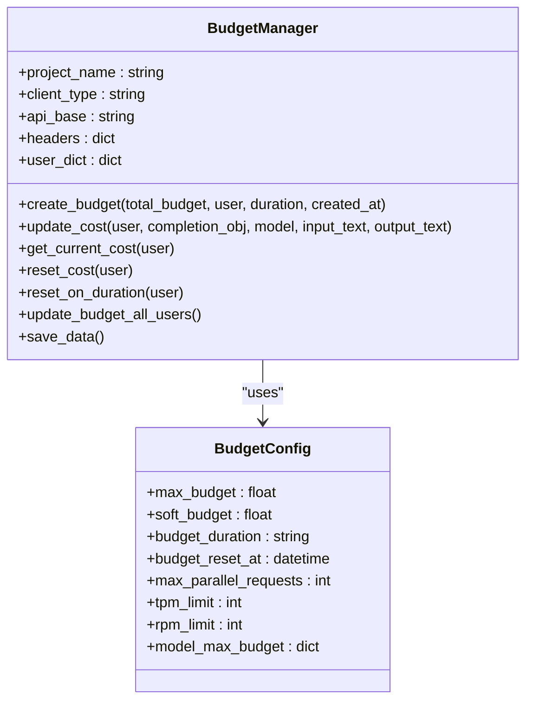
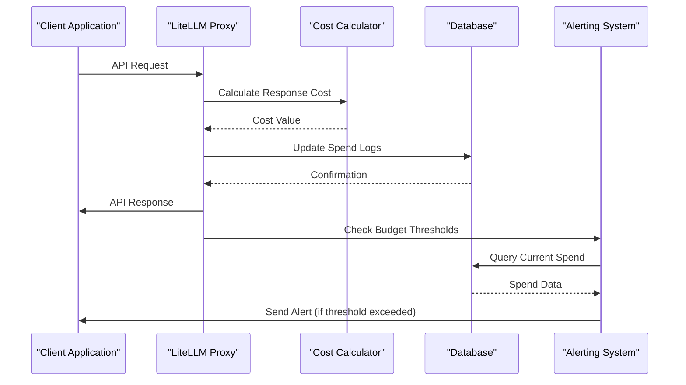
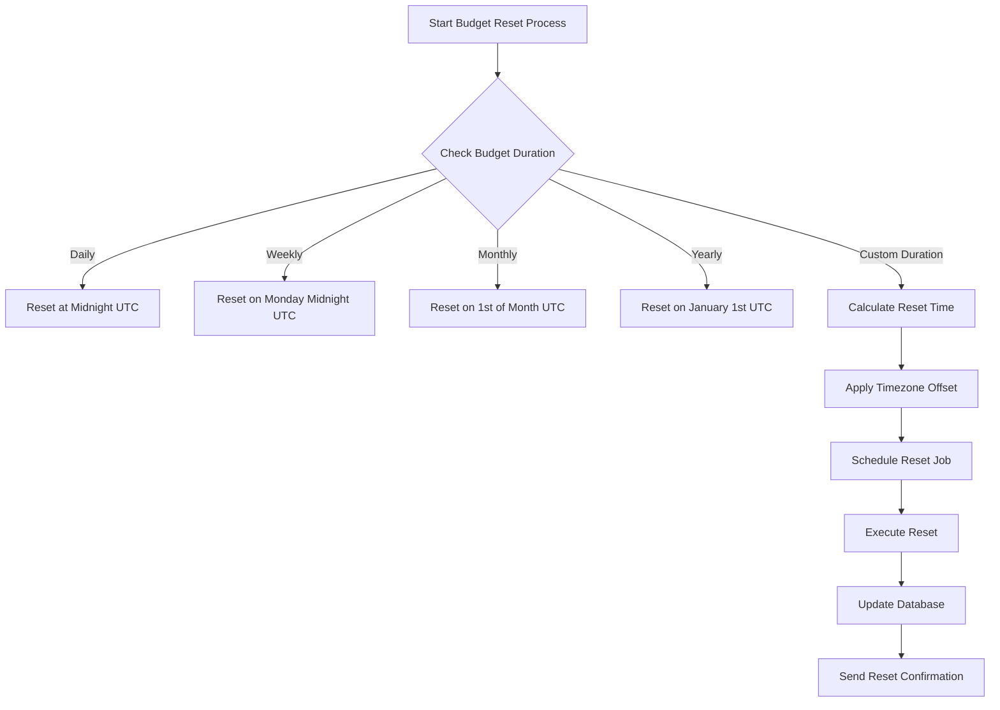
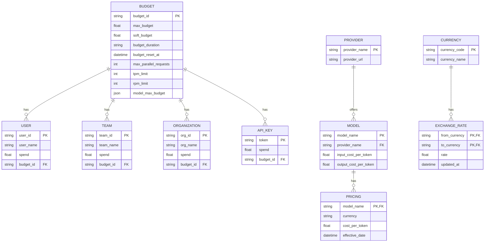
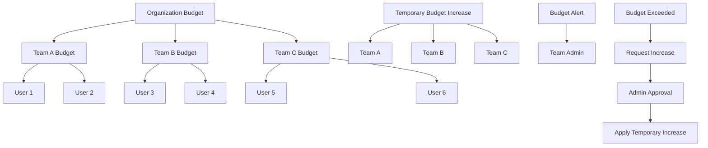
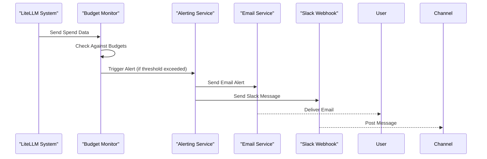
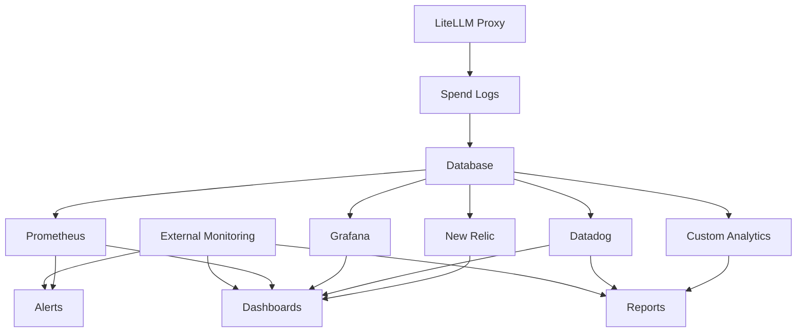
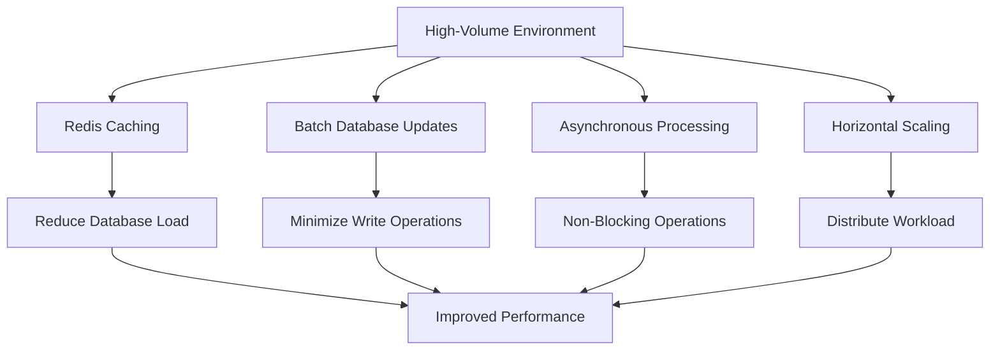
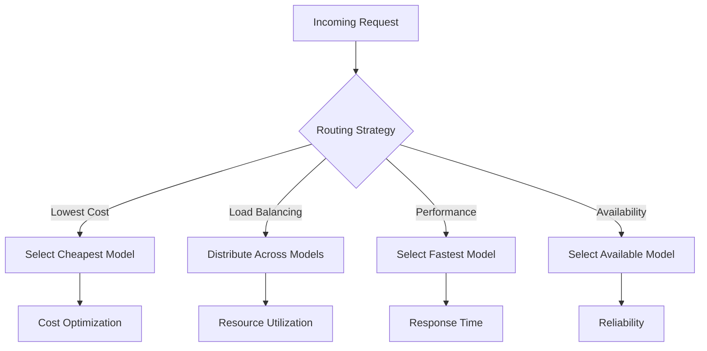

# Cost Management

<cite>
**Referenced Files in This Document**   
- [budget_manager.py](file://litellm/budget_manager.py)
- [cost_calculator.py](file://litellm/cost_calculator.py)
- [spend_tracking_utils.py](file://litellm/proxy/spend_tracking/spend_tracking_utils.py)
- [budget_management_endpoints.py](file://litellm/proxy/management_endpoints/budget_management_endpoints.py)
- [reset_budget_job.py](file://litellm/proxy/common_utils/reset_budget_job.py)
- [budget_limiter.py](file://litellm/router_strategy/budget_limiter.py)
- [db_spend_update_writer.py](file://litellm/proxy/db/db_spend_update_writer.py)
</cite>

## Table of Contents
1. [Introduction](#introduction)
2. [Budget Manager Architecture](#budget-manager-architecture)
3. [Real-Time Spend Tracking](#real-time-spend-tracking)
4. [Budget Reset Mechanisms](#budget-reset-mechanisms)
5. [Configuration and Setup](#configuration-and-setup)
6. [Team-Level Budgets and Temporary Increases](#team-level-budgets-and-temporary-increases)
7. [Spending Alerts](#spending-alerts)
8. [Integration with Observability Systems](#integration-with-observability-systems)
9. [Common Issues and Solutions](#common-issues-and-solutions)
10. [Performance Considerations](#performance-considerations)
11. [Cost Optimization Strategies](#cost-optimization-strategies)
12. [Conclusion](#conclusion)

## Introduction

LiteLLM provides a comprehensive cost management system designed to help organizations track, monitor, and optimize their LLM (Large Language Model) usage costs. The system offers robust budget tracking capabilities, spending alerts, and cost optimization features that enable teams to maintain control over their AI expenditures. This documentation details the architecture and functionality of LiteLLM's budget management system, including real-time spend tracking, budget reset mechanisms, timezone handling, and integration with observability systems.

The cost management system is built around several core components that work together to provide accurate cost calculation, budget enforcement, and detailed spending analytics. These components include the Budget Manager, cost calculator, spend tracking utilities, and various integration points for alerts and monitoring.

**Section sources**
- [budget_manager.py](file://litellm/budget_manager.py#L26-L231)
- [cost_calculator.py](file://litellm/cost_calculator.py#L1-L800)

## Budget Manager Architecture

The Budget Manager in LiteLLM is designed to track and manage spending across different users, teams, and organizations. It provides a flexible architecture that supports various budget durations and reset mechanisms.



**Diagram sources **
- [budget_manager.py](file://litellm/budget_manager.py#L26-L231)

The Budget Manager class is initialized with a project name and client type, which determines whether data is stored locally or in a hosted database. The manager maintains a user dictionary that tracks spending information for each user, including their current cost, total budget, and budget duration.

Key methods in the Budget Manager include:
- `create_budget()`: Creates a new budget for a user with specified limits and duration
- `update_cost()`: Updates the current cost based on model usage and response data
- `reset_cost()`: Resets the cost tracking for a user
- `reset_on_duration()`: Automatically resets costs when the budget duration expires
- `update_budget_all_users()`: Checks and resets budgets for all users

The system supports different budget durations including daily, weekly, monthly, and yearly, with automatic reset functionality that ensures budgets are renewed at the appropriate intervals.

**Section sources**
- [budget_manager.py](file://litellm/budget_manager.py#L26-L231)

## Real-Time Spend Tracking

LiteLLM's spend tracking system provides real-time monitoring of LLM usage costs across various entities including users, teams, organizations, and API keys. The system captures detailed information about each request and calculates costs based on token usage, model pricing, and other relevant factors.



**Diagram sources **
- [spend_tracking_utils.py](file://litellm/proxy/spend_tracking/spend_tracking_utils.py#L203-L449)
- [cost_calculator.py](file://litellm/cost_calculator.py#L755-L800)

The spend tracking process begins when a request is received by the LiteLLM proxy. The system calculates the cost of the response using the `completion_cost()` function, which takes into account the model used, number of tokens, and other relevant factors. This cost is then recorded in the spend logs along with metadata about the request.

The `get_logging_payload()` function in `spend_tracking_utils.py` is responsible for creating a comprehensive payload that includes:
- Request and response timestamps
- Model information
- Token counts (prompt, completion, total)
- Cost information
- User and team identifiers
- API key information
- Request tags

This detailed logging enables organizations to analyze their spending patterns and identify areas for optimization.

**Section sources**
- [spend_tracking_utils.py](file://litellm/proxy/spend_tracking/spend_tracking_utils.py#L203-L449)
- [cost_calculator.py](file://litellm/cost_calculator.py#L755-L800)

## Budget Reset Mechanisms

LiteLLM implements sophisticated budget reset mechanisms that handle various reset frequencies and timezone considerations. The system ensures that budgets are reset accurately according to their specified durations.



**Diagram sources **
- [reset_budget_job.py](file://litellm/proxy/common_utils/reset_budget_job.py#L19-L583)

The budget reset process is managed by the `ResetBudgetJob` class, which runs periodically to check for budgets that need to be reset. The job handles different entity types including keys, users, teams, and end-users.

Key features of the budget reset system include:
- Automatic detection of expired budgets based on the `budget_reset_at` timestamp
- Support for various reset frequencies (daily, weekly, monthly, yearly)
- Timezone-aware reset scheduling
- Atomic database updates to prevent race conditions
- Comprehensive error handling and logging

The reset process follows these steps:
1. Identify all entities with budgets that have reached their reset time
2. Reset the spend counter to zero for each entity
3. Calculate the next reset time based on the budget duration
4. Update the database with the new spend value and reset time
5. Log the reset operation for auditing purposes

The system uses UTC time for all calculations to ensure consistency across different timezones, with the ability to apply timezone offsets when needed.

**Section sources**
- [reset_budget_job.py](file://litellm/proxy/common_utils/reset_budget_job.py#L19-L583)

## Configuration and Setup

Setting up cost tracking in LiteLLM involves configuring the budget management system with appropriate parameters for your organization's needs. The configuration supports multiple providers and currency conversion.



**Diagram sources **
- [budget_management_endpoints.py](file://litellm/proxy/management_endpoints/budget_management_endpoints.py#L27-L298)

To configure cost tracking, you can use the budget management endpoints to create and manage budgets. The system supports setting up budgets with various parameters:

### Budget Configuration Options
- **max_budget**: The maximum amount that can be spent within the budget period
- **soft_budget**: A warning threshold that triggers alerts when approached
- **budget_duration**: The time period for the budget (e.g., "30d", "1h")
- **budget_reset_at**: The specific time when the budget should reset
- **max_parallel_requests**: Limit on concurrent requests
- **tpm_limit**: Tokens per minute limit
- **rpm_limit**: Requests per minute limit
- **model_max_budget**: Model-specific budget limits

The system automatically handles currency conversion using up-to-date exchange rates, allowing organizations to track costs in their preferred currency regardless of the provider's billing currency.

**Section sources**
- [budget_management_endpoints.py](file://litellm/proxy/management_endpoints/budget_management_endpoints.py#L27-L298)

## Team-Level Budgets and Temporary Increases

LiteLLM supports team-level budget management, allowing organizations to allocate budgets to specific teams and implement temporary budget increases when needed.



**Diagram sources **
- [budget_management_endpoints.py](file://litellm/proxy/management_endpoints/budget_management_endpoints.py#L27-L298)
- [reset_budget_job.py](file://litellm/proxy/common_utils/reset_budget_job.py#L19-L583)

### Team-Level Budget Implementation

Team-level budgets are implemented through the budget management endpoints, which allow administrators to create budgets specifically for teams. Each team budget can have its own limits and reset schedule.

To create a team-level budget:
1. Use the `/budget/new` endpoint with the team_id parameter
2. Set appropriate budget limits and duration
3. Assign team members to the budget

The system tracks spending at both the team level and individual user level, providing detailed insights into how the team budget is being utilized.

### Temporary Budget Increases

Temporary budget increases can be implemented through the budget update functionality. This is useful for scenarios such as:
- Special projects requiring additional resources
- Seasonal increases in usage
- Testing and development phases

To implement a temporary budget increase:
1. Retrieve the current budget configuration using `/budget/info`
2. Update the budget with a higher max_budget value using `/budget/update`
3. Set a specific end date for the increase by updating the budget_reset_at field
4. After the temporary period, reset to the original budget values

The system maintains a history of budget changes, allowing administrators to audit and review all modifications.

**Section sources**
- [budget_management_endpoints.py](file://litellm/proxy/management_endpoints/budget_management_endpoints.py#L27-L298)
- [reset_budget_job.py](file://litellm/proxy/common_utils/reset_budget_job.py#L19-L583)

## Spending Alerts

LiteLLM provides automated spending alerts through email and Slack integration, helping organizations stay informed about their budget status and potential overages.



**Diagram sources **
- [spend_tracking_utils.py](file://litellm/proxy/spend_tracking/spend_tracking_utils.py#L203-L449)

The spending alert system works by continuously monitoring spend data against configured budget thresholds. When a threshold is approached or exceeded, the system triggers alerts through the configured channels.

### Alert Configuration

Alerts can be configured with the following parameters:
- **Soft budget threshold**: Percentage of budget usage that triggers a warning alert (e.g., 80%)
- **Hard budget threshold**: Percentage of budget usage that triggers a critical alert (e.g., 95%)
- **Alert channels**: Email, Slack, or both
- **Recipients**: Specific users or teams to receive alerts
- **Frequency**: How often alerts are sent (immediate, daily summary, etc.)

### Implementation Example

To set up spending alerts:
1. Configure the alerting service with your email and Slack webhook details
2. Set up budget thresholds for soft and hard limits
3. Specify recipients for each alert type
4. Test the alert configuration with a simulated budget breach

The system supports both immediate alerts for critical breaches and periodic summary reports for ongoing monitoring.

**Section sources**
- [spend_tracking_utils.py](file://litellm/proxy/spend_tracking/spend_tracking_utils.py#L203-L449)

## Integration with Observability Systems

LiteLLM integrates with various observability systems to provide comprehensive monitoring and analytics of LLM usage costs. The system logs detailed spending data that can be exported to external monitoring tools.



**Diagram sources **
- [spend_tracking_utils.py](file://litellm/proxy/spend_tracking/spend_tracking_utils.py#L203-L449)
- [db_spend_update_writer.py](file://litellm/proxy/db/db_spend_update_writer.py#L54-L700)

### Data Logging Structure

The system logs comprehensive spending data in the `LiteLLM_SpendLogs` table, which includes:
- Request ID and timestamps
- Model information (name, provider, version)
- Token usage (prompt, completion, total)
- Cost calculation details
- User and team identifiers
- API key information
- Request tags for categorization
- Response metadata

### Integration Points

The observability integration supports several key systems:

#### Prometheus Integration
- Exposes metrics for current spend, budget utilization, and request rates
- Provides service-level metrics for monitoring system health
- Supports custom metric creation for specific monitoring needs

#### Grafana Dashboards
- Pre-built dashboards for spend visualization
- Customizable views for different organizational levels
- Historical trend analysis and forecasting

#### Third-Party Monitoring
- Datadog, New Relic, and other APM tools
- Custom webhook integrations for proprietary systems
- Export functionality for data analysis in external tools

The integration enables organizations to create comprehensive dashboards that provide real-time visibility into their LLM usage costs and patterns.

**Section sources**
- [spend_tracking_utils.py](file://litellm/proxy/spend_tracking/spend_tracking_utils.py#L203-L449)
- [db_spend_update_writer.py](file://litellm/proxy/db/db_spend_update_writer.py#L54-L700)

## Common Issues and Solutions

This section addresses common issues encountered with LiteLLM's cost management system and provides solutions for each.

### Delayed Cost Reporting

**Issue**: Cost reporting may appear delayed, especially in high-volume environments.

**Solution**: The system uses a transaction queue to batch database updates for performance optimization. This can cause a slight delay in cost reporting. To minimize this:
- Adjust the transaction queue flush interval based on your latency requirements
- Use real-time monitoring of in-memory spend counters for immediate feedback
- Implement caching strategies to reduce database load

### Budget Synchronization Across Distributed Systems

**Issue**: In distributed deployments, budget synchronization between instances can be challenging.

**Solution**: The system uses Redis as a distributed cache to synchronize budget information across instances:
- Configure Redis as the primary cache backend
- Set appropriate TTL values for budget data
- Implement lock mechanisms to prevent race conditions during budget updates
- Monitor Redis performance and capacity to ensure reliable synchronization

### Inaccurate Cost Calculations

**Issue**: Cost calculations may not match provider billing due to pricing model differences.

**Solution**: Ensure accurate cost calculations by:
- Regularly updating the model cost database with current pricing
- Configuring custom pricing for models with special rate plans
- Validating cost calculations against actual provider invoices
- Implementing currency conversion with up-to-date exchange rates

### Budget Reset Failures

**Issue**: Budget resets may fail to execute properly.

**Solution**: Ensure reliable budget reset operations by:
- Monitoring the reset job scheduler for errors
- Verifying database connectivity and permissions
- Checking timezone configurations for reset times
- Implementing retry mechanisms for failed reset operations

**Section sources**
- [db_spend_update_writer.py](file://litellm/proxy/db/db_spend_update_writer.py#L54-L700)
- [reset_budget_job.py](file://litellm/proxy/common_utils/reset_budget_job.py#L19-L583)

## Performance Considerations

The cost management system is designed to handle high-volume environments efficiently while maintaining accurate cost tracking.

### High-Volume Optimization

For high-volume environments, consider the following optimizations:



**Diagram sources **
- [db_spend_update_writer.py](file://litellm/proxy/db/db_spend_update_writer.py#L54-L700)

### Key Performance Features

- **Redis Integration**: Uses Redis as a distributed cache to reduce database load and improve response times
- **Batch Processing**: Aggregates spend updates and writes them to the database in batches to minimize write operations
- **Asynchronous Operations**: Performs non-critical operations (like logging) asynchronously to avoid blocking request processing
- **Horizontal Scaling**: Supports multiple proxy instances with synchronized budget tracking through Redis
- **Connection Pooling**: Implements database connection pooling to reduce connection overhead

### Configuration Recommendations

For optimal performance in high-volume environments:
- Enable Redis caching for all budget-related operations
- Configure appropriate batch sizes for database updates
- Monitor system resource usage and scale horizontally as needed
- Implement proper indexing on database tables used for spend tracking
- Regularly monitor and optimize database query performance

**Section sources**
- [db_spend_update_writer.py](file://litellm/proxy/db/db_spend_update_writer.py#L54-L700)

## Cost Optimization Strategies

LiteLLM provides several strategies for optimizing LLM usage costs through intelligent routing and caching.

### Intelligent Routing

The system supports intelligent routing based on cost considerations:



**Diagram sources **
- [budget_limiter.py](file://litellm/router_strategy/budget_limiter.py#L21-L822)

### Caching Strategies

Implement effective caching to reduce costs:
- **Response Caching**: Store responses for identical requests to avoid redundant API calls
- **Token Caching**: Cache token calculations to reduce processing overhead
- **Budget Caching**: Cache budget information to minimize database queries

### Provider Budget Limiting

The system includes a router strategy for provider budget limiting that filters out deployments that have exceeded their budget limits:

```python
# Example configuration for provider budget limiting
{
    "openai": {
        "budget_limit": 1000.0,
        "time_period": "30d"
    },
    "anthropic": {
        "budget_limit": 500.0,
        "time_period": "30d"
    }
}
```

This strategy helps prevent overspending with specific providers by automatically routing requests away from providers that have reached their budget limits.

### Model Selection Optimization

Optimize model selection based on cost-effectiveness:
- Use smaller, less expensive models for simple tasks
- Reserve larger, more expensive models for complex tasks requiring higher quality
- Implement fallback strategies to switch to alternative models if primary models exceed budget limits

These optimization strategies help organizations maximize their LLM usage while staying within budget constraints.

**Section sources**
- [budget_limiter.py](file://litellm/router_strategy/budget_limiter.py#L21-L822)

## Conclusion

LiteLLM's cost management system provides a comprehensive solution for tracking, monitoring, and optimizing LLM usage costs. The system's architecture supports real-time spend tracking, flexible budget configurations, and integration with observability systems, enabling organizations to maintain control over their AI expenditures.

Key features of the system include:
- Real-time spend tracking across users, teams, and organizations
- Flexible budget configurations with various reset mechanisms
- Automated spending alerts through email and Slack
- Integration with observability systems for comprehensive monitoring
- Solutions for common issues like delayed reporting and budget synchronization
- Performance optimizations for high-volume environments
- Cost optimization strategies through intelligent routing and caching

By implementing these features, organizations can effectively manage their LLM usage costs, prevent budget overruns, and optimize their AI investments. The system's modular design allows for customization to meet specific organizational needs, making it a versatile solution for cost management in AI applications.