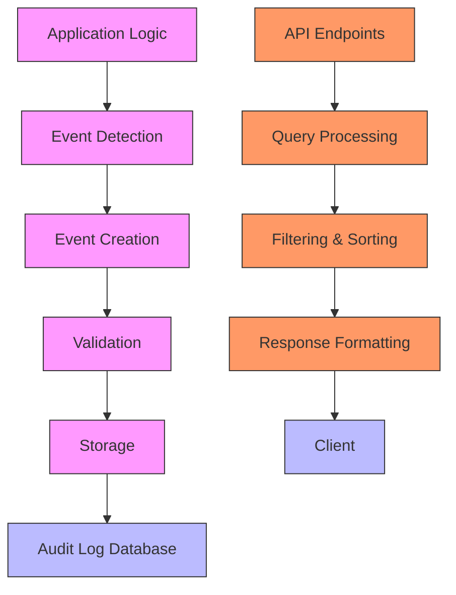
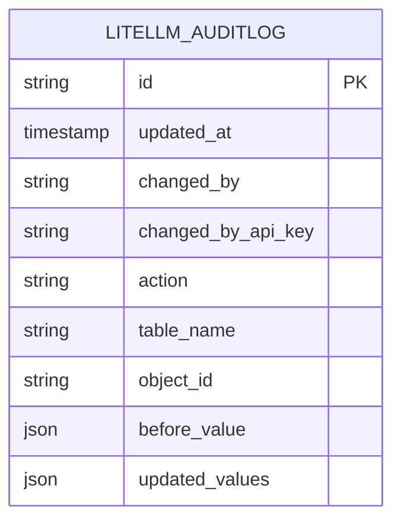
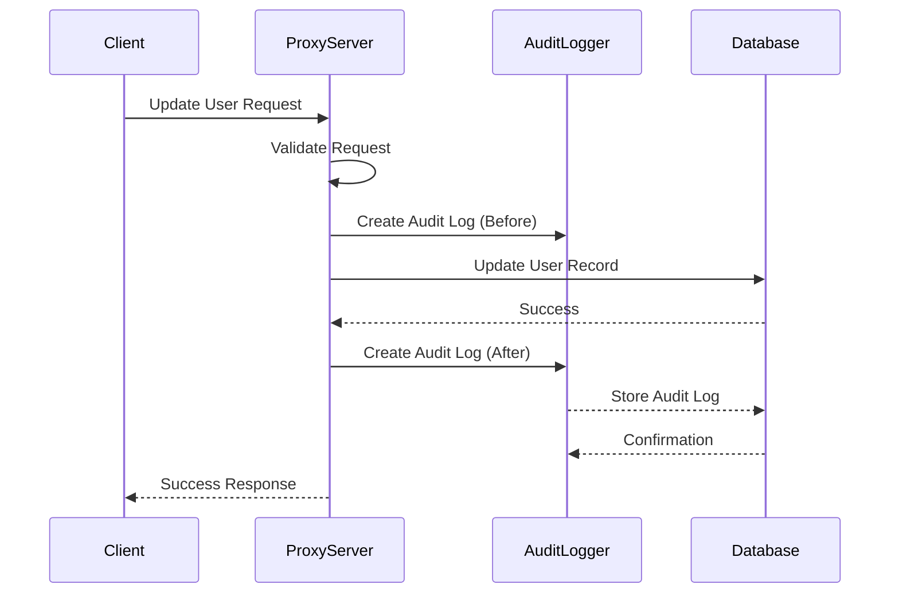
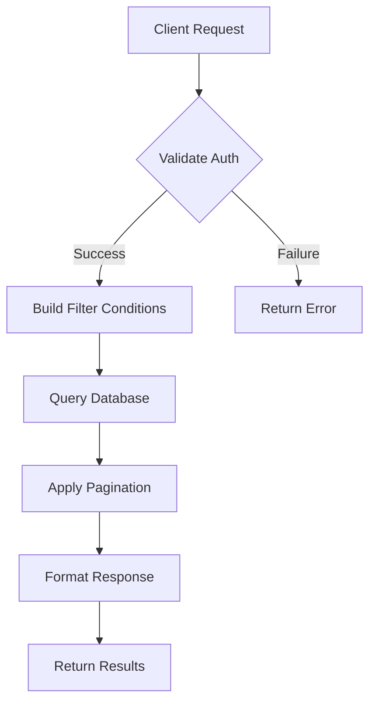

# Audit Logging

<cite>
**Referenced Files in This Document**   
- [audit_logging_endpoints.py](file://enterprise/litellm_enterprise/proxy/audit_logging_endpoints.py)
- [audit_logs.py](file://litellm/proxy/management_helpers/audit_logs.py)
- [types/proxy/audit_logging_endpoints.py](file://enterprise/litellm_enterprise/types/proxy/audit_logging_endpoints.py)
- [user_management_event_hooks.py](file://litellm/proxy/hooks/user_management_event_hooks.py)
- [schema.prisma](file://schema.prisma)
- [audit_logs.tsx](file://ui/litellm-dashboard/src/components/view_logs/audit_logs.tsx)
- [columns.tsx](file://ui/litellm-dashboard/src/components/view_logs/columns.tsx)
</cite>

## Table of Contents
1. [Introduction](#introduction)
2. [Audit Logging Architecture](#audit-logging-architecture)
3. [Data Model](#data-model)
4. [Event Types and Generation](#event-types-and-generation)
5. [Configuration Options](#configuration-options)
6. [Storage Mechanisms](#storage-mechanisms)
7. [API Endpoints](#api-endpoints)
8. [Integration with Security Features](#integration-with-security-features)
9. [Sensitive Data Handling](#sensitive-data-handling)
10. [Performance Considerations](#performance-considerations)
11. [Log Analysis and Monitoring](#log-analysis-and-monitoring)
12. [Compliance Requirements](#compliance-requirements)

## Introduction

Audit logging in LiteLLM enterprise deployments provides comprehensive tracking of system changes and user activities. The audit logging system captures critical events such as user management operations, configuration changes, and API key modifications, enabling organizations to maintain security, ensure compliance, and troubleshoot issues effectively. This documentation details the implementation, configuration, and usage of the audit logging system, covering data collection, storage mechanisms, and integration with security features.

**Section sources**
- [audit_logging_endpoints.py](file://enterprise/litellm_enterprise/proxy/audit_logging_endpoints.py#L1-L8)
- [audit_logs.py](file://litellm/proxy/management_helpers/audit_logs.py#L1-L3)

## Audit Logging Architecture

The audit logging system in LiteLLM follows a modular architecture that integrates with the proxy server's core components. The system is designed to capture audit events at the point of execution and store them securely in the database. The architecture consists of several key components:



**Diagram sources**
- [audit_logging_endpoints.py](file://enterprise/litellm_enterprise/proxy/audit_logging_endpoints.py#L25-L167)
- [audit_logs.py](file://litellm/proxy/management_helpers/audit_logs.py#L67-L107)

## Data Model

The audit logging system uses a structured data model to capture comprehensive information about each audited event. The model includes timestamps, user identifiers, action types, and resource references, providing a complete picture of system changes.



The audit log record structure is defined by the `AuditLogResponse` Pydantic model, which includes the following fields:

| Field | Type | Description |
|-------|------|-------------|
| `id` | string | Unique identifier for the audit log entry |
| `updated_at` | datetime | Timestamp when the change was made |
| `changed_by` | string | User or system that performed the action |
| `changed_by_api_key` | string | API key hash that performed the action |
| `action` | string | Type of action performed (create, update, delete) |
| `table_name` | string | Database table that was modified |
| `object_id` | string | ID of the object that was modified |
| `before_value` | json | Values of the row before the change |
| `updated_values` | json | Values of the row after the change |

**Diagram sources**
- [schema.prisma](file://schema.prisma#L1-L20)
- [types/proxy/audit_logging_endpoints.py](file://enterprise/litellm_enterprise/types/proxy/audit_logging_endpoints.py#L7-L18)

**Section sources**
- [types/proxy/audit_logging_endpoints.py](file://enterprise/litellm_enterprise/types/proxy/audit_logging_endpoints.py#L7-L18)
- [schema.prisma](file://schema.prisma#L1-L20)

## Event Types and Generation

The audit logging system captures various event types across different system components. Events are generated automatically when specific operations are performed, ensuring comprehensive coverage of system activities.

### User Management Events

User management operations trigger audit events that capture changes to user accounts. These events are generated in the user management hooks and include user creation, updates, and deletions.



**Diagram sources**
- [user_management_event_hooks.py](file://litellm/proxy/hooks/user_management_event_hooks.py#L184-L209)
- [audit_logs.py](file://litellm/proxy/management_helpers/audit_logs.py#L20-L64)

### Configuration Change Events

Configuration changes, including updates to routing rules, rate limits, and model parameters, generate audit events. These events help track modifications to the system's operational parameters.

### API Access Events

API access events capture information about API key usage, including creation, modification, and deletion of API keys. These events are essential for security monitoring and compliance.

**Section sources**
- [user_management_event_hooks.py](file://litellm/proxy/hooks/user_management_event_hooks.py#L184-L209)
- [audit_logs.py](file://litellm/proxy/management_helpers/audit_logs.py#L20-L64)

## Configuration Options

The audit logging system provides several configuration options to control its behavior and integrate with external systems.

### Log Retention

Log retention can be configured through database-level settings and cleanup policies. The system does not have built-in retention configuration but relies on database management practices.

### Export Formats

Audit logs can be exported in JSON format through the API endpoints. The paginated response model includes all necessary fields for external processing and analysis.

### External SIEM Integration

The system supports integration with external Security Information and Event Management (SIEM) systems through custom logging callbacks and webhook integrations.

| Configuration Option | Environment Variable | Default Value | Description |
|----------------------|----------------------|---------------|-------------|
| Store Audit Logs | LITELLM_STORE_AUDIT_LOGS | false | Enables or disables audit logging |
| Premium User | premium_user | false | Required for audit logging functionality |

**Section sources**
- [audit_logs.py](file://litellm/proxy/management_helpers/audit_logs.py#L73-L75)
- [audit_logs.tsx](file://ui/litellm-dashboard/src/components/view_logs/audit_logs.tsx#L286-L287)

## Storage Mechanisms

Audit logs are stored in the primary database using Prisma ORM. The storage mechanism is designed for reliability and query performance.

### Database Schema

The audit log table is defined in the Prisma schema with appropriate indexes for query performance:

```prisma
model LiteLLMAuditLog {
  id                String   @id @default(uuid())
  updatedAt         DateTime @updatedAt
  changedBy         String
  changedByAPIKey   String
  action            String
  tableName         String
  objectId          String
  beforeValue       Json?
  updatedValues     Json?
  
  @@index([updatedAt])
  @@index([changedBy])
  @@index([action])
  @@index([tableName])
  @@index([objectId])
}
```

### Storage Performance

The storage implementation includes error handling to ensure that audit logging failures do not impact primary system functionality. Logs are written asynchronously when possible to minimize performance impact.

**Section sources**
- [schema.prisma](file://schema.prisma#L1-L20)
- [audit_logs.py](file://litellm/proxy/management_helpers/audit_logs.py#L97-L105)

## API Endpoints

The audit logging system provides REST API endpoints for retrieving audit logs with filtering and pagination capabilities.

### GET /audit

Retrieves audit logs with filtering and pagination options.



**Parameters:**
- `page`: Page number (default: 1)
- `page_size`: Number of items per page (default: 10, max: 100)
- `changed_by`: Filter by user who performed the action
- `changed_by_api_key`: Filter by API key hash
- `action`: Filter by action type (create, update, delete)
- `table_name`: Filter by table name modified
- `object_id`: Filter by object ID
- `start_date`: Filter logs after this date
- `end_date`: Filter logs before this date
- `sort_by`: Column to sort by
- `sort_order`: Sort order (asc or desc)

### GET /audit/{id}

Retrieves a specific audit log entry by ID.

**Section sources**
- [audit_logging_endpoints.py](file://enterprise/litellm_enterprise/proxy/audit_logging_endpoints.py#L25-L167)

## Integration with Security Features

The audit logging system is tightly integrated with LiteLLM's security features, providing comprehensive tracking of authentication, authorization, and API key management activities.

### Authentication Integration

Audit logs capture authentication-related events, including user login attempts and authentication method changes. The system records the user identifier and API key hash for each authenticated action.

### Authorization Integration

Authorization changes, such as role assignments and permission modifications, are logged with details about the before and after states. This enables tracking of privilege escalation and access control changes.

### API Key Management

All API key operations are audited, including:
- API key creation
- API key updates (e.g., changing permissions or rate limits)
- API key deletion
- API key rotation

The audit logs include the API key hash (not the full key) to maintain security while providing traceability.

**Section sources**
- [audit_logging_endpoints.py](file://enterprise/litellm_enterprise/proxy/audit_logging_endpoints.py#L35-L40)
- [user_management_event_hooks.py](file://litellm/proxy/hooks/user_management_event_hooks.py#L202-L203)

## Sensitive Data Handling

The audit logging system implements several measures to protect sensitive data while maintaining audit trail integrity.

### Data Redaction

Sensitive data is redacted or masked in audit logs to prevent exposure of confidential information. API keys are stored as hashes rather than plaintext values.

### Compliance with Regulatory Requirements

The system supports compliance with regulatory requirements through:
- Immutable audit trails
- Secure storage of audit records
- Access controls for audit log viewing
- Data retention policies

Best practices for sensitive data handling include:
- Regular review of audit log content for accidental sensitive data exposure
- Implementation of automated scanning for sensitive data patterns
- Use of encryption for audit log storage and transmission

**Section sources**
- [audit_logs.py](file://litellm/proxy/management_helpers/audit_logs.py#L89-L93)
- [columns.tsx](file://ui/litellm-dashboard/src/components/view_logs/columns.tsx#L409-L410)

## Performance Considerations

The audit logging system is designed to minimize performance impact on the primary proxy operations.

### High-Volume Environments

In high-volume environments, the following strategies are recommended:
- Database indexing on frequently queried fields
- Asynchronous log writing to prevent blocking
- Batch processing of audit logs
- Regular database maintenance and optimization

### Log Volume Management

To manage log volume:
- Implement appropriate retention policies
- Use database partitioning for large datasets
- Monitor storage usage and plan for capacity
- Consider archiving older logs to cold storage

The system includes error handling to ensure that audit logging failures do not impact primary functionality, treating audit logging as a best-effort service.

**Section sources**
- [audit_logs.py](file://litellm/proxy/management_helpers/audit_logs.py#L104-L105)
- [audit_logging_endpoints.py](file://enterprise/litellm_enterprise/proxy/audit_logging_endpoints.py#L100-L104)

## Log Analysis and Monitoring

The audit logging system supports comprehensive log analysis and monitoring capabilities.

### Query Capabilities

The API endpoints support advanced querying with:
- Filtering by multiple criteria
- Sorting by various fields
- Pagination for large result sets
- Date range filtering

### Monitoring Best Practices

Recommended monitoring practices include:
- Setting up alerts for suspicious activities
- Regular review of audit logs for compliance
- Integration with SIEM systems for centralized monitoring
- Creation of dashboards for key metrics

The UI dashboard provides visualization of audit logs with filtering and search capabilities, enabling efficient analysis of system activities.

**Section sources**
- [audit_logging_endpoints.py](file://enterprise/litellm_enterprise/proxy/audit_logging_endpoints.py#L34-L57)
- [audit_logs.tsx](file://ui/litellm-dashboard/src/components/view_logs/audit_logs.tsx#L63-L74)

## Compliance Requirements

The audit logging system helps organizations meet various compliance requirements by providing a comprehensive record of system activities.

### Regulatory Alignment

The system supports compliance with regulations such as:
- GDPR: Right to audit and data processing records
- HIPAA: Security event tracking
- SOC 2: Audit trail requirements
- PCI DSS: Access control monitoring

### Audit Trail Integrity

The system ensures audit trail integrity through:
- Immutable records
- Tamper-evident storage
- Secure access controls
- Complete event coverage

Organizations should supplement the system's capabilities with their own policies and procedures to fully meet compliance requirements.

[No sources needed since this section provides general guidance]