# Custom Enterprise Callbacks

<cite>
**Referenced Files in This Document**   
- [callback_controls.py](file://enterprise/litellm_enterprise/enterprise_callbacks/callback_controls.py)
- [logging_callback_manager.py](file://litellm/litellm_core_utils/logging_callback_manager.py)
- [callback_utils.py](file://litellm/proxy/common_utils/callback_utils.py)
- [custom_callbacks.py](file://litellm/proxy/example_config_yaml/custom_callbacks.py)
- [banned_keywords.py](file://enterprise/enterprise_hooks/banned_keywords.py)
- [pagerduty.py](file://enterprise/litellm_enterprise/enterprise_callbacks/pagerduty/pagerduty.py)
- [callback_management_endpoints.py](file://litellm/proxy/management_endpoints/callback_management_endpoints.py)
- [initialize_dynamic_callback_params.py](file://litellm/litellm_core_utils/initialize_dynamic_callback_params.py)
</cite>

## Table of Contents
1. [Introduction](#introduction)
2. [Callback System Architecture](#callback-system-architecture)
3. [Hook Types and Execution Order](#hook-types-and-execution-order)
4. [Error Handling and Exception Management](#error-handling-and-exception-management)
5. [Configuration and Registration](#configuration-and-registration)
6. [Integration with Core Proxy Functionality](#integration-with-core-proxy-functionality)
7. [API for Callback Development](#api-for-callback-development)
8. [Concrete Implementation Examples](#concrete-implementation-examples)
9. [Performance Considerations](#performance-considerations)
10. [Troubleshooting and Debugging](#troubleshooting-and-debugging)
11. [Security Considerations](#security-considerations)
12. [Best Practices](#best-practices)

## Introduction

LiteLLM's enterprise callback system provides a powerful extensibility framework that allows organizations to customize and enhance the proxy's behavior for authentication, authorization, and business logic enforcement. The system enables deep integration with external services and custom business rules through a comprehensive callback mechanism that intercepts and processes requests and responses at various stages of the LLM API lifecycle.

The callback architecture is designed to support both synchronous and asynchronous operations, allowing for flexible implementation patterns that can accommodate various performance requirements and integration scenarios. Enterprise callbacks can be used to implement security policies, monitor usage, integrate with external systems, and enforce business rules across all LLM API calls processed by the LiteLLM proxy.

This document provides a comprehensive guide to developing and implementing custom enterprise callbacks, covering the technical details of the callback system, configuration options, integration patterns, and best practices for reliable and secure callback development.

## Callback System Architecture

The LiteLLM callback system is built around a centralized logging callback manager that orchestrates the registration, execution, and lifecycle management of callbacks. The architecture follows a modular design that separates callback definition from execution, allowing for flexible configuration and dynamic behavior.

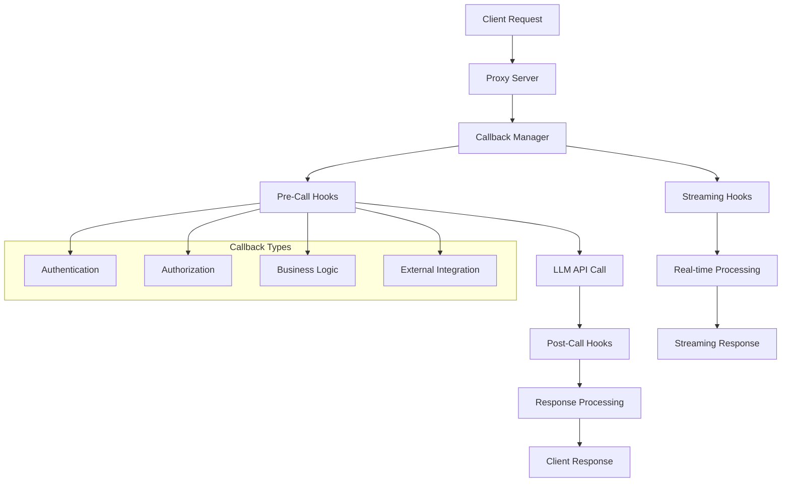

**Diagram sources**
- [logging_callback_manager.py](file://litellm/litellm_core_utils/logging_callback_manager.py#L18-L457)
- [callback_utils.py](file://litellm/proxy/common_utils/callback_utils.py#L21-L303)

**Section sources**
- [logging_callback_manager.py](file://litellm/litellm_core_utils/logging_callback_manager.py#L1-L457)
- [callback_utils.py](file://litellm/proxy/common_utils/callback_utils.py#L1-L457)

## Hook Types and Execution Order

The LiteLLM callback system supports multiple hook types that execute at different stages of the request-response lifecycle. Each hook type serves a specific purpose and has a defined execution order that ensures consistent behavior across different callback implementations.

### Pre-Call Hooks
Pre-call hooks execute before the LLM API call is made, allowing callbacks to inspect and potentially modify the request or reject it entirely. These hooks are ideal for authentication, authorization, and input validation.

### Post-Call Success Hooks
These hooks execute after a successful LLM API response is received. They can process the response, update metrics, or trigger downstream actions based on the successful completion of the request.

### Post-Call Failure Hooks
Executed when an LLM API call fails, these hooks allow for error handling, logging, and potentially retry logic or fallback mechanisms.

### Streaming Hooks
For streaming responses, these hooks process chunks of data as they are received, enabling real-time processing and monitoring of streaming content.

### Async Hooks
Asynchronous versions of the above hooks allow for non-blocking operations, which is particularly important for external system integrations that may have variable response times.

The execution order follows a strict sequence: pre-call → LLM API call → post-call (success/failure) → streaming (if applicable). This predictable flow ensures that callbacks can rely on the state established by previous hooks and that business logic is applied consistently.

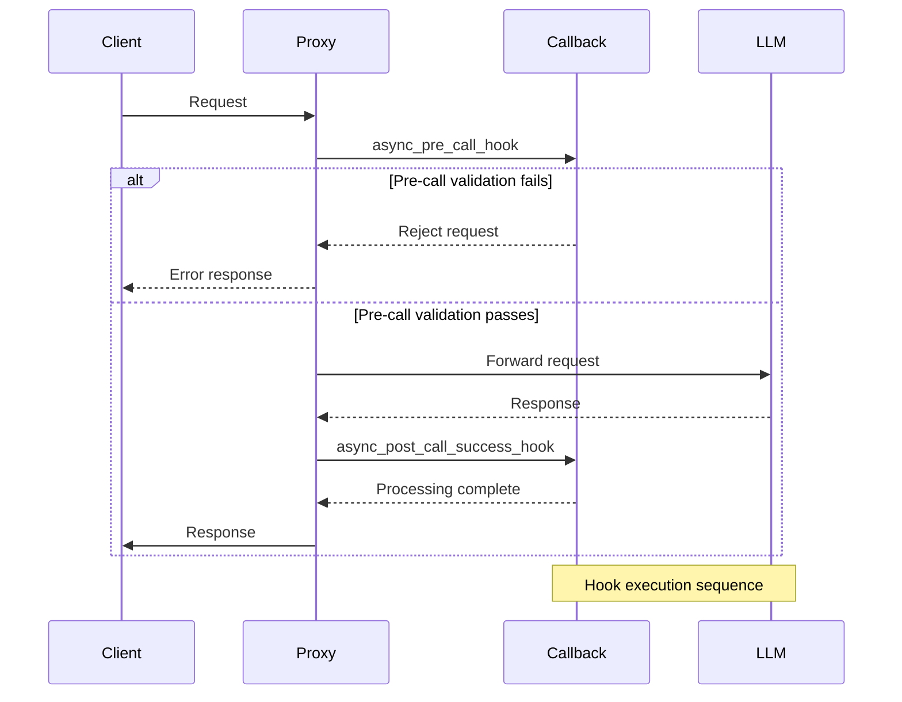

**Diagram sources**
- [callback_utils.py](file://litellm/proxy/common_utils/callback_utils.py#L21-L303)
- [banned_keywords.py](file://enterprise/enterprise_hooks/banned_keywords.py#L63-L89)

**Section sources**
- [callback_utils.py](file://litellm/proxy/common_utils/callback_utils.py#L21-L303)
- [banned_keywords.py](file://enterprise/enterprise_hooks/banned_keywords.py#L19-L108)

## Error Handling and Exception Management

The callback system implements comprehensive error handling to ensure that callback failures do not compromise the reliability of the core proxy functionality. Exceptions within callbacks are caught and logged without interrupting the main request flow, unless the callback explicitly raises an HTTPException to reject the request.

### Exception Propagation
Callbacks can raise HTTPException to reject requests during pre-call validation, but other exceptions are contained within the callback execution context. This design prevents a single faulty callback from affecting the entire system.

### Error Logging
All callback exceptions are logged with detailed context, including the callback name, input parameters, and stack trace. This facilitates debugging and monitoring of callback health.

### Fallback Mechanisms
When a callback fails, the system continues with the remaining callbacks and core functionality. This fault-tolerant design ensures service availability even when individual callbacks encounter issues.

### Timeout Handling
Callbacks are subject to configurable timeouts to prevent hanging requests. If a callback exceeds its timeout, it is terminated, and the system proceeds with the remaining processing.

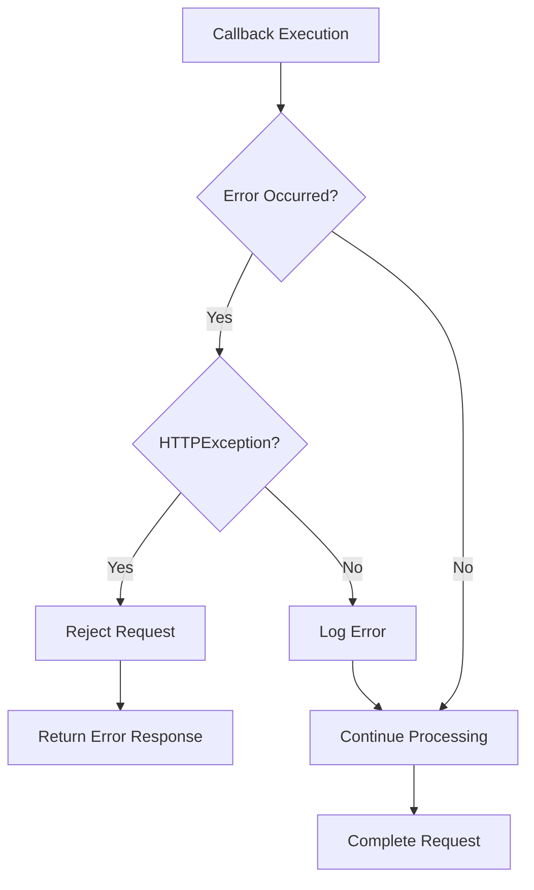

**Diagram sources**
- [banned_keywords.py](file://enterprise/enterprise_hooks/banned_keywords.py#L81-L88)
- [pagerduty.py](file://enterprise/litellm_enterprise/enterprise_callbacks/pagerduty/pagerduty.py#L308-L309)

**Section sources**
- [banned_keywords.py](file://enterprise/enterprise_hooks/banned_keywords.py#L19-L108)
- [pagerduty.py](file://enterprise/litellm_enterprise/enterprise_callbacks/pagerduty/pagerduty.py#L1-L310)

## Configuration and Registration

Custom callbacks are configured and registered through the LiteLLM proxy configuration system, which supports both static configuration files and dynamic runtime registration.

### Configuration File Setup
Callbacks are defined in the proxy configuration YAML file, where they can be enabled and configured with specific parameters. The configuration supports both built-in enterprise callbacks and custom callback classes.

### Dynamic Registration
Callbacks can be registered at runtime through API endpoints, allowing for dynamic configuration changes without requiring proxy restarts. This enables adaptive behavior based on changing business requirements.

### Environment Variable Integration
Callback parameters can reference environment variables, allowing for secure configuration of sensitive information like API keys and connection strings.

### Parameter Validation
The system validates callback parameters at registration time, ensuring that required configuration is present and correctly formatted.

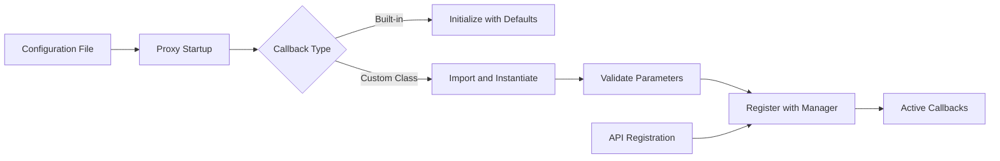

**Diagram sources**
- [callback_utils.py](file://litellm/proxy/common_utils/callback_utils.py#L21-L303)
- [callback_management_endpoints.py](file://litellm/proxy/management_endpoints/callback_management_endpoints.py#L15-L31)

**Section sources**
- [callback_utils.py](file://litellm/proxy/common_utils/callback_utils.py#L21-L303)
- [callback_management_endpoints.py](file://litellm/proxy/management_endpoints/callback_management_endpoints.py#L1-L54)

## Integration with Core Proxy Functionality

Enterprise callbacks are tightly integrated with the core proxy functionality, allowing them to modify request and response processing in various ways.

### Request Modification
Callbacks can modify request parameters, headers, and content before the request is forwarded to the LLM API. This enables use cases like input sanitization, parameter enrichment, and routing adjustments.

### Response Modification
Post-call callbacks can modify the response before it is returned to the client, enabling response filtering, content transformation, and metadata injection.

### Context Propagation
Callbacks can access and modify the request context, which is passed through the entire processing pipeline. This allows for state sharing between different callbacks and with the core proxy logic.

### Header Injection
Callbacks can add custom headers to both requests and responses, facilitating integration with monitoring systems, audit logging, and client-side processing.

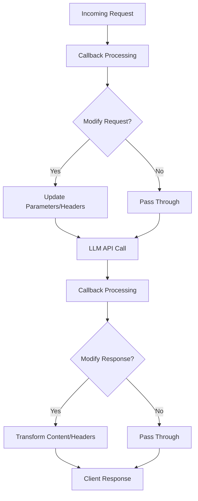

**Diagram sources**
- [callback_utils.py](file://litellm/proxy/common_utils/callback_utils.py#L361-L382)
- [banned_keywords.py](file://enterprise/enterprise_hooks/banned_keywords.py#L90-L107)

**Section sources**
- [callback_utils.py](file://litellm/proxy/common_utils/callback_utils.py#L361-L382)
- [banned_keywords.py](file://enterprise/enterprise_hooks/banned_keywords.py#L19-L108)

## API for Callback Development

The callback development API provides a standardized interface for implementing custom callbacks, ensuring consistency and compatibility across different implementations.

### Base Classes
Custom callbacks extend the CustomLogger base class, which defines the standard hook methods that can be overridden to implement specific functionality.

### Hook Methods
The API includes various hook methods that correspond to different stages of the request-response lifecycle:
- async_pre_call_hook: Before the LLM API call
- async_post_call_success_hook: After successful response
- async_post_call_streaming_hook: For streaming responses
- async_log_failure_event: When an error occurs

### Context Data
Callbacks receive comprehensive context data, including:
- Request parameters and metadata
- User authentication information
- LLM API configuration
- Timing information
- Standard logging objects

### Return Value Specifications
Callbacks typically return None, but can return data that may be used by subsequent processing stages. Exceptions are used to signal errors or request rejection.

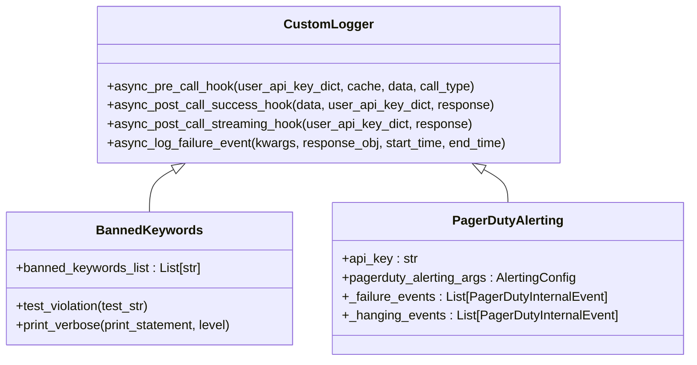

**Diagram sources**
- [custom_callbacks.py](file://litellm/proxy/example_config_yaml/custom_callbacks.py#L24-L75)
- [banned_keywords.py](file://enterprise/enterprise_hooks/banned_keywords.py#L19-L108)
- [pagerduty.py](file://enterprise/litellm_enterprise/enterprise_callbacks/pagerduty/pagerduty.py#L45-L310)

**Section sources**
- [custom_callbacks.py](file://litellm/proxy/example_config_yaml/custom_callbacks.py#L1-L75)
- [banned_keywords.py](file://enterprise/enterprise_hooks/banned_keywords.py#L19-L108)

## Concrete Implementation Examples

The LiteLLM codebase includes several concrete examples of enterprise callback implementations that demonstrate various use cases and patterns.

### Banned Keyword Filtering
The BannedKeywords callback demonstrates input and output content filtering by checking for prohibited terms in both requests and responses. It implements pre-call validation for input content and post-call validation for response content, rejecting requests that contain banned keywords.

### Usage Monitoring
The proxy_track_cost_callback example shows how to track and monitor API usage and costs, providing insights into resource consumption and enabling budget enforcement.

### External System Integration
The PagerDutyAlerting callback illustrates integration with external monitoring systems, demonstrating how to send alerts based on predefined conditions such as high failure rates or hanging requests.

### Authentication and Authorization
The BlockedUserList callback shows how to implement access control by checking user identifiers against a blocklist, preventing unauthorized access to the LLM API.

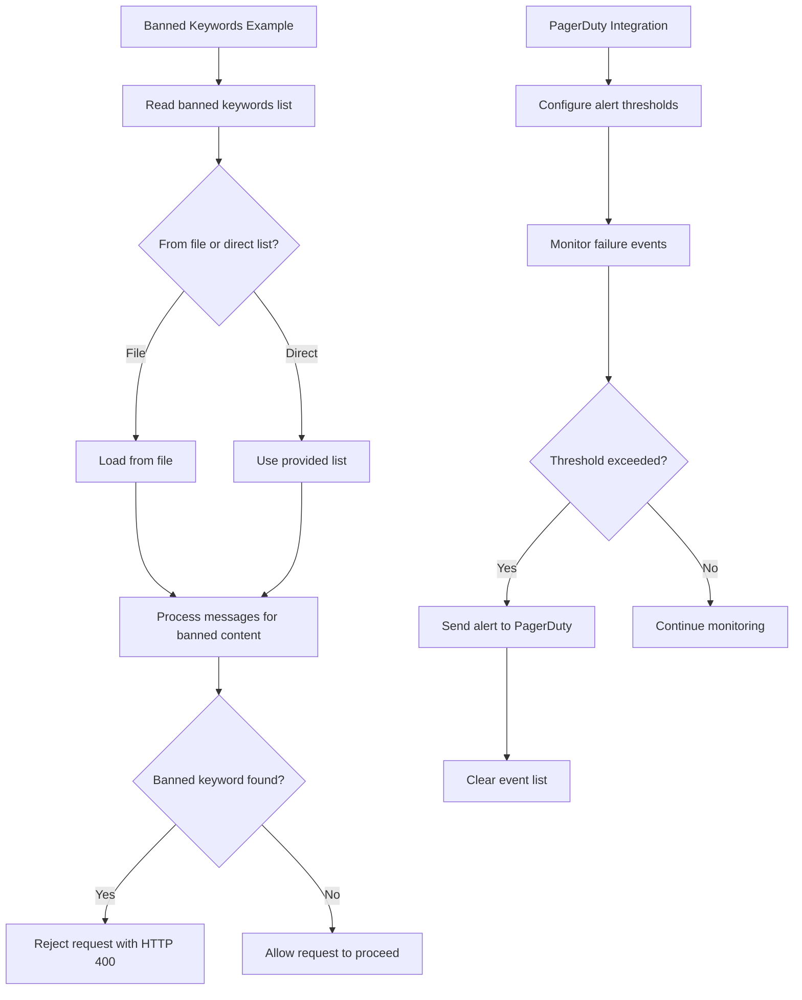

**Diagram sources**
- [banned_keywords.py](file://enterprise/enterprise_hooks/banned_keywords.py#L19-L108)
- [pagerduty.py](file://enterprise/litellm_enterprise/enterprise_callbacks/pagerduty/pagerduty.py#L45-L310)

**Section sources**
- [banned_keywords.py](file://enterprise/enterprise_hooks/banned_keywords.py#L19-L108)
- [pagerduty.py](file://enterprise/litellm_enterprise/enterprise_callbacks/pagerduty/pagerduty.py#L1-L310)

## Performance Considerations

Developing high-performance callbacks requires careful consideration of several factors to ensure they don't negatively impact the overall system performance.

### Execution Time
Callbacks should be optimized for minimal execution time, especially pre-call hooks that directly affect request latency. Long-running operations should be performed asynchronously when possible.

### Resource Usage
Callbacks should be mindful of memory and CPU usage, avoiding operations that could lead to resource exhaustion under high load.

### Caching Strategies
Implement caching for expensive operations, such as external API calls or complex computations, to reduce redundant work and improve response times.

### Connection Management
For callbacks that integrate with external systems, proper connection pooling and reuse should be implemented to minimize connection overhead.

### Scalability
Callbacks should be designed to scale horizontally, avoiding shared state that could become a bottleneck. When state is required, use distributed storage solutions.

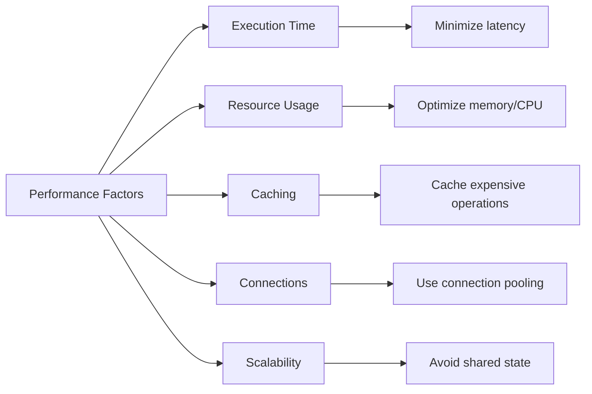

**Section sources**
- [pagerduty.py](file://enterprise/litellm_enterprise/enterprise_callbacks/pagerduty/pagerduty.py#L153-L157)
- [banned_keywords.py](file://enterprise/enterprise_hooks/banned_keywords.py#L75-L80)

## Troubleshooting and Debugging

Effective troubleshooting and debugging strategies are essential for maintaining reliable callback functionality.

### Logging and Monitoring
Comprehensive logging should be implemented to capture callback execution details, including entry/exit points, parameter values, and any errors encountered.

### Health Checks
Implement health check endpoints that verify callback functionality and dependencies, allowing for proactive detection of issues.

### Error Tracking
Use structured error tracking to categorize and prioritize callback issues, making it easier to identify and resolve problems.

### Testing Strategies
Develop comprehensive test cases that cover normal operation, edge cases, and failure scenarios to ensure callback reliability.

### Debug Mode
Implement a debug mode that provides additional diagnostic information when enabled, helping to diagnose issues in development and staging environments.

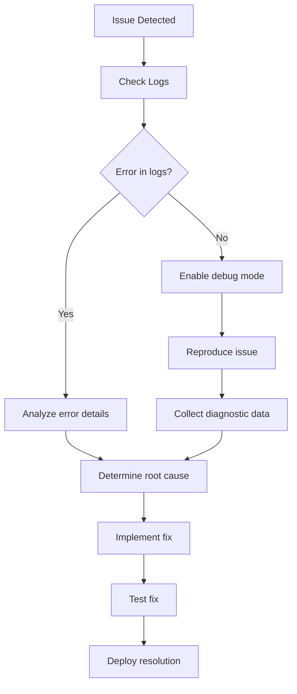

**Section sources**
- [banned_keywords.py](file://enterprise/enterprise_hooks/banned_keywords.py#L84-L88)
- [pagerduty.py](file://enterprise/litellm_enterprise/enterprise_callbacks/pagerduty/pagerduty.py#L308-L309)

## Security Considerations

Security is paramount when developing enterprise callbacks, as they have access to sensitive data and system functionality.

### Input Validation
All input to callbacks should be thoroughly validated to prevent injection attacks and other security vulnerabilities.

### Secure Configuration
Sensitive configuration data, such as API keys and credentials, should be stored securely and never exposed in logs or error messages.

### Principle of Least Privilege
Callbacks should operate with the minimum privileges necessary to perform their functions, reducing the potential impact of security breaches.

### Data Protection
Implement appropriate data protection measures, including encryption of sensitive data at rest and in transit.

### Audit Logging
Maintain comprehensive audit logs of callback activities, especially those involving security-related decisions.

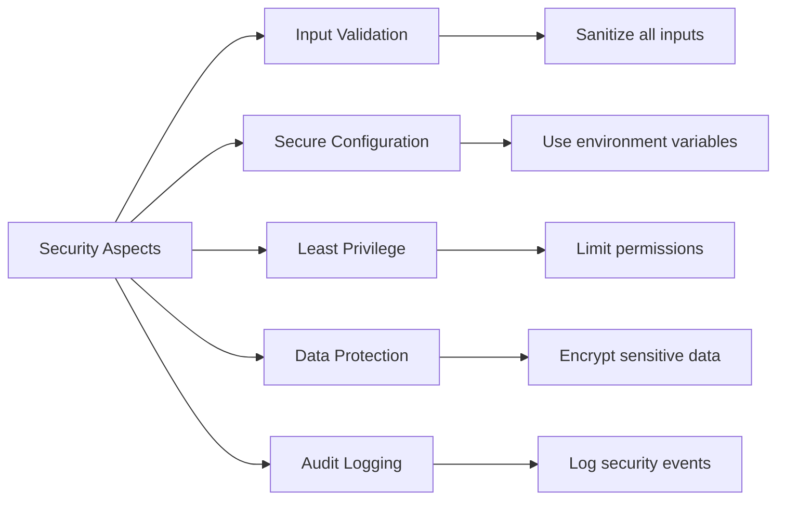

**Section sources**
- [banned_keywords.py](file://enterprise/enterprise_hooks/banned_keywords.py#L58-L61)
- [pagerduty.py](file://enterprise/litellm_enterprise/enterprise_callbacks/pagerduty/pagerduty.py#L55-L57)

## Best Practices

Adhering to best practices ensures that custom callbacks are reliable, maintainable, and performant.

### Code Organization
Structure callback code logically, separating concerns and following consistent naming conventions.

### Error Handling
Implement robust error handling that gracefully manages failures without compromising system stability.

### Documentation
Provide comprehensive documentation for callback functionality, configuration options, and usage examples.

### Testing
Develop thorough test suites that cover all functionality, including edge cases and failure scenarios.

### Monitoring
Implement monitoring and alerting to detect performance issues and functional problems.

### Version Compatibility
Ensure callbacks are compatible with different versions of the LiteLLM proxy and maintain backward compatibility when possible.

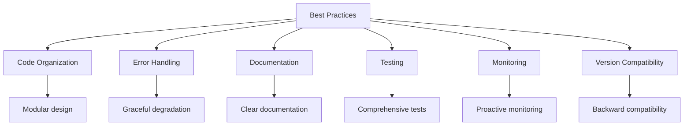

**Section sources**
- [custom_callbacks.py](file://litellm/proxy/example_config_yaml/custom_callbacks.py#L1-L75)
- [callback_controls.py](file://enterprise/litellm_enterprise/enterprise_callbacks/callback_controls.py#L1-L99)