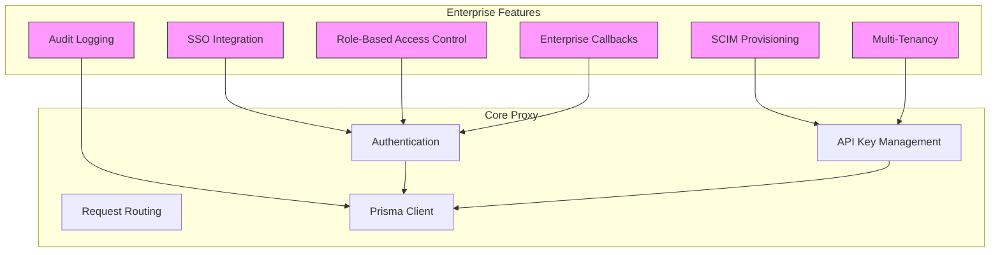
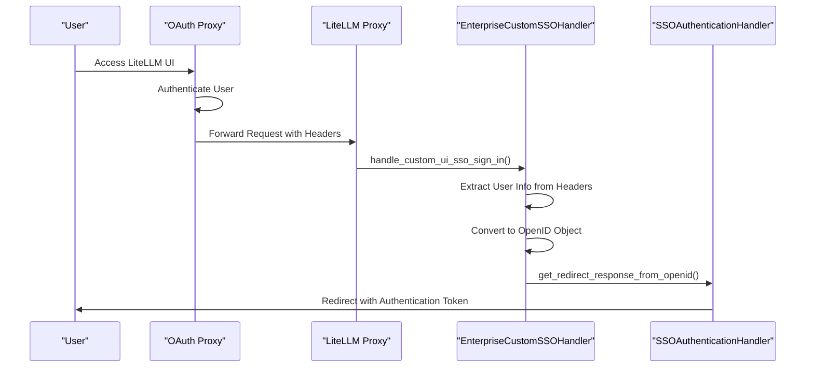
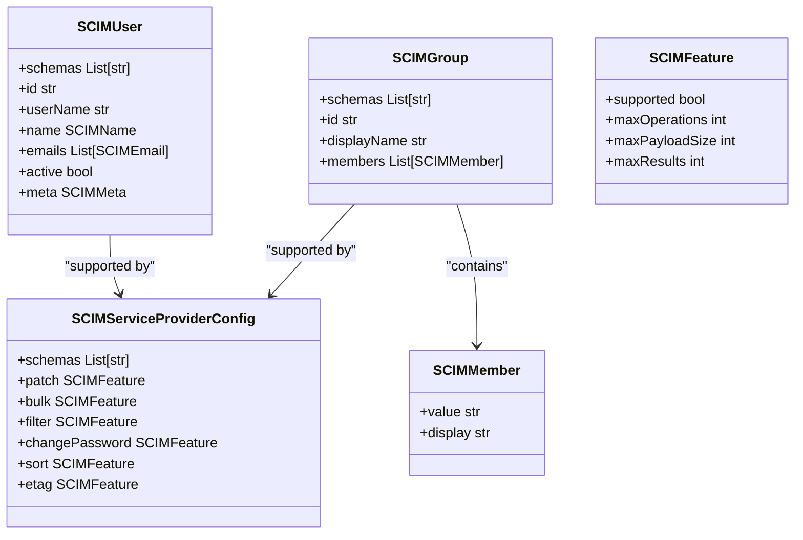
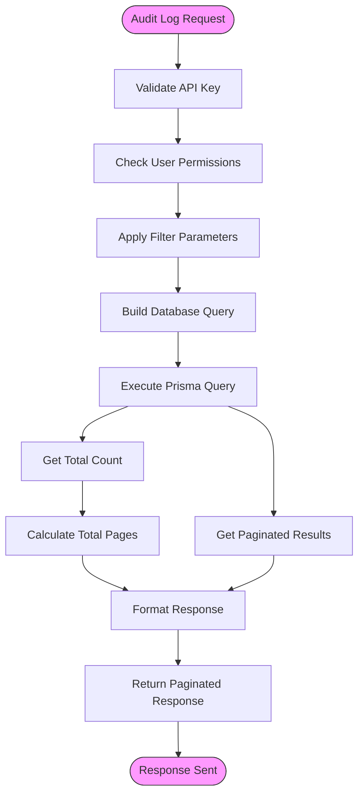
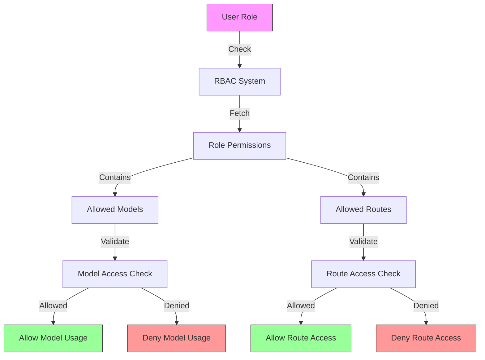
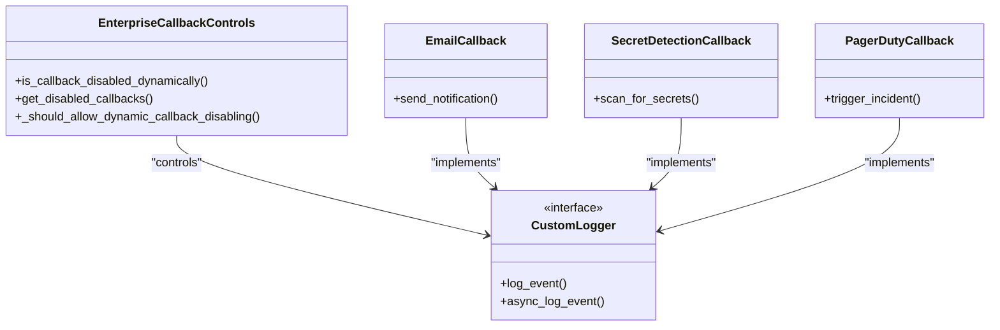

# Enterprise Features

<cite>
**Referenced Files in This Document**   
- [custom_sso_handler.py](file://enterprise/litellm_enterprise/proxy/auth/custom_sso_handler.py#L1-L86)
- [audit_logging_endpoints.py](file://enterprise/litellm_enterprise/proxy/audit_logging_endpoints.py#L1-L168)
- [enterprise_routes.py](file://enterprise/litellm_enterprise/proxy/enterprise_routes.py#L1-L27)
- [callback_controls.py](file://enterprise/litellm_enterprise/enterprise_callbacks/callback_controls.py#L1-L99)
- [SCIM_v2.py](file://litellm/types/proxy/management_endpoints/scim_v2.py#L54-L114)
- [SCIM.tsx](file://ui/litellm-dashboard/src/components/SCIM.tsx#L1-L158)
- [auth_checks.py](file://litellm/proxy/auth/auth_checks.py#L918-L975)
</cite>

## Table of Contents
1. [Introduction](#introduction)
2. [Architecture Overview](#architecture-overview)
3. [SSO Integration](#sso-integration)
4. [SCIM Provisioning](#scim-provisioning)
5. [Audit Logging](#audit-logging)
6. [Role-Based Access Control](#role-based-access-control)
7. [Multi-Tenancy and Organization Hierarchies](#multi-tenancy-and-organization-hierarchies)
8. [Enterprise Callbacks](#enterprise-callbacks)
9. [Security Integration](#security-integration)
10. [Troubleshooting Guide](#troubleshooting-guide)
11. [Performance Considerations](#performance-considerations)
12. [Best Practices](#best-practices)

## Introduction
LiteLLM Enterprise provides a comprehensive suite of features designed for large-scale, secure deployments in enterprise environments. This documentation covers the architecture and implementation details of key enterprise capabilities including Single Sign-On (SSO) integration, System for Cross-domain Identity Management (SCIM) provisioning, audit logging, role-based access control, and multi-tenancy support. The enterprise module is designed to meet the stringent security, compliance, and scalability requirements of large organizations, enabling secure API access management, user provisioning, and comprehensive audit trails.

## Architecture Overview
The LiteLLM Enterprise architecture is built as an extension to the core LiteLLM proxy, providing enterprise-grade features through a modular design. The architecture consists of several key components that work together to provide secure, scalable enterprise functionality.

**Diagram sources**
- [custom_sso_handler.py](file://enterprise/litellm_enterprise/proxy/auth/custom_sso_handler.py#L1-L86)
- [audit_logging_endpoints.py](file://enterprise/litellm_enterprise/proxy/audit_logging_endpoints.py#L1-L168)
- [enterprise_routes.py](file://enterprise/litellm_enterprise/proxy/enterprise_routes.py#L1-L27)

**Section sources**
- [custom_sso_handler.py](file://enterprise/litellm_enterprise/proxy/auth/custom_sso_handler.py#L1-L86)
- [audit_logging_endpoints.py](file://enterprise/litellm_enterprise/proxy/audit_logging_endpoints.py#L1-L168)

## SSO Integration
LiteLLM Enterprise supports custom SSO integration through the EnterpriseCustomSSOHandler class, which enables organizations to integrate with their existing identity providers and OAuth proxies. The SSO integration allows users to authenticate through an external OAuth proxy that has already authenticated the user, extracting user information from custom headers or request attributes.

The SSO flow begins with the handle_custom_ui_sso_sign_in method, which processes incoming requests and converts user information into OpenID format. This approach is particularly useful when deploying LiteLLM behind an existing OAuth proxy, where the proxy has already handled user authentication and added custom headers containing user information.

**Diagram sources**
- [custom_sso_handler.py](file://enterprise/litellm_enterprise/proxy/auth/custom_sso_handler.py#L36-L86)

**Section sources**
- [custom_sso_handler.py](file://enterprise/litellm_enterprise/proxy/auth/custom_sso_handler.py#L1-L86)

## SCIM Provisioning
LiteLLM Enterprise provides SCIM v2.0 compliant provisioning endpoints for automated user and group management. The SCIM integration enables seamless synchronization of user identities and group memberships between identity providers and the LiteLLM proxy, supporting automated provisioning, deprovisioning, and attribute synchronization.

The SCIM implementation includes support for core SCIM resources including users and groups, with standard CRUD operations for managing identities. The system supports the urn:ietf:params:scim:schemas:core:2.0:User and urn:ietf:params:scim:schemas:core:2.0:Group schemas, along with the service provider configuration endpoint that describes supported features.

**Diagram sources**
- [SCIM_v2.py](file://litellm/types/proxy/management_endpoints/scim_v2.py#L54-L114)
- [SCIM.tsx](file://ui/litellm-dashboard/src/components/SCIM.tsx#L1-L158)

**Section sources**
- [SCIM_v2.py](file://litellm/types/proxy/management_endpoints/scim_v2.py#L54-L114)
- [SCIM.tsx](file://ui/litellm-dashboard/src/components/SCIM.tsx#L1-L158)

## Audit Logging
LiteLLM Enterprise provides comprehensive audit logging capabilities to track all administrative actions and system changes. The audit logging system captures detailed information about who made changes, what was changed, when the change occurred, and which API key was used, enabling compliance with regulatory requirements and security monitoring.

The audit logging endpoints provide both paginated retrieval of audit logs and detailed lookup by ID. Logs are stored in the database with fields for the action performed (create, update, delete), the table modified, the object ID, the user or system that made the change, and the timestamp of the change. The system supports filtering by various criteria including date ranges, action types, table names, and user identifiers.

**Diagram sources**
- [audit_logging_endpoints.py](file://enterprise/litellm_enterprise/proxy/audit_logging_endpoints.py#L25-L168)

**Section sources**
- [audit_logging_endpoints.py](file://enterprise/litellm_enterprise/proxy/audit_logging_endpoints.py#L1-L168)

## Role-Based Access Control
LiteLLM Enterprise implements a robust role-based access control (RBAC) system that allows administrators to define granular permissions for different user roles. The RBAC system controls access to models, routes, and management endpoints based on user roles, enabling organizations to enforce the principle of least privilege.

The role-based permissions are configured in the general_settings configuration, where administrators can define which models and routes are accessible to each role. The system supports standard roles such as admin, user, and viewer, with configurable permissions that can be customized to meet specific organizational requirements.

**Diagram sources**
- [auth_checks.py](file://litellm/proxy/auth/auth_checks.py#L918-L975)

**Section sources**
- [auth_checks.py](file://litellm/proxy/auth/auth_checks.py#L918-L975)

## Multi-Tenancy and Organization Hierarchies
LiteLLM Enterprise supports multi-tenancy through organization-based isolation of resources and permissions. The system allows organizations to create hierarchical structures with parent-child relationships between organizations, enabling delegated administration and resource sharing across organizational units.

Each organization has its own set of API keys, users, and configuration settings, with the ability to inherit certain policies from parent organizations. This hierarchical approach enables large enterprises to manage multiple business units or departments with different requirements while maintaining centralized control over security policies and compliance settings.

The multi-tenancy model integrates with the RBAC system, allowing different roles to have different levels of access across organizational boundaries. For example, a global administrator might have access to all organizations, while a department administrator only has access to their specific organizational unit and its children.

## Enterprise Callbacks
LiteLLM Enterprise provides a flexible callback system that allows organizations to extend the proxy's functionality with custom enterprise-specific logic. The callback system supports various types of enterprise callbacks including email notifications, secret detection, and integration with external monitoring systems.

The EnterpriseCallbackControls class provides mechanisms for dynamically enabling or disabling callbacks based on request headers or other conditions. This allows organizations to control which callbacks are executed for specific requests, providing flexibility in how enterprise features are applied.

**Diagram sources**
- [callback_controls.py](file://enterprise/litellm_enterprise/enterprise_callbacks/callback_controls.py#L14-L99)

**Section sources**
- [callback_controls.py](file://enterprise/litellm_enterprise/enterprise_callbacks/callback_controls.py#L1-L99)

## Security Integration
LiteLLM Enterprise integrates with various security systems to provide comprehensive protection for API access and data. The security integration includes support for API key management, team-based routing, and encryption of sensitive data.

The system supports the x-litellm-disable-callbacks header, which allows requests to dynamically disable specific callbacks for security or performance reasons. This feature is particularly useful in enterprise environments where certain callbacks might need to be temporarily disabled for specific operations.

The integration between enterprise features and security systems ensures that access controls are consistently enforced across all components. For example, when a user makes a request, the system validates their API key, checks their role-based permissions, and applies any organization-specific policies before routing the request to the appropriate LLM provider.

## Troubleshooting Guide
When implementing LiteLLM Enterprise features, several common issues may arise. This section provides guidance for diagnosing and resolving these issues.

For SSO configuration errors, verify that the OAuth proxy is correctly configured to add the required headers to requests. Check that the custom_ui_sso_sign_in_handler is properly configured in the general_settings and that it can successfully extract user information from the request headers.

For permission inheritance problems in organization hierarchies, ensure that the parent organization's policies are correctly configured and that child organizations are properly linked. Verify that role-based permissions are correctly defined and that there are no conflicting policies.

When audit logs are not being generated, check that the prisma_client is properly connected to the database and that the audit logging endpoints have the necessary permissions to write to the database. Verify that the premium_user flag is set to True, as audit logging is an enterprise feature.

## Performance Considerations
For large organizations with thousands of users, several performance considerations should be addressed. The SCIM provisioning endpoints should be optimized for bulk operations to minimize the number of API calls required for user synchronization. Caching strategies should be implemented for frequently accessed data such as user roles and permissions.

The audit logging system should be configured with appropriate indexing on the database to ensure fast query performance, especially when filtering by date ranges or other common criteria. For organizations with high volumes of audit data, consider implementing data retention policies and archiving older logs to maintain performance.

The RBAC system should be optimized to minimize the overhead of permission checks, particularly for high-traffic endpoints. Caching of role-based permissions can significantly improve performance for organizations with complex permission structures.

## Best Practices
To ensure secure and effective deployment of LiteLLM Enterprise features, follow these best practices:

1. Implement regular key rotation for API keys and service accounts
2. Configure appropriate data retention policies for audit logs
3. Use the principle of least privilege when defining role-based permissions
4. Regularly review and audit access controls and user permissions
5. Implement monitoring and alerting for security-related events
6. Use encryption for sensitive data at rest and in transit
7. Regularly update and patch the LiteLLM proxy and its dependencies
8. Conduct regular security assessments and penetration testing
9. Implement backup and disaster recovery procedures
10. Document and review security policies and procedures regularly