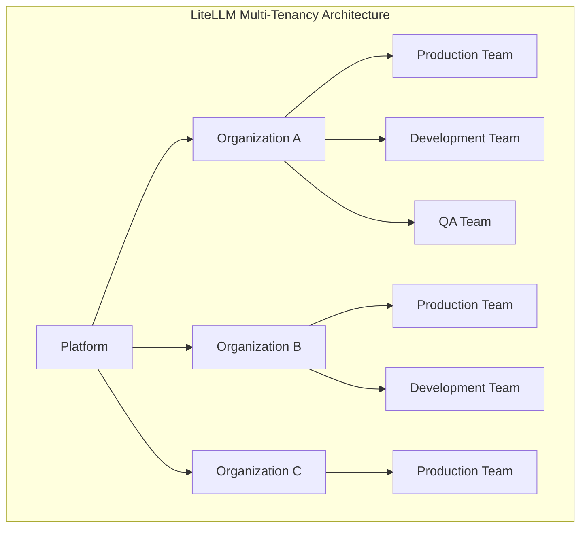
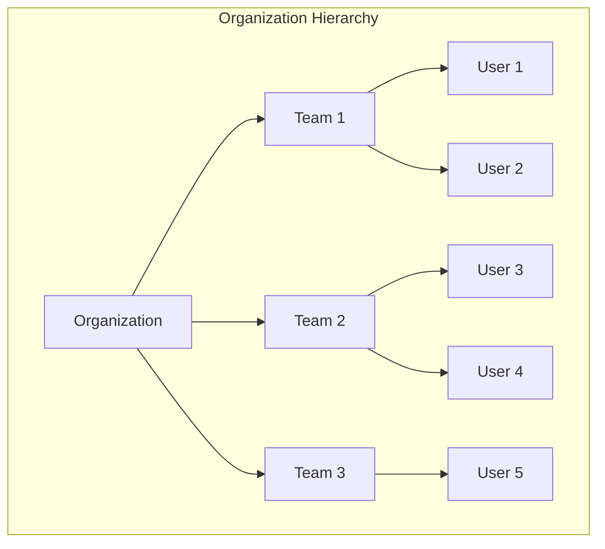
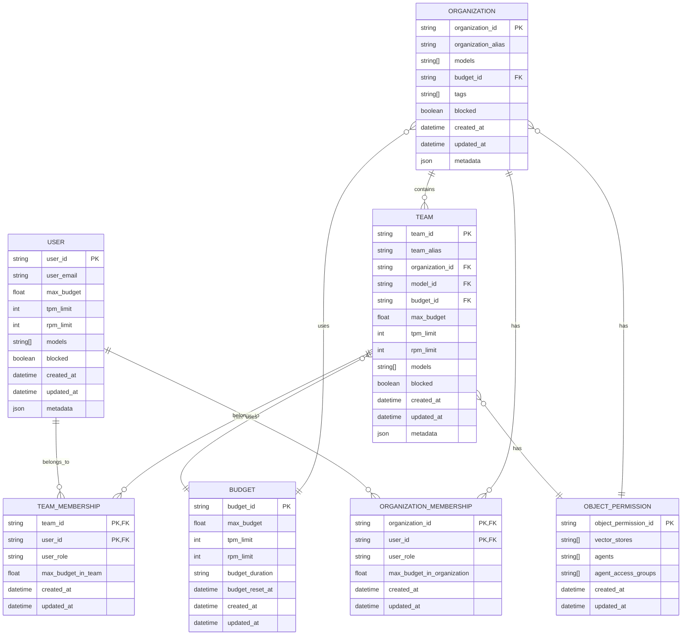

# Organization Management

<cite>
**Referenced Files in This Document**   
- [organization_endpoints.py](file://litellm/proxy/management_endpoints/organization_endpoints.py)
- [auth_checks_organization.py](file://litellm/proxy/auth/auth_checks_organization.py)
- [team_endpoints.py](file://litellm/proxy/management_endpoints/team_endpoints.py)
- [multi_tenant_architecture.md](file://docs/my-website/docs/proxy/multi_tenant_architecture.md)
- [db_info.md](file://docs/my-website/docs/proxy/db_info.md)
- [test_organizations.py](file://tests/test_organizations.py)
- [types.py](file://litellm/proxy/_types.py)
</cite>

## Table of Contents
1. [Introduction](#introduction)
2. [Multi-Tenancy Architecture](#multi-tenancy-architecture)
3. [Organization Hierarchy](#organization-hierarchy)
4. [Team Structures](#team-structures)
5. [User Management](#user-management)
6. [Configuration Options](#configuration-options)
7. [Data Model](#data-model)
8. [API Endpoints](#api-endpoints)
9. [Common Issues and Solutions](#common-issues-and-solutions)
10. [Scalability Considerations](#scalability-considerations)

## Introduction

LiteLLM provides a comprehensive multi-tenancy architecture for enterprise deployments, enabling organizations to centrally manage LLM access while maintaining tenant isolation. The system supports hierarchical organization structures with Organizations, Teams, and Users, allowing for granular control over budgets, model access, rate limits, and permissions. This documentation details the implementation of organization management in LiteLLM, covering the architecture, configuration options, API endpoints, and best practices for enterprise deployments.

**Section sources**
- [multi_tenant_architecture.md](file://docs/my-website/docs/proxy/multi_tenant_architecture.md#L1-L435)

## Multi-Tenancy Architecture

LiteLLM implements a hierarchical multi-tenant architecture that scales across multiple tenants, enabling organizations to centrally manage LLM access while isolating spend and usage across different organizational units. The architecture supports delegation of administration without compromising security and provides detailed cost tracking at granular levels from organization to team to user to key.

The multi-tenancy solution addresses key challenges faced by organizations:
- Centralized vs. decentralized management needs
- Cost attribution across business units, departments, or customers
- Access control with different models, budgets, and rate limits for different teams
- Delegation of administrative responsibilities
- Scalability from small teams to large enterprises with thousands of users

Organizations can implement multi-tenancy using Teams alone in the open source version, or add Organizations on top for additional hierarchy in the enterprise version. This flexible approach allows organizations to start with simpler team-based isolation and evolve to more complex organizational structures as their needs grow.



**Diagram sources**
- [multi_tenant_architecture.md](file://docs/my-website/docs/proxy/multi_tenant_architecture.md#L34-L35)

**Section sources**
- [multi_tenant_architecture.md](file://docs/my-website/docs/proxy/multi_tenant_architecture.md#L1-L435)

## Organization Hierarchy

The organization hierarchy in LiteLLM consists of three primary levels: Organizations, Teams, and Users. Organizations represent the highest level of tenant isolation, typically corresponding to business units, departments, or customers. Each organization has its own budget limits, allowed models, admin users, teams, and spend tracking.

Organizations provide complete isolation between different business units or customers, ensuring that one organization cannot view or access another organization's data, keys, or models. Organization admins can manage teams within their organization but have no visibility into other organizations. This isolation is critical for multi-customer SaaS providers or enterprises with strict data separation requirements.

The hierarchical structure enables centralized billing and model access control while allowing department leads to manage their own teams and budgets. This balance of central control and decentralized management is essential for large enterprises with multiple departments or business units.



**Diagram sources**
- [multi_tenant_architecture.md](file://docs/my-website/docs/proxy/multi_tenant_architecture.md#L34-L35)

**Section sources**
- [multi_tenant_architecture.md](file://docs/my-website/docs/proxy/multi_tenant_architecture.md#L38-L59)
- [organization_endpoints.py](file://litellm/proxy/management_endpoints/organization_endpoints.py#L70-L141)

## Team Structures

Teams in LiteLLM serve as mid-level groupings that can work independently or exist within organizations. Teams represent logical groupings of users working together on specific projects or functions. Each team has team-specific budgets, rate limits, service account keys for shared resources, model access controls, and granular member permissions.

Teams are available in both open source and enterprise versions of LiteLLM, making them a versatile building block for multi-tenancy. In open source deployments, teams can serve as the primary multi-tenant boundary, while in enterprise deployments, they provide an additional layer of organization within larger organizational structures.

Key team features include:
- Team-specific budgets and rate limits
- Team admins who manage members and permissions
- Service account keys for shared resources and production environments
- Model access controls and guardrails
- Granular member permissions for non-admin team members

The team structure supports various deployment patterns, including departmental separation, multi-customer SaaS, and environment separation (development, staging, production). This flexibility allows organizations to adapt the structure to their specific needs.

**Section sources**
- [multi_tenant_architecture.md](file://docs/my-website/docs/proxy/multi_tenant_architecture.md#L64-L77)
- [team_endpoints.py](file://litellm/proxy/management_endpoints/team_endpoints.py#L636-L723)

## User Management

User management in LiteLLM enables fine-grained control over individual user access, permissions, and resource allocation. Users can be members of multiple teams and organizations, with their permissions and limits inherited from their organizational hierarchy. The system supports various user roles, including proxy admins, organization admins, team admins, and regular users, each with different levels of access and control.

User management includes features for:
- User provisioning and deprovisioning
- Role assignment and permission management
- Individual budget and rate limit configuration
- Authentication and authorization
- Audit logging of user actions

The system also supports bulk user operations and integration with external identity providers through SSO. User invitations and onboarding workflows are provided to streamline the addition of new users to teams and organizations.

**Section sources**
- [multi_tenant_architecture.md](file://docs/my-website/docs/proxy/multi_tenant_architecture.md#L201-L205)
- [team_endpoints.py](file://litellm/proxy/management_endpoints/team_endpoints.py#L903-L913)

## Configuration Options

### Organization Configuration

Organizations in LiteLLM can be configured with various options to control access, budgets, and behavior. Key configuration parameters include:

- **organization_alias**: A user-friendly name for the organization
- **models**: List of models the organization has access to
- **budget_id**: Reference to a budget configuration for the organization
- **max_budget**: Maximum budget for the organization
- **tpm_limit**: Maximum tokens per minute limit for the organization
- **rpm_limit**: Maximum requests per minute limit for the organization
- **model_rpm_limit**: RPM limits per specific model
- **model_tpm_limit**: TPM limits per specific model
- **metadata**: Custom metadata for the organization
- **blocked**: Flag to block all calls from keys associated with the organization
- **tags**: Tags for tracking spend and tag-based routing
- **object_permission**: Organization-specific object permissions for resources like vector stores and MCP servers

Organizations can be created with either a reference to an existing budget or with budget parameters that will create a new budget automatically. This flexibility allows for centralized budget management or decentralized budget creation.

### Team Configuration

Teams can be configured with a comprehensive set of options to control their behavior and resource allocation:

- **team_alias**: User-defined team alias
- **members_with_roles**: List of users and their roles in the team
- **team_member_permissions**: Routes that non-admin team members can access
- **metadata**: Custom metadata for the team
- **model_rpm_limit**: RPM limits per model for the team
- **model_tpm_limit**: TPM limits per model for the team
- **tpm_limit**: Overall TPM limit for the team
- **rpm_limit**: Overall RPM limit for the team
- **max_budget**: Maximum budget for the team
- **budget_duration**: Duration of the budget for the team
- **models**: List of models associated with the team
- **blocked**: Flag to block all calls from keys with this team_id
- **organization_id**: The organization to which the team belongs
- **model_aliases**: Model aliases for the team
- **guardrails**: Guardrails for the team
- **object_permission**: Team-specific object permissions

Teams can also be configured with member-specific limits, including team_member_budget, team_member_rpm_limit, and team_member_tpm_limit, which apply to individual team members.

### User Configuration

Users can be configured with various parameters to control their access and resource allocation:

- **user_id**: Unique identifier for the user
- **models**: List of models the user has access to
- **max_budget**: Maximum budget for the user
- **budget_duration**: Duration of the user's budget
- **user_email**: Email address for the user
- **team_id**: Team to which the user belongs
- **organization_id**: Organization to which the user belongs
- **duration**: Duration of the user's access
- **blocked**: Flag to block the user
- **allowed_model_region**: Region restrictions for model access
- **allowed_model_max_input_tokens**: Maximum input tokens allowed
- **allowed_model_max_output_tokens**: Maximum output tokens allowed

**Section sources**
- [organization_endpoints.py](file://litellm/proxy/management_endpoints/organization_endpoints.py#L88-L108)
- [team_endpoints.py](file://litellm/proxy/management_endpoints/team_endpoints.py#L658-L689)
- [multi_tenant_architecture.md](file://docs/my-website/docs/proxy/multi_tenant_architecture.md#L201-L205)

## Data Model

The data model for organization management in LiteLLM is implemented using a PostgreSQL database with several key tables that represent the hierarchical structure and relationships between organizations, teams, users, and other entities.

### Core Tables

The primary tables in the data model are:

| Table Name | Description |
|------------|-------------|
| LiteLLM_OrganizationTable | Manages organization-level configurations, including organization spend, model access, metadata, budget configurations, and associated teams |
| LiteLLM_TeamTable | Handles team-level settings within organizations, managing team members, admins, roles, budgets, rate limits, and model access |
| LiteLLM_UserTable | Stores user information and settings, tracking individual user spend, model access, rate limits, roles, and team memberships |
| LiteLLM_TeamMembership | Tracks user participation in teams, managing team-specific user budgets and spend |
| LiteLLM_OrganizationMembership | Manages user roles within organizations, tracking organization-specific user permissions and spend |
| LiteLLM_BudgetTable | Stores budget configurations for organizations, teams, and users, including max budget, TPM/RPM limits, and budget duration |
| LiteLLM_ObjectPermissionTable | Manages object-level permissions for resources like vector stores and MCP servers |

### Relationships

The tables are related through foreign key relationships that enforce the hierarchical structure:

- Organizations contain multiple teams (one-to-many relationship)
- Teams contain multiple users through the TeamMembership table (many-to-many relationship)
- Users can belong to multiple organizations through the OrganizationMembership table (many-to-many relationship)
- Budgets are associated with organizations, teams, or users
- Object permissions are associated with organizations or teams

This relational structure enables efficient querying and enforcement of the hierarchical permissions and limits.



**Diagram sources**
- [db_info.md](file://docs/my-website/docs/proxy/db_info.md#L17-L23)
- [organization_endpoints.py](file://litellm/proxy/management_endpoints/organization_endpoints.py#L232-L259)
- [team_endpoints.py](file://litellm/proxy/management_endpoints/team_endpoints.py#L856-L898)

**Section sources**
- [db_info.md](file://docs/my-website/docs/proxy/db_info.md#L17-L23)
- [organization_endpoints.py](file://litellm/proxy/management_endpoints/organization_endpoints.py#L232-L259)
- [team_endpoints.py](file://litellm/proxy/management_endpoints/team_endpoints.py#L856-L898)

## API Endpoints

### Organization Endpoints

The organization management API provides endpoints for creating, updating, deleting, and listing organizations.

#### Create Organization
```
POST /organization/new
```
Creates a new organization with specified configuration options. Only proxy admins can create organizations.

**Request Parameters:**
- organization_alias: Name of the organization
- models: Models the organization can access
- budget_id: ID of existing budget or budget parameters to create new budget
- max_budget: Maximum budget for the organization
- tpm_limit: Maximum TPM limit for the organization
- rpm_limit: Maximum RPM limit for the organization
- metadata: Custom metadata for the organization
- blocked: Whether the organization is blocked
- tags: Tags for spend tracking and routing
- organization_id: Optional organization ID (auto-generated if not provided)
- model_aliases: Model aliases for the organization
- object_permission: Object permissions for the organization

**Response:** Created organization object with organization_id and configuration.

#### Update Organization
```
PATCH /organization/update
```
Updates an existing organization's configuration.

**Request Parameters:**
- organization_id: ID of the organization to update
- Other organization parameters to update

**Response:** Updated organization object.

#### Delete Organization
```
DELETE /organization/delete
```
Deletes one or more organizations. Only proxy admins can delete organizations.

**Request Parameters:**
- organization_ids: List of organization IDs to delete

**Response:** List of deleted organization objects.

#### List Organizations
```
GET /organization/list
```
Lists all organizations accessible to the authenticated user.

**Response:** List of organization objects.

#### Organization Information
```
GET /organization/info
```
Retrieves information about a specific organization.

**Request Parameters:**
- organization_id: ID of the organization to retrieve

**Response:** Organization object with full configuration.

### Team Endpoints

#### Create Team
```
POST /team/new
```
Creates a new team with specified configuration.

**Request Parameters:**
- team_alias: Team name
- team_id: Optional team ID (auto-generated if not provided)
- members_with_roles: List of members and their roles
- team_member_permissions: Permissions for non-admin team members
- metadata: Custom metadata
- model_rpm_limit: Model-specific RPM limits
- model_tpm_limit: Model-specific TPM limits
- tpm_limit: Overall TPM limit
- rpm_limit: Overall RPM limit
- max_budget: Maximum budget
- budget_duration: Budget duration
- models: Allowed models
- blocked: Whether the team is blocked
- organization_id: Parent organization ID
- model_aliases: Model aliases
- guardrails: Team guardrails
- object_permission: Object permissions
- team_member_budget: Individual member budget limits
- team_member_rpm_limit: Individual member RPM limits
- team_member_tpm_limit: Individual member TPM limits

**Response:** Created team object with team_id.

#### Update Team
```
POST /team/update
```
Updates an existing team's configuration.

**Request Parameters:**
- team_id: ID of the team to update
- Other team parameters to update

**Response:** Updated team object.

#### Delete Team
```
POST /team/delete
```
Deletes one or more teams.

**Request Parameters:**
- team_ids: List of team IDs to delete

**Response:** List of deleted team objects.

#### List Teams
```
GET /team/list
```
Lists all teams accessible to the authenticated user.

**Response:** List of team objects.

### User Endpoints

#### Add User to Organization
```
POST /organization/member_add
```
Adds one or more users to an organization.

**Request Parameters:**
- organization_id: ID of the organization
- member: User or list of users to add, with roles
- max_budget_in_organization: Optional budget limit for the user in the organization

**Response:** Confirmation of added members.

#### Add User to Team
```
POST /team/member_add
```
Adds one or more users to a team.

**Request Parameters:**
- team_id: ID of the team
- member: User or list of users to add, with roles
- max_budget_in_team: Optional budget limit for the user in the team

**Response:** Confirmation of added members.

**Section sources**
- [organization_endpoints.py](file://litellm/proxy/management_endpoints/organization_endpoints.py#L70-L682)
- [team_endpoints.py](file://litellm/proxy/management_endpoints/team_endpoints.py#L636-L1169)
- [test_organizations.py](file://tests/test_organizations.py#L53-L166)

## Common Issues and Solutions

### Permission Inheritance Conflicts

When users belong to multiple organizations or teams with conflicting permissions, LiteLLM resolves these conflicts through a hierarchical permission model. Permissions are evaluated from the most specific to the most general level:

1. User-specific permissions
2. Team-level permissions
3. Organization-level permissions
4. System-wide default permissions

When conflicts arise, the most restrictive permission takes precedence. For example, if a user has access to a model at the organization level but is blocked from that model at the team level, the team-level restriction applies.

To avoid conflicts, organizations should establish clear permission hierarchies and regularly audit user permissions. The system provides audit logs that track permission changes and can help identify and resolve conflicts.

### Quota Management Across Organizations

Managing quotas across multiple organizations requires careful planning to prevent overspending while ensuring adequate resources for all teams. LiteLLM provides several mechanisms to manage quotas effectively:

- **Hierarchical quota enforcement**: Organization quotas serve as upper limits that cannot be exceeded by any team or user within the organization
- **Quota monitoring**: Real-time monitoring of quota usage with alerts when thresholds are approached
- **Quota allocation**: Organizations can allocate portions of their total quota to specific teams
- **Quota rollover**: Unused quota can be configured to roll over to subsequent periods or expire

Best practices for quota management include:
- Setting realistic quotas based on historical usage and projected needs
- Implementing soft limits with notifications before hard limits are reached
- Regularly reviewing and adjusting quotas based on actual usage patterns
- Using tags to track quota usage by project, department, or other categories

### Bulk User Provisioning

Bulk user provisioning can be challenging due to the need to maintain data consistency and handle errors gracefully. LiteLLM addresses these challenges through:

- **Batch operations**: Support for bulk creation and updates of users, teams, and organizations
- **Transaction safety**: Database transactions ensure that operations are atomic and consistent
- **Error handling**: Detailed error reporting for individual operations within bulk requests
- **Idempotency**: Support for idempotent operations to prevent duplicate creation

Best practices for bulk user provisioning include:
- Validating data before submission to minimize errors
- Using small batch sizes to simplify error handling
- Implementing retry logic for failed operations
- Monitoring system performance during bulk operations to avoid overloading

**Section sources**
- [organization_endpoints.py](file://litellm/proxy/management_endpoints/organization_endpoints.py#L505-L562)
- [team_endpoints.py](file://litellm/proxy/management_endpoints/team_endpoints.py#L2780-L2801)
- [utils.py](file://litellm/proxy/utils.py#L2777-L2801)

## Scalability Considerations

### Large Organization Performance

For large organizations with complex hierarchies, LiteLLM implements several performance optimization techniques:

- **Caching**: Frequently accessed data such as team and organization configurations are cached to reduce database queries
- **Indexing**: Database indexes are optimized for common query patterns, particularly for organization and team membership lookups
- **Batch operations**: Support for batch updates to minimize database round trips
- **Asynchronous processing**: Non-critical operations like audit logging are processed asynchronously to reduce request latency

The system is designed to scale horizontally, allowing additional proxy instances to be added as needed to handle increased load. Database performance is optimized through connection pooling and query optimization.

### Hierarchical Query Optimization

Queries involving the organizational hierarchy are optimized through:

- **Denormalization**: Critical relationship data is denormalized to reduce JOIN operations
- **Materialized views**: Pre-computed views for common reporting queries
- **Indexing strategy**: Composite indexes on frequently queried fields like organization_id and team_id
- **Query batching**: Related queries are batched to reduce round trips

### Caching Strategy

LiteLLM employs a multi-layer caching strategy to optimize performance:

- **In-memory cache**: For frequently accessed configuration data
- **Redis cache**: For distributed caching across multiple proxy instances
- **Database caching**: Prisma client-level caching for database queries
- **HTTP response caching**: For read-only API endpoints

The caching strategy is configurable, allowing organizations to balance performance and data freshness based on their requirements.

### Monitoring and Alerting

Comprehensive monitoring and alerting capabilities help ensure the system performs optimally:

- **Usage analytics**: Real-time tracking of API usage, spend, and performance metrics
- **Alerting**: Configurable alerts for quota thresholds, error rates, and performance degradation
- **Audit logging**: Detailed logs of all administrative actions for security and compliance
- **Health checks**: Regular health checks to monitor system status

These monitoring capabilities enable proactive identification and resolution of performance issues before they impact users.

**Section sources**
- [team_endpoints.py](file://litellm/proxy/management_endpoints/team_endpoints.py#L2777-L2801)
- [utils.py](file://litellm/proxy/utils.py#L2777-L2801)
- [multi_tenant_architecture.md](file://docs/my-website/docs/proxy/multi_tenant_architecture.md#L390-L394)