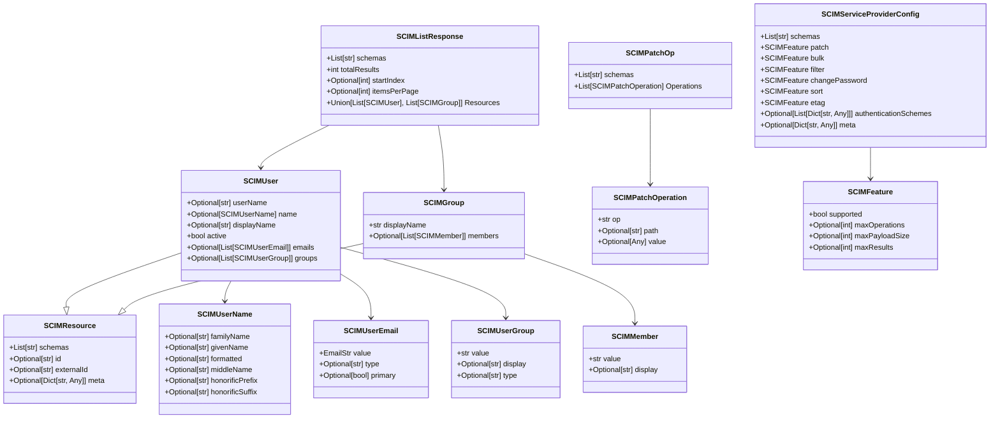
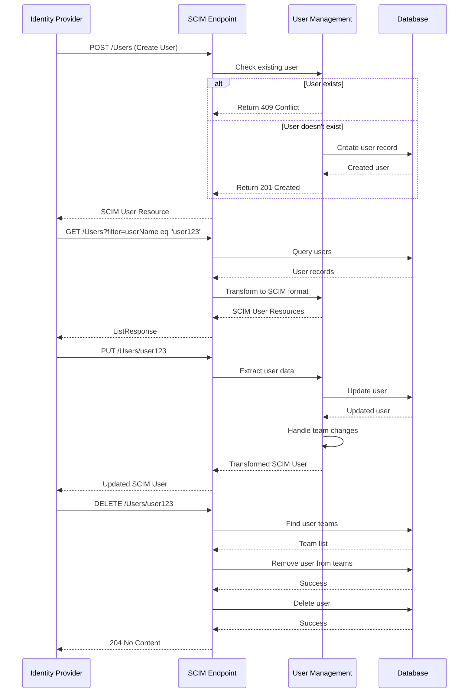
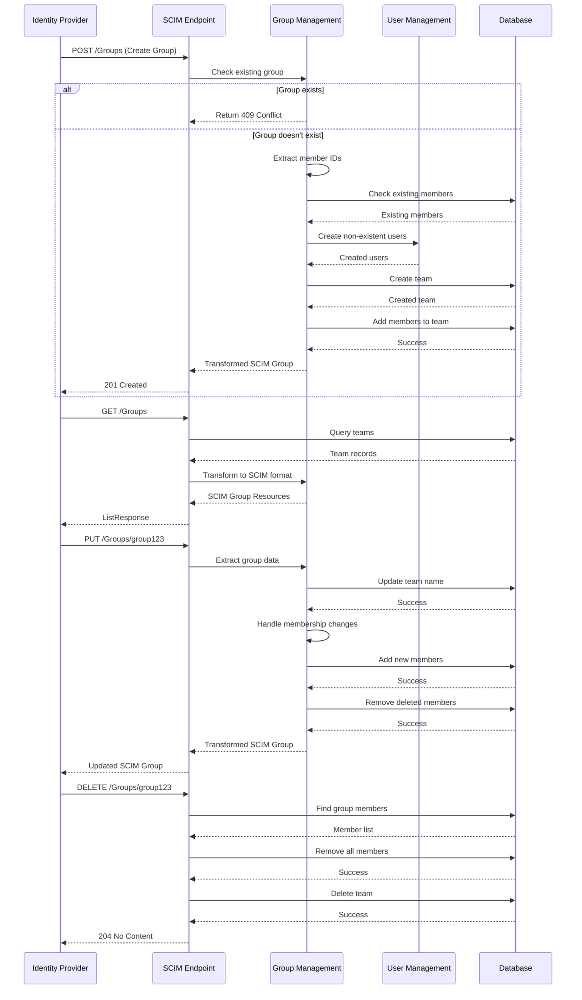
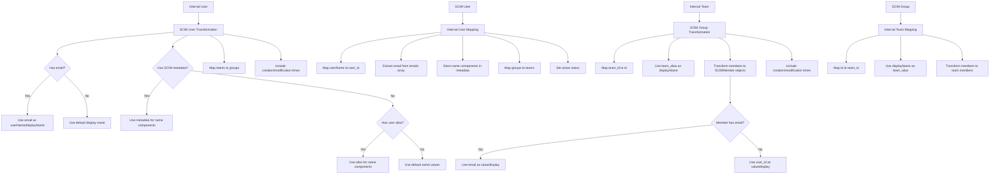

# SCIM Provisioning

<cite>
**Referenced Files in This Document**   
- [scim_v2.py](file://litellm/proxy/management_endpoints/scim/scim_v2.py)
- [scim_transformations.py](file://litellm/proxy/management_endpoints/scim/scim_transformations.py)
- [scim_v2.py](file://litellm/types/proxy/management_endpoints/scim_v2.py)
- [internal_user_endpoints.py](file://litellm/proxy/management_endpoints/internal_user_endpoints.py)
- [team_endpoints.py](file://litellm/proxy/management_endpoints/team_endpoints.py)
- [test_scim_v2_endpoints.py](file://tests/test_litellm/proxy/management_endpoints/scim/test_scim_v2_endpoints.py)
- [test_scim_transformations.py](file://tests/test_litellm/proxy/management_endpoints/scim/test_scim_transformations.py)
- [scim_litellm.md](file://docs/my-website/docs/tutorials/scim_litellm.md)
</cite>

## Table of Contents
1. [Introduction](#introduction)
2. [SCIM Endpoints Implementation](#scim-endpoints-implementation)
3. [Data Model and Resource Structure](#data-model-and-resource-structure)
4. [User Management Operations](#user-management-operations)
5. [Group Management Operations](#group-management-operations)
6. [SCIM Transformations and Data Mapping](#scim-transformations-and-data-mapping)
7. [Configuration and Security](#configuration-and-security)
8. [Integration with Identity Providers](#integration-with-identity-providers)
9. [Error Handling and Troubleshooting](#error-handling-and-troubleshooting)
10. [Best Practices](#best-practices)

## Introduction

System for Cross-domain Identity Management (SCIM) provisioning in LiteLLM enterprise deployments enables automated user and group management through standardized endpoints. This documentation details the implementation of SCIM 2.0 compliant endpoints for user and group management operations within the LiteLLM Proxy system. The SCIM functionality is an enterprise feature that requires a premium license and allows identity providers such as Okta, Azure AD, Google Workspace, OneLogin, Keycloak, and Auth0 to automate provisioning, updates, and deprovisioning of users and teams.

The SCIM implementation in LiteLLM follows the SCIM 2.0 protocol specification (RFC 7644) and provides endpoints for creating, reading, updating, and deleting user and group resources. The system integrates with LiteLLM's internal user and team management infrastructure, transforming SCIM resources to and from the internal data models used by the proxy. This integration enables seamless synchronization between external identity providers and the LiteLLM user management system, ensuring that access controls and permissions are consistently maintained across systems.

**Section sources**
- [scim_litellm.md](file://docs/my-website/docs/tutorials/scim_litellm.md#L1-L79)

## SCIM Endpoints Implementation

The SCIM endpoints in LiteLLM are implemented as FastAPI routes under the `/scim/v2` prefix, with comprehensive support for the core SCIM operations required for user and group management. The implementation follows the SCIM 2.0 protocol specification and provides a complete set of endpoints for identity provider integration.

The SCIM router is defined with enterprise-specific dependencies that enforce premium license requirements:

```python
scim_router = APIRouter(
    prefix="/scim/v2",
    tags=["✨ SCIM v2 (Enterprise Only)"],
    dependencies=[Depends(_premium_user_check)],
)
```

The implementation includes the following endpoints:

- **ServiceProviderConfig**: Returns the service provider configuration at `/ServiceProviderConfig`, detailing the supported SCIM features and capabilities.
- **Users Collection**: Supports GET, POST, PUT, PATCH, and DELETE operations for user management at `/Users` and `/Users/{user_id}`.
- **Groups Collection**: Supports GET, POST, PUT, PATCH, and DELETE operations for group management at `/Groups` and `/Groups/{group_id}`.

Each endpoint includes proper authentication via the `user_api_key_auth` dependency and sets the appropriate `application/scim+json` content type. The implementation handles all required SCIM operations with proper error handling and response codes, ensuring compatibility with standard identity providers.

```mermaid
graph TD
A[SCIM v2 Endpoints] --> B[ServiceProviderConfig]
A --> C[Users Collection]
A --> D[Groups Collection]
C --> C1[GET /Users]
C --> C2[POST /Users]
C --> C3[PUT /Users/{id}]
C --> C4[PATCH /Users/{id}]
C --> C5[DELETE /Users/{id}]
D --> D1[GET /Groups]
D --> D2[POST /Groups]
D --> D3[PUT /Groups/{id}]
D --> D4[PATCH /Groups/{id}]
D --> D5[DELETE /Groups/{id}]
```

**Diagram sources**
- [scim_v2.py](file://litellm/proxy/management_endpoints/scim/scim_v2.py#L118-L122)

**Section sources**
- [scim_v2.py](file://litellm/proxy/management_endpoints/scim/scim_v2.py#L1-L1361)

## Data Model and Resource Structure

The SCIM implementation in LiteLLM defines a comprehensive data model that aligns with the SCIM 2.0 specification while integrating with the internal user and team management structures. The data model is defined in the `scim_v2.py` file within the types module and includes classes for all SCIM resources and operations.

The core SCIM resource model extends the base `SCIMResource` class, which includes the required `schemas`, `id`, `externalId`, and `meta` attributes. User resources are represented by the `SCIMUser` class, which includes attributes such as `userName`, `name`, `displayName`, `active`, `emails`, and `groups`. The `SCIMUserName` class provides structured name components including `familyName`, `givenName`, `formatted`, `middleName`, `honorificPrefix`, and `honorificSuffix`.

Group resources are represented by the `SCIMGroup` class, which includes `displayName` and `members` attributes. Group membership is represented by the `SCIMMember` class, which contains a `value` (user ID) and optional `display` name. The implementation supports the full SCIM PATCH operation model with the `SCIMPatchOp` and `SCIMPatchOperation` classes, allowing for granular updates to resources.

The service provider configuration is represented by the `SCIMServiceProviderConfig` class, which indicates support for PATCH operations while disabling bulk operations, filtering, password changes, sorting, and ETags. This configuration reflects the current capabilities of the LiteLLM SCIM implementation.



**Diagram sources**
- [scim_v2.py](file://litellm/types/proxy/management_endpoints/scim_v2.py#L7-L114)

**Section sources**
- [scim_v2.py](file://litellm/types/proxy/management_endpoints/scim_v2.py#L1-L115)

## User Management Operations

The SCIM implementation in LiteLLM provides comprehensive support for user management operations, including creation, retrieval, updating, and deletion of user resources. Each operation follows the SCIM 2.0 protocol specification and integrates with the internal user management system.

### User Creation

The `create_user` endpoint (POST /Users) creates a new user in the system based on the provided SCIM user resource. The implementation first checks if a user with the same username already exists, returning a 409 Conflict error if found. If the user does not exist, it extracts relevant data from the SCIM user object and creates a new user through the internal user management system.

The creation process includes:
- Extracting user email, alias, and team memberships from the SCIM user
- Building metadata with SCIM-specific information such as given and family names
- Setting the default user role based on configuration
- Creating the user with the extracted data

The implementation also handles the case where a user with the same email already exists by updating the existing user with the new username and other provided information.

### User Retrieval

The implementation provides two endpoints for retrieving user information:
- **GET /Users**: Returns a paginated list of users with optional filtering support
- **GET /Users/{user_id}**: Returns a specific user by ID

The list endpoint supports pagination through `startIndex` and `count` parameters and basic filtering for `userName` and `emails.value`. The response follows the SCIM ListResponse format with proper pagination metadata.

### User Update

LiteLLM supports both full replacement (PUT) and partial update (PATCH) operations for user resources:

- **PUT /Users/{user_id}**: Performs a full replacement of the user resource
- **PATCH /Users/{user_id}**: Applies partial updates to the user resource

The PUT operation extracts all user data from the SCIM user object and updates the corresponding fields in the internal user record. It also handles team membership changes by adding or removing the user from teams as needed.

The PATCH operation supports the standard SCIM patch operations (add, remove, replace) for various user attributes:
- `displayName`: Updates the user's display name
- `externalId`: Updates the SSO user ID
- `active`: Updates the user's active status
- `name.givenName` and `name.familyName`: Updates the user's name components
- `groups`: Updates the user's group memberships

### User Deletion

The DELETE /Users/{user_id} endpoint removes a user from the system. Before deletion, the implementation removes the user from all teams they belong to, ensuring that team membership data remains consistent. After removing the user from all teams, the user record is deleted from the database.



**Diagram sources**
- [scim_v2.py](file://litellm/proxy/management_endpoints/scim/scim_v2.py#L471-L552)
- [scim_v2.py](file://litellm/proxy/management_endpoints/scim/scim_v2.py#L380-L445)
- [scim_v2.py](file://litellm/proxy/management_endpoints/scim/scim_v2.py#L554-L621)
- [scim_v2.py](file://litellm/proxy/management_endpoints/scim/scim_v2.py#L623-L663)

**Section sources**
- [scim_v2.py](file://litellm/proxy/management_endpoints/scim/scim_v2.py#L471-L663)
- [test_scim_v2_endpoints.py](file://tests/test_litellm/proxy/management_endpoints/scim/test_scim_v2_endpoints.py#L32-L1150)

## Group Management Operations

The SCIM implementation in LiteLLM provides comprehensive support for group management operations, enabling identity providers to manage team memberships and create teams through the SCIM protocol. The group management functionality is tightly integrated with LiteLLM's team-based access control system.

### Group Creation

The `create_group` endpoint (POST /Groups) creates a new group (team) in the system based on the provided SCIM group resource. The implementation first checks if a group with the same ID already exists, returning a 409 Conflict error if found. If the group does not exist, it creates a new team through the internal team management system.

A key feature of the group creation process is the automatic creation of users that are specified as members but do not yet exist in the system. When a group is created with member references to non-existent users, the system automatically creates those users with default settings. This supports the common identity provider pattern of pushing group memberships that include new users.

The group creation process includes:
- Checking for existing group with the same ID
- Extracting member IDs from the group members list
- Creating non-existent users referenced in the members list
- Creating the team with the provided display name
- Adding all members (existing and newly created) to the team

### Group Retrieval

The implementation provides two endpoints for retrieving group information:
- **GET /Groups**: Returns a paginated list of groups with optional filtering support
- **GET /Groups/{group_id}**: Returns a specific group by ID

The list endpoint supports pagination through `startIndex` and `count` parameters. The response follows the SCIM ListResponse format with proper pagination metadata. The group retrieval process transforms the internal team representation to the SCIM group format, including member information with display names.

### Group Update

LiteLLM supports both full replacement (PUT) and partial update (PATCH) operations for group resources:

- **PUT /Groups/{group_id}**: Performs a full replacement of the group resource
- **PATCH /Groups/{group_id}**: Applies partial updates to the group resource

The PUT operation updates the group's display name and replaces all members with the provided list. It handles membership changes by adding new members and removing members that are no longer in the list.

The PATCH operation supports the standard SCIM patch operations for group attributes:
- `displayName`: Updates the group's display name
- `members`: Updates the group's membership through add, remove, or replace operations

### Group Deletion

The DELETE /Groups/{group_id} endpoint removes a group from the system. The implementation first removes all members from the group and then deletes the team record from the database.



**Diagram sources**
- [scim_v2.py](file://litellm/proxy/management_endpoints/scim/scim_v2.py#L1015-L1150)
- [scim_v2.py](file://litellm/proxy/management_endpoints/scim/scim_v2.py#L666-L794)
- [scim_v2.py](file://litellm/proxy/management_endpoints/scim/scim_v2.py#L802-L917)

**Section sources**
- [scim_v2.py](file://litellm/proxy/management_endpoints/scim/scim_v2.py#L666-L1150)
- [test_scim_v2_endpoints.py](file://tests/test_litellm/proxy/management_endpoints/scim/test_scim_v2_endpoints.py#L918-L1150)

## SCIM Transformations and Data Mapping

The SCIM implementation in LiteLLM includes a comprehensive transformation layer that converts between SCIM resources and the internal user and team data models. This transformation layer is implemented in the `ScimTransformations` class within the `scim_transformations.py` file and ensures proper mapping between SCIM attributes and LiteLLM's internal representation.

### User Transformations

The `transform_litellm_user_to_scim_user` method converts a LiteLLM user record to a SCIM user resource. The transformation process includes:

- **User Identification**: The user ID is mapped to the SCIM `id` attribute, and the username is derived from the user's email address
- **Name Attributes**: The user's name components are extracted from metadata or user alias fields, with fallbacks to default values when necessary
- **Emails**: The user's email is included in the emails array with primary flag set to true
- **Groups**: The user's team memberships are transformed into SCIM group references with display names
- **Metadata**: Creation and modification timestamps are included in the meta object

The transformation handles various edge cases, such as users without email addresses or aliases, by providing default values that comply with SCIM requirements for non-empty string fields.

### Group Transformations

The `transform_litellm_team_to_scim_group` method converts a LiteLLM team record to a SCIM group resource. The transformation process includes:

- **Group Identification**: The team ID is mapped to the SCIM `id` attribute
- **Display Name**: The team alias is used as the display name
- **Members**: Team members are transformed into SCIM member objects, with member values derived from user emails when available, falling back to user IDs
- **Metadata**: Creation and modification timestamps are included in the meta object

### Attribute Mapping Strategies

The implementation uses several strategies for mapping attributes between SCIM and internal models:

- **Direct Mapping**: Simple one-to-one mappings for attributes like `userName`, `displayName`, and `active`
- **Composite Mapping**: Combining multiple internal fields into a single SCIM attribute, such as constructing the `name` object from metadata or user alias
- **Fallback Chains**: Using a priority order to determine attribute values, such as preferring SCIM metadata for name components, then user alias, then default values
- **Reverse Mapping**: Converting SCIM attributes back to internal representations during create and update operations

The transformation layer also handles the special `scim_metadata` field in the user's metadata, which stores SCIM-specific information such as given and family names that may not be present in the standard user fields.



**Diagram sources**
- [scim_transformations.py](file://litellm/proxy/management_endpoints/scim/scim_transformations.py#L12-L176)
- [test_scim_transformations.py](file://tests/test_litellm/proxy/management_endpoints/scim/test_scim_transformations.py#L106-L286)

**Section sources**
- [scim_transformations.py](file://litellm/proxy/management_endpoints/scim/scim_transformations.py#L1-L176)
- [test_scim_transformations.py](file://tests/test_litellm/proxy/management_endpoints/scim/test_scim_transformations.py#L1-L286)

## Configuration and Security

The SCIM provisioning system in LiteLLM includes several configuration options and security measures to ensure secure and reliable operation in enterprise environments.

### Authentication and Authorization

The SCIM endpoints require authentication using a bearer token that is specifically created for SCIM access. This token is generated through the LiteLLM UI or API with permissions restricted to the `/scim/*` endpoints. The authentication process uses the standard `user_api_key_auth` mechanism, which validates the provided API key and ensures the user has the necessary permissions to perform SCIM operations.

The SCIM endpoints are protected by the `_premium_user_check` dependency, which verifies that the deployment has a valid enterprise license. This ensures that SCIM functionality is only available in licensed enterprise deployments.

### Rate Limiting

While the provided code does not explicitly show rate limiting configuration for SCIM endpoints, the underlying LiteLLM Proxy system includes comprehensive rate limiting capabilities that can be applied to SCIM operations. Rate limiting can be configured at the deployment level to prevent abuse and ensure system stability.

### Configuration Options

The SCIM implementation supports several configuration options through LiteLLM settings:

- **default_internal_user_params**: Allows setting default values for newly created users, including user role, teams, and other attributes
- **max_internal_user_budget** and **internal_user_budget_duration**: Configure default budget settings for internal users
- **default_internal_user_role**: Sets the default role for newly created users when no role is specified

These configuration options allow administrators to customize the behavior of user creation and ensure consistent user setup across the organization.

### Security Considerations

The implementation includes several security features:

- **Input Validation**: All SCIM operations include thorough input validation to prevent injection attacks and ensure data integrity
- **Error Handling**: Detailed error messages are provided for debugging while avoiding information disclosure in production environments
- **Data Integrity**: Transactions are used to ensure data consistency during user and group operations
- **Access Control**: The SCIM token has restricted permissions, limiting access to only the necessary endpoints

When a user is removed via SCIM, all associated API keys and access tokens are automatically deleted, ensuring that removed users lose all access immediately and securely.

**Section sources**
- [scim_v2.py](file://litellm/proxy/management_endpoints/scim/scim_v2.py#L118-L122)
- [scim_litellm.md](file://docs/my-website/docs/tutorials/scim_litellm.md#L24-L79)
- [internal_user_endpoints.py](file://litellm/proxy/management_endpoints/internal_user_endpoints.py#L56-L101)

## Integration with Identity Providers

Integrating LiteLLM's SCIM endpoints with identity providers such as Okta, Azure AD, Google Workspace, OneLogin, Keycloak, and Auth0 follows a standardized process that enables automated user and group provisioning.

### Setup Process

The integration process involves the following steps:

1. **Generate SCIM Token**: In the LiteLLM UI, navigate to Settings > Admin Settings > SCIM to create a SCIM token. This token serves as the bearer token for authenticating the identity provider to the SCIM endpoints.

2. **Configure Identity Provider**: In the identity provider's admin console, create a new SCIM provisioning configuration for the LiteLLM application. Provide the LiteLLM SCIM base URL (typically `https://your-litellm-proxy/scim/v2`) and the generated SCIM token.

3. **Test Connection**: Use the identity provider's test connection feature to verify that it can successfully authenticate to the LiteLLM SCIM endpoints.

4. **Assign Groups/Users**: Assign the relevant groups or users to the LiteLLM application in the identity provider. This triggers the provisioning process.

5. **Verify Synchronization**: Sign in to the LiteLLM UI via SSO to verify that users and groups have been properly synchronized.

### Synchronization Behavior

The integration supports the following synchronization scenarios:

- **User Provisioning**: When a user is assigned to the LiteLLM application in the identity provider, a corresponding user is created in LiteLLM with appropriate permissions.
- **Group Provisioning**: When a group is assigned to the LiteLLM application, a corresponding team is created in LiteLLM, and all members of the group are added to the team.
- **Attribute Updates**: Changes to user attributes (name, email, active status) in the identity provider are synchronized to LiteLLM.
- **Deactivation**: When a user is deactivated or removed in the identity provider, the corresponding user is deactivated in LiteLLM, and all API keys are revoked.

The implementation supports the "Group Push" scenario where creating a group with non-existent users automatically creates those users, facilitating bulk provisioning from the identity provider.

**Section sources**
- [scim_litellm.md](file://docs/my-website/docs/tutorials/scim_litellm.md#L24-L79)

## Error Handling and Troubleshooting

The SCIM implementation in LiteLLM includes comprehensive error handling to ensure reliable operation and provide meaningful feedback for troubleshooting integration issues.

### Common Error Scenarios

The system handles several common error scenarios with appropriate HTTP status codes and error messages:

- **409 Conflict**: Returned when attempting to create a user or group that already exists
- **404 Not Found**: Returned when attempting to update or delete a non-existent user or group
- **400 Bad Request**: Returned for invalid SCIM requests or malformed data
- **401 Unauthorized**: Returned for authentication failures
- **403 Forbidden**: Returned when the authenticated user lacks sufficient permissions
- **500 Internal Server Error**: Returned for unexpected server errors

### Synchronization Conflicts

The implementation handles synchronization conflicts through several mechanisms:

- **Idempotent Operations**: Create operations are idempotent, allowing repeated requests without creating duplicate resources
- **Email-Based Updates**: When a user with the same email already exists, the system updates the existing user rather than creating a duplicate
- **Consistent Error Messages**: Clear error messages help identify the source of conflicts for troubleshooting

### Attribute Validation

The system performs thorough validation of SCIM attributes:

- **Required Fields**: Ensures that required SCIM fields are present and non-empty
- **Data Types**: Validates that attributes have the correct data types
- **String Length**: Enforces minimum length requirements for string fields
- **Email Format**: Validates email addresses using standard email validation

### Troubleshooting Guidance

When troubleshooting SCIM integration issues, consider the following steps:

1. **Verify Authentication**: Ensure the SCIM token is correctly configured in the identity provider and has not expired.

2. **Check Endpoint URLs**: Verify that the SCIM base URL is correctly configured, including the proper protocol (HTTP vs HTTPS) and port.

3. **Review Logs**: Examine the LiteLLM proxy logs for detailed error messages and request/response information.

4. **Test Connectivity**: Use tools like curl or Postman to test the SCIM endpoints directly with the SCIM token.

5. **Validate SCIM Configuration**: Ensure the identity provider's SCIM configuration matches the capabilities reported by the ServiceProviderConfig endpoint.

6. **Check User and Group Mappings**: Verify that the user and group attributes being sent by the identity provider match the expected format.

The verbose logging in the SCIM endpoints provides detailed information about each request, including the method, URL, headers, and payload, which is invaluable for diagnosing integration issues.

**Section sources**
- [scim_v2.py](file://litellm/proxy/management_endpoints/scim/scim_v2.py#L496-L501)
- [scim_v2.py](file://litellm/proxy/management_endpoints/scim/scim_v2.py#L443-L444)
- [test_scim_v2_endpoints.py](file://tests/test_litellm/proxy/management_endpoints/scim/test_scim_v2_endpoints.py#L32-L1150)

## Best Practices

To ensure successful implementation and operation of SCIM provisioning in LiteLLM enterprise deployments, follow these best practices:

### Security Best Practices

- **Use Dedicated SCIM Tokens**: Create dedicated API keys for SCIM integration with restricted permissions to minimize the impact of token compromise.
- **Regular Token Rotation**: Implement a process for regularly rotating SCIM tokens to enhance security.
- **Monitor Access Logs**: Regularly review access logs for the SCIM endpoints to detect unauthorized access attempts.
- **Enable HTTPS**: Always use HTTPS for SCIM endpoints to protect authentication credentials and sensitive data.

### Configuration Best Practices

- **Set Default User Parameters**: Configure `default_internal_user_params` to ensure consistent user setup across the organization.
- **Define Clear Naming Conventions**: Establish consistent naming conventions for users and groups to avoid confusion.
- **Plan Team Structure**: Design your team structure in LiteLLM to align with your organizational hierarchy and access control requirements.
- **Configure Appropriate Roles**: Set appropriate default roles for different types of users based on their responsibilities.

### Operational Best Practices

- **Test in Staging**: Test SCIM integration in a staging environment before deploying to production.
- **Monitor Synchronization**: Regularly verify that user and group synchronization is working as expected.
- **Implement Monitoring**: Set up monitoring and alerting for SCIM endpoint availability and performance.
- **Document the Process**: Maintain documentation of the SCIM integration configuration and troubleshooting procedures.

### Identity Provider Integration

- **Start with a Small Group**: Begin with a small test group to validate the integration before rolling out to the entire organization.
- **Verify Attribute Mapping**: Carefully review and test the attribute mapping between your identity provider and LiteLLM.
- **Plan for De-provisioning**: Ensure that user deactivation and deletion workflows are properly configured to maintain security.
- **Coordinate Changes**: Coordinate changes to user and group structures between teams to avoid conflicts.

By following these best practices, organizations can ensure a secure, reliable, and maintainable SCIM integration that simplifies user management and enhances security in their LiteLLM enterprise deployments.

**Section sources**
- [scim_litellm.md](file://docs/my-website/docs/tutorials/scim_litellm.md#L24-L79)
- [scim_v2.py](file://litellm/proxy/management_endpoints/scim/scim_v2.py#L1-L1361)