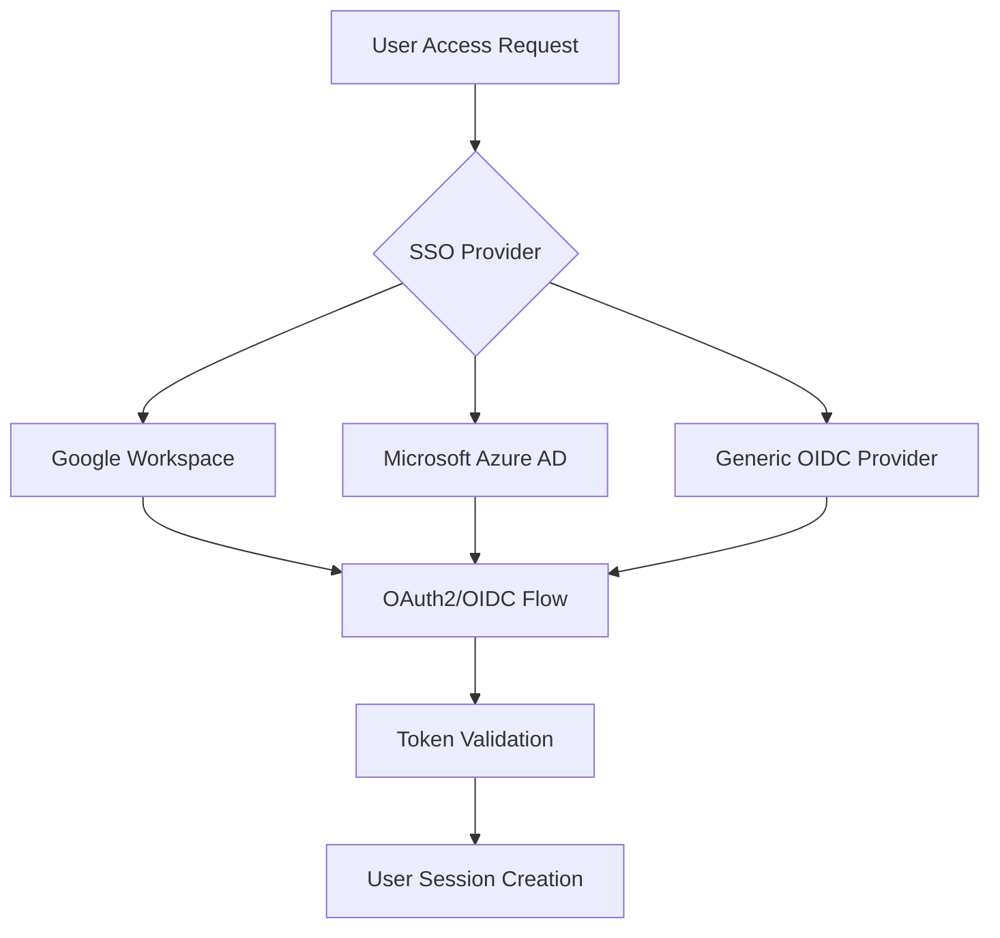
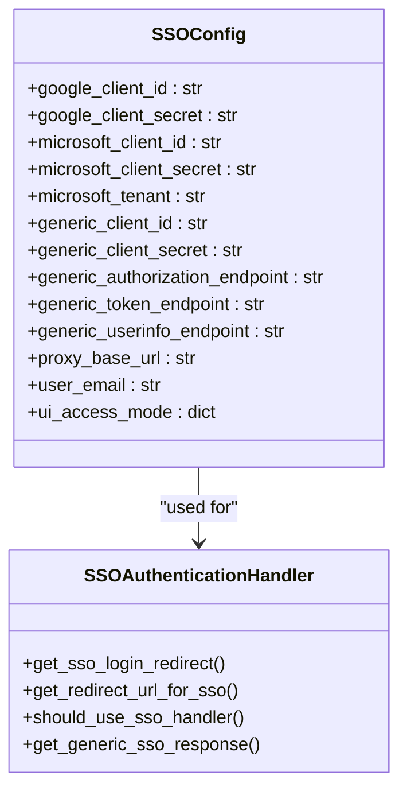
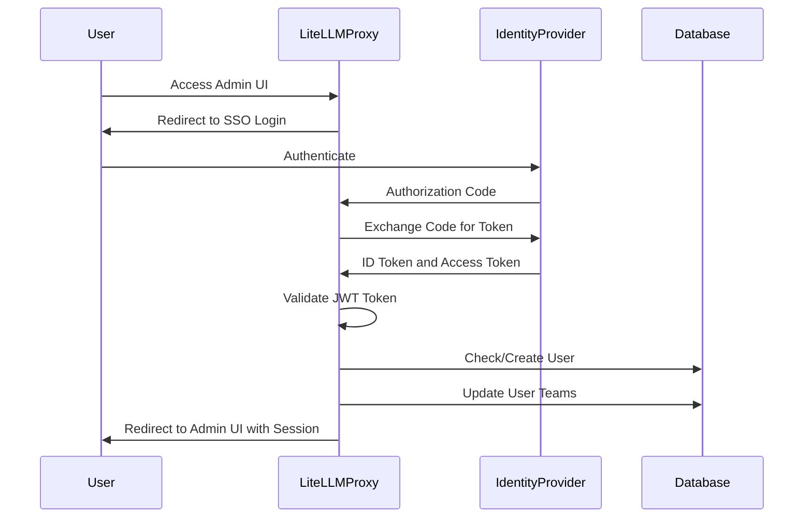
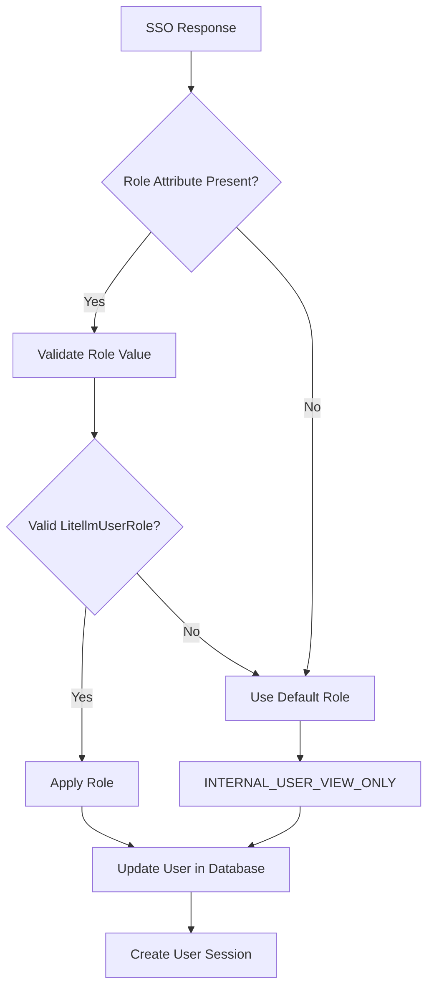
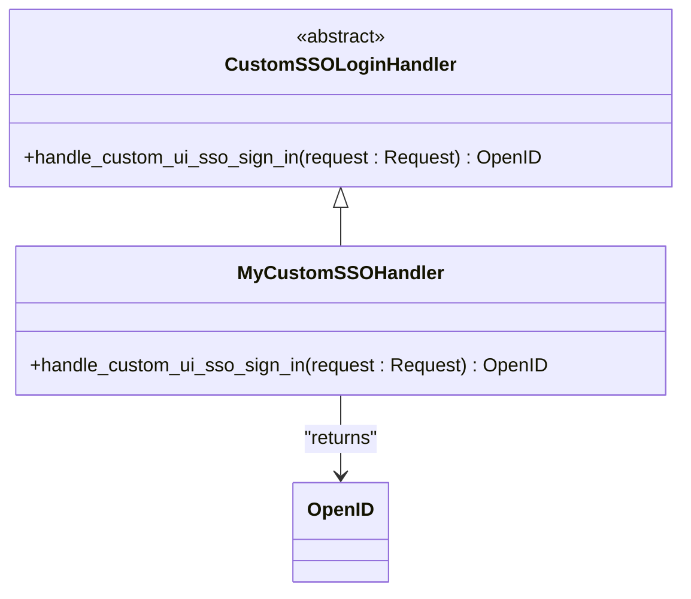
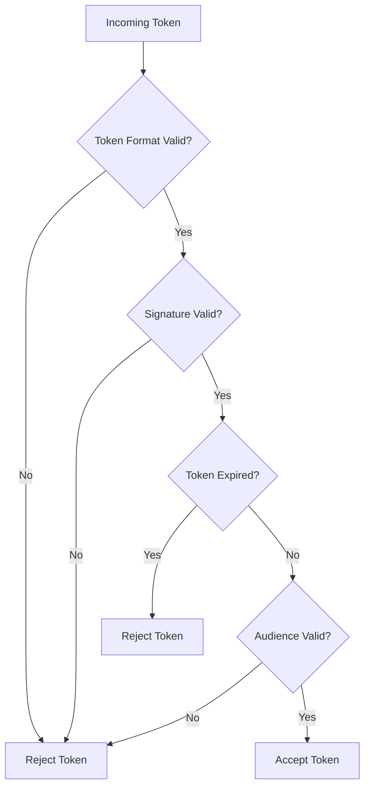

# SSO Integration

<cite>
**Referenced Files in This Document**   
- [ui_sso.py](file://litellm/proxy/management_endpoints/ui_sso.py)
- [custom_sso.py](file://litellm/proxy/custom_sso.py)
- [custom_sso_handler.py](file://litellm/integrations/custom_sso_handler.py)
- [handle_jwt.py](file://litellm/proxy/auth/handle_jwt.py)
- [sso_helper_utils.py](file://litellm/proxy/management_endpoints/sso_helper_utils.py)
- [proxy_setting_endpoints.py](file://litellm/proxy/ui_crud_endpoints/proxy_setting_endpoints.py)
- [oidc.md](file://docs/my-website/docs/oidc.md)
</cite>

## Table of Contents
1. [Introduction](#introduction)
2. [SSO Protocols Support](#sso-protocols-support)
3. [Identity Provider Configuration](#identity-provider-configuration)
4. [Authentication Flow](#authentication-flow)
5. [User Management and Role Mapping](#user-management-and-role-mapping)
6. [Custom SSO Handlers](#custom-sso-handlers)
7. [Common Issues and Troubleshooting](#common-issues-and-troubleshooting)
8. [Security Considerations](#security-considerations)
9. [Conclusion](#conclusion)

## Introduction
Single Sign-On (SSO) integration in LiteLLM enterprise deployments provides a secure and streamlined authentication mechanism for users accessing the LiteLLM proxy and admin interface. This documentation details the implementation of SSO using SAML, OIDC, and OAuth2 protocols, with specific focus on integration with enterprise identity providers such as Azure AD, Google Workspace, and Okta. The SSO system in LiteLLM is designed to support both standard and custom authentication flows, enabling organizations to integrate their existing identity infrastructure with the LiteLLM platform.

**Section sources**
- [ui_sso.py](file://litellm/proxy/management_endpoints/ui_sso.py#L1-L800)
- [oidc.md](file://docs/my-website/docs/oidc.md#L219-L266)

## SSO Protocols Support
LiteLLM supports multiple SSO protocols including OIDC, OAuth2, and SAML through its flexible authentication framework. The implementation is built on the `fastapi_sso` library, which provides standardized handlers for various identity providers.

The core SSO functionality is implemented in the `SSOAuthenticationHandler` class, which manages the authentication flow across different providers. For OIDC and OAuth2, LiteLLM uses the `create_provider` function to dynamically create SSO providers based on discovery documents and custom response converters.

For generic OIDC providers, LiteLLM allows configuration of custom endpoints through environment variables such as `GENERIC_AUTHORIZATION_ENDPOINT`, `GENERIC_TOKEN_ENDPOINT`, and `GENERIC_USERINFO_ENDPOINT`. This enables integration with any OIDC-compliant identity provider beyond the built-in Google and Microsoft support.



**Diagram sources**
- [ui_sso.py](file://litellm/proxy/management_endpoints/ui_sso.py#L381-L425)
- [custom_sso_handler.py](file://litellm/integrations/custom_sso_handler.py#L1-L29)

## Identity Provider Configuration
LiteLLM supports configuration for multiple identity providers through environment variables and configuration files. The system is designed to work with Azure AD, Google Workspace, and generic OIDC providers like Okta.

### Azure AD Configuration
For Azure AD integration, administrators must configure the application in Azure portal and set the following environment variables:
- `MICROSOFT_CLIENT_ID`: The application (client) ID from Azure AD
- `MICROSOFT_CLIENT_SECRET`: The client secret from Azure AD
- `MICROSOFT_TENANT`: The directory (tenant) ID from Azure AD
- `MICROSOFT_SERVICE_PRINCIPAL_ID`: Optional service principal ID for group-based access control

The configuration also supports mapping Microsoft Graph API groups to LiteLLM teams, enabling role-based access control based on Azure AD group membership.

### Google Workspace Configuration
Google Workspace integration requires the following environment variables:
- `GOOGLE_CLIENT_ID`: The OAuth 2.0 client ID from Google Cloud Console
- `GOOGLE_CLIENT_SECRET`: The client secret from Google Cloud Console

### Generic OIDC Configuration
For generic OIDC providers like Okta, the following environment variables are used:
- `GENERIC_CLIENT_ID`: The client ID from the identity provider
- `GENERIC_CLIENT_SECRET`: The client secret from the identity provider
- `GENERIC_AUTHORIZATION_ENDPOINT`: The authorization endpoint URL
- `GENERIC_TOKEN_ENDPOINT`: The token endpoint URL
- `GENERIC_USERINFO_ENDPOINT`: The userinfo endpoint URL
- `GENERIC_SCOPE`: The OAuth scope to request (default: "openid email profile")

Additional headers can be passed to the SSO provider using the `GENERIC_SSO_HEADERS` environment variable, which accepts a comma-separated list of key-value pairs.



**Diagram sources**
- [ui_sso.py](file://litellm/proxy/management_endpoints/ui_sso.py#L142-L2029)
- [proxy_setting_endpoints.py](file://litellm/proxy/ui_crud_endpoints/proxy_setting_endpoints.py#L439-L462)

## Authentication Flow
The SSO authentication flow in LiteLLM follows the standard OAuth2/OIDC authorization code flow with additional enterprise features. The process begins when a user attempts to access the LiteLLM admin interface or API.



The authentication flow consists of the following steps:
1. User requests access to the LiteLLM admin interface
2. The system redirects the user to the configured SSO provider's login page
3. After successful authentication, the SSO provider redirects back to LiteLLM with an authorization code
4. LiteLLM exchanges the authorization code for an ID token and access token
5. The ID token is validated using JWT validation, including signature verification and expiration checks
6. User information is extracted from the token and used to create or update the user in the LiteLLM database
7. The user is redirected to the admin interface with an authenticated session

For enhanced security, LiteLLM supports PKCE (Proof Key for Code Exchange) for generic SSO providers when the `GENERIC_CLIENT_USE_PKCE` environment variable is set to "true". This adds an additional layer of protection against authorization code interception attacks.

**Diagram sources**
- [ui_sso.py](file://litellm/proxy/management_endpoints/ui_sso.py#L690-L792)
- [handle_jwt.py](file://litellm/proxy/auth/handle_jwt.py#L548-L649)

## User Management and Role Mapping
LiteLLM's SSO integration includes comprehensive user management capabilities that map identity provider attributes to LiteLLM roles and permissions. The system supports automatic user provisioning and team membership management based on SSO attributes.

### Role Mapping
User roles are mapped from SSO responses using configurable attribute names. The default configuration uses the "role" attribute, but this can be customized using the `GENERIC_USER_ROLE_ATTRIBUTE` environment variable. The system validates that the role value corresponds to a valid `LitellmUserRoles` enum value before applying it.

Supported user roles include:
- `proxy_admin`: Full administrative access
- `proxy_admin_viewer`: View-only administrative access
- `internal_user`: Standard internal user with key management capabilities
- `internal_user_viewer`: View-only access for internal users
- `customer`: External customer role



### Team Membership
Team membership is managed through JWT token claims or Microsoft Graph API integration. For Azure AD, the system can automatically create LiteLLM teams from Microsoft Enterprise Application groups when a service principal ID is configured. User group membership is synchronized with LiteLLM teams, enabling centralized access control.

The `SSOUserDefinedValues` class is used to define custom user attributes during SSO authentication, including:
- `models`: List of allowed models
- `user_id`: Unique user identifier
- `user_email`: User email address
- `user_role`: User role
- `max_budget`: Maximum spending limit
- `budget_duration`: Budget period

**Section sources**
- [ui_sso.py](file://litellm/proxy/management_endpoints/ui_sso.py#L295-L306)
- [_types.py](file://litellm/proxy/_types.py#L87-L127)

## Custom SSO Handlers
LiteLLM provides extensibility through custom SSO handlers, allowing organizations to implement custom authentication logic. The `CustomSSOLoginHandler` class serves as a base for creating custom SSO integrations.

To implement a custom SSO handler, extend the `CustomSSOLoginHandler` class and override the `handle_custom_ui_sso_sign_in` method. This method receives the FastAPI request object and returns an `OpenID` object containing user information.

```python
from fastapi import Request
from fastapi_sso.sso.base import OpenID
from litellm.integrations.custom_sso_handler import CustomSSOLoginHandler

class MyCustomSSOHandler(CustomSSOLoginHandler):
    async def handle_custom_ui_sso_sign_in(self, request: Request) -> OpenID:
        # Extract user information from request headers or other sources
        user_id = request.headers.get("x-custom-user-id")
        email = request.headers.get("x-custom-email")
        
        return OpenID(
            id=user_id,
            email=email,
            first_name="John",
            last_name="Doe",
            display_name="John Doe",
            picture="https://example.com/avatar.jpg",
            provider="custom"
        )
```

The custom handler can be registered in the LiteLLM configuration by setting the `user_custom_ui_sso_sign_in_handler` variable. This enables integration with custom authentication systems, API gateways, or header-based authentication proxies.



**Diagram sources**
- [custom_sso_handler.py](file://litellm/integrations/custom_sso_handler.py#L7-L29)
- [custom_sso.py](file://litellm/proxy/custom_sso.py#L21-L45)

## Common Issues and Troubleshooting
This section addresses common issues encountered during SSO integration and provides troubleshooting guidance.

### Token Expiration
JWT tokens have a limited lifespan and will expire after their configured validity period. When a token expires, users will need to re-authenticate through the SSO provider. To mitigate this, ensure that the SSO provider's token expiration settings align with your organization's security policies.

### Attribute Mapping Errors
Incorrect attribute mapping can prevent proper user provisioning and role assignment. Common issues include:
- Using incorrect attribute names in environment variables
- Case sensitivity in attribute names
- Missing required attributes in the SSO response

Verify the attribute names using the SSO provider's documentation and test the integration with a sample SSO response.

### Multi-Tenant SSO Configurations
In multi-tenant environments, ensure that each tenant has a unique client ID and secret. Use separate configuration files or environment variables for each tenant to prevent configuration conflicts.

### Troubleshooting Steps
1. Enable verbose logging to capture detailed authentication flow information
2. Verify that all required environment variables are set correctly
3. Check the network connectivity between LiteLLM and the SSO provider
4. Validate the SSO provider's configuration, including redirect URIs
5. Test with a known working SSO configuration before customizing

**Section sources**
- [ui_sso.py](file://litellm/proxy/management_endpoints/ui_sso.py#L419-L423)
- [handle_jwt.py](file://litellm/proxy/auth/handle_jwt.py#L613-L615)

## Security Considerations
LiteLLM's SSO implementation includes multiple security measures to protect against common vulnerabilities.

### Token Validation
All JWT tokens are validated using cryptographic signature verification. The system supports multiple signing algorithms including RS256, PS256, ES256, and EdDSA. Public keys are retrieved from the SSO provider's JWKS (JSON Web Key Set) endpoint and cached for performance.

### Signature Verification
Signature verification ensures that tokens have not been tampered with and were issued by a trusted identity provider. The system validates the token signature using the public key corresponding to the key ID (kid) in the token header.

### Protection Against SSO Vulnerabilities
The implementation includes protections against common SSO vulnerabilities:
- **Replay attacks**: Tokens are validated for expiration and used only once when possible
- **Token injection**: Input validation prevents injection of malicious tokens
- **Open redirect**: Redirect URLs are validated against allowed domains
- **PKCE support**: Proof Key for Code Exchange prevents authorization code interception

### Secure Configuration
Follow these best practices for secure SSO configuration:
- Use HTTPS for all communication
- Store client secrets securely using environment variables or secret management systems
- Regularly rotate client secrets
- Limit the scope of requested permissions to the minimum required
- Monitor authentication logs for suspicious activity



**Diagram sources**
- [handle_jwt.py](file://litellm/proxy/auth/handle_jwt.py#L548-L649)
- [jwtUtils.ts](file://ui/litellm-dashboard/src/utils/jwtUtils.ts#L1-L14)

## Conclusion
LiteLLM's SSO integration provides a robust and flexible authentication framework for enterprise deployments. By supporting multiple protocols and identity providers, LiteLLM enables organizations to integrate their existing identity infrastructure with the AI proxy platform. The system's extensibility through custom SSO handlers and comprehensive security features make it suitable for demanding enterprise environments. Proper configuration and adherence to security best practices ensure a secure and seamless authentication experience for users.