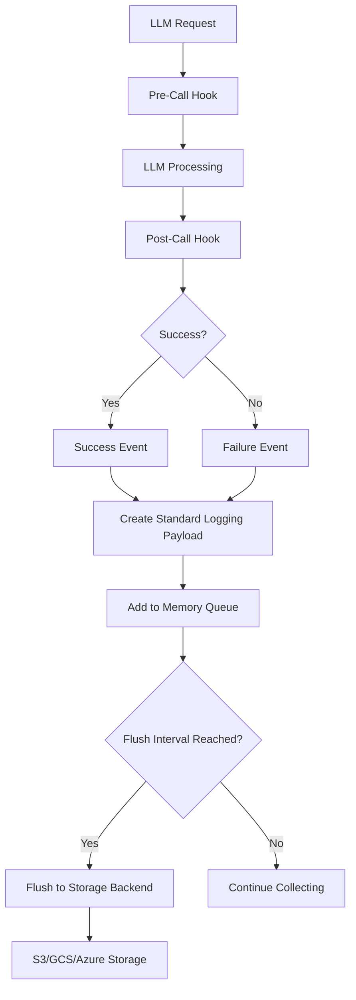
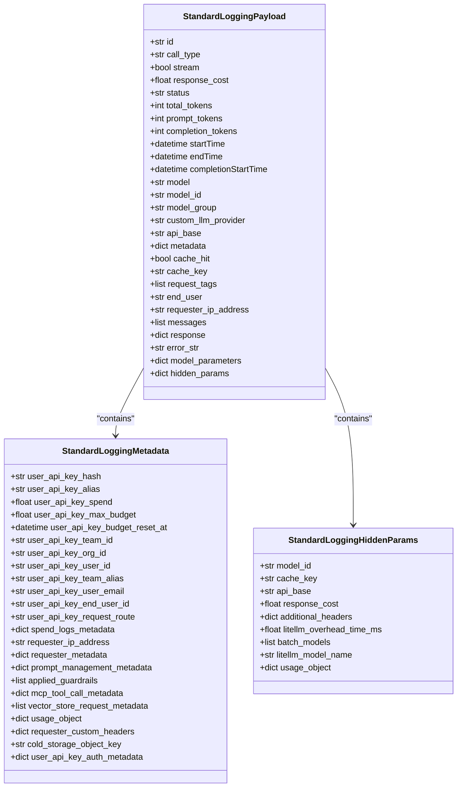
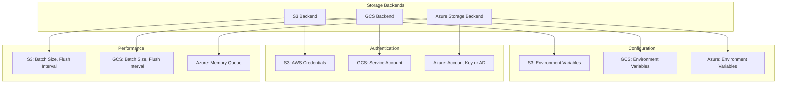
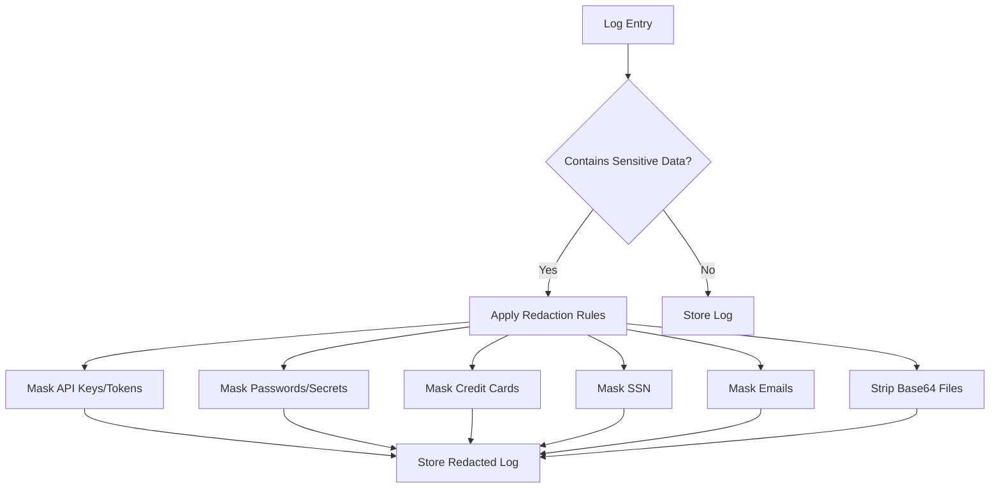
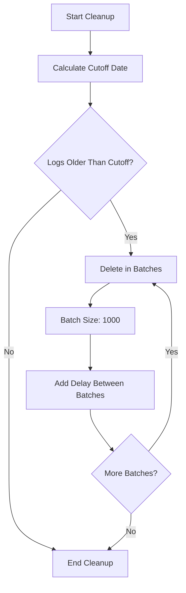

# Logging

<cite>
**Referenced Files in This Document**   
- [litellm/_logging.py](file://litellm/_logging.py)
- [litellm/litellm_core_utils/litellm_logging.py](file://litellm/litellm_core_utils/litellm_logging.py)
- [litellm/integrations/custom_logger.py](file://litellm/integrations/custom_logger.py)
- [litellm/integrations/s3_v2.py](file://litellm/integrations/s3_v2.py)
- [litellm/integrations/gcs_bucket/gcs_bucket.py](file://litellm/integrations/gcs_bucket/gcs_bucket.py)
- [litellm/integrations/azure_storage/azure_storage.py](file://litellm/integrations/azure_storage/azure_storage.py)
- [litellm/litellm_core_utils/sensitive_data_masker.py](file://litellm/litellm_core_utils/sensitive_data_masker.py)
- [litellm/proxy/db/db_transaction_queue/spend_log_cleanup.py](file://litellm/proxy/db/db_transaction_queue/spend_log_cleanup.py)
- [docs/my-website/docs/data_retention.md](file://docs/my-website/docs/data_retention.md)
- [docs/my-website/docs/proxy/spend_logs_deletion.md](file://docs/my-website/docs/proxy/spend_logs_deletion.md)
</cite>

## Table of Contents
1. [Introduction](#introduction)
2. [Logging Architecture](#logging-architecture)
3. [Standard Logging Payload](#standard-logging-payload)
4. [External Storage Backends](#external-storage-backends)
5. [Log Redaction and Sensitive Data Protection](#log-redaction-and-sensitive-data-protection)
6. [Log Retention and Cleanup](#log-retention-and-cleanup)
7. [Performance Considerations](#performance-considerations)
8. [Best Practices](#best-practices)

## Introduction

LiteLLM provides a comprehensive logging system that captures complete LLM interactions, including prompts, completions, and metadata. The logging architecture is designed to handle high-throughput LLM traffic while providing flexible storage options and robust data protection mechanisms. This document details the implementation of LiteLLM's request/response logging capabilities, focusing on the architecture, external storage backends, data protection features, and performance considerations.

The logging system captures detailed information about each LLM interaction, including model parameters, response times, token usage, and error information. This data is structured in a standardized format and can be stored in various external systems such as S3, GCS, and Azure Storage. The system also includes features for log redaction, retention management, and performance optimization to balance comprehensive auditing with cost efficiency.

**Section sources**
- [litellm/litellm_core_utils/litellm_logging.py](file://litellm/litellm_core_utils/litellm_logging.py#L1-L200)

## Logging Architecture

LiteLLM's logging architecture follows a modular design that separates the logging payload creation from the storage mechanism. The system captures LLM interactions at various stages of the request lifecycle, including pre-call, post-call, success, and failure events. This allows for comprehensive monitoring and debugging of LLM operations.

The architecture consists of several key components:
- **Logging Callbacks**: These are the primary interfaces for capturing LLM interactions. They implement methods for different stages of the request lifecycle.
- **Payload Creation**: The system creates a standardized logging payload that includes all relevant information about the LLM interaction.
- **Storage Backends**: The logging system supports multiple storage backends, allowing users to store logs in their preferred system.
- **Batch Processing**: Logs are collected in memory and flushed to the storage backend in batches to improve performance and reduce costs.

The logging system is designed to be non-blocking, ensuring that logging operations do not impact the performance of LLM requests. Logs are collected in memory and flushed to the storage backend asynchronously, with configurable flush intervals and batch sizes.

**Diagram sources **
- [litellm/integrations/custom_logger.py](file://litellm/integrations/custom_logger.py#L66-L200)
- [litellm/litellm_core_utils/litellm_logging.py](file://litellm/litellm_core_utils/litellm_logging.py#L3556-L3586)

**Section sources**
- [litellm/integrations/custom_logger.py](file://litellm/integrations/custom_logger.py#L1-L200)
- [litellm/litellm_core_utils/litellm_logging.py](file://litellm/litellm_core_utils/litellm_logging.py#L1-L200)

## Standard Logging Payload

The StandardLoggingPayload is the core data structure used by LiteLLM to capture LLM interactions. It includes comprehensive information about each request and response, structured in a consistent format that can be easily processed and analyzed.

The payload includes the following key components:
- **Request Information**: Model, provider, API base, and model parameters
- **Response Information**: Response cost, status, tokens, and response object
- **Timing Information**: Start time, end time, and completion start time
- **Metadata**: User API key information, team ID, organization ID, and requester metadata
- **Error Information**: Error status, class, message, and traceback

The payload is designed to be extensible, allowing for additional metadata to be included as needed. It also includes support for hidden parameters that may contain sensitive information or internal system details.

**Diagram sources **
- [litellm/litellm_core_utils/litellm_logging.py](file://litellm/litellm_core_utils/litellm_logging.py#L100-L120)

**Section sources**
- [litellm/litellm_core_utils/litellm_logging.py](file://litellm/litellm_core_utils/litellm_logging.py#L4300-L4700)

## External Storage Backends

LiteLLM supports multiple external storage backends for persisting logs, including S3, GCS, and Azure Storage. Each backend is implemented as a separate module that handles the specific requirements of the storage system.

### S3 Backend

The S3 backend (S3V2Logger) provides integration with Amazon S3 for storing logs. It supports configurable flush intervals and batch sizes to optimize performance and cost. The backend uses environment variables for configuration, including bucket name, region, and authentication credentials.

Key features of the S3 backend:
- Configurable flush interval (default: 60 seconds)
- Configurable batch size (default: 1000 logs)
- Support for team-based prefixes
- Option to strip base64-encoded files from logs
- Integration with AWS authentication mechanisms

### GCS Backend

The GCS backend (GCSBucketLogger) provides integration with Google Cloud Storage. It is a premium feature that requires a premium user account. The backend collects logs in memory and flushes them to GCS periodically.

Key features of the GCS backend:
- Configurable flush interval via GCS_FLUSH_INTERVAL environment variable
- Configurable batch size via GCS_BATCH_SIZE environment variable
- Premium feature requiring premium user account
- Automatic handling of GCS authentication

### Azure Storage Backend

The Azure Storage backend (AzureBlobStorageLogger) provides integration with Azure Blob Storage. It supports both account key authentication and Azure AD authentication.

Key features of the Azure Storage backend:
- Support for account key and Azure AD authentication
- Required environment variables: AZURE_STORAGE_ACCOUNT_NAME, AZURE_STORAGE_FILE_SYSTEM
- Optional environment variables for Azure AD authentication: AZURE_STORAGE_TENANT_ID, AZURE_STORAGE_CLIENT_ID, AZURE_STORAGE_CLIENT_SECRET
- Premium feature requiring premium user account

**Diagram sources **
- [litellm/integrations/s3_v2.py](file://litellm/integrations/s3_v2.py#L30-L200)
- [litellm/integrations/gcs_bucket/gcs_bucket.py](file://litellm/integrations/gcs_bucket/gcs_bucket.py#L23-L200)
- [litellm/integrations/azure_storage/azure_storage.py](file://litellm/integrations/azure_storage/azure_storage.py#L21-L200)

**Section sources**
- [litellm/integrations/s3_v2.py](file://litellm/integrations/s3_v2.py#L1-L200)
- [litellm/integrations/gcs_bucket/gcs_bucket.py](file://litellm/integrations/gcs_bucket/gcs_bucket.py#L1-L200)
- [litellm/integrations/azure_storage/azure_storage.py](file://litellm/integrations/azure_storage/azure_storage.py#L1-L200)

## Log Redaction and Sensitive Data Protection

LiteLLM includes comprehensive features for protecting sensitive data in logs. The system automatically redacts sensitive information from logs and provides mechanisms for custom redaction rules.

### Built-in Redaction

The system includes built-in redaction for common sensitive data patterns, including:
- API keys and tokens
- Passwords and secrets
- Credit card numbers
- Social Security Numbers (SSN)
- Email addresses
- Base64-encoded files

The SensitiveDataMasker class is used to redact sensitive information from logs. It supports configurable prefix and suffix lengths for masked values, allowing users to balance security with debugging needs.

### Custom Redaction

Users can implement custom redaction rules by extending the CustomLogger class and overriding the appropriate methods. This allows for domain-specific redaction rules based on the application's requirements.

### Base64 Redaction

The system includes specific handling for base64-encoded content, which is common in multimodal LLM applications. Base64-encoded files can be automatically stripped from logs to reduce storage costs and protect sensitive data.

**Diagram sources **
- [litellm/litellm_core_utils/sensitive_data_masker.py](file://litellm/litellm_core_utils/sensitive_data_masker.py#L1-L107)
- [litellm/integrations/custom_logger.py](file://litellm/integrations/custom_logger.py#L720-L808)

**Section sources**
- [litellm/litellm_core_utils/sensitive_data_masker.py](file://litellm/litellm_core_utils/sensitive_data_masker.py#L1-L107)
- [litellm/integrations/custom_logger.py](file://litellm/integrations/custom_logger.py#L720-L808)

## Log Retention and Cleanup

LiteLLM provides configurable log retention policies to manage storage costs and comply with data privacy regulations. The system includes automated cleanup mechanisms to remove logs older than the configured retention period.

### Retention Configuration

Log retention can be configured using the maximum_spend_logs_retention_period setting. This setting accepts duration strings (e.g., "30d" for 30 days, "1h" for 1 hour) or integer values representing seconds.

Enterprise customers can configure custom retention policies through the LiteLLM Cloud dashboard or via API, with options to adjust the retention period for active data from 0 to 365 days.

### Cleanup Process

The cleanup process runs periodically and removes logs older than the configured retention period. It operates in batches to avoid overloading the database, with configurable batch sizes and maximum deletions per run.

Key cleanup parameters:
- **Batch size**: 1000 logs (configurable via SPEND_LOG_CLEANUP_BATCH_SIZE)
- **Max batches per run**: 500
- **Max deletions per run**: 500,000 logs

The cleanup process adds a short delay between batches to prevent database overload.

**Diagram sources **
- [litellm/proxy/db/db_transaction_queue/spend_log_cleanup.py](file://litellm/proxy/db/db_transaction_queue/spend_log_cleanup.py#L37-L62)
- [docs/my-website/docs/proxy/spend_logs_deletion.md](file://docs/my-website/docs/proxy/spend_logs_deletion.md#L71-L94)

**Section sources**
- [litellm/proxy/db/db_transaction_queue/spend_log_cleanup.py](file://litellm/proxy/db/db_transaction_queue/spend_log_cleanup.py#L37-L62)
- [docs/my-website/docs/data_retention.md](file://docs/my-website/docs/data_retention.md#L31-L42)
- [docs/my-website/docs/proxy/spend_logs_deletion.md](file://docs/my-website/docs/proxy/spend_logs_deletion.md#L71-L94)

## Performance Considerations

When logging high-throughput LLM traffic, several performance considerations must be addressed to balance comprehensive auditing with cost efficiency.

### Batch Processing

The logging system uses batch processing to improve performance and reduce costs. Logs are collected in memory and flushed to the storage backend in batches, with configurable flush intervals and batch sizes. This reduces the number of API calls to the storage backend and minimizes the impact on LLM request performance.

### Memory Usage

The in-memory log queue can consume significant memory when handling high-throughput traffic. The memory usage depends on the batch size, flush interval, and average log size. Users should monitor memory usage and adjust the batch size and flush interval accordingly.

### Storage Costs

Storage costs can become significant when logging large volumes of LLM interactions. Users should consider the following strategies to optimize storage costs:
- Configure appropriate log retention periods
- Use log sampling for high-throughput applications
- Strip base64-encoded files from logs
- Use cold storage for archived logs

### Network Latency

The logging system is designed to be non-blocking, but network latency to the storage backend can still impact performance. Users should ensure that the storage backend is located in a region close to the application to minimize latency.

## Best Practices

To effectively use LiteLLM's logging capabilities, follow these best practices:

### Configuration

- Set appropriate flush intervals and batch sizes based on your throughput and cost requirements
- Configure log retention periods to balance auditing needs with storage costs
- Use environment variables for storage backend configuration to avoid hardcoding credentials

### Security

- Enable sensitive data redaction to protect API keys, tokens, and other sensitive information
- Regularly review log content to ensure no sensitive data is being logged
- Use secure authentication mechanisms for storage backends (e.g., IAM roles instead of access keys)

### Cost Optimization

- Implement log sampling for high-throughput applications to reduce storage costs
- Use cold storage for archived logs to reduce costs
- Monitor storage usage and adjust retention policies as needed
- Strip base64-encoded files from logs to reduce storage costs

### Monitoring

- Monitor the logging system's performance and memory usage
- Set up alerts for logging failures or high memory usage
- Regularly review log content to ensure it meets your auditing and debugging needs

By following these best practices, you can effectively use LiteLLM's logging capabilities to monitor and debug your LLM applications while maintaining security and cost efficiency.

**Section sources**
- [litellm/integrations/s3_v2.py](file://litellm/integrations/s3_v2.py#L15-L20)
- [litellm/integrations/gcs_bucket/gcs_bucket.py](file://litellm/integrations/gcs_bucket/gcs_bucket.py#L30-L34)
- [litellm/proxy/db/db_transaction_queue/spend_log_cleanup.py](file://litellm/proxy/db/db_transaction_queue/spend_log_cleanup.py#L50-L56)
- [docs/my-website/docs/proxy/spend_logs_deletion.md](file://docs/my-website/docs/proxy/spend_logs_deletion.md#L78-L80)