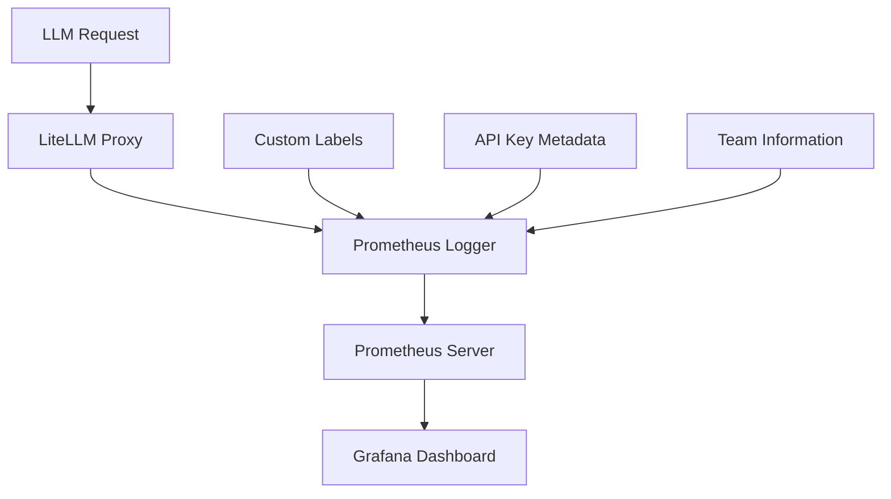
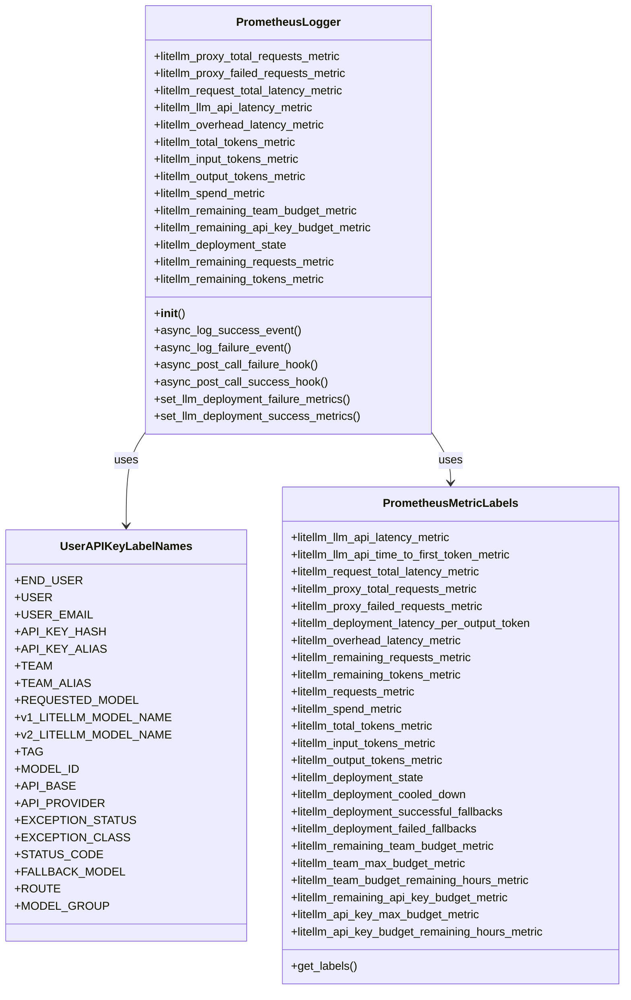
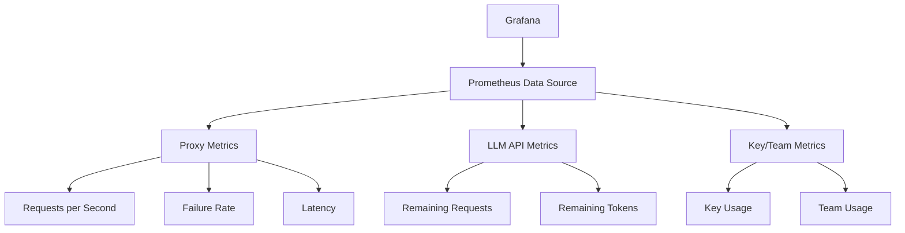
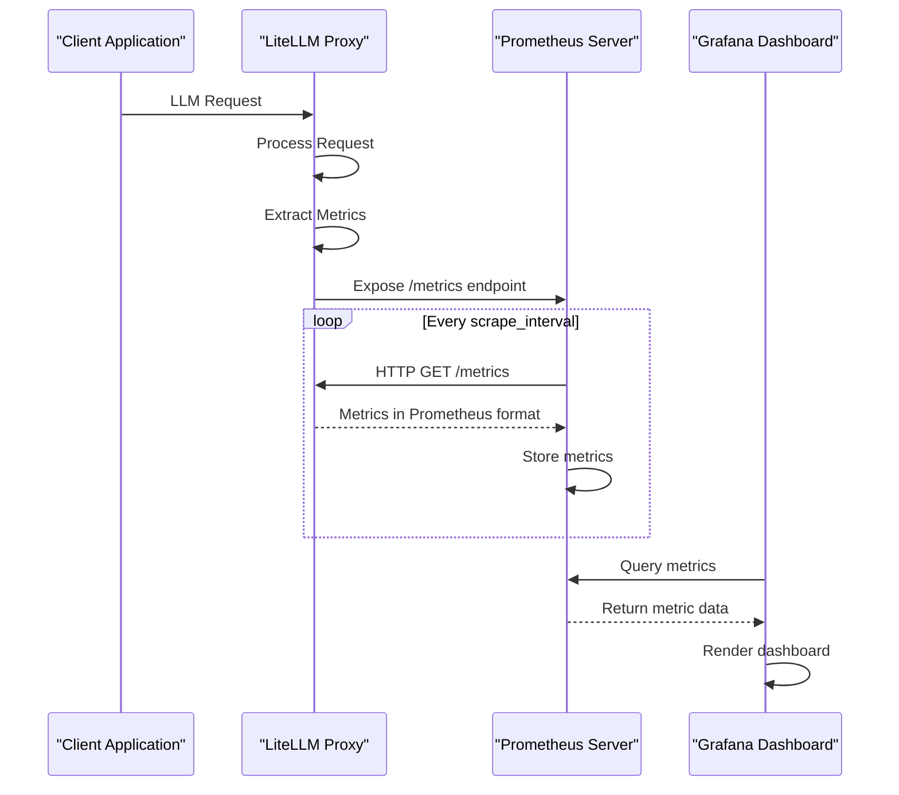

# Monitoring

<cite>
**Referenced Files in This Document**   
- [prometheus.yml](file://prometheus.yml)
- [litellm/integrations/prometheus.py](file://litellm/integrations/prometheus.py)
- [litellm/types/integrations/prometheus.py](file://litellm/types/integrations/prometheus.py)
- [litellm/integrations/prometheus_helpers/prometheus_api.py](file://litellm/integrations/prometheus_helpers/prometheus_api.py)
- [litellm/integrations/prometheus_services.py](file://litellm/integrations/prometheus_services.py)
- [grafana/provisioning/datasources/prometheus.yml](file://grafana/provisioning/datasources/prometheus.yml)
- [cookbook/litellm_proxy_server/grafana_dashboard/dashboard_v2/grafana_dashboard.json](file://cookbook/litellm_proxy_server/grafana_dashboard/dashboard_v2/grafana_dashboard.json)
</cite>

## Table of Contents
1. [Introduction](#introduction)
2. [Metrics System Architecture](#metrics-system-architecture)
3. [Prometheus Integration](#prometheus-integration)
4. [Grafana Dashboard Setup](#grafana-dashboard-setup)
5. [Data Flow Analysis](#data-flow-analysis)
6. [Common Issues and Solutions](#common-issues-and-solutions)
7. [Performance Considerations](#performance-considerations)
8. [Best Practices for Dashboard Design](#best-practices-for-dashboard-design)
9. [Conclusion](#conclusion)

## Introduction
LiteLLM provides comprehensive monitoring capabilities for tracking LLM request metrics, token usage, latency, and error rates. The system integrates with Prometheus for metrics collection and Grafana for visualization, enabling detailed insights into LLM usage patterns and system health. This documentation covers the architecture of the metrics system, implementation details of Prometheus integration, setup of Grafana dashboards, and best practices for monitoring LLM operations.

## Metrics System Architecture
The LiteLLM monitoring system captures metrics at multiple levels, from proxy-level requests to individual LLM API calls. The architecture is designed to provide granular visibility into system performance, cost tracking, and error patterns. Key components include the Prometheus logger, which collects metrics from LLM requests, and the Grafana dashboard, which visualizes these metrics in an actionable format.

The system captures various metrics including:
- LLM request and failure rates
- Latency measurements (total, API, and overhead)
- Token usage (input, output, and total)
- Cost tracking and budget metrics
- Deployment health and rate limit information



**Diagram sources**
- [litellm/integrations/prometheus.py](file://litellm/integrations/prometheus.py)
- [litellm/types/integrations/prometheus.py](file://litellm/types/integrations/prometheus.py)

**Section sources**
- [litellm/integrations/prometheus.py](file://litellm/integrations/prometheus.py)
- [litellm/types/integrations/prometheus.py](file://litellm/types/integrations/prometheus.py)

## Prometheus Integration
LiteLLM's Prometheus integration is implemented through the `PrometheusLogger` class, which extends the `CustomLogger` interface. The integration captures metrics using Prometheus client libraries and exposes them via the `/metrics` endpoint on the LiteLLM Proxy.

### Custom Metric Definitions
The system defines numerous custom metrics for monitoring LLM operations. These metrics are categorized into several groups:

**Request Metrics**
- `litellm_proxy_total_requests_metric`: Total number of requests to the proxy
- `litellm_proxy_failed_requests_metric`: Failed requests to the proxy
- `litellm_requests_metric`: Deprecated metric for total LLM calls

**Latency Metrics**
- `litellm_request_total_latency_metric`: Total latency for requests
- `litellm_llm_api_latency_metric`: Latency for LLM API calls
- `litellm_overhead_latency_metric`: Overhead latency added by LiteLLM processing

**Token Metrics**
- `litellm_total_tokens_metric`: Total tokens (input + output)
- `litellm_input_tokens_metric`: Input tokens
- `litellm_output_tokens_metric`: Output tokens

**Cost and Budget Metrics**
- `litellm_spend_metric`: Total spend on LLM requests
- `litellm_remaining_team_budget_metric`: Remaining budget for teams
- `litellm_remaining_api_key_budget_metric`: Remaining budget for API keys

**Deployment Metrics**
- `litellm_deployment_state`: State of LLM deployments (0=healthy, 1=partial outage, 2=complete outage)
- `litellm_remaining_requests_metric`: Remaining requests from LLM API rate limits
- `litellm_remaining_tokens_metric`: Remaining tokens from LLM API rate limits

### Label Structures
Metrics are enriched with labels that provide dimensional data for filtering and aggregation. The label structure follows Prometheus best practices and includes:

**Standard Labels**
- `end_user`: End user ID for cost tracking
- `hashed_api_key`: Hashed API key for identification
- `api_key_alias`: Alias for the API key
- `model`: Requested LLM model
- `team`: Team ID associated with the request
- `team_alias`: Alias for the team
- `user`: User ID making the request

**Error Labels**
- `exception_status`: HTTP status code of the exception
- `exception_class`: Class name of the exception
- `status_code`: Response status code

**Custom Labels**
The system supports custom labels through configuration:
- `custom_prometheus_metadata_labels`: Extract labels from metadata
- `custom_prometheus_tags`: Extract labels from request tags



**Diagram sources**
- [litellm/integrations/prometheus.py](file://litellm/integrations/prometheus.py)
- [litellm/types/integrations/prometheus.py](file://litellm/types/integrations/prometheus.py)

**Section sources**
- [litellm/integrations/prometheus.py](file://litellm/integrations/prometheus.py)
- [litellm/types/integrations/prometheus.py](file://litellm/types/integrations/prometheus.py)

### Exposition Endpoints
The Prometheus metrics are exposed through the `/metrics` endpoint on the LiteLLM Proxy. This endpoint is automatically mounted when the Prometheus logger is initialized:

```python
@staticmethod
def _mount_metrics_endpoint():
    """
    Mount the Prometheus metrics endpoint with optional authentication.
    """
    from prometheus_client import make_asgi_app
    from litellm.proxy.proxy_server import app
    
    # Create metrics ASGI app
    if "PROMETHEUS_MULTIPROC_DIR" in os.environ:
        from prometheus_client import CollectorRegistry, multiprocess
        registry = CollectorRegistry()
        multiprocess.MultiProcessCollector(registry)
        metrics_app = make_asgi_app(registry)
    else:
        metrics_app = make_asgi_app()
    
    # Mount the metrics app to the app
    app.mount("/metrics", metrics_app)
```

The endpoint supports multi-process mode when the `PROMETHEUS_MULTIPROC_DIR` environment variable is set, allowing metrics collection in multi-process deployments.

## Grafana Dashboard Setup
LiteLLM provides pre-configured Grafana dashboards for visualizing LLM metrics. These dashboards are available in the cookbook directory and can be imported into Grafana for immediate use.

### Dashboard Configuration
The primary dashboard (`grafana_dashboard.json`) includes multiple panels for monitoring different aspects of LLM operations:

**Proxy Level Metrics**
- Requests per second (success + failure)
- Failure responses per second by exception class
- Average and median response latency

**LLM API Metrics**
- x-ratelimit-remaining-requests from LLM APIs
- x-ratelimit-remaining-tokens from LLM APIs

**Virtual Key and Team Metrics**
- Requests per second by key alias
- Requests per second by team alias



**Diagram sources**
- [cookbook/litellm_proxy_server/grafana_dashboard/dashboard_v2/grafana_dashboard.json](file://cookbook/litellm_proxy_server/grafana_dashboard/dashboard_v2/grafana_dashboard.json)

### Practical Examples
To set up the Grafana dashboard:

1. **Configure Prometheus Data Source**
   ```yaml
   apiVersion: 1
   datasources:
     - name: Prometheus
       type: prometheus
       access: proxy
       url: http://prometheus:9090
       isDefault: true
       editable: false
   ```

2. **Import Dashboard JSON**
   - Navigate to Grafana dashboard import
   - Upload the `grafana_dashboard.json` file
   - Select the Prometheus data source

3. **Configure Dashboard Variables**
   - Set appropriate time ranges
   - Configure panel refresh intervals
   - Adjust threshold values for alerts

4. **Customize Panels**
   - Modify queries to focus on specific models or teams
   - Adjust visualization types (timeseries, bar charts, etc.)
   - Set up alert rules based on metric thresholds

## Data Flow Analysis
The data flow from request processing through metric collection to visualization follows a well-defined path:



**Diagram sources**
- [litellm/integrations/prometheus.py](file://litellm/integrations/prometheus.py)
- [grafana/provisioning/datasources/prometheus.yml](file://grafana/provisioning/datasources/prometheus.yml)

**Section sources**
- [litellm/integrations/prometheus.py](file://litellm/integrations/prometheus.py)
- [grafana/provisioning/datasources/prometheus.yml](file://grafana/provisioning/datasources/prometheus.yml)

### Key Data Flow Stages
1. **Request Processing**: The LiteLLM Proxy receives and processes LLM requests
2. **Metric Extraction**: During request processing, metrics are extracted and stored
3. **Metric Exposure**: Metrics are exposed via the `/metrics` endpoint in Prometheus format
4. **Metric Scraping**: Prometheus server scrapes the `/metrics` endpoint at configured intervals
5. **Data Storage**: Prometheus stores the scraped metrics in its time-series database
6. **Visualization**: Grafana queries Prometheus and renders the metrics in dashboards

## Common Issues and Solutions
### Missing Metrics
**Issue**: Metrics are not appearing in Prometheus or Grafana.

**Solutions**:
1. Verify the Prometheus logger is properly initialized:
   ```python
   from litellm.integrations.prometheus import PrometheusLogger
   litellm.callbacks = [PrometheusLogger()]
   ```

2. Check that the `/metrics` endpoint is accessible:
   ```bash
   curl http://localhost:8000/metrics
   ```

3. Verify Prometheus scrape configuration:
   ```yaml
   scrape_configs:
     - job_name: 'litellm'
       static_configs:
         - targets: ['litellm-proxy:8000']
   ```

4. Ensure the Prometheus client library is installed:
   ```bash
   pip install prometheus-client
   ```

### Incorrect Aggregation
**Issue**: Metrics are aggregated incorrectly, showing inaccurate values.

**Solutions**:
1. Verify label consistency across metrics:
   ```python
   # Ensure consistent label usage
   labels = {
       "model": model_name,
       "hashed_api_key": hashed_key,
       "team": team_id
   }
   ```

2. Check for proper metric type usage:
   - Use Counters for cumulative values
   - Use Gauges for instantaneous values
   - Use Histograms for latency distributions

3. Validate query expressions in Grafana:
   ```promql
   # Correct: Rate over 2 minutes
   sum(rate(litellm_proxy_total_requests_metric_total[2m]))
   
   # Avoid: Instantaneous values without rate
   sum(litellm_proxy_total_requests_metric_total)
   ```

4. Ensure proper handling of multi-process environments:
   ```bash
   # Set environment variable for multi-process mode
   export PROMETHEUS_MULTIPROC_DIR=/tmp/prometheus
   ```

## Performance Considerations
When collecting high-volume metrics, several performance considerations must be addressed:

### High-Volume Metrics Collection
1. **Scrape Interval**: Configure appropriate scrape intervals based on traffic volume:
   ```yaml
   global:
     scrape_interval: 30s
   ```

2. **Metric Cardinality**: Limit high-cardinality labels that can cause performance issues:
   ```python
   # Avoid high-cardinality labels
   # BAD: user_email, request_id
   # GOOD: model, team, api_key_alias
   ```

3. **Memory Usage**: Monitor memory usage, especially in multi-process environments:
   ```bash
   # Monitor Prometheus server memory
   echo $(cat /proc/$(pgrep prometheus)/status | grep VmRSS)
   ```

4. **Retention Policies**: Configure appropriate retention policies:
   ```yaml
   # In prometheus.yml
   storage:
     retention: 15d
   ```

### Optimization Strategies
1. **Metric Filtering**: Configure which metrics to collect:
   ```python
   from litellm.types.integrations.prometheus import PrometheusMetricsConfig
   
   litellm.prometheus_metrics_config = [
       PrometheusMetricsConfig(
           group="essential",
           metrics=[
               "litellm_proxy_total_requests_metric",
               "litellm_proxy_failed_requests_metric",
               "litellm_request_total_latency_metric"
           ]
       )
   ]
   ```

2. **Label Filtering**: Limit the labels collected for each metric:
   ```python
   PrometheusMetricsConfig(
       group="latency",
       metrics=["litellm_request_total_latency_metric"],
       include_labels=["model", "hashed_api_key", "team"]
   )
   ```

3. **Batch Processing**: For high-volume environments, consider batch processing of metrics:
   ```python
   # Use counters that increment in batches
   # Instead of incrementing for each request, batch increments
   ```

## Best Practices for Dashboard Design
Effective dashboard design provides actionable insights into LLM usage patterns and system health.

### Dashboard Layout Principles
1. **Hierarchical Organization**: Group related metrics together:
   - Proxy-level metrics
   - LLM API metrics
   - Cost and budget metrics
   - Team and key usage metrics

2. **Visual Hierarchy**: Use size and position to emphasize important metrics:
   - Place critical metrics (error rates, latency) at the top
   - Use larger panels for key performance indicators
   - Group related metrics in rows

3. **Color Coding**: Use consistent color schemes:
   - Green for healthy states
   - Yellow for warnings
   - Red for critical issues

### Actionable Insights
Design dashboards to answer specific questions:

**Performance Monitoring**
- "Is the system responding within acceptable latency thresholds?"
- "Are there any models with consistently high error rates?"

**Cost Tracking**
- "Which teams or users are consuming the most resources?"
- "Are we approaching budget limits for any teams or keys?"

**Usage Patterns**
- "What are the peak usage times for our LLM services?"
- "Which models are most frequently used?"

**System Health**
- "Are any LLM deployments in a partial or complete outage state?"
- "Are rate limits being approached for any models?"

### Example Dashboard Configuration
```json
{
  "panels": [
    {
      "title": "Proxy - Requests per second (success + failure)",
      "type": "timeseries",
      "targets": [
        {
          "expr": "sum(rate(litellm_proxy_total_requests_metric_total[2m]))",
          "legendFormat": "__auto"
        }
      ]
    },
    {
      "title": "Proxy Failure Responses / Second By Exception Class",
      "type": "timeseries",
      "targets": [
        {
          "expr": "sum(rate(litellm_proxy_failed_requests_metric_total[2m])) by (exception_class)",
          "legendFormat": "__auto"
        }
      ]
    },
    {
      "title": "Proxy - Average & Median Response Latency (seconds)",
      "type": "timeseries",
      "targets": [
        {
          "expr": "sum(rate(litellm_request_total_latency_metric_sum[2m]))/sum(rate(litellm_request_total_latency_metric_count[2m]))",
          "legendFormat": "Average Latency (seconds)"
        },
        {
          "expr": "histogram_quantile(0.5, sum(rate(litellm_request_total_latency_metric_bucket[2m])) by (le))",
          "legendFormat": "Median Latency (seconds)"
        }
      ]
    }
  ]
}
```

## Conclusion
LiteLLM's monitoring system provides comprehensive capabilities for tracking LLM request metrics, token usage, latency, and error rates. The integration with Prometheus and Grafana enables detailed visualization of system performance and cost patterns. By following the best practices outlined in this documentation, organizations can effectively monitor their LLM operations, identify performance bottlenecks, track costs, and ensure system reliability. The flexible metric and label system allows for customization to meet specific monitoring requirements, while the pre-configured Grafana dashboards provide immediate visibility into key performance indicators.