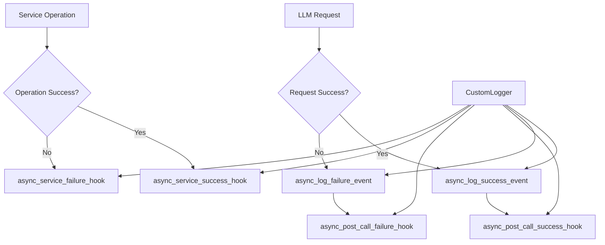
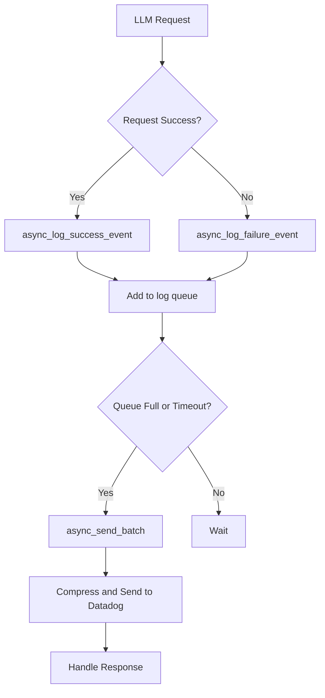
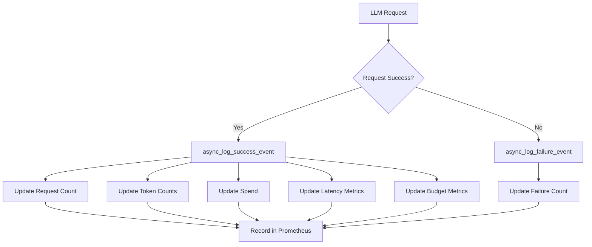
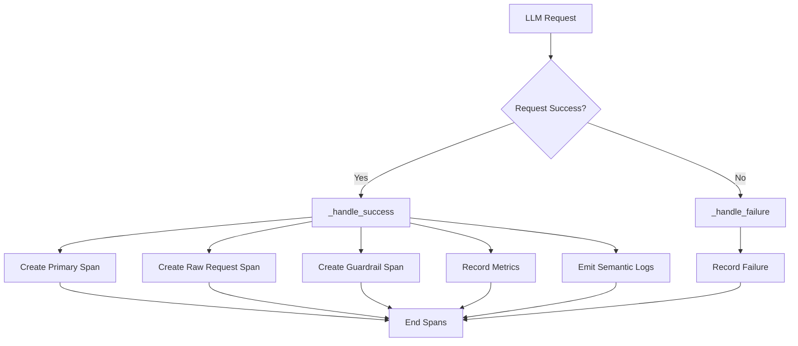

# Observability Integrations

<cite>
**Referenced Files in This Document**   
- [prometheus.py](file://litellm/integrations/prometheus.py)
- [opentelemetry.py](file://litellm/integrations/opentelemetry.py)
- [langfuse.py](file://litellm/integrations/langfuse/langfuse.py)
- [langfuse_otel.py](file://litellm/integrations/langfuse/langfuse_otel.py)
- [datadog.py](file://litellm/integrations/datadog/datadog.py)
- [datadog_llm_obs.py](file://litellm/integrations/datadog/datadog_llm_obs.py)
</cite>

## Table of Contents
1. [Introduction](#introduction)
2. [Core Callback System](#core-callback-system)
3. [Langfuse Integration](#langfuse-integration)
4. [Datadog Integration](#datadog-integration)
5. [Prometheus Integration](#prometheus-integration)
6. [OpenTelemetry Integration](#opentelemetry-integration)
7. [Common Issues and Solutions](#common-issues-and-solutions)
8. [Conclusion](#conclusion)

## Introduction

LiteLLM provides comprehensive observability integrations with various monitoring platforms to help developers track, analyze, and optimize their LLM applications. This document details the implementation of integrations with Langfuse, Datadog, Prometheus, and OpenTelemetry, explaining how they hook into the request/response lifecycle, their configuration options, initialization parameters, and usage patterns.

These integrations are built on LiteLLM's core callback system, which allows for flexible and extensible monitoring capabilities. Each integration captures different aspects of LLM operations, from detailed tracing and logging to metrics collection and visualization.

**Section sources**
- [prometheus.py](file://litellm/integrations/prometheus.py#L1-L800)
- [opentelemetry.py](file://litellm/integrations/opentelemetry.py#L1-L800)
- [langfuse.py](file://litellm/integrations/langfuse/langfuse.py#L1-L800)
- [datadog.py](file://litellm/integrations/datadog/datadog.py#L1-L654)

## Core Callback System

The foundation of LiteLLM's observability features is its callback system, which provides hooks into the request/response lifecycle. This system allows integrations to capture events at various stages of LLM operations, including success, failure, and service events.

The callback system is implemented through the `CustomLogger` base class, which defines the interface for all observability integrations. Key methods include:

- `async_log_success_event`: Called when an LLM request succeeds
- `async_log_failure_event`: Called when an LLM request fails
- `async_service_success_hook`: Called when a service operation succeeds
- `async_service_failure_hook`: Called when a service operation fails
- `async_post_call_success_hook`: Called after a successful call
- `async_post_call_failure_hook`: Called after a failed call

Each integration inherits from `CustomLogger` and implements these methods to send data to their respective monitoring platforms. The system supports both synchronous and asynchronous logging, with asynchronous operations preferred for better performance.

The callback system is designed to be non-blocking, ensuring that logging operations do not impact the performance of LLM requests. This is achieved through background threads, batching mechanisms, and efficient data serialization.



**Diagram sources **
- [opentelemetry.py](file://litellm/integrations/opentelemetry.py#L344-L354)
- [datadog.py](file://litellm/integrations/datadog/datadog.py#L165-L201)

**Section sources**
- [opentelemetry.py](file://litellm/integrations/opentelemetry.py#L344-L354)
- [datadog.py](file://litellm/integrations/datadog/datadog.py#L165-L201)

## Langfuse Integration

The Langfuse integration provides comprehensive tracing and logging capabilities for LLM applications. It captures detailed information about LLM requests and responses, including prompts, completions, token usage, and costs.

### Implementation Details

The Langfuse integration is implemented in two main components: the vanilla Langfuse logger and the OpenTelemetry-based Langfuse logger.

The vanilla Langfuse logger (`LangFuseLogger`) directly interfaces with the Langfuse API, while the OpenTelemetry-based logger (`LangfuseOtelLogger`) uses OpenTelemetry to send data to Langfuse. This dual approach provides flexibility for different use cases and deployment scenarios.

Key implementation features include:

- Support for both Langfuse v1 and v2 APIs
- Automatic extraction of metadata from request headers
- Custom masking functions for sensitive data
- Support for trace continuation and parent-child relationships
- Integration with Langfuse's prompt management system

### Configuration and Initialization

The Langfuse integration can be configured using environment variables or direct parameters. The primary configuration options are:

- `LANGFUSE_SECRET_KEY`: Your Langfuse secret key
- `LANGFUSE_PUBLIC_KEY`: Your Langfuse public key
- `LANGFUSE_HOST`: The Langfuse host URL (default: https://cloud.langfuse.com)
- `LANGFUSE_RELEASE`: Release identifier for your application
- `LANGFUSE_DEBUG`: Enable debug logging

```python
from litellm import LangFuseLogger

# Initialize with environment variables
logger = LangFuseLogger()

# Or initialize with explicit parameters
logger = LangFuseLogger(
    langfuse_secret="your-secret-key",
    langfuse_public_key="your-public-key",
    langfuse_host="https://your-langfuse-host.com"
)
```

### Usage Patterns

The Langfuse integration supports several advanced usage patterns:

1. **Trace Continuation**: Continue an existing trace by providing the `existing_trace_id` in metadata
2. **Custom Tracing**: Set custom trace names, versions, and metadata
3. **Guardrail Logging**: Log guardrail information as spans
4. **Prompt Management**: Integrate with Langfuse's prompt management system

Example usage with custom metadata:

```python
import litellm

# Set up Langfuse credentials
litellm.langfuse_secret = "your-secret-key"
litellm.langfuse_public_key = "your-public-key"

# Make a completion request with custom metadata
response = litellm.completion(
    model="gpt-3.5-turbo",
    messages=[{"role": "user", "content": "Hello world"}],
    metadata={
        "trace_name": "my-custom-trace",
        "session_id": "session-123",
        "tags": ["production", "high-priority"]
    }
)
```

### Request/Response Lifecycle Hook

The Langfuse integration hooks into the request/response lifecycle through the `log_event_on_langfuse` method, which is called after a successful or failed LLM request. This method:

1. Extracts input and output content from the request and response
2. Creates or continues a trace in Langfuse
3. Logs a generation event with detailed information
4. Handles both success and error cases

The integration also supports the `async_post_call_success_hook` and `async_post_call_failure_hook` methods for post-call processing.

**Section sources**
- [langfuse.py](file://litellm/integrations/langfuse/langfuse.py#L1-L800)
- [langfuse_otel.py](file://litellm/integrations/langfuse/langfuse_otel.py#L1-L322)

## Datadog Integration

The Datadog integration provides robust logging and observability capabilities for LLM applications, with support for both standard log forwarding and Datadog's LLM Observability service.

### Implementation Details

The Datadog integration consists of two main components:

1. **Standard Datadog Logger**: Sends logs to Datadog's standard log intake API
2. **LLM Observability Logger**: Sends structured data to Datadog's LLM Observability service

The standard logger (`DataDogLogger`) inherits from `CustomBatchLogger` and implements batched logging to optimize performance. It supports both direct API connections and Datadog agent forwarding.

The LLM Observability logger (`DataDogLLMObsLogger`) implements Datadog's LLM Observability API specification, providing structured spans with detailed metadata about LLM operations.

Key implementation features include:

- Batched logging with configurable batch size and flush interval
- Support for both direct API and agent-based forwarding
- Compression of data using gzip
- Error handling and retry mechanisms
- Health checking capabilities

### Configuration and Initialization

The Datadog integration can be configured using environment variables or direct parameters. The primary configuration options are:

For standard logging:
- `DD_API_KEY`: Your Datadog API key
- `DD_SITE`: Your Datadog site (e.g., "us5.datadoghq.com")
- `LITELLM_DD_AGENT_HOST`: Hostname or IP of Datadog agent (optional)
- `LITELLM_DD_AGENT_PORT`: Port of Datadog agent (default: 10518)

For LLM Observability:
- `DD_API_KEY`: Your Datadog API key
- `DD_SITE`: Your Datadog site

```python
from litellm import DataDogLogger

# Initialize with environment variables
logger = DataDogLogger()

# Or initialize with explicit parameters
logger = DataDogLogger(
    DD_API_KEY="your-api-key",
    DD_SITE="us5.datadoghq.com"
)
```

### Usage Patterns

The Datadog integration supports several usage patterns:

1. **Batched Logging**: Events are batched in memory and flushed periodically or when the batch size is reached
2. **Service Monitoring**: Logs success and failure events for adjacent systems like Redis and Postgres
3. **LLM Observability**: Sends structured spans with detailed metadata about LLM operations
4. **Custom Tags**: Adds custom tags to logs for better filtering and analysis

Example usage:

```python
import litellm

# Set up Datadog credentials
litellm.add_service("datadog", DataDogLogger())

# Make a completion request
response = litellm.completion(
    model="gpt-3.5-turbo",
    messages=[{"role": "user", "content": "Hello world"}]
)
```

### Request/Response Lifecycle Hook

The Datadog integration hooks into the request/response lifecycle through the `async_log_success_event` and `async_log_failure_event` methods. These methods:

1. Create a Datadog payload with detailed information about the request and response
2. Add the payload to an in-memory queue
3. Flush the queue when it reaches the batch size or the flush interval expires
4. Handle both success and failure cases

The integration also supports the `async_service_success_hook` and `async_service_failure_hook` methods for logging service operations.



**Diagram sources **
- [datadog.py](file://litellm/integrations/datadog/datadog.py#L165-L201)
- [datadog_llm_obs.py](file://litellm/integrations/datadog/datadog_llm_obs.py#L99-L129)

**Section sources**
- [datadog.py](file://litellm/integrations/datadog/datadog.py#L1-L654)
- [datadog_llm_obs.py](file://litellm/integrations/datadog/datadog_llm_obs.py#L1-L785)

## Prometheus Integration

The Prometheus integration provides comprehensive metrics collection for LLM applications, enabling detailed monitoring and alerting capabilities.

### Implementation Details

The Prometheus integration is implemented through the `PrometheusLogger` class, which creates and manages various Prometheus metrics. The integration is designed to be highly configurable, allowing users to control which metrics are enabled and which labels are included.

Key implementation features include:

- Support for counters, gauges, and histograms
- Configurable metric filtering and label filtering
- Validation of metric names and labels
- Pretty printing of configuration using rich
- Lazy loading of dependencies to reduce memory usage

The integration creates a wide range of metrics, including:

- Request and failure counts
- Latency metrics (total, LLM API, time to first token)
- Token usage metrics (input, output, total)
- Spend metrics
- Budget metrics (remaining, max, reset time)
- Deployment metrics (remaining requests, remaining tokens, state)

### Configuration and Initialization

The Prometheus integration is automatically enabled when Prometheus is installed. It can be configured using the `litellm.prometheus_metrics_config` variable, which accepts a list of configuration objects.

Each configuration object can specify:

- Which metrics to enable
- Which labels to include for each metric
- Validation of metric names and labels

Example configuration:

```python
from litellm.types.integrations.prometheus import PrometheusMetricsConfig

# Configure which metrics to enable and which labels to include
litellm.prometheus_metrics_config = [
    PrometheusMetricsConfig(
        metrics=["litellm_proxy_total_requests_metric", "litellm_spend_metric"],
        include_labels=["model", "hashed_api_key", "team"]
    ),
    PrometheusMetricsConfig(
        metrics=["litellm_request_total_latency_metric"],
        include_labels=["model", "hashed_api_key"]
    )
]

# Initialize the logger
from litellm.integrations.prometheus import PrometheusLogger
logger = PrometheusLogger()
```

### Usage Patterns

The Prometheus integration supports several usage patterns:

1. **Selective Metric Collection**: Enable only the metrics you need to reduce overhead
2. **Label Filtering**: Include only the labels you need for each metric
3. **Budget Monitoring**: Track remaining and maximum budgets for teams and API keys
4. **Deployment Analytics**: Monitor the state and performance of LLM deployments

Example usage:

```python
import litellm
from litellm.integrations.prometheus import PrometheusLogger

# Add Prometheus to service callbacks
litellm.service_callback = ["prometheus"]

# Make a completion request
response = litellm.completion(
    model="gpt-3.5-turbo",
    messages=[{"role": "user", "content": "Hello world"}]
)
```

### Request/Response Lifecycle Hook

The Prometheus integration hooks into the request/response lifecycle through the `async_log_success_event` method, which is called after a successful LLM request. This method:

1. Extracts the standard logging payload from the request
2. Updates various metrics based on the request and response
3. Increments counters for requests and tokens
4. Updates gauges for remaining budgets
5. Records histograms for latency and token usage

The integration also updates metrics for failed requests through the `async_log_failure_event` method.



**Diagram sources **
- [prometheus.py](file://litellm/integrations/prometheus.py#L774-L780)
- [prometheus.py](file://litellm/integrations/prometheus.py#L312-L324)

**Section sources**
- [prometheus.py](file://litellm/integrations/prometheus.py#L1-L800)

## OpenTelemetry Integration

The OpenTelemetry integration provides comprehensive distributed tracing and metrics collection for LLM applications, enabling detailed observability across complex systems.

### Implementation Details

The OpenTelemetry integration is implemented through the `OpenTelemetry` class, which creates and manages OpenTelemetry tracers, meters, and loggers. The integration is designed to be highly flexible, supporting various exporters and configurations.

Key implementation features include:

- Support for multiple exporters (console, OTLP, in-memory)
- Configurable metrics and events
- Dynamic header injection for team/key-based logging
- Integration with existing OpenTelemetry providers
- Support for semantic conventions

The integration creates a wide range of telemetry data, including:

- Spans for LLM requests and responses
- Metrics for operation duration, token usage, cost, and latency
- Semantic logs for detailed event information
- Custom attributes for rich metadata

### Configuration and Initialization

The OpenTelemetry integration can be configured using environment variables or direct parameters. The primary configuration options are:

- `OTEL_EXPORTER`: The exporter to use (e.g., "otlp_http", "console")
- `OTEL_ENDPOINT`: The endpoint for the exporter
- `OTEL_HEADERS`: Headers to include in requests
- `LITELLM_OTEL_INTEGRATION_ENABLE_METRICS`: Whether to enable metrics
- `LITELLM_OTEL_INTEGRATION_ENABLE_EVENTS`: Whether to enable events

```python
from litellm.integrations.opentelemetry import OpenTelemetry

# Initialize with environment variables
logger = OpenTelemetry()

# Or initialize with explicit parameters
logger = OpenTelemetry(
    config=OpenTelemetryConfig(
        exporter="otlp_http",
        endpoint="https://api.honeycomb.io/v1/traces",
        headers="x-honeycomb-team=your-api-key",
        enable_metrics=True,
        enable_events=True
    )
)
```

### Usage Patterns

The OpenTelemetry integration supports several advanced usage patterns:

1. **Distributed Tracing**: Trace requests across multiple services
2. **Metrics Collection**: Collect detailed metrics about LLM operations
3. **Semantic Logging**: Log detailed event information with structured data
4. **Dynamic Configuration**: Configure exporters and settings at runtime

Example usage:

```python
import litellm
from litellm.integrations.opentelemetry import OpenTelemetry

# Add OpenTelemetry to service callbacks
litellm.service_callback = ["otel"]

# Make a completion request
response = litellm.completion(
    model="gpt-3.5-turbo",
    messages=[{"role": "user", "content": "Hello world"}]
)
```

### Request/Response Lifecycle Hook

The OpenTelemetry integration hooks into the request/response lifecycle through the `_handle_success` method, which is called after a successful LLM request. This method:

1. Creates a primary span for the LLM request
2. Optionally creates a raw request sub-span
3. Creates a guardrail span
4. Records metrics for duration, tokens, cost, and latency
5. Emits semantic logs if enabled

The integration also handles failure cases through the `_handle_failure` method.



**Diagram sources **
- [opentelemetry.py](file://litellm/integrations/opentelemetry.py#L602-L637)
- [opentelemetry.py](file://litellm/integrations/opentelemetry.py#L344-L354)

**Section sources**
- [opentelemetry.py](file://litellm/integrations/opentelemetry.py#L1-L800)

## Common Issues and Solutions

This section addresses common issues encountered when using LiteLLM's observability integrations and provides solutions.

### Authentication Problems

**Issue**: Authentication failures with external services (e.g., invalid API keys)

**Solution**: 
- Verify that the correct environment variables are set
- Check that API keys have the necessary permissions
- For Langfuse, ensure both `LANGFUSE_SECRET_KEY` and `LANGFUSE_PUBLIC_KEY` are set
- For Datadog, ensure `DD_API_KEY` and `DD_SITE` are set correctly
- For OpenTelemetry, verify the exporter configuration and headers

### Data Format Mismatches

**Issue**: Data format mismatches between LiteLLM and the monitoring platform

**Solution**:
- Use the appropriate integration for your monitoring platform
- Ensure that data types are compatible (e.g., convert timestamps to the expected format)
- For Datadog LLM Observability, ensure that spans are formatted according to the API specification
- For Prometheus, ensure that metric names and labels are valid

### Performance Issues

**Issue**: Performance degradation due to observability overhead

**Solution**:
- Use asynchronous logging methods when possible
- Configure appropriate batch sizes and flush intervals
- Enable only the metrics and logs you need
- Use the `turn_off_message_logging` parameter to reduce payload size
- Monitor the performance impact and adjust configuration as needed

### Configuration Errors

**Issue**: Configuration errors leading to failed initialization

**Solution**:
- Validate configuration using the provided validation functions
- Use the pretty printing features to debug configuration issues
- Start with a minimal configuration and gradually add complexity
- Check the verbose logging output for error messages

### Missing Data

**Issue**: Missing data in the monitoring platform

**Solution**:
- Verify that the integration is properly added to `litellm.service_callback`
- Check that the necessary environment variables are set
- Verify network connectivity to the monitoring platform
- Check the verbose logging output for any error messages
- Ensure that the LLM requests are actually being made through LiteLLM

**Section sources**
- [prometheus.py](file://litellm/integrations/prometheus.py#L336-L372)
- [opentelemetry.py](file://litellm/integrations/opentelemetry.py#L109-L133)
- [langfuse.py](file://litellm/integrations/langfuse/langfuse.py#L57-L61)
- [datadog.py](file://litellm/integrations/datadog/datadog.py#L143-L146)

## Conclusion

LiteLLM's observability integrations provide comprehensive monitoring capabilities for LLM applications, enabling developers to track, analyze, and optimize their systems. The integrations with Langfuse, Datadog, Prometheus, and OpenTelemetry offer different strengths and use cases, from detailed tracing and logging to metrics collection and visualization.

The core callback system provides a flexible foundation for these integrations, allowing them to hook into the request/response lifecycle and capture events at various stages of LLM operations. Each integration is designed to be non-blocking and efficient, minimizing the performance impact on LLM requests.

By understanding the implementation details, configuration options, and usage patterns of these integrations, developers can effectively monitor their LLM applications and address common issues such as authentication problems and data format mismatches. This enables better performance, reliability, and cost optimization for LLM-powered applications.