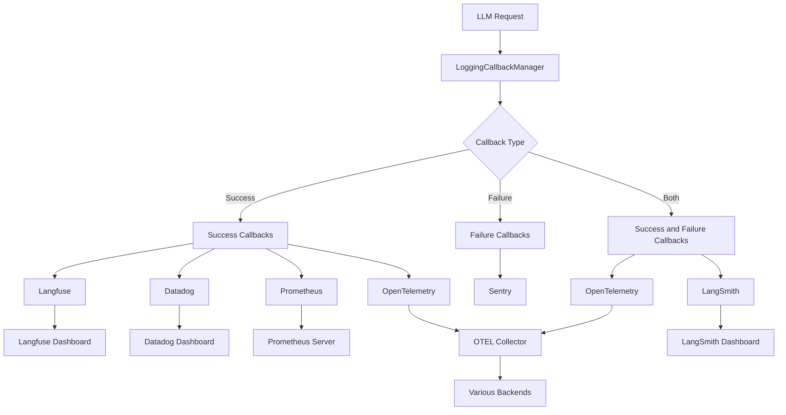
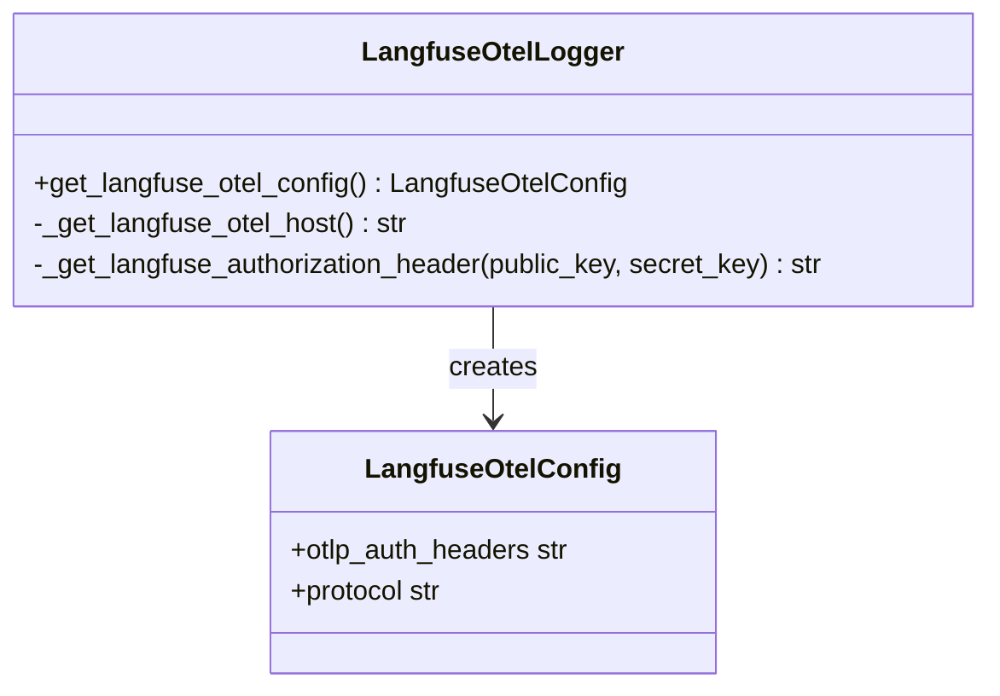
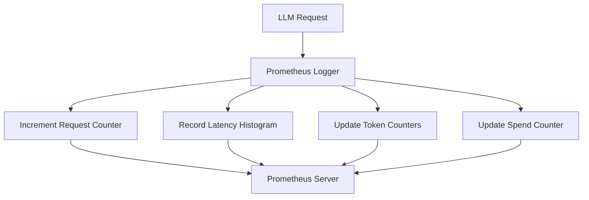
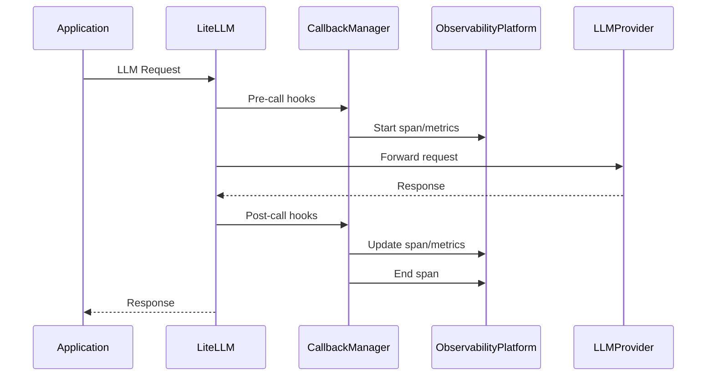

# Observability

<cite>
**Referenced Files in This Document**   
- [callback_configs.json](file://litellm/integrations/callback_configs.json)
- [custom_logger.py](file://litellm/integrations/custom_logger.py)
- [langfuse_otel.py](file://litellm/integrations/langfuse/langfuse_otel.py)
- [opentelemetry.py](file://litellm/integrations/opentelemetry.py)
- [prometheus.py](file://litellm/integrations/prometheus.py)
- [logging_callback_manager.py](file://litellm/litellm_core_utils/logging_callback_manager.py)
- [litellm_logging.py](file://litellm/litellm_core_utils/litellm_logging.py)
</cite>

## Table of Contents
1. [Introduction](#introduction)
2. [Callback System Architecture](#callback-system-architecture)
3. [Core Components](#core-components)
4. [Integration Implementation Details](#integration-implementation-details)
5. [Data Flow Analysis](#data-flow-analysis)
6. [Performance Considerations](#performance-considerations)
7. [Troubleshooting Guide](#troubleshooting-guide)
8. [Advanced Topics](#advanced-topics)

## Introduction
LiteLLM provides a comprehensive observability ecosystem for monitoring, logging, and tracing LLM operations across various platforms. The system is built around a flexible callback architecture that enables integration with multiple observability solutions including Langfuse, Datadog, Prometheus, and OpenTelemetry. This documentation details the architecture, implementation, and practical usage of these monitoring capabilities, providing guidance on configuration, data flow, and best practices for comprehensive system observability.

## Callback System Architecture

**Diagram sources**
- [logging_callback_manager.py](file://litellm/litellm_core_utils/logging_callback_manager.py#L18-L457)
- [litellm_logging.py](file://litellm/litellm_core_utils/litellm_logging.py#L1-L5293)

**Section sources**
- [logging_callback_manager.py](file://litellm/litellm_core_utils/logging_callback_manager.py#L1-L457)
- [litellm_logging.py](file://litellm/litellm_core_utils/litellm_logging.py#L1-L5293)

## Core Components

The observability ecosystem in LiteLLM is built on several core components that work together to provide comprehensive monitoring capabilities. The LoggingCallbackManager serves as the central coordinator, managing the registration and execution of various callback types. CustomLogger provides the base interface for all observability integrations, defining the standard methods for handling different logging events. The system supports three callback types: success (executed on successful LLM calls), failure (executed on failed LLM calls), and success_and_failure (executed on all LLM calls regardless of outcome).

The callback system is designed with performance in mind, implementing safeguards such as the MAX_CALLBACKS limit (default: 30) to prevent excessive resource consumption. The system prevents duplicate callback registration and provides mechanisms for dynamic callback management, allowing callbacks to be added or removed during runtime. This architecture enables flexible monitoring configurations while maintaining system stability.

**Section sources**
- [logging_callback_manager.py](file://litellm/litellm_core_utils/logging_callback_manager.py#L1-L457)
- [custom_logger.py](file://litellm/integrations/custom_logger.py#L1-L809)

## Integration Implementation Details

### Langfuse Integration
The Langfuse integration provides comprehensive tracing and evaluation capabilities. Configuration requires setting LANGFUSE_PUBLIC_KEY and LANGFUSE_SECRET_KEY environment variables. The integration automatically collects request details, response content, timing information, and metadata. For OpenTelemetry compatibility, the langfuse_otel integration can be used, which configures the OTEL exporter to send data to Langfuse endpoints.

**Diagram sources**
- [langfuse_otel.py](file://litellm/integrations/langfuse/langfuse_otel.py#L229-L284)

### Datadog Integration
The Datadog integration enables monitoring of LLM operations within the Datadog platform. Configuration requires dd_api_key and dd_site parameters. The integration supports both standard logging and Datadog's LLM Observability features, providing detailed metrics and traces that can be visualized in Datadog dashboards.

### Prometheus Integration
The Prometheus integration provides metrics collection for monitoring system performance and usage. Key metrics include:
- litellm_proxy_total_requests_metric: Total number of requests to the proxy
- litellm_spend_metric: Total spend on LLM requests
- litellm_tokens_metric: Total number of input and output tokens
- litellm_request_total_latency_metric: Total latency for requests
- litellm_llm_api_latency_metric: Latency for LLM API calls

The integration supports configuration through prometheus_metrics_config, allowing filtering of metrics and labels to optimize monitoring overhead.

**Diagram sources**
- [prometheus.py](file://litellm/integrations/prometheus.py#L51-L800)

### OpenTelemetry Integration
The OpenTelemetry integration provides distributed tracing and metrics collection. Configuration can be done through environment variables (OTEL_EXPORTER_OTLP_PROTOCOL, OTEL_EXPORTER_OTLP_ENDPOINT, OTEL_EXPORTER_OTLP_HEADERS) or programmatically via OpenTelemetryConfig. The integration supports multiple exporters including console, OTLP HTTP/GRPC, and Honeycomb. Key features include:
- Distributed tracing with span creation for LLM requests
- Metrics collection for operation duration, token usage, and costs
- Semantic logging with event emission
- Support for team and key-based logging control

**Section sources**
- [opentelemetry.py](file://litellm/integrations/opentelemetry.py#L1-L2007)
- [prometheus.py](file://litellm/integrations/prometheus.py#L1-L2414)
- [callback_configs.json](file://litellm/integrations/callback_configs.json#L1-L405)

## Data Flow Analysis

**Diagram sources**
- [litellm_logging.py](file://litellm/litellm_core_utils/litellm_logging.py#L1-L5293)
- [custom_logger.py](file://litellm/integrations/custom_logger.py#L1-L809)

The data flow begins with an LLM request from the application to LiteLLM. The LoggingCallbackManager intercepts the request and triggers pre-call hooks, which may include starting spans in tracing systems or initializing metrics. LiteLLM then forwards the request to the appropriate LLM provider. Upon receiving the response, post-call hooks are executed, updating spans with response details, recording metrics, and logging relevant information to the configured observability platforms. The final response is returned to the application, completing the flow.

## Performance Considerations

When enabling multiple observability integrations, several performance considerations should be addressed:

1. **Callback Overhead**: Each active callback adds processing overhead. The system limits callbacks to 30 by default to prevent excessive resource consumption.

2. **Network Latency**: External integrations (Datadog, Langfuse, etc.) introduce network latency. Asynchronous logging is used where possible to minimize impact on request processing.

3. **Memory Usage**: Prometheus metrics are stored in memory, which can grow with high request volumes. Proper metric labeling and filtering should be configured to manage memory usage.

4. **Configuration Optimization**: Use prometheus_metrics_config to filter metrics and labels, reducing the volume of data collected and transmitted.

5. **Sampling**: For high-volume applications, consider implementing sampling strategies, particularly with LangSmith which supports configurable sampling rates.

6. **Resource Monitoring**: Monitor the observability system itself to ensure it doesn't become a bottleneck. The Prometheus integration provides metrics for tracking callback performance and system health.

**Section sources**
- [logging_callback_manager.py](file://litellm/litellm_core_utils/logging_callback_manager.py#L28-L28)
- [prometheus.py](file://litellm/integrations/prometheus.py#L336-L345)

## Troubleshooting Guide

### Missing Spans in Traces
**Issue**: Spans are not appearing in tracing backends like Langfuse or Datadog.
**Solution**: 
1. Verify callback configuration and required environment variables
2. Check that the callback is properly registered in the success/failure callback lists
3. Enable DEBUG_OTEL environment variable to debug OpenTelemetry issues
4. Verify network connectivity to the tracing backend

### Delayed Metric Reporting
**Issue**: Prometheus metrics show delays in updates.
**Solution**:
1. Check the scrape interval configuration in Prometheus
2. Verify that the /metrics endpoint is accessible
3. Review the prometheus_metrics_config for any filtering that might exclude metrics
4. Monitor system resources to ensure the application isn't under heavy load

### High Memory Usage
**Issue**: Application memory usage increases with observability enabled.
**Solution**:
1. Review metric labels and reduce cardinality
2. Implement proper metric cleanup for dynamic labels
3. Consider disabling less critical metrics
4. Monitor the number of active callbacks and remove unnecessary ones

### Authentication Failures
**Issue**: Callbacks fail due to authentication errors.
**Solution**:
1. Verify API keys and secrets are correctly configured
2. Check that environment variables are properly set
3. Validate that credentials have the necessary permissions
4. Test connectivity to the observability platform independently

**Section sources**
- [opentelemetry.py](file://litellm/integrations/opentelemetry.py#L157-L169)
- [prometheus.py](file://litellm/integrations/prometheus.py#L333-L345)
- [custom_logger.py](file://litellm/integrations/custom_logger.py#L629-L659)

## Advanced Topics

### Custom Callback Development
Developers can create custom callbacks by extending the CustomLogger class and implementing the appropriate logging methods (log_success_event, log_failure_event, async_log_success_event, etc.). Custom callbacks can be registered programmatically or through configuration files.

### Enterprise Monitoring Integration
The system supports integration with enterprise monitoring solutions through the callback architecture. Custom implementations can be developed to interface with proprietary monitoring systems, leveraging the standardized callback interface.

### Dynamic Configuration
Callbacks can be configured dynamically based on request metadata, allowing different monitoring configurations for different users, teams, or API keys. This enables fine-grained control over observability data collection and routing.

**Section sources**
- [custom_logger.py](file://litellm/integrations/custom_logger.py#L67-L82)
- [litellm_logging.py](file://litellm/litellm_core_utils/litellm_logging.py#L1-L5293)