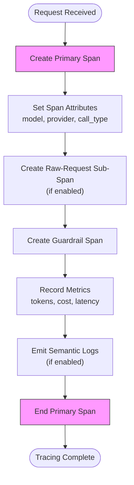
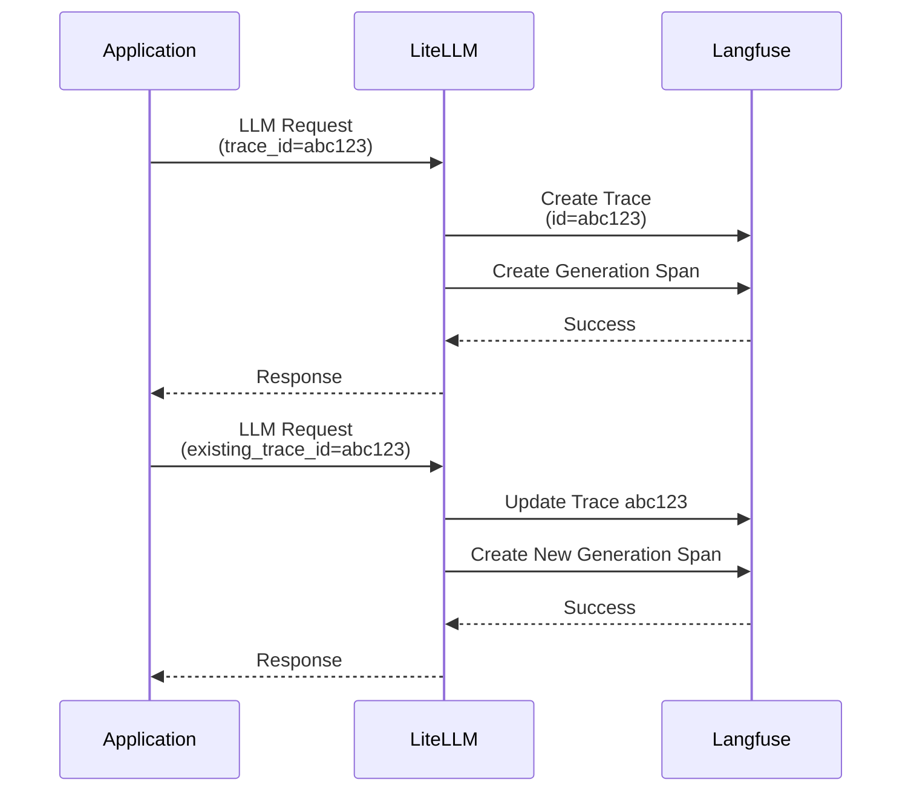
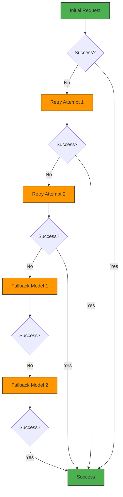

# Tracing

<cite>
**Referenced Files in This Document**   
- [opentelemetry.py](file://litellm/integrations/opentelemetry.py)
- [langfuse.py](file://litellm/integrations/langfuse/langfuse.py)
- [langsmith.py](file://litellm/integrations/langsmith.py)
- [arize_phoenix.py](file://litellm/integrations/arize/arize_phoenix.py)
- [litellm_logging.py](file://litellm/litellm_core_utils/litellm_logging.py)
- [add_retry_fallback_headers.py](file://litellm/router_utils/add_retry_fallback_headers.py)
</cite>

## Table of Contents
1. [Introduction](#introduction)
2. [Trace Propagation and Context Management](#trace-propagation-and-context-management)
3. [Span Creation and Lifecycle](#span-creation-and-lifecycle)
4. [Integration with Observability Platforms](#integration-with-observability-platforms)
5. [Trace Context Preservation Across Retries and Fallbacks](#trace-context-preservation-across-retries-and-fallbacks)
6. [Relationship with Other Observability Signals](#relationship-with-other-observability-signals)
7. [Common Issues and Solutions](#common-issues-and-solutions)
8. [Advanced Configuration](#advanced-configuration)
9. [Conclusion](#conclusion)

## Introduction
LiteLLM provides comprehensive distributed tracing capabilities for LLM calls, enabling detailed observability across the entire request lifecycle. The system supports multiple tracing backends including Langfuse, Arize, LangSmith, and OpenTelemetry-compatible platforms. This documentation details the implementation of trace propagation, span creation, context management, and integration with various observability platforms to capture prompt-response pairs, token usage, and latency metrics.

The tracing system is designed to maintain context across retries, fallbacks, and service boundaries, ensuring complete visibility into LLM operations. It integrates seamlessly with existing observability ecosystems, allowing developers to correlate LLM performance with application metrics and logs.

## Trace Propagation and Context Management

LiteLLM's tracing system implements a robust context propagation mechanism that ensures trace continuity across the request lifecycle. The system follows a hierarchical approach to determine the parent context for new spans, prioritizing existing active spans from the global context.

The context management process begins with the `_get_span_context` method in the OpenTelemetry integration, which evaluates multiple sources to establish the parent context:

1. **Explicit parent context**: When provided in the request metadata
2. **Parent span from user API key authentication**: When available in the authentication context
3. **Active span from global context**: Automatically detected from the OpenTelemetry context
4. **Root span creation**: When no parent context is found

This prioritization ensures that traces remain connected even when spans are created across different components or service boundaries. The system preserves trace context by extracting and propagating trace identifiers through the request metadata, allowing child spans to properly reference their parent spans.

When integrating with external systems, LiteLLM supports dynamic header injection for team and key-based logging. The `construct_dynamic_otel_headers` method allows custom implementations in integrations like Langfuse and Arize to include team-specific or key-specific headers in the tracing data.

**Section sources**
- [opentelemetry.py](file://litellm/integrations/opentelemetry.py#L1622-L1645)
- [litellm_logging.py](file://litellm/litellm_core_utils/litellm_logging.py#L360-L362)

## Span Creation and Lifecycle

LiteLLM creates multiple spans for each LLM request to capture different aspects of the operation. The primary span represents the complete LLM request, while additional spans capture specific components like raw requests, guardrail evaluations, and metrics recording.

The span creation process is managed by the `_handle_success` method in the OpenTelemetry integration, which orchestrates the creation of the following spans:

1. **Primary span**: Represents the complete LLM request with attributes like model name, provider, and call type
2. **Raw-request sub-span**: Captures the actual LLM API request and response when message logging is enabled
3. **Guardrail span**: Records guardrail evaluations and their outcomes
4. **Metrics spans**: Capture token usage, cost, and latency metrics

Each span follows a standard lifecycle: creation with appropriate attributes, attribute updates during processing, and proper termination with end time and status. The system ensures that spans are properly ended, even in error conditions, by implementing cleanup logic in failure hooks.

For streaming requests, LiteLLM captures specialized latency metrics including time to first token (TTFT) and time per output token (TPOT). These metrics are recorded using dedicated histogram instruments that track the duration between key events in the streaming process.



**Diagram sources **
- [opentelemetry.py](file://litellm/integrations/opentelemetry.py#L602-L637)
- [opentelemetry.py](file://litellm/integrations/opentelemetry.py#L638-L658)

**Section sources**
- [opentelemetry.py](file://litellm/integrations/opentelemetry.py#L602-L658)
- [opentelemetry.py](file://litellm/integrations/opentelemetry.py#L686-L754)

## Integration with Observability Platforms

LiteLLM provides native integrations with multiple observability platforms, each implementing the common tracing interface while adding platform-specific features.

### Langfuse Integration
The Langfuse integration captures comprehensive LLM observability data including:
- Prompt and response content
- Token usage and cost metrics
- Latency measurements
- Guardrail evaluations
- User and session identifiers

The integration supports advanced features like trace continuation, where existing traces can be updated with new generations. This is controlled by the `existing_trace_id` and `update_trace_keys` metadata parameters, which allow subsequent LLM calls to append to an existing trace rather than creating a new one.



**Diagram sources **
- [langfuse.py](file://litellm/integrations/langfuse/langfuse.py#L457-L620)
- [langfuse.py](file://litellm/integrations/langfuse/langfuse.py#L537-L572)

### Arize Phoenix Integration
The Arize Phoenix integration leverages OpenTelemetry to export tracing data to the Arize platform. It automatically configures the OTLP exporter based on environment variables:

- `PHOENIX_API_KEY`: Authentication token for the Arize Phoenix collector
- `PHOENIX_COLLECTOR_ENDPOINT`: Collector endpoint for gRPC or HTTP
- `PHOENIX_PROJECT_NAME`: Project name for organizing traces

The integration handles protocol detection, automatically determining whether to use gRPC or HTTP/protobuf based on the endpoint configuration. For local development, it defaults to the standard Phoenix endpoint at `http://localhost:6006/v1/traces`.

### LangSmith Integration
The LangSmith integration implements batched logging to optimize performance and reduce API calls. Key features include:

- **Batch processing**: Events are queued and sent in batches to minimize network overhead
- **Sampling support**: Configurable sampling rate to control data volume
- **Team-based logging**: Support for multiple API keys and projects within a single application

The integration groups log entries by credentials before sending them to LangSmith, enabling key-based and team-based logging scenarios. This allows different parts of an application to log to different LangSmith projects using their respective API keys.

**Section sources**
- [langfuse.py](file://litellm/integrations/langfuse/langfuse.py#L457-L620)
- [arize_phoenix.py](file://litellm/integrations/arize/arize_phoenix.py#L59-L87)
- [langsmith.py](file://litellm/integrations/langsmith.py#L329-L338)

## Trace Context Preservation Across Retries and Fallbacks

LiteLLM ensures trace context continuity across retries and fallbacks through several mechanisms:

1. **Persistent trace identifiers**: The `litellm_call_id` and `litellm_trace_id` are preserved across retry attempts, ensuring all attempts are linked to the same trace
2. **Header propagation**: Retry and fallback metadata is added to response headers, allowing downstream systems to understand the retry context
3. **Context inheritance**: The original tracing context is passed to fallback models, maintaining the parent-child relationship in the trace tree

The system uses the `add_retry_headers_to_response` and `add_fallback_headers_to_response` functions to inject metadata about retry attempts into the response. These headers include:
- `x-litellm-attempted-retries`: Number of retry attempts made
- `x-litellm-max-retries`: Maximum number of retries configured
- `x-litellm-attempted-fallbacks`: Number of fallback models attempted

This information allows observability platforms to reconstruct the complete retry and fallback sequence, showing how the system recovered from failures.



**Diagram sources **
- [add_retry_fallback_headers.py](file://litellm/router_utils/add_retry_fallback_headers.py#L33-L47)
- [add_retry_fallback_headers.py](file://litellm/router_utils/add_retry_fallback_headers.py#L50-L69)

**Section sources**
- [add_retry_fallback_headers.py](file://litellm/router_utils/add_retry_fallback_headers.py#L33-L69)
- [fallback_utils.py](file://litellm/litellm_core_utils/fallback_utils.py#L40-L63)

## Relationship with Other Observability Signals

LiteLLM's tracing system is designed to work in concert with other observability signals like logs and metrics, providing a comprehensive view of LLM operations.

### Logs Integration
The tracing system enriches log entries with trace context, allowing logs to be correlated with specific traces. Each log entry includes:
- Trace ID for cross-referencing with tracing data
- Span ID for precise event ordering
- Request metadata for contextual understanding

This integration enables developers to trace the complete execution path of an LLM request by following the trace ID across log entries.

### Metrics Correlation
Tracing data is enriched with metrics from the LLM response, creating a unified observability record. Key metrics captured include:
- Token usage (prompt and completion tokens)
- Response cost in USD
- Latency measurements (TTFT, TPOT, total duration)
- Cache hit/miss status

These metrics are attached as span attributes, allowing observability platforms to perform cross-dimensional analysis. For example, developers can analyze cost by model, latency by provider, or token usage by user.

### Distributed Tracing
For applications with multiple services, LiteLLM participates in distributed tracing by:
- Propagating trace context from incoming requests
- Generating W3C Trace Context headers for outgoing requests
- Preserving parent span relationships across service boundaries

This enables end-to-end tracing of LLM requests that originate from other services, providing complete visibility into the request flow.

**Section sources**
- [opentelemetry.py](file://litellm/integrations/opentelemetry.py#L686-L754)
- [opentelemetry.py](file://litellm/integrations/opentelemetry.py#L322-L341)

## Common Issues and Solutions

### Broken Traces Across Service Boundaries
**Issue**: Trace context is lost when LLM requests are made from different services.

**Solution**: Ensure proper propagation of W3C Trace Context headers between services. Use the `traceparent` and `tracestate` headers to maintain trace continuity.

### Missing Context in Retries
**Issue**: Retry attempts appear as separate traces rather than part of the original trace.

**Solution**: Preserve the `litellm_trace_id` across retry attempts and ensure it's passed to the retry logic. The system automatically handles this when using the built-in retry mechanisms.

### Sampling Too Aggressive
**Issue**: Important error cases are missed due to high sampling rates.

**Solution**: Configure adaptive sampling that reduces sampling for error responses. For LangSmith integration, set `LANGSMITH_SAMPLING_RATE` to 1.0 for development and lower values for production.

### Header Size Limits
**Issue**: Large metadata causes header size limits to be exceeded.

**Solution**: Use the `mask_input` and `mask_output` parameters to redact sensitive or large content from tracing data. Alternatively, configure the tracing backend to sample or truncate large attributes.

### Performance Overhead
**Issue**: Tracing introduces significant latency.

**Solution**: Enable batched logging and adjust the flush interval. For OpenTelemetry, increase the `flush_interval` parameter to reduce the frequency of exporter calls.

## Advanced Configuration

### Trace Sampling Strategies
LiteLLM supports configurable trace sampling through environment variables and request metadata:

- **Global sampling**: Set `LANGSMITH_SAMPLING_RATE` to control the percentage of requests logged
- **Dynamic sampling**: Use `standard_callback_dynamic_params` to override sampling rate per request
- **Conditional sampling**: Implement custom logic in pre-call hooks to determine whether to trace a request

### Custom Span Attribute Injection
Developers can inject custom attributes into spans using several methods:

1. **Metadata parameters**: Include attributes in the `metadata` dictionary of the request
2. **Dynamic callbacks**: Use `standard_callback_dynamic_params` to add attributes at runtime
3. **Pre-call hooks**: Modify the request before it's processed to include tracing metadata

### Multiple Tracing Backends
LiteLLM supports simultaneous integration with multiple tracing backends. This is configured by including multiple callback names in the `service_callback` list:

```python
litellm.service_callback = ["langfuse", "langsmith", "arize"]
```

Each backend receives the same tracing data, allowing organizations to maintain redundancy or use different platforms for different purposes.

## Conclusion
LiteLLM's distributed tracing capabilities provide comprehensive observability for LLM operations, capturing detailed information about prompt-response pairs, token usage, and latency metrics. The system's robust context propagation ensures trace continuity across retries, fallbacks, and service boundaries, while its integrations with platforms like Langfuse, Arize, and LangSmith enable rich visualization and analysis.

By following the patterns and best practices outlined in this documentation, developers can effectively monitor and optimize their LLM applications, gaining valuable insights into performance, cost, and reliability.