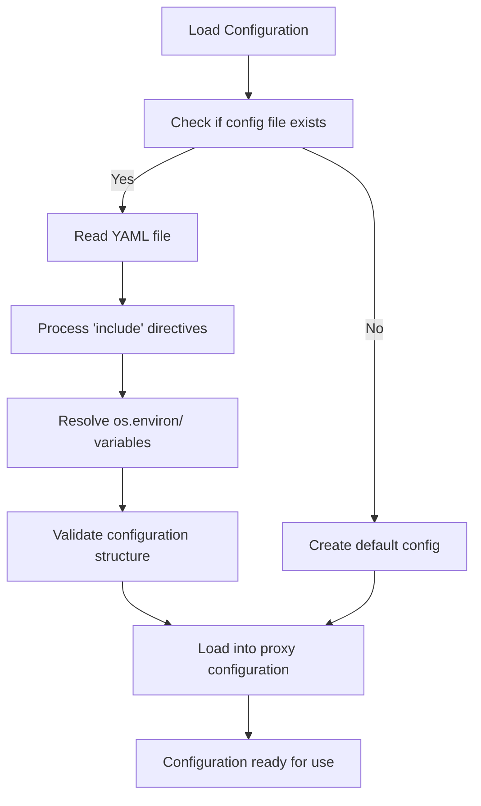
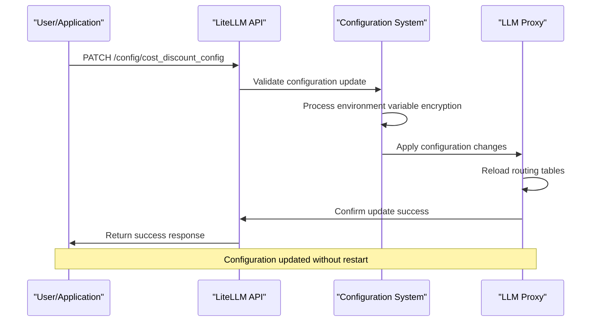
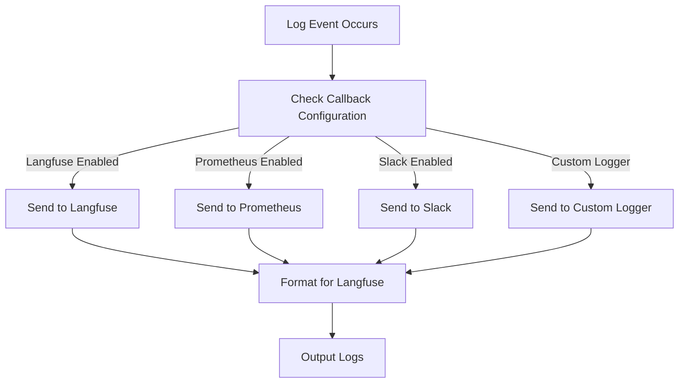
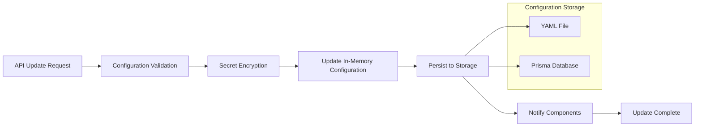
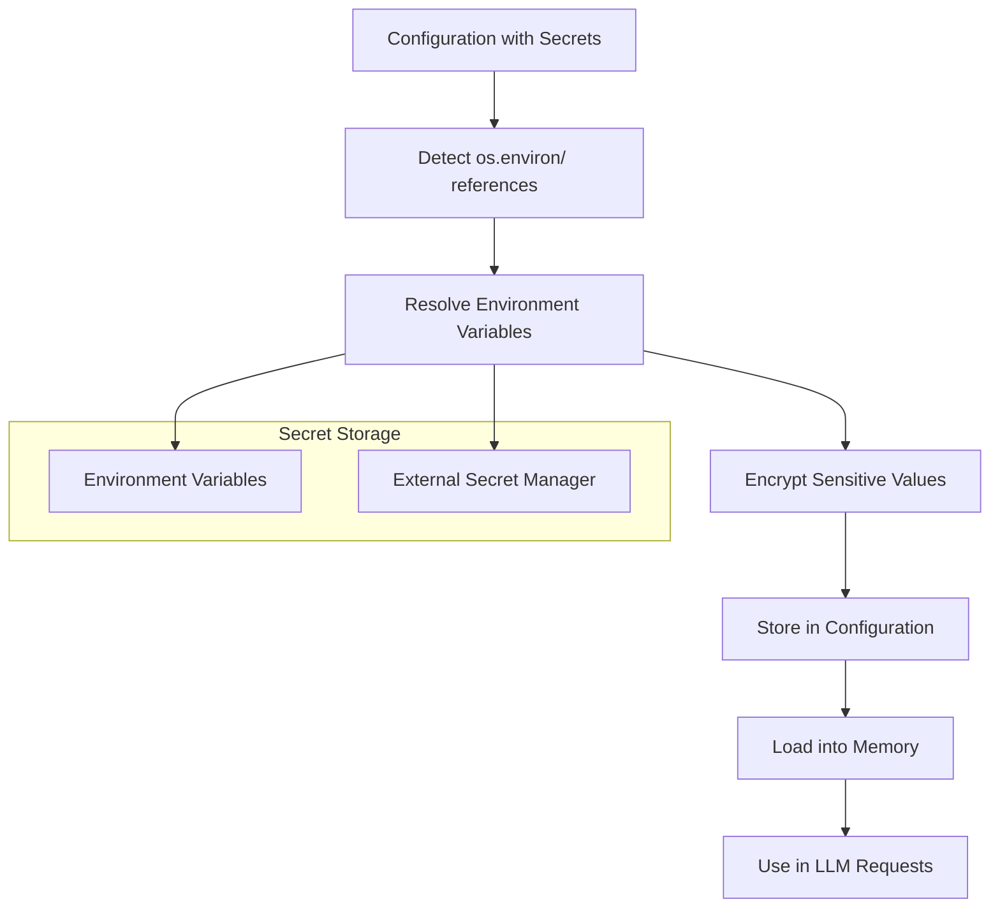

# Configuration

<cite>
**Referenced Files in This Document**   
- [proxy_config.yaml](file://litellm/proxy/proxy_config.yaml)
- [model_config.yaml](file://litellm/proxy/model_config.yaml)
- [proxy_server_config.yaml](file://proxy_server_config.yaml)
- [proxy_server.py](file://litellm/proxy/proxy_server.py)
- [utils.py](file://litellm/proxy/utils.py)
- [proxy_cli.py](file://litellm/proxy/proxy_cli.py)
- [simple_config.yaml](file://litellm/proxy/example_config_yaml/simple_config.yaml)
- [load_balancer.yaml](file://litellm/proxy/example_config_yaml/load_balancer.yaml)
- [multi_instance_simple_config.yaml](file://litellm/proxy/example_config_yaml/multi_instance_simple_config.yaml)
- [store_model_db_config.yaml](file://litellm/proxy/example_config_yaml/store_model_db_config.yaml)
- [langfuse_config.yaml](file://litellm/proxy/example_config_yaml/langfuse_config.yaml)
- [spend_tracking_config.yaml](file://litellm/proxy/example_config_yaml/spend_tracking_config.yaml)
</cite>

## Table of Contents
1. [Introduction](#introduction)
2. [Configuration Methods](#configuration-methods)
3. [Proxy Configuration Structure](#proxy-configuration-structure)
4. [Model Configuration Approaches](#model-configuration-approaches)
5. [Practical Configuration Examples](#practical-configuration-examples)
6. [Static vs Dynamic Configuration](#static-vs-dynamic-configuration)
7. [Best Practices for Configuration Management](#best-practices-for-configuration-management)
8. [Conclusion](#conclusion)

## Introduction
LiteLLM provides a comprehensive configuration system that enables users to manage their LLM proxy deployments through multiple methods. The system supports YAML configuration files, environment variables, and API-based management, allowing for flexible deployment scenarios from development to production. This document details the various configuration approaches, proxy settings, model deployment strategies, and best practices for managing LiteLLM configurations effectively.

**Section sources**
- [proxy_server.py](file://litellm/proxy/proxy_server.py#L1762-L1800)

## Configuration Methods

### YAML Configuration Files
LiteLLM's primary configuration method uses YAML files to define the proxy's behavior, model routing, and system settings. The configuration system supports multiple YAML files that can be loaded and processed hierarchically. The main configuration file typically contains several key sections:

- **model_list**: Defines the available models and their parameters
- **litellm_settings**: Configures global LiteLLM behavior and callbacks
- **router_settings**: Controls routing strategy and Redis connection parameters
- **general_settings**: Manages proxy-wide settings like authentication and database connections
- **environment_variables**: Sets environment variables for the proxy process

The configuration loader processes YAML files recursively, allowing for modular configuration management. When a configuration file is loaded, the system checks for environment variable references (prefixed with `os.environ/`) and resolves them during the loading process.



**Diagram sources**
- [proxy_server.py](file://litellm/proxy/proxy_server.py#L1762-L1820)
- [utils.py](file://litellm/proxy/utils.py#L2154-L2181)

### Environment Variables
LiteLLM supports environment variable configuration through two mechanisms. First, specific configuration values can reference environment variables using the `os.environ/` prefix, which tells LiteLLM to read the value from the environment at runtime. This is particularly useful for API keys and sensitive credentials.

Second, the `environment_variables` section in the YAML configuration allows setting environment variables for the proxy process itself. This enables configuration of external services and integrations without requiring system-level environment variable setup.

The system processes environment variables during configuration loading, resolving any `os.environ/` references and setting the specified variables in the process environment. This approach provides a secure way to manage secrets and allows for configuration portability across different deployment environments.

**Section sources**
- [proxy_server.py](file://litellm/proxy/proxy_server.py#L2154-L2181)
- [proxy_server_config.yaml](file://proxy_server_config.yaml#L225-L231)

### API-Based Configuration Management
LiteLLM provides REST API endpoints for dynamic configuration management, allowing runtime updates without requiring server restarts. The API supports CRUD operations for configuration elements, enabling programmatic management of the proxy's behavior.

Key API endpoints include:
- `/config/model/list` - Manage model configurations
- `/config/cost_discount_config` - Configure cost tracking and discount settings
- Various endpoints in the `config_management_endpoints` module for different configuration aspects

This dynamic configuration capability enables use cases such as automated model deployment, runtime parameter tuning, and integration with external configuration management systems.



**Diagram sources**
- [proxy_server.py](file://litellm/proxy/proxy_server.py#L9123-L9149)
- [cost_tracking_settings.tsx](file://ui/litellm-dashboard/src/components/cost_tracking_settings.tsx#L42-L93)

## Proxy Configuration Structure

### Server Settings
The proxy configuration includes comprehensive server settings that control the behavior of the LiteLLM proxy server. Key server settings include:

- **host and port**: Network binding configuration
- **num_workers**: Process worker count for handling concurrent requests
- **ssl_certfile_path and ssl_keyfile_path**: SSL/TLS configuration for secure connections
- **max_requests_before_restart**: Worker recycling to prevent memory growth

These settings can be configured via command-line arguments, environment variables, or the YAML configuration file, providing flexibility for different deployment scenarios.

**Section sources**
- [proxy_cli.py](file://litellm/proxy/proxy_cli.py#L312-L322)

### Logging Options
LiteLLM offers extensive logging configuration options to support monitoring and debugging. The logging system can be configured with different verbosity levels and output formats. Key logging settings include:

- **set_verbose**: Enables verbose logging output
- **success_callback and failure_callback**: Configures logging integrations like Langfuse, Prometheus, and Slack
- **detailed_debug**: Enables detailed debug logging for troubleshooting

The logging system integrates with various observability platforms, allowing users to route logs and metrics to their preferred monitoring solutions.



**Diagram sources**
- [proxy_server_config.yaml](file://proxy_server_config.yaml#L152-L160)
- [langfuse_config.yaml](file://litellm/proxy/example_config_yaml/langfuse_config.yaml#L4-L6)

### Security Parameters
Security configuration in LiteLLM includes multiple layers of protection for the proxy and its resources. Key security parameters include:

- **master_key**: Authentication key for proxy access
- **api_key**: Provider-specific API keys, often referenced via environment variables
- **database_url**: Database connection string with credentials
- **redis_password**: Redis authentication for caching and rate limiting

The configuration system supports secure handling of sensitive data through environment variable references and encryption mechanisms, preventing secrets from being stored in plaintext configuration files.

**Section sources**
- [proxy_server_config.yaml](file://proxy_server_config.yaml#L208-L218)

## Model Configuration Approaches

### Single Model Deployment
For single model deployments, LiteLLM configuration is straightforward, requiring minimal configuration. The basic structure includes defining a model in the `model_list` with its corresponding parameters:

```yaml
model_list:
  - model_name: gpt-3.5-turbo
    litellm_params:
      model: gpt-3.5-turbo
```

This simple configuration routes all requests for the specified model name to the corresponding LLM provider. The `model_name` serves as the routing key, while the `litellm_params` contains the actual model identifier and connection parameters.

**Section sources**
- [simple_config.yaml](file://litellm/proxy/example_config_yaml/simple_config.yaml#L1-L4)

### Multiple Model Deployment
For multiple model deployments, LiteLLM supports complex routing configurations that enable load balancing, failover, and cost optimization. Multiple models can be defined with the same `model_name`, allowing the router to distribute requests according to the configured strategy:

```yaml
model_list:
  - model_name: gpt-3.5-turbo
    litellm_params:
      model: gpt-3.5-turbo
      api_key: sk-uj6F
    tpm: 20000
    rpm: 3
  - model_name: gpt-3.5-turbo
    litellm_params:
      model: gpt-3.5-turbo
      api_key: sk-Imn
    tpm: 20000
    rpm: 3
```

This configuration enables the usage-based routing strategy to distribute requests across multiple instances of the same model, providing load balancing and redundancy.

**Section sources**
- [load_balancer.yaml](file://litellm/proxy/example_config_yaml/load_balancer.yaml#L1-L17)

## Practical Configuration Examples

### Load Balancing Configuration
The load balancing configuration demonstrates how to distribute requests across multiple model instances to optimize performance and reliability:

```yaml
litellm_settings:
  drop_params: True

model_list:
  - model_name: gpt-3.5-turbo
    litellm_params:
      model: gpt-3.5-turbo
      api_key: sk-uj6F
    tpm: 20000
    rpm: 3
  - model_name: gpt-3.5-turbo
    litellm_params:
      model: gpt-3.5-turbo
      api_key: sk-Imn
    tpm: 20000
    rpm: 3

environment_variables:
  REDIS_HOST: localhost
  REDIS_PASSWORD: 
  REDIS_PORT: 
```

This configuration uses the usage-based routing strategy to balance requests across two OpenAI API keys, with rate limits specified for each instance. The Redis configuration enables shared state for tracking usage across workers.

**Section sources**
- [load_balancer.yaml](file://litellm/proxy/example_config_yaml/load_balancer.yaml)

### Cost Optimization Configuration
For cost optimization, LiteLLM provides configuration options that enable routing to the most cost-effective model based on pricing data:

```yaml
router_settings:
  routing_strategy: lowest_cost
  redis_host: os.environ/REDIS_HOST
  redis_password: os.environ/REDIS_PASSWORD
  redis_port: os.environ/REDIS_PORT

model_list:
  - model_name: gpt-3.5-turbo
    litellm_params:
      model: openai/gpt-3.5-turbo
      api_key: os.environ/OPENAI_API_KEY
  - model_name: gpt-3.5-turbo
    litellm_params:
      model: anthropic/claude-3-haiku-20240307
      api_key: os.environ/ANTHROPIC_API_KEY
```

This configuration uses the lowest_cost routing strategy to automatically select the most economical model for each request based on current pricing. The system evaluates the cost of each available model and routes requests accordingly.

**Section sources**
- [proxy_server_config.yaml](file://proxy_server_config.yaml#L199-L206)

## Static vs Dynamic Configuration

### Static Configuration Files
Static configuration in LiteLLM is managed through YAML files that define the initial state of the proxy. These files are loaded at startup and provide the foundation for the proxy's behavior. The static configuration includes:

- Model definitions and routing rules
- System-wide settings and defaults
- Initial environment variable setup
- Security parameters and authentication

The static configuration serves as the baseline for the proxy's operation and is typically version-controlled and deployed as part of the application infrastructure.

**Section sources**
- [proxy_server.py](file://litellm/proxy/proxy_server.py#L1762-L1820)

### Dynamic API-Based Updates
LiteLLM supports dynamic configuration updates through its REST API, allowing runtime modifications without service interruption. This capability enables:

- Real-time model deployment and removal
- Runtime parameter tuning
- Dynamic scaling of routing rules
- Immediate security updates

The dynamic configuration system maintains consistency between the in-memory configuration and persistent storage, ensuring that updates are durable and survive process restarts. When an API update is received, the system validates the changes, applies them to the running configuration, and persists them to the appropriate storage backend.



**Diagram sources**
- [proxy_server.py](file://litellm/proxy/proxy_server.py#L9123-L9149)
- [utils.py](file://litellm/proxy/utils.py#L2154-L2181)

## Best Practices for Configuration Management

### Development vs Production Environments
Configuration management differs significantly between development and production environments. In development, configurations tend to be simpler and more permissive, focusing on ease of use and rapid iteration. Production configurations prioritize security, reliability, and performance.

Key differences include:
- **Development**: Minimal authentication, verbose logging, local storage
- **Production**: Strict authentication, optimized logging, distributed storage

The configuration system supports environment-specific settings through conditional configuration and environment variable overrides, allowing seamless transitions between environments.

**Section sources**
- [proxy_server_config.yaml](file://proxy_server_config.yaml)

### Version Control Considerations
Effective version control of LiteLLM configurations requires careful management of sensitive data and environment-specific settings. Best practices include:

- Storing configuration templates in version control
- Using environment variables for secrets and credentials
- Maintaining separate configuration files for different environments
- Implementing configuration validation in CI/CD pipelines

The modular configuration system supports these practices by allowing configuration files to include other files and reference environment variables, reducing the risk of accidentally committing sensitive information.

**Section sources**
- [proxy_server.py](file://litellm/proxy/proxy_server.py#L1822-L1894)

### Secret Management
LiteLLM provides robust secret management capabilities to protect sensitive configuration data. The system supports:

- Environment variable references (`os.environ/`) for secrets
- Encryption of sensitive values in configuration storage
- Integration with external secret management systems
- Secure handling of API keys and database credentials

The configuration loader automatically detects and processes secret references, ensuring that sensitive data is never stored in plaintext when possible. For database-stored configurations, the system provides encryption mechanisms to protect secrets at rest.



**Diagram sources**
- [proxy_server.py](file://litellm/proxy/proxy_server.py#L1919-L1923)
- [utils.py](file://litellm/proxy/utils.py#L2167-L2172)

## Conclusion
LiteLLM's configuration system provides a comprehensive and flexible approach to managing LLM proxy deployments. By supporting multiple configuration methods including YAML files, environment variables, and API-based management, LiteLLM enables both static and dynamic configuration scenarios. The system's modular design allows for complex routing strategies, load balancing, and cost optimization while maintaining security and reliability. Best practices for configuration management emphasize the separation of secrets from code, environment-specific configurations, and the use of version control to ensure reproducible deployments. This robust configuration framework makes LiteLLM suitable for both development and production use cases across various deployment scenarios.