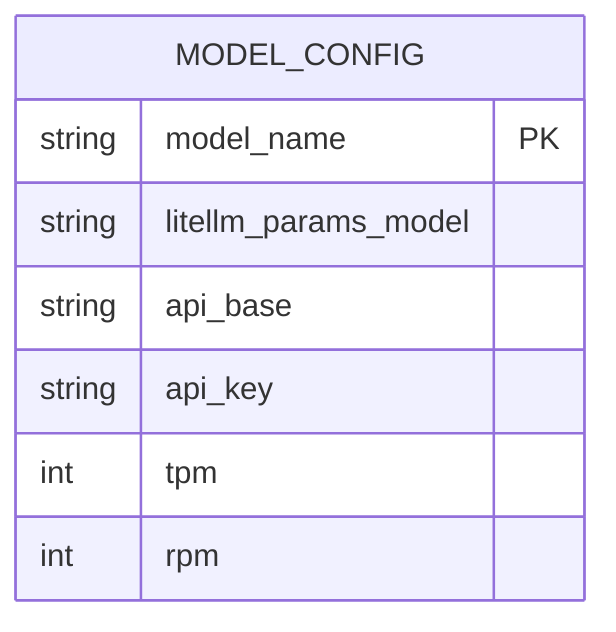
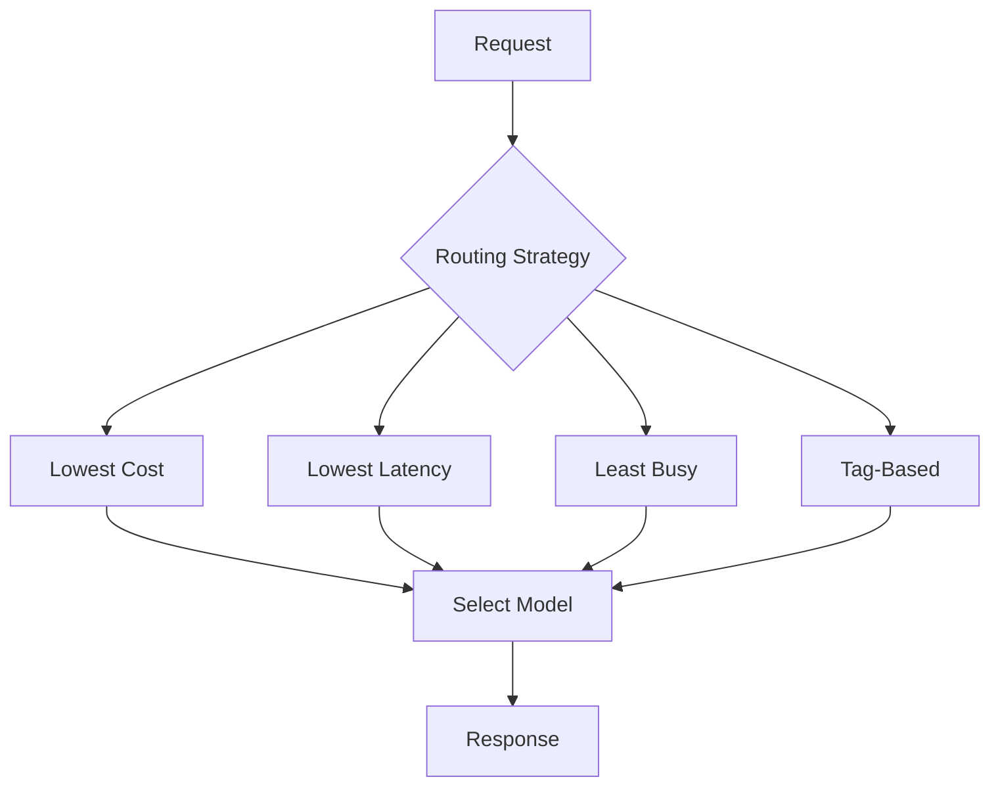
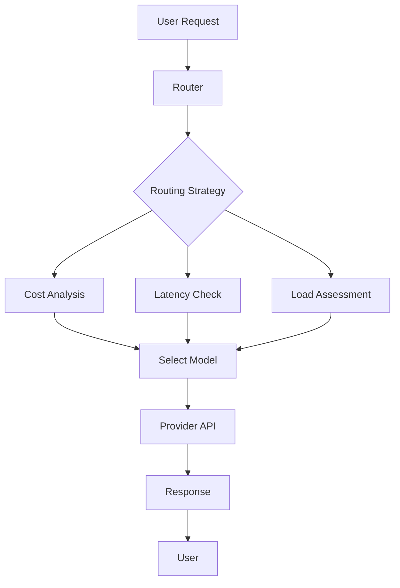
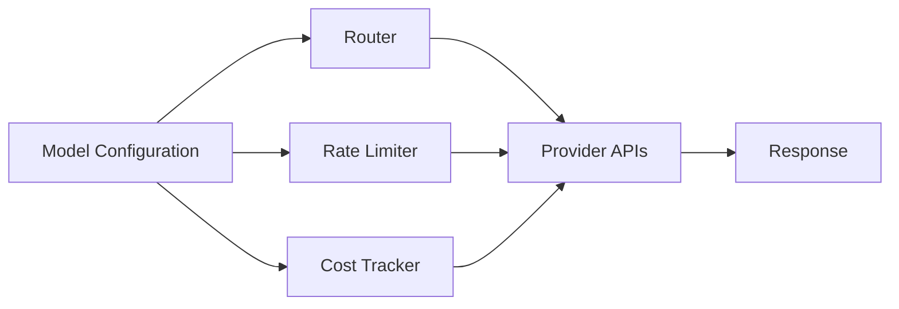

# Model Configuration

<cite>
**Referenced Files in This Document**   
- [model_config.yaml](file://litellm/proxy/model_config.yaml)
- [proxy_config.yaml](file://litellm/proxy/proxy_config.yaml)
- [store_model_db_config.yaml](file://litellm/proxy/example_config_yaml/store_model_db_config.yaml)
- [router.py](file://litellm/router.py)
- [lowest_cost.py](file://litellm/router_strategy/lowest_cost.py)
- [least_busy.py](file://litellm/router_strategy/least_busy.py)
- [tag_based_routing.py](file://litellm/router_strategy/tag_based_routing.py)
</cite>

## Table of Contents
1. [Introduction](#introduction)
2. [Configuration Approaches](#configuration-approaches)
3. [Model Configuration Structure](#model-configuration-structure)
4. [Advanced Configuration Options](#advanced-configuration-options)
5. [Practical Examples](#practical-examples)
6. [Best Practices](#best-practices)
7. [System Integration](#system-integration)

## Introduction
LiteLLM's model management system provides a comprehensive framework for configuring and managing large language models through multiple approaches. The system supports static YAML configuration, dynamic API registration, and automatic discovery from provider endpoints, enabling flexible deployment strategies for various use cases. This document details the model configuration system, covering configuration structure, advanced routing options, and integration with other system components.

## Configuration Approaches

LiteLLM supports multiple approaches for model configuration, allowing users to choose the most appropriate method based on their deployment requirements and operational preferences.

### Static YAML Configuration
The primary method for configuring models in LiteLLM is through YAML configuration files. The system uses a model list structure where each model is defined with a model name and associated LiteLLM parameters. Configuration files such as `model_config.yaml` and `proxy_config.yaml` contain model lists that define available models and their properties. This approach provides a declarative way to manage model configurations, making it easy to version control and deploy consistent configurations across environments.

### Dynamic API Registration
LiteLLM enables dynamic model registration through its API, allowing models to be added or modified at runtime without requiring configuration file changes. This approach is particularly useful for environments where models need to be frequently updated or where configuration changes should be made without service interruption. The dynamic registration system integrates with the router's model management capabilities, ensuring that newly registered models are immediately available for routing.

### Automatic Discovery from Provider Endpoints
The system supports automatic discovery of models from provider endpoints, reducing the manual configuration burden. This feature allows LiteLLM to query provider APIs and automatically register available models based on the discovered endpoints. The discovery mechanism can be configured to periodically refresh the model list, ensuring that the system stays up-to-date with the latest models offered by providers.

**Section sources**
- [model_config.yaml](file://litellm/proxy/model_config.yaml#L1-L11)
- [proxy_config.yaml](file://litellm/proxy/proxy_config.yaml#L1-L10)
- [store_model_db_config.yaml](file://litellm/proxy/example_config_yaml/store_model_db_config.yaml#L1-L11)

## Model Configuration Structure

The model configuration structure in LiteLLM follows a consistent pattern that defines model identifiers, provider specifications, API keys, and routing parameters.

### Model Identifiers
Each model configuration includes a model_name field that serves as the identifier for the model within the LiteLLM system. This identifier is used for routing requests and can be aliased to provide user-friendly names. The model_name can use wildcard patterns (e.g., "gemini/*") to match multiple models with similar naming conventions, enabling bulk configuration of related models.

### Provider Specifications
The litellm_params section contains provider-specific configuration, including the model identifier used by the provider (e.g., "openai/gpt-4o") and the API endpoint (api_base). This structure allows LiteLLM to route requests to the appropriate provider with the correct model specification. The configuration also supports provider-specific parameters such as api_key for authentication.

### API Keys and Authentication
Authentication credentials are configured within the litellm_params section, allowing for secure storage and management of API keys. The system supports various authentication methods, including direct API keys, environment variables, and integration with secret management systems. This flexible approach enables secure credential management while supporting different deployment scenarios.

### Routing Parameters
Model configurations can include routing parameters such as TPM (tokens per minute) and RPM (requests per minute) limits, which are used by the router to make intelligent routing decisions. These parameters help prevent rate limiting and ensure optimal performance by distributing load across available models based on their capacity.

**Diagram sources **
- [model_config.yaml](file://litellm/proxy/model_config.yaml#L1-L11)
- [store_model_db_config.yaml](file://litellm/proxy/example_config_yaml/store_model_db_config.yaml#L1-L11)

**Section sources**
- [model_config.yaml](file://litellm/proxy/model_config.yaml#L1-L11)
- [proxy_config.yaml](file://litellm/proxy/proxy_config.yaml#L1-L10)

## Advanced Configuration Options

LiteLLM provides advanced configuration options for sophisticated model management, including model groups, fallback strategies, and weighted routing.

### Model Groups
Model groups allow multiple deployments of the same model type to be grouped together for load balancing and failover purposes. The system uses model_group as a key to identify related deployments that can be used interchangeably. This enables features like load balancing across multiple instances of the same model from different providers or regions.

### Fallback Strategies
The system supports configurable fallback strategies that automatically route requests to alternative models when the primary model is unavailable or returns an error. Fallback policies can be defined based on various criteria, including error types, latency thresholds, and availability status. This ensures high availability and reliability of the LLM service.

### Weighted Routing
LiteLLM implements weighted routing strategies that distribute requests based on various metrics such as cost, latency, and availability. The system includes built-in routing strategies like lowest_cost, lowest_latency, and least_busy, which automatically select the optimal model based on real-time performance data. These strategies can be customized with specific routing arguments to meet particular requirements.

**Diagram sources **
- [lowest_cost.py](file://litellm/router_strategy/lowest_cost.py#L1-L333)
- [least_busy.py](file://litellm/router_strategy/least_busy.py#L1-L252)
- [tag_based_routing.py](file://litellm/router_strategy/tag_based_routing.py#L49-L113)

**Section sources**
- [lowest_cost.py](file://litellm/router_strategy/lowest_cost.py#L1-L333)
- [least_busy.py](file://litellm/router_strategy/least_busy.py#L1-L252)

## Practical Examples

This section provides practical examples of model configuration for common use cases.

### Multi-Provider Redundancy
Configuring models from multiple providers for the same model type provides redundancy and failover capabilities. For example, configuring both OpenAI and Anthropic versions of similar models allows the system to automatically switch between providers if one experiences issues. This approach enhances reliability and ensures continuous service availability.

### Cost-Based Routing
The lowest_cost routing strategy automatically selects the most cost-effective model for each request based on real-time usage data. By configuring multiple models with different pricing structures, the system can optimize costs while maintaining performance requirements. This is particularly valuable for applications with variable workloads and budget constraints.

### Performance Optimization
Performance optimization can be achieved through various routing strategies. The lowest_latency strategy selects models based on response time, ensuring the fastest possible responses. The least_busy strategy distributes requests to models with the lowest current load, preventing bottlenecks and maintaining consistent performance under high traffic conditions.

**Diagram sources **
- [lowest_cost.py](file://litellm/router_strategy/lowest_cost.py#L1-L333)
- [least_busy.py](file://litellm/router_strategy/least_busy.py#L1-L252)

**Section sources**
- [lowest_cost.py](file://litellm/router_strategy/lowest_cost.py#L1-L333)
- [least_busy.py](file://litellm/router_strategy/least_busy.py#L1-L252)

## Best Practices

Effective model configuration requires adherence to several best practices for managing large numbers of models, versioning, and configuration validation.

### Managing Large Numbers of Models
When managing large numbers of models, it's recommended to use wildcard patterns and model groups to reduce configuration complexity. Organizing models by provider, region, or performance tier helps maintain clarity and simplifies management. The system's support for including multiple configuration files enables modular configuration management.

### Versioning Strategies
Implementing a consistent versioning strategy for model configurations is crucial for maintaining stability and enabling rollbacks. Using version control systems to track configuration changes, along with clear naming conventions for model versions, helps ensure that changes can be audited and reverted if necessary.

### Configuration Validation
Validating model configurations before deployment is essential to prevent runtime errors. The system should include validation checks for required fields, proper formatting, and connectivity to provider endpoints. Automated testing of configuration changes in staging environments helps identify potential issues before they affect production services.

**Section sources**
- [router.py](file://litellm/router.py#L1-L200)
- [model_config.yaml](file://litellm/proxy/model_config.yaml#L1-L11)

## System Integration

The model configuration system integrates closely with other components of the LiteLLM architecture, including routing, rate limiting, and cost tracking.

### Routing Integration
The model configuration directly influences the routing decisions made by the router component. Configuration parameters such as model groups, routing strategies, and fallback policies are used by the router to determine the optimal path for each request. The integration between configuration and routing enables sophisticated load balancing and failover capabilities.

### Rate Limiting
Model configuration includes rate limiting parameters (TPM/RPM) that are enforced by the rate limiting system. These limits help prevent overloading of provider APIs and ensure fair usage across multiple consumers. The system monitors usage against these limits and can trigger fallback mechanisms when thresholds are approached.

### Cost Tracking
The configuration system integrates with cost tracking components to monitor and optimize spending. By including cost-related parameters in the model configuration, the system can calculate usage costs and apply cost-based routing strategies. This integration enables detailed cost analysis and budget management for LLM usage.

**Diagram sources **
- [router.py](file://litellm/router.py#L1-L200)
- [lowest_cost.py](file://litellm/router_strategy/lowest_cost.py#L1-L333)

**Section sources**
- [router.py](file://litellm/router.py#L1-L200)
- [lowest_cost.py](file://litellm/router_strategy/lowest_cost.py#L1-L333)