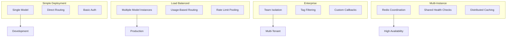

# Proxy Configuration

<cite>
**Referenced Files in This Document**   
- [proxy_config.yaml](file://litellm/proxy/proxy_config.yaml)
- [proxy_server_config.yaml](file://proxy_server_config.yaml)
- [proxy_server.py](file://litellm/proxy/proxy_server.py)
- [health_check.py](file://litellm/proxy/health_check.py)
- [ui_crud_endpoints/proxy_setting_endpoints.py](file://litellm/proxy/ui_crud_endpoints/proxy_setting_endpoints.py)
- [example_config_yaml/simple_config.yaml](file://litellm/proxy/example_config_yaml/simple_config.yaml)
- [example_config_yaml/enterprise_config.yaml](file://litellm/proxy/example_config_yaml/enterprise_config.yaml)
- [example_config_yaml/load_balancer.yaml](file://litellm/proxy/example_config_yaml/load_balancer.yaml)
- [example_config_yaml/multi_instance_simple_config.yaml](file://litellm/proxy/example_config_yaml/multi_instance_simple_config.yaml)
</cite>

## Table of Contents
1. [Introduction](#introduction)
2. [Configuration Structure](#configuration-structure)
3. [Model Configuration](#model-configuration)
4. [Server Settings](#server-settings)
5. [Configuration Methods](#configuration-methods)
6. [Deployment Scenarios](#deployment-scenarios)
7. [Critical Configuration Options](#critical-configuration-options)
8. [Environment Management](#environment-management)
9. [Security Considerations](#security-considerations)
10. [Dynamic Configuration Management](#dynamic-configuration-management)

## Introduction
The LiteLLM proxy server provides a flexible configuration system that enables users to manage AI model routing, authentication, caching, and various operational parameters. This document details the comprehensive configuration options available for the LiteLLM proxy, covering both static configuration files and dynamic runtime management through APIs. The configuration system supports multiple deployment scenarios from simple single-model setups to complex multi-tenant enterprise environments.

## Configuration Structure
The LiteLLM proxy configuration follows a YAML-based structure with several key sections that define the server's behavior. The primary configuration file, typically named `proxy_config.yaml`, contains multiple top-level sections that control different aspects of the proxy's functionality.

The main configuration sections include:
- **model_list**: Defines the available models and their routing parameters
- **litellm_settings**: Global settings for the LiteLLM framework
- **router_settings**: Configuration for the routing strategy and load balancing
- **general_settings**: General proxy server settings including authentication
- **environment_variables**: Environment-specific variable definitions

The configuration system supports hierarchical organization, allowing for complex setups with multiple models, routing strategies, and security policies. Each section contains specific parameters that control various aspects of the proxy's operation, from timeout settings to callback integrations.

**Section sources**
- [proxy_server_config.yaml](file://proxy_server_config.yaml#L1-L232)
- [proxy_config.yaml](file://litellm/proxy/proxy_config.yaml#L1-L10)

## Model Configuration
The model_list section is the core of the LiteLLM proxy configuration, defining which models are available through the proxy and how requests to these models should be handled. Each model entry contains a model_name that clients will use to access the model, and a litellm_params section that specifies the actual backend model and connection parameters.

Model configuration supports several advanced features:
- Wildcard routing using asterisk notation (e.g., "anthropic/*" routes to "anthropic/*")
- Provider-specific routing for services like Bedrock, Groq, and Mistral
- Model aliasing through the model_group_alias parameter in router_settings
- Multiple deployment instances of the same model for load balancing

Each model can have specific parameters such as API keys, rate limits (rpm), timeout values, and cost metrics. The configuration also supports health check settings for individual models, allowing the proxy to monitor endpoint availability and automatically route around failed instances.

```mermaid
flowchart TD
A["Client Request"] --> B{Model Name}
B --> |"gpt-3.5-turbo*|" C["OpenAI gpt-4.1-mini"]
B --> |"gemini-1.5-flash*|" D["Gemini API"]
B --> |"bedrock/**|" E["AWS Bedrock"]
B --> |"*|" F["Default OpenAI"]
C --> G["API Key: OPENAI_API_KEY"]
D --> H["API Key: GOOGLE_API_KEY"]
E --> I["AWS Credentials"]
F --> G
```

**Diagram sources**
- [proxy_server_config.yaml](file://proxy_server_config.yaml#L1-L150)
- [simple_config.yaml](file://litellm/proxy/example_config_yaml/simple_config.yaml#L1-L4)

**Section sources**
- [proxy_server_config.yaml](file://proxy_server_config.yaml#L1-L150)
- [simple_config.yaml](file://litellm/proxy/example_config_yaml/simple_config.yaml#L1-L4)

## Server Settings
The server settings in LiteLLM proxy are distributed across multiple configuration sections, each controlling different aspects of the server's behavior. The litellm_settings section contains global parameters that affect all model requests, including callback integrations, retry policies, and request timeouts.

Key server settings include:
- **success_callback** and **failure_callback**: Specify which monitoring and logging systems to use (e.g., Langfuse, Prometheus)
- **num_retries**: Global retry policy for failed requests
- **request_timeout**: Maximum time to wait for a response from backend models
- **drop_params**: Whether to drop unsupported parameters from client requests

The router_settings section controls the load balancing and routing behavior, including the selection of routing strategies such as usage-based routing, least busy, or lowest cost. It also configures the Redis connection for distributed rate limiting and model state sharing across multiple proxy instances.

General settings include security parameters like the master_key for proxy authentication and database connection settings for persistent storage of keys and usage data.

**Section sources**
- [proxy_server_config.yaml](file://proxy_server_config.yaml#L152-L218)
- [enterprise_config.yaml](file://litellm/proxy/example_config_yaml/enterprise_config.yaml#L11-L18)

## Configuration Methods
LiteLLM proxy supports multiple configuration methods to accommodate different deployment and management workflows. The primary method is through YAML configuration files, which provide a comprehensive and version-controllable way to define the proxy's behavior.

The configuration system supports environment variable integration through the "os.environ/" prefix, allowing sensitive data like API keys to be stored securely outside the configuration file. This enables secure deployment across different environments without exposing credentials in version control.

For dynamic configuration management, the proxy provides API endpoints that allow runtime updates to the configuration. These endpoints enable programmatic modification of model routes, rate limits, and other parameters without requiring server restarts. The UI CRUD endpoints also provide a web interface for configuration management, making it accessible to non-technical users.

The configuration loading process in the proxy_server.py file handles the parsing and validation of configuration files, ensuring that all settings are properly formatted before being applied to the running server.

**Section sources**
- [proxy_server_config.yaml](file://proxy_server_config.yaml#L11-L232)
- [proxy_server.py](file://litellm/proxy/proxy_server.py#L2064-L2101)
- [proxy_setting_endpoints.py](file://litellm/proxy/ui_crud_endpoints/proxy_setting_endpoints.py#L511-L535)

## Deployment Scenarios
The LiteLLM proxy configuration supports a wide range of deployment scenarios, from simple single-model setups to complex multi-tenant enterprise deployments. The example configuration files demonstrate various use cases and their corresponding configuration patterns.

For simple deployments, the basic configuration focuses on a single model with minimal settings, as shown in the simple_config.yaml example. This setup is ideal for development and testing environments where complexity needs to be minimized.

Load balancing scenarios use multiple instances of the same model_name with different API keys and rate limits, enabling the proxy to distribute traffic across multiple provider accounts. This approach increases overall throughput and provides redundancy in case of provider issues.

Enterprise deployments leverage features like team-based settings, tag filtering, and custom callbacks to create isolated environments for different teams or projects. The enterprise_config.yaml example demonstrates how to configure team-specific callbacks and authentication settings.

Multi-instance deployments use Redis-based caching and shared health checks to coordinate behavior across multiple proxy instances, ensuring consistent routing and rate limiting in distributed environments.



**Diagram sources**
- [simple_config.yaml](file://litellm/proxy/example_config_yaml/simple_config.yaml#L1-L4)
- [load_balancer.yaml](file://litellm/proxy/example_config_yaml/load_balancer.yaml#L1-L28)
- [enterprise_config.yaml](file://litellm/proxy/example_config_yaml/enterprise_config.yaml#L1-L18)
- [multi_instance_simple_config.yaml](file://litellm/proxy/example_config_yaml/multi_instance_simple_config.yaml#L1-L13)

**Section sources**
- [simple_config.yaml](file://litellm/proxy/example_config_yaml/simple_config.yaml#L1-L4)
- [load_balancer.yaml](file://litellm/proxy/example_config_yaml/load_balancer.yaml#L1-L28)
- [enterprise_config.yaml](file://litellm/proxy/example_config_yaml/enterprise_config.yaml#L1-L18)
- [multi_instance_simple_config.yaml](file://litellm/proxy/example_config_yaml/multi_instance_simple_config.yaml#L1-L13)

## Critical Configuration Options
Several critical configuration options in the LiteLLM proxy significantly impact performance, reliability, and security. These settings require careful consideration when deploying the proxy in production environments.

Timeout settings are crucial for maintaining system stability. The configuration includes multiple timeout parameters:
- **request_timeout**: Global timeout for all requests
- **stream_timeout**: Timeout for streaming responses
- **health_check_timeout**: Timeout for health check operations

Retry policies are configured through the num_retries parameter and can be supplemented with custom retry logic in the application layer. The proxy automatically handles transient failures by retrying requests according to the configured policy.

Health check configurations ensure service reliability by monitoring backend model availability. The health_check.py implementation performs periodic checks on configured models and updates the routing table to exclude unhealthy endpoints. Health checks can be customized per model with specific timeout values and check intervals.

Rate limiting parameters (rpm, tpm) control the request volume to backend services, preventing account suspension due to excessive usage. These limits can be set globally or on a per-model basis, allowing fine-grained control over resource utilization.

```mermaid
flowchart TD
A["Client Request"] --> B["Timeout Check"]
B --> |"Within request_timeout*|" C["Routing Decision"]
B --> |"Exceeded*|" D["Return Error"]
C --> E["Health Check"]
E --> |"Endpoint Healthy*|" F["Forward Request"]
E --> |"Endpoint Unhealthy*|" G["Select Alternative"]
F --> H["Apply Rate Limit"]
H --> |"Within Limits*|" I["Send to Backend"]
H --> |"Exceeded*|" J["Return 429"]
I --> K["Monitor for Timeout"]
K --> |"Success*|" L["Return Response"]
K --> |"Timeout*|" M["Retry Logic"]
M --> |"Within num_retries*|" N["Repeat Request"]
M --> |"Exceeded*|" O["Return Error"]
```

**Diagram sources**
- [proxy_server_config.yaml](file://proxy_server_config.yaml#L158-L159)
- [health_check.py](file://litellm/proxy/health_check.py#L66-L81)
- [load_balancer.yaml](file://litellm/proxy/example_config_yaml/load_balancer.yaml#L10-L11)

**Section sources**
- [proxy_server_config.yaml](file://proxy_server_config.yaml#L158-L159)
- [health_check.py](file://litellm/proxy/health_check.py#L66-L81)
- [load_balancer.yaml](file://litellm/proxy/example_config_yaml/load_balancer.yaml#L10-L11)

## Environment Management
Managing LiteLLM proxy configuration across different environments (development, staging, production) requires careful planning and adherence to best practices. The configuration system supports environment-specific settings through a combination of configuration files and environment variables.

For development environments, configurations should prioritize ease of use and debugging. This includes enabling verbose logging, using simple authentication schemes, and configuring liberal rate limits. The configuration should also include test models and endpoints that don't incur costs.

Staging environments should mirror production as closely as possible while still allowing for safe testing. Configuration here should include realistic rate limits, proper authentication, and monitoring callbacks. However, it may use separate provider accounts to isolate testing from production traffic.

Production configurations must prioritize security, reliability, and cost control. Sensitive data should be managed through environment variables or secret management systems rather than being embedded in configuration files. Rate limits should reflect actual provider constraints, and monitoring callbacks should be fully enabled to track usage and performance.

Configuration versioning and deployment automation are critical for maintaining consistency across environments. Using configuration management tools and CI/CD pipelines ensures that changes are properly tested and deployed in a controlled manner.

**Section sources**
- [proxy_server_config.yaml](file://proxy_server_config.yaml#L227-L232)
- [load_balancer.yaml](file://litellm/proxy/example_config_yaml/load_balancer.yaml#L25-L28)

## Security Considerations
Security is a critical aspect of LiteLLM proxy configuration, particularly when handling sensitive data and API credentials. The configuration system includes several features to enhance security and protect against common threats.

Authentication is controlled through the master_key parameter in general_settings, which requires clients to provide a valid key to access the proxy. Additional security layers can be implemented through custom authentication modules and SSO integration.

Sensitive configuration data, particularly API keys, should never be stored directly in configuration files. Instead, the "os.environ/" prefix should be used to reference environment variables, keeping credentials out of version control. For enhanced security, organizations can implement secret management systems that integrate with the proxy's configuration system.

The configuration should also include settings for request validation and input sanitization to prevent injection attacks and other security vulnerabilities. Rate limiting helps prevent abuse and denial-of-service attacks by limiting the number of requests from individual clients.

Network security considerations include configuring proper TLS settings, restricting access through firewalls, and monitoring for suspicious activity. The proxy should be deployed in a secure network environment with appropriate access controls.

**Section sources**
- [proxy_server_config.yaml](file://proxy_server_config.yaml#L208-L218)
- [proxy_setting_endpoints.py](file://litellm/proxy/ui_crud_endpoints/proxy_setting_endpoints.py#L511-L535)

## Dynamic Configuration Management
The LiteLLM proxy supports dynamic configuration management through API endpoints that allow runtime updates to the server's settings. This capability enables administrators to modify the configuration without restarting the server, reducing downtime and improving operational flexibility.

The configuration management system maintains the current configuration state in memory and provides methods to update and retrieve this state. The update_config_state method in the proxy server handles configuration updates, while get_config_state provides access to the current configuration.

Dynamic updates can modify various aspects of the configuration, including:
- Adding or removing models from the routing table
- Updating rate limits and timeout settings
- Modifying callback configurations
- Changing authentication settings

The system ensures configuration consistency by validating changes before applying them and maintaining a deep copy of the configuration state to prevent unintended modifications. This approach allows for safe, atomic updates to the server's behavior while maintaining stability for ongoing requests.

The UI CRUD endpoints provide a web-based interface for configuration management, making it accessible to users who prefer a graphical interface over direct API calls or file editing.

**Section sources**
- [proxy_server.py](file://litellm/proxy/proxy_server.py#L2074-L2092)
- [proxy_setting_endpoints.py](file://litellm/proxy/ui_crud_endpoints/proxy_setting_endpoints.py#L511-L535)