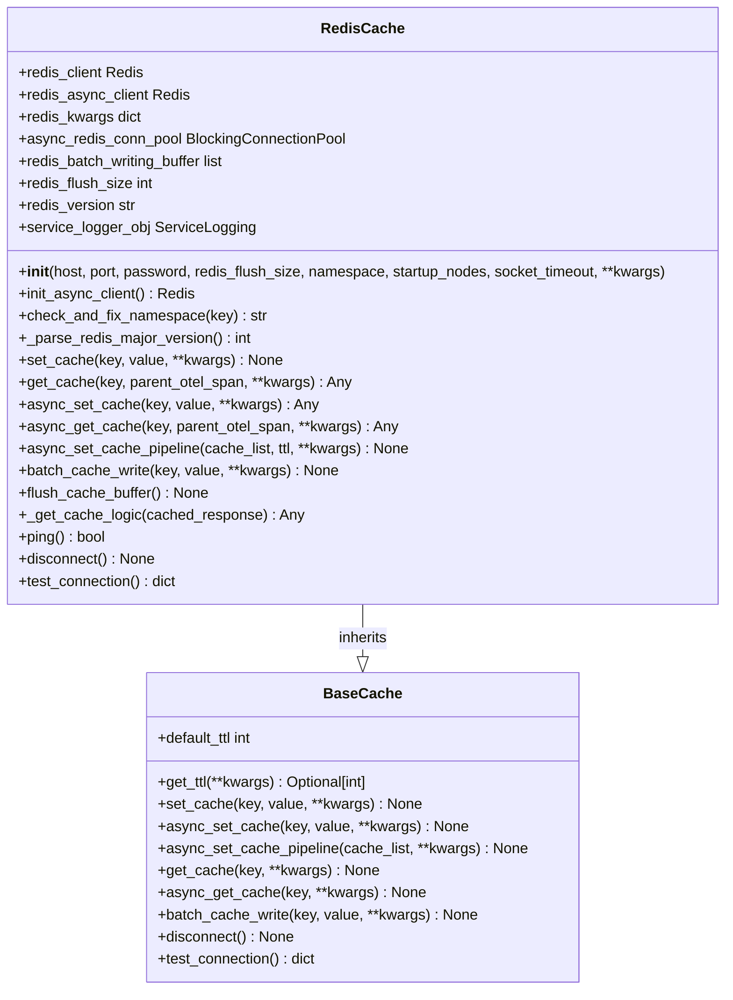
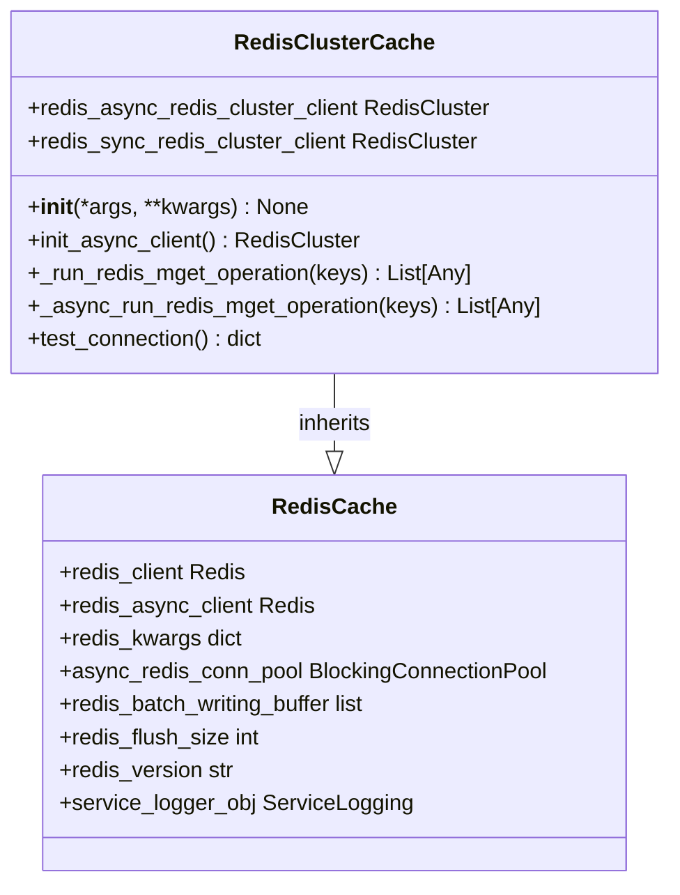
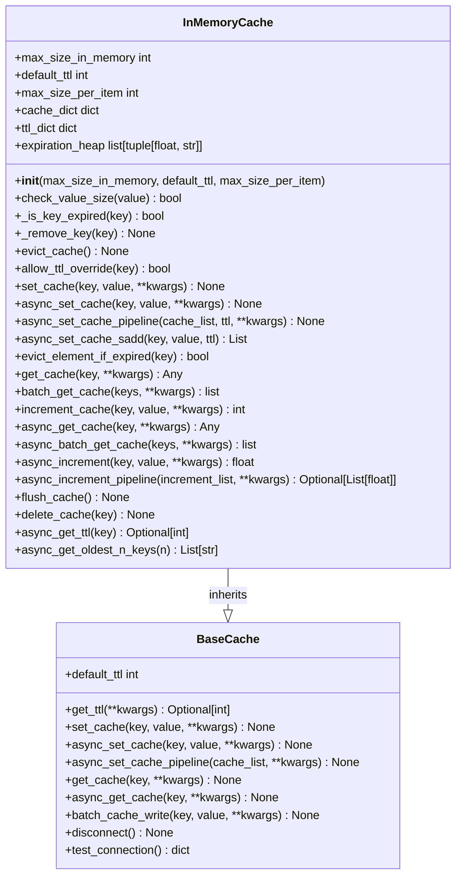

# Cache Backends

<cite>
**Referenced Files in This Document**   
- [base_cache.py](file://litellm/caching/base_cache.py)
- [caching.py](file://litellm/caching/caching.py)
- [dual_cache.py](file://litellm/caching/dual_cache.py)
- [redis_cache.py](file://litellm/caching/redis_cache.py)
- [redis_cluster_cache.py](file://litellm/caching/redis_cluster_cache.py)
- [s3_cache.py](file://litellm/caching/s3_cache.py)
- [gcs_cache.py](file://litellm/caching/gcs_cache.py)
- [disk_cache.py](file://litellm/caching/disk_cache.py)
- [in_memory_cache.py](file://litellm/caching/in_memory_cache.py)
- [azure_blob_cache.py](file://litellm/caching/azure_blob_cache.py)
- [_redis.py](file://litellm/_redis.py)
</cite>

## Table of Contents
1. [Introduction](#introduction)
2. [Base Cache Interface](#base-cache-interface)
3. [Redis Cache Implementation](#redis-cache-implementation)
4. [S3 and GCS Backends](#s3-and-gcs-backends)
5. [Disk and In-Memory Caching](#disk-and-in-memory-caching)
6. [Azure Blob Storage Integration](#azure-blob-storage-integration)
7. [Configuration Patterns](#configuration-patterns)
8. [Error Handling and Common Issues](#error-handling-and-common-issues)
9. [Conclusion](#conclusion)

## Introduction
LiteLLM provides a comprehensive caching system with multiple backend implementations for both distributed and local caching scenarios. The system is designed to support various storage types including Redis, S3, Google Cloud Storage (GCS), disk, in-memory, and Azure Blob storage. Each backend implements a common interface while providing specialized features for its storage type. The caching system supports both synchronous and asynchronous operations, connection pooling, and failover mechanisms. This document details the implementation of each cache backend, configuration patterns, and solutions to common issues encountered when using these distributed caching systems.

## Base Cache Interface
The caching system in LiteLLM is built around a unified interface defined in the `BaseCache` class, which serves as the foundation for all cache implementations. This interface ensures consistent behavior across different storage backends while allowing for specialized implementations. The base class defines essential methods including `set_cache`, `get_cache`, `async_set_cache`, and `async_get_cache`, which must be implemented by all concrete cache classes. Additionally, the interface includes methods for connection management (`disconnect`) and connection testing (`test_connection`). The `BaseCache` class also provides a `default_ttl` parameter that sets the default time-to-live for cached items, which can be overridden by specific implementations. This standardized interface enables seamless switching between different cache backends without requiring changes to the application code that uses the cache.

**Section sources**
- [base_cache.py](file://litellm/caching/base_cache.py#L22-L64)

## Redis Cache Implementation

### Connection Pooling and Client Management
The Redis cache implementation in LiteLLM features sophisticated connection pooling and client management to optimize performance and resource utilization. The system creates a connection pool during initialization using `get_redis_connection_pool`, which manages a pool of reusable connections to reduce the overhead of establishing new connections for each operation. The `RedisCache` class maintains both synchronous and asynchronous client instances, with the asynchronous client being cached in `in_memory_llm_clients_cache` to prevent redundant connection creation. When initializing the async client, the system first checks for an existing cached client before creating a new one, ensuring efficient resource usage in high-traffic scenarios. The connection pool is configured with a timeout specified by `REDIS_CONNECTION_POOL_TIMEOUT`, preventing operations from hanging indefinitely.

**Diagram sources **
- [redis_cache.py](file://litellm/caching/redis_cache.py#L87-L105)
- [base_cache.py](file://litellm/caching/base_cache.py#L22-L64)

**Section sources**
- [redis_cache.py](file://litellm/caching/redis_cache.py#L101-L132)
- [_redis.py](file://litellm/_redis.py#L460-L475)

### Serialization and Data Handling
The Redis cache implementation handles serialization of cached data using JSON format, with fallback to `ast.literal_eval` for cases where JSON parsing fails. When setting a cache value, the system converts the value to a JSON string using `json.dumps` before storing it in Redis. For retrieval operations, the system first attempts to parse the response as JSON using `json.loads`, and if that fails, falls back to `ast.literal_eval` to handle the data. The cache also includes a `_get_cache_logic` method that handles timestamp validation, checking if cached responses have expired based on their `max_age` parameter. This method extracts the timestamp from the cached response and compares it with the current time to determine if the response should be considered stale and not returned.

**Section sources**
- [redis_cache.py](file://litellm/caching/redis_cache.py#L729-L743)
- [caching.py](file://litellm/caching/caching.py#L445-L467)

### Cluster Support and High Availability
LiteLLM provides dedicated support for Redis Cluster through the `RedisClusterCache` class, which extends the base `RedisCache` implementation. This specialized class handles the unique requirements of Redis Cluster environments, including node management and non-atomic operations. The cluster implementation overrides the `_run_redis_mget_operation` and `_async_run_redis_mget_operation` methods to use `mget_nonatomic` instead of the standard `mget`, as Redis Cluster does not support atomic multi-key operations across different hash slots. The `RedisClusterCache` maintains separate client instances for synchronous and asynchronous operations, with the async client being initialized through the `init_async_client` method. The system also includes comprehensive connection testing functionality that creates a fresh Redis Cluster client with the provided configuration to verify connectivity before establishing the main connection.

**Diagram sources **
- [redis_cluster_cache.py](file://litellm/caching/redis_cluster_cache.py#L26-L31)
- [redis_cache.py](file://litellm/caching/redis_cache.py#L87-L105)

**Section sources**
- [redis_cluster_cache.py](file://litellm/caching/redis_cluster_cache.py#L26-L60)
- [redis_cache.py](file://litellm/caching/redis_cache.py#L777-L784)

## S3 and GCS Backends

### S3 Backend Implementation
The S3 cache backend in LiteLLM provides durable object storage caching with comprehensive configuration options for AWS integration. The `S3Cache` class initializes a boto3 S3 client with various configuration parameters including region name, endpoint URL, SSL settings, and authentication credentials. The implementation converts cache keys to S3 object keys by replacing colons with forward slashes and applying a configurable key prefix. When setting cache values, the system serializes the data to JSON and uploads it to S3 with appropriate metadata including cache control headers, content type, and expiration settings. For TTL-based expiration, the system sets both the `Expires` header and `CacheControl` header with the specified max-age. The implementation also supports asynchronous operations through `run_in_executor`, allowing non-blocking access to the S3 storage while maintaining compatibility with Python's async/await pattern.

**Section sources**
- [s3_cache.py](file://litellm/caching/s3_cache.py#L23-L37)

### GCS Backend Implementation
The Google Cloud Storage (GCS) cache backend implements HTTP-based interactions with GCS buckets using the Google Cloud Storage JSON API. The `GCSCache` class creates both synchronous and asynchronous HTTP clients for interacting with the GCS API endpoints. Authentication is handled through service account credentials, with the implementation using the `GCSBucketBase` class to construct appropriate request headers. The system uploads objects to GCS using the resumable upload endpoint with `uploadType=media`, and retrieves objects using the standard object retrieval endpoint with `alt=media`. The implementation includes comprehensive error handling for common GCS API errors, with specific handling for 404 responses indicating that a requested object does not exist. Like the S3 backend, the GCS implementation supports asynchronous operations natively through the async HTTP client, enabling efficient non-blocking access to cloud storage.

**Section sources**
- [gcs_cache.py](file://litellm/caching/gcs_cache.py#L18-L27)

### Signed URL and Bucket Configuration
Both the S3 and GCS backends handle authentication and authorization through their respective cloud provider mechanisms. The S3 backend uses standard AWS authentication credentials (access key ID, secret access key, and session token) passed directly to the boto3 client. The GCS backend uses service account credentials, either provided directly or loaded from a JSON file specified by the `path_service_account` parameter. For both backends, the bucket name is a required configuration parameter, with the GCS implementation also supporting an optional path prefix within the bucket. The implementations handle signed URLs implicitly through the respective client libraries, with boto3 automatically generating pre-signed URLs for S3 operations and the GCS HTTP client handling authentication headers for GCP API requests. This approach abstracts the complexity of URL signing from the application layer while maintaining secure access to cloud storage resources.

**Section sources**
- [s3_cache.py](file://litellm/caching/s3_cache.py#L25-L36)
- [gcs_cache.py](file://litellm/caching/gcs_cache.py#L19-L23)

## Disk and In-Memory Caching

### Disk Cache Implementation
The disk cache backend in LiteLLM uses the `diskcache` library to provide persistent local storage with configurable directory paths. The `DiskCache` class initializes a disk cache instance, using the default `.litellm_cache` directory if no custom path is provided. The implementation supports TTL-based expiration through the `expire` parameter when setting cache values. The cache stores serialized data as files in the specified directory, with the diskcache library handling file organization and cleanup policies automatically. The system includes methods for batch operations (`batch_get_cache` and `async_batch_get_cache`) that retrieve multiple values in sequence, and supports atomic operations like `increment_cache` for counters and rate limiting. The disk cache also provides a `flush_cache` method to clear all cached data, which calls the underlying diskcache `clear` method.

**Section sources**
- [disk_cache.py](file://litellm/caching/disk_cache.py#L14-L27)

### In-Memory Cache Implementation
The in-memory cache implementation provides ultra-low latency caching for high-performance scenarios. The `InMemoryCache` class maintains three primary data structures: `cache_dict` for storing cached values, `ttl_dict` for tracking expiration times, and `expiration_heap` for efficient eviction of expired items. The cache implements a bounded size policy with a default maximum of 200 items to prevent memory exhaustion. When the cache reaches capacity, it evicts items based on their expiration time, prioritizing the removal of expired items first, then the items with the earliest expiration times. The implementation includes sophisticated size validation through the `check_value_size` method, which prevents excessively large values from being cached by checking the size against `MAX_SIZE_PER_ITEM_IN_MEMORY_CACHE_IN_KB`. The cache also supports TTL override logic, allowing values to be updated even if their current TTL has not expired, which is essential for maintaining up-to-date rate limiting counters.

**Diagram sources **
- [in_memory_cache.py](file://litellm/caching/in_memory_cache.py#L27-L35)
- [base_cache.py](file://litellm/caching/base_cache.py#L22-L64)

**Section sources**
- [in_memory_cache.py](file://litellm/caching/in_memory_cache.py#L47-L50)

## Azure Blob Storage Integration
The Azure Blob Storage backend provides integration with Microsoft Azure's object storage service through the `AzureBlobCache` class. The implementation uses the Azure Storage Blob SDK to create both synchronous and asynchronous container clients, with authentication handled through Azure's DefaultAzureCredential and AsyncDefaultAzureCredential classes. This approach supports multiple authentication methods including managed identities, service principal credentials, and development environment authentication. The cache automatically creates the specified container if it doesn't exist, using a suppress context manager to handle the case where the container already exists. The implementation supports both synchronous and asynchronous operations, with the async methods using the asynchronous blob client to perform non-blocking operations. The system includes comprehensive error handling for common Azure Blob Storage errors, with specific handling for `ResourceNotFoundError` when attempting to retrieve non-existent blobs. The backend also provides a `flush_cache` method to delete all blobs in the container, which iterates through all objects and deletes them individually.

**Section sources**
- [azure_blob_cache.py](file://litellm/caching/azure_blob_cache.py#L20-L35)

## Configuration Patterns

### Connection Strings and Credentials Management
LiteLLM supports multiple methods for configuring cache backend connections and managing credentials. For Redis, the system supports both direct connection parameters (host, port, password) and URL-based configuration through the `REDIS_URL` environment variable. The implementation also supports Redis-specific environment variables like `REDIS_HOST`, `REDIS_PORT`, and `REDIS_PASSWORD`, which are automatically detected and used when present. For cloud storage backends, credentials can be provided directly in the configuration or loaded from environment variables. The S3 backend accepts AWS credentials directly, while the GCS backend supports service account JSON file paths. The system also supports the `os.environ/<key-name>` syntax for referencing environment variables, allowing sensitive credentials to be kept out of configuration files. For Redis with GCP IAM authentication, the system supports service account specification through the `gcp_service_account` parameter, which is used to generate temporary access tokens for authentication.

**Section sources**
- [caching.py](file://litellm/caching/caching.py#L57-L113)
- [_redis.py](file://litellm/_redis.py#L173-L196)

### Region-Specific Settings
The cache backends support region-specific configuration for cloud providers. The S3 backend includes a `s3_region_name` parameter that specifies the AWS region for the S3 bucket, which is passed to the boto3 client during initialization. The implementation also supports a custom `s3_endpoint_url` parameter, which allows the use of S3-compatible storage services in different regions or private deployments. For GCS, while the region is typically determined by the bucket configuration, the implementation allows for specifying a custom endpoint URL if needed. The Azure Blob Storage backend does not require explicit region configuration, as the account URL includes the region information (e.g., `https://<account>.blob.core.windows.net`). The system also supports region-specific settings through environment variables, with the Redis implementation detecting `REDIS_SSL` to determine whether to use secure connections, which may be required in certain regions or compliance environments.

**Section sources**
- [s3_cache.py](file://litellm/caching/s3_cache.py#L27-L31)
- [caching.py](file://litellm/caching/caching.py#L86-L93)

## Error Handling and Common Issues

### Network Latency for Cloud Storage
Cloud storage backends like S3, GCS, and Azure Blob Storage are susceptible to network latency issues that can impact application performance. To mitigate this, the implementations use connection pooling and keep-alive connections where possible. The S3 backend uses boto3's built-in connection pooling, while the GCS backend maintains persistent HTTP connections through the async HTTP client. For high-latency scenarios, the system provides the `DualCache` implementation, which combines a fast in-memory cache with a durable cloud storage backend. This pattern allows frequently accessed items to be served from low-latency memory while still benefiting from the durability of cloud storage. The implementations also include comprehensive timeout handling, with configurable socket timeouts and connection pool timeouts to prevent operations from hanging indefinitely. Additionally, the system logs detailed timing information for cache operations, which can be used to identify and diagnose latency issues.

**Section sources**
- [dual_cache.py](file://litellm/caching/dual_cache.py#L50-L55)
- [redis_cache.py](file://litellm/caching/redis_cache.py#L98-L99)

### Memory Pressure for In-Memory Caches
The in-memory cache implementation includes several mechanisms to prevent memory pressure and potential out-of-memory conditions. The primary defense is the `max_size_in_memory` parameter, which limits the total number of items in the cache to a configurable maximum (default 200 items). When this limit is reached, the cache automatically evicts items based on their expiration time. The implementation also includes per-item size validation through the `check_value_size` method, which prevents excessively large values from being cached by comparing their size against `MAX_SIZE_PER_ITEM_IN_MEMORY_CACHE_IN_KB` (1MB by default). The cache uses a heap-based expiration mechanism (`expiration_heap`) to efficiently track and remove expired items, reducing memory overhead. For applications with high memory constraints, the system provides the `max_size_per_item` parameter to further restrict the size of individual cached values. The implementation also includes a `flush_cache` method to completely clear the cache when memory pressure becomes critical.

**Section sources**
- [in_memory_cache.py](file://litellm/caching/in_memory_cache.py#L29-L35)
- [in_memory_cache.py](file://litellm/caching/in_memory_cache.py#L52-L87)

### Permission Configuration for Cloud Providers
Proper permission configuration is critical for the cloud storage backends to function correctly. For S3, the AWS credentials must have permissions for `s3:GetObject`, `s3:PutObject`, and `s3:DeleteObject` on the specified bucket. The implementation handles `NoSuchKey` errors gracefully, returning `None` when attempting to retrieve a non-existent object. For GCS, the service account must have the `Storage Object Admin` or `Storage Object Viewer` role, depending on whether write operations are needed. The Azure Blob Storage backend requires the `Storage Blob Data Contributor` role for full functionality. The implementations include comprehensive error handling for permission-related issues, with specific exception types caught and handled appropriately. For example, the GCS backend catches `ResourceNotFoundError` for 404 responses, while the Azure backend catches the same exception type. The system also supports various authentication methods, including service account keys, managed identities, and environment-based authentication, allowing flexibility in permission configuration based on the deployment environment.

**Section sources**
- [s3_cache.py](file://litellm/caching/s3_cache.py#L152-L157)
- [gcs_cache.py](file://litellm/caching/gcs_cache.py#L59-L60)
- [azure_blob_cache.py](file://litellm/caching/azure_blob_cache.py#L59-L60)

## Conclusion
LiteLLM's caching system provides a robust and flexible framework for implementing distributed and local caching across various storage backends. The unified `BaseCache` interface ensures consistent behavior while allowing specialized implementations for Redis, S3, GCS, disk, in-memory, and Azure Blob storage. The system includes sophisticated features like connection pooling, cluster support, and dual caching for high availability. Configuration is flexible, supporting environment variables, direct parameters, and cloud provider-specific authentication methods. The implementations include comprehensive error handling and performance optimizations to address common issues like network latency and memory pressure. By leveraging these caching backends, applications can significantly improve performance and reduce costs through effective response caching and rate limiting.