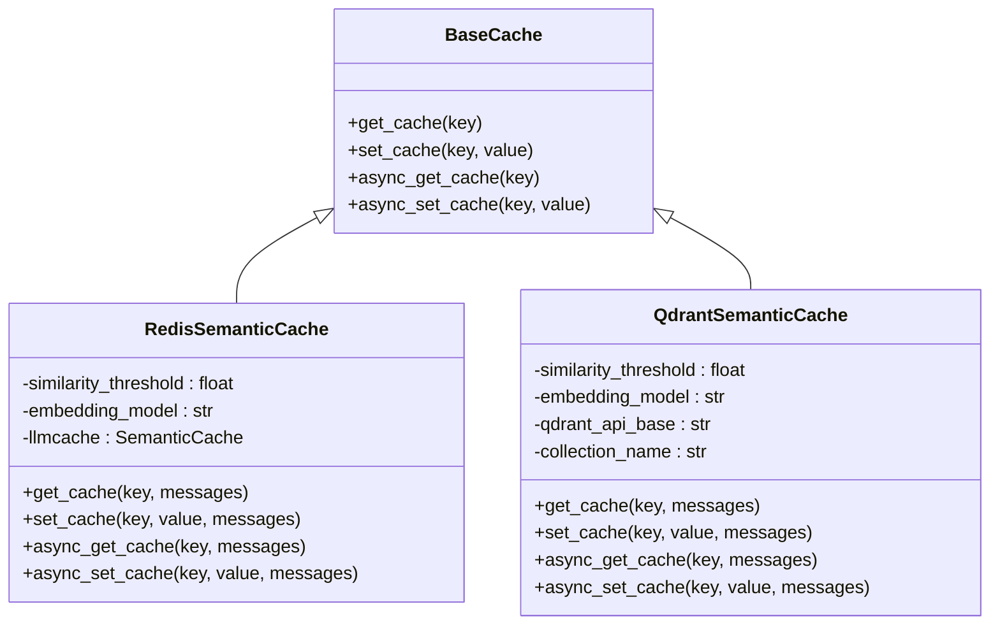
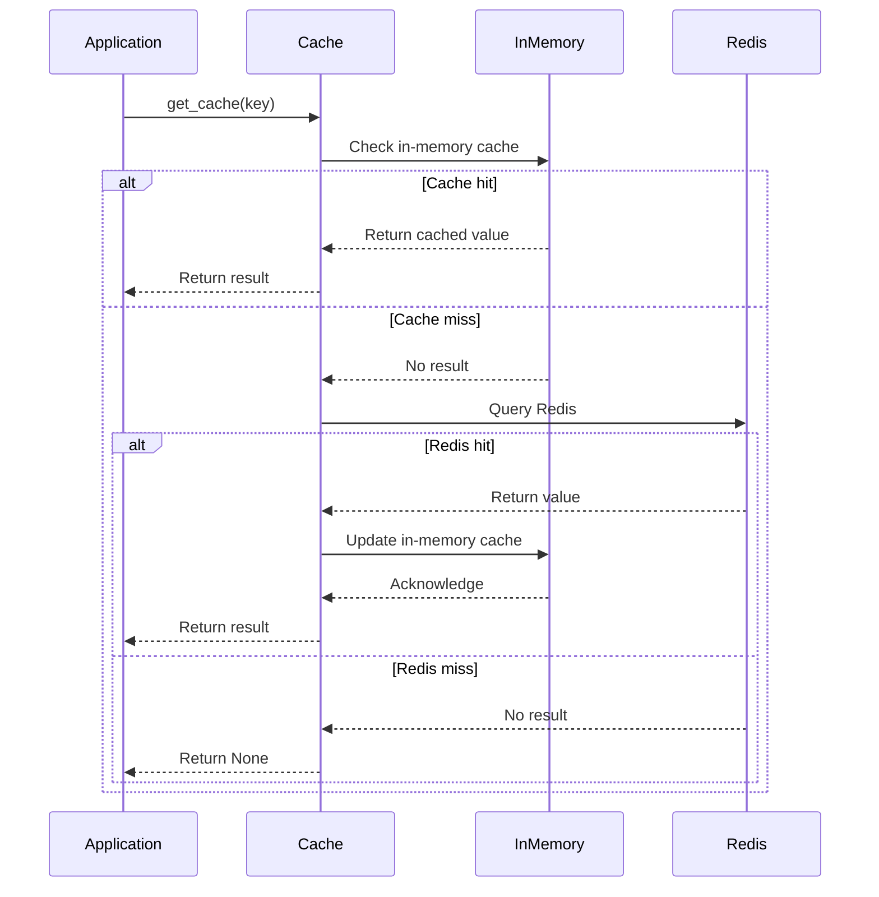

# Cache Types

<cite>
**Referenced Files in This Document**   
- [dual_cache.py](file://litellm/caching/dual_cache.py)
- [redis_semantic_cache.py](file://litellm/caching/redis_semantic_cache.py)
- [qdrant_semantic_cache.py](file://litellm/caching/qdrant_semantic_cache.py)
- [caching.py](file://litellm/caching/caching.py)
- [in_memory_cache.py](file://litellm/caching/in_memory_cache.py)
- [redis_cache.py](file://litellm/caching/redis_cache.py)
- [base_cache.py](file://litellm/caching/base_cache.py)
</cite>

## Table of Contents
1. [Dual Cache](#dual-cache)
2. [Semantic Caching](#semantic-caching)
3. [Regular Response Caching](#regular-response-caching)
4. [Performance Characteristics](#performance-characteristics)
5. [Common Issues and Solutions](#common-issues-and-solutions)

## Dual Cache

The DualCache implementation in LiteLLM combines fast in-memory caching with durable distributed caching to optimize for both performance and persistence. This dual-layer approach ensures low-latency access while maintaining data durability across application restarts.

The DualCache class inherits from BaseCache and coordinates between an in-memory cache (InMemoryCache) and a distributed cache (typically RedisCache). When data is written, it's simultaneously stored in both caches. During reads, the system first checks the in-memory cache for a hit, and only if that fails, it queries the distributed cache, then updates the in-memory cache with the retrieved value.

Key configuration parameters include:
- `default_in_memory_ttl`: Default time-to-live for in-memory cache entries
- `default_redis_ttl`: Default time-to-live for Redis cache entries
- `default_redis_batch_cache_expiry`: Expiration time for batch cache operations

The implementation uses a LimitedSizeOrderedDict to track the last access time of Redis batch operations, preventing excessive Redis queries for frequently accessed keys. This optimization reduces latency by serving repeated requests from the in-memory cache after the initial Redis lookup.

**Section sources**
- [dual_cache.py](file://litellm/caching/dual_cache.py#L50-L471)
- [caching.py](file://litellm/caching/caching.py#L30)

## Semantic Caching

LiteLLM provides semantic caching capabilities through specialized implementations that use vector similarity to find semantically similar prompts rather than requiring exact matches. This allows for cache hits even when prompts are not identical but carry similar meaning.

### Redis Semantic Cache

The RedisSemanticCache leverages RedisVL's SemanticCache to store and retrieve responses based on vector similarity. It uses a configurable embedding model (default: text-embedding-ada-002) to generate embeddings for prompts. The similarity threshold parameter (0.0 to 1.0) determines how closely prompts must match to be considered similar, with 1.0 requiring exact matches and 0.0 accepting any match.

Key features:
- Configurable similarity threshold that converts to distance threshold for cosine distance calculations
- Automatic Redis index management with configurable index names
- Support for TTL-based expiration of cached entries
- Integration with RedisVL's vector search capabilities for approximate nearest neighbor search

The implementation handles embedding generation through both synchronous and asynchronous methods, with special handling for routing through the LiteLLM router when appropriate. Cached responses are processed to handle various data formats, including JSON and Python literals.

### Qdrant Semantic Cache

The QdrantSemanticCache provides similar functionality using Qdrant as the vector database backend. It requires configuration of the Qdrant API base URL, API key, and collection name. Like the Redis implementation, it uses a similarity threshold to determine cache hits.

Key configuration parameters:
- `qdrant_api_base`: URL for the Qdrant cluster
- `qdrant_api_key`: Authentication key for Qdrant
- `collection_name`: Name of the Qdrant collection
- `similarity_threshold`: Threshold for semantic similarity
- `quantization_config`: Configuration for vector quantization (binary, scalar, or product)

The Qdrant implementation supports different quantization strategies to optimize storage and search performance, with scalar quantization using a configurable quantile value.

**Diagram sources **
- [redis_semantic_cache.py](file://litellm/caching/redis_semantic_cache.py#L28-L451)
- [qdrant_semantic_cache.py](file://litellm/caching/qdrant_semantic_cache.py#L24-L443)
- [base_cache.py](file://litellm/caching/base_cache.py#L22-L64)

**Section sources**
- [redis_semantic_cache.py](file://litellm/caching/redis_semantic_cache.py#L28-L451)
- [qdrant_semantic_cache.py](file://litellm/caching/qdrant_semantic_cache.py#L24-L443)

## Regular Response Caching

Regular response caching in LiteLLM provides exact request matching with TTL-based invalidation through the caching.py module. This implementation creates cache keys by hashing the combination of all relevant parameters from the LLM API call.

The cache key generation process:
1. Extracts relevant parameters from the API call
2. Combines them into a string representation
3. Applies SHA-256 hashing to create a fixed-length cache key
4. Optionally adds a namespace prefix for Redis cache organization

Key features include:
- Support for various cache types (local, Redis, S3, disk, etc.)
- Configurable TTL with support for dynamic cache control headers
- Namespace support for organizing cache entries
- Batch operations for improved performance with high-volume requests

The Cache class serves as the main interface, with configuration options for different backend types. For Redis caching, it supports both standalone Redis and Redis Cluster configurations, with options for connection pooling and health monitoring.

**Diagram sources **
- [caching.py](file://litellm/caching/caching.py#L55-L800)
- [dual_cache.py](file://litellm/caching/dual_cache.py#L50-L471)
- [in_memory_cache.py](file://litellm/caching/in_memory_cache.py#L27-L289)

**Section sources**
- [caching.py](file://litellm/caching/caching.py#L55-L800)

## Performance Characteristics

The dual caching strategy in LiteLLM provides significant performance benefits by combining the speed of in-memory caching with the durability of distributed caching. This architecture reduces latency for repeated requests while maintaining data persistence across application restarts.

Key performance characteristics:
- **Latency reduction**: In-memory cache hits serve requests in microseconds, while Redis cache hits typically respond in milliseconds
- **Throughput optimization**: Batch operations and connection pooling maximize throughput for high-volume applications
- **Memory efficiency**: The in-memory cache uses an LRU (Least Recently Used) eviction policy with configurable maximum size to prevent memory bloat
- **Network optimization**: The dual cache implementation minimizes Redis queries by tracking recent access patterns and serving repeated requests from memory

The system is designed to handle high-traffic scenarios efficiently, with configurable flush sizes for batch Redis operations and connection pooling for optimal resource utilization. Health monitoring is integrated to detect and handle connection issues proactively.

**Section sources**
- [dual_cache.py](file://litellm/caching/dual_cache.py#L50-L471)
- [redis_cache.py](file://litellm/caching/redis_cache.py#L87-L1300)

## Common Issues and Solutions

### Cold Start Performance

When an application starts, the in-memory cache is empty, leading to increased latency as requests populate the cache. The dual cache implementation mitigates this by:
- Pre-warming the cache with frequently accessed data when possible
- Using the Redis cache as a persistent backing store to reduce the impact of application restarts
- Implementing efficient batch loading for bulk data

### Semantic Drift in Vector Caches

Over time, the meaning of prompts may evolve, leading to inaccurate cache hits. Solutions include:
- Regularly reviewing and adjusting the similarity threshold based on application requirements
- Monitoring cache hit quality and adjusting the embedding model if needed
- Implementing cache invalidation strategies for specific prompt patterns

### Memory Bloat

The in-memory cache has built-in protections against memory issues:
- Configurable maximum size (default: 200 items)
- Automatic eviction of expired or least recently used items
- Size validation for individual cache entries (default: 1MB maximum)
- Heap-based expiration tracking for efficient TTL management

These mechanisms ensure that the cache remains performant and doesn't consume excessive memory resources.

**Section sources**
- [in_memory_cache.py](file://litellm/caching/in_memory_cache.py#L27-L289)
- [dual_cache.py](file://litellm/caching/dual_cache.py#L50-L471)
- [redis_semantic_cache.py](file://litellm/caching/redis_semantic_cache.py#L28-L451)