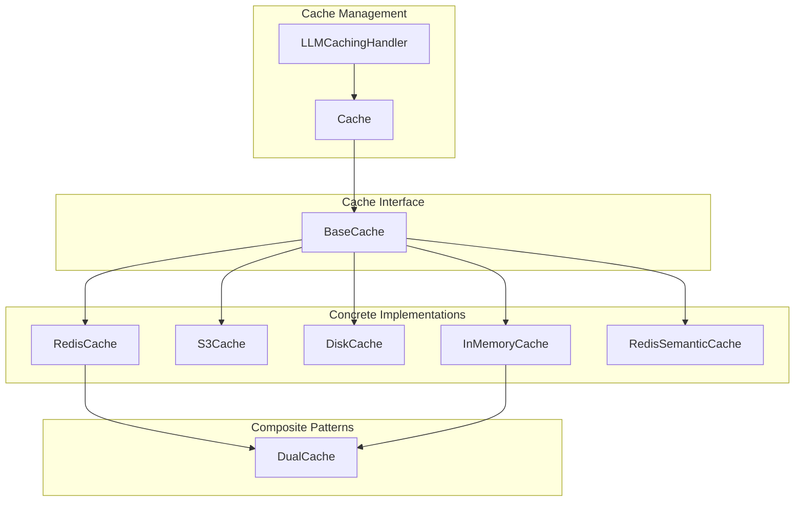
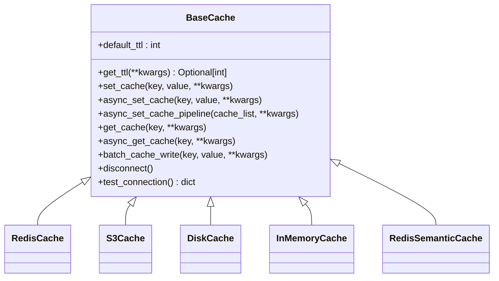
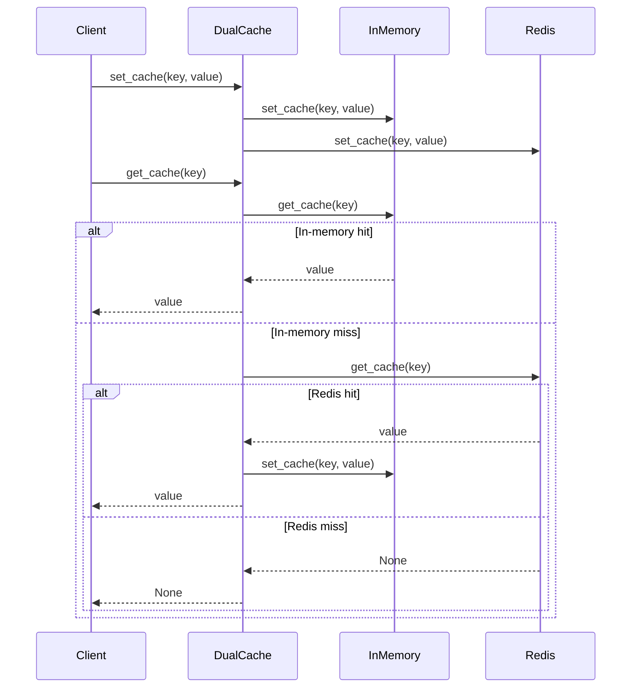
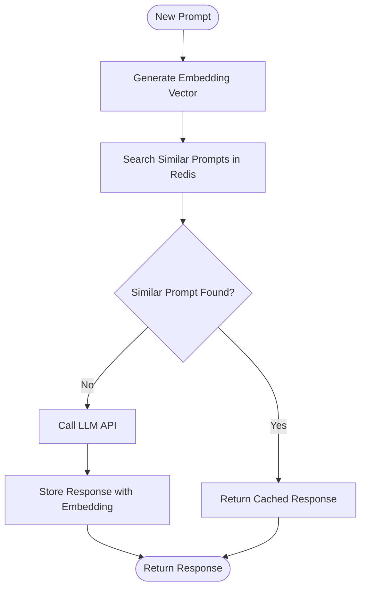

# Caching

<cite>
**Referenced Files in This Document**   
- [base_cache.py](file://litellm/caching/base_cache.py)
- [redis_cache.py](file://litellm/caching/redis_cache.py)
- [s3_cache.py](file://litellm/caching/s3_cache.py)
- [disk_cache.py](file://litellm/caching/disk_cache.py)
- [in_memory_cache.py](file://litellm/caching/in_memory_cache.py)
- [dual_cache.py](file://litellm/caching/dual_cache.py)
- [redis_semantic_cache.py](file://litellm/caching/redis_semantic_cache.py)
- [caching.py](file://litellm/caching/caching.py)
- [caching_handler.py](file://litellm/caching/caching_handler.py)
</cite>

## Table of Contents
1. [Introduction](#introduction)
2. [Core Caching Architecture](#core-caching-architecture)
3. [Base Cache Interface](#base-cache-interface)
4. [Concrete Cache Implementations](#concrete-cache-implementations)
5. [Dual Cache Pattern](#dual-cache-pattern)
6. [Semantic Caching](#semantic-caching)
7. [Cache Configuration and TTL Policies](#cache-configuration-and-ttl-policies)
8. [Integration with Other Components](#integration-with-other-components)
9. [Common Issues and Solutions](#common-issues-and-solutions)
10. [Performance Optimization](#performance-optimization)
11. [Best Practices](#best-practices)

## Introduction
LiteLLM provides a comprehensive multi-layered caching system designed to optimize LLM API performance, reduce costs, and improve response times. The caching architecture is built around a flexible interface that supports multiple backend implementations, including Redis, S3, disk, and in-memory storage. This document details the implementation of the caching system, focusing on the base_cache.py interface and its concrete implementations. It explains the dual_cache.py pattern that combines fast local cache with durable distributed cache, describes semantic caching using vector similarity in redis_semantic_cache.py, and covers prompt caching for LLM context reuse. The document also addresses the relationship between caching and other components, common issues like cache invalidation, and provides performance optimization tips for high-throughput scenarios.

## Core Caching Architecture

**Diagram sources**
- [base_cache.py](file://litellm/caching/base_cache.py#L22-L64)
- [redis_cache.py](file://litellm/caching/redis_cache.py#L87-L130)
- [s3_cache.py](file://litellm/caching/s3_cache.py#L23-L38)
- [disk_cache.py](file://litellm/caching/disk_cache.py#L14-L28)
- [in_memory_cache.py](file://litellm/caching/in_memory_cache.py#L27-L35)
- [redis_semantic_cache.py](file://litellm/caching/redis_semantic_cache.py#L28-L49)
- [dual_cache.py](file://litellm/caching/dual_cache.py#L50-L65)
- [caching.py](file://litellm/caching/caching.py#L56-L113)
- [caching_handler.py](file://litellm/caching/caching_handler.py#L88-L94)

**Section sources**
- [base_cache.py](file://litellm/caching/base_cache.py#L1-L64)
- [caching.py](file://litellm/caching/caching.py#L56-L113)
- [caching_handler.py](file://litellm/caching/caching_handler.py#L88-L94)

## Base Cache Interface

The foundation of LiteLLM's caching system is the `BaseCache` abstract class defined in base_cache.py. This interface establishes a consistent contract for all cache implementations, ensuring uniform behavior across different storage backends. The interface defines both synchronous and asynchronous methods for cache operations, allowing for flexible integration with various application patterns.

**Diagram sources**
- [base_cache.py](file://litellm/caching/base_cache.py#L22-L64)

**Section sources**
- [base_cache.py](file://litellm/caching/base_cache.py#L1-L64)

## Concrete Cache Implementations

### Redis Cache
The RedisCache implementation provides a robust distributed caching solution using Redis as the backend. It supports both standalone Redis instances and Redis clusters, with comprehensive error handling and performance monitoring. The implementation includes features like connection pooling, automatic reconnection, and detailed logging of cache operations.

**Section sources**
- [redis_cache.py](file://litellm/caching/redis_cache.py#L87-L130)

### S3 Cache
The S3Cache implementation enables durable, persistent caching using Amazon S3 or compatible object storage services. This implementation is particularly useful for long-term caching requirements and scenarios where data persistence is critical. It handles S3-specific features like expiration policies and cache control headers.

**Section sources**
- [s3_cache.py](file://litellm/caching/s3_cache.py#L23-L38)

### Disk Cache
The DiskCache implementation uses the diskcache library to provide persistent caching on local disk storage. This implementation offers a balance between performance and durability, making it suitable for scenarios where Redis is not available but persistent storage is required.

**Section sources**
- [disk_cache.py](file://litellm/caching/disk_cache.py#L14-L28)

### In-Memory Cache
The InMemoryCache implementation provides the fastest possible caching performance by storing data in the application's memory space. It includes sophisticated eviction policies to prevent memory leaks and ensure bounded memory usage. The cache uses a heap-based expiration mechanism to efficiently manage time-to-live for cached items.

**Section sources**
- [in_memory_cache.py](file://litellm/caching/in_memory_cache.py#L27-L35)

## Dual Cache Pattern

The DualCache pattern combines the speed of in-memory caching with the durability of distributed caching (typically Redis). This hybrid approach ensures high performance while maintaining data persistence. When data is written, it is stored in both caches simultaneously. When reading, the system first checks the in-memory cache for a potential hit, falling back to Redis if necessary, and then updating the in-memory cache with the retrieved value.

**Diagram sources**
- [dual_cache.py](file://litellm/caching/dual_cache.py#L50-L65)

**Section sources**
- [dual_cache.py](file://litellm/caching/dual_cache.py#L1-L471)

## Semantic Caching

Semantic caching in LiteLLM uses vector similarity to find semantically similar prompts rather than requiring exact matches. The RedisSemanticCache implementation leverages RedisVL's SemanticCache to store and retrieve responses based on the semantic similarity of prompts. This approach significantly increases cache hit rates for prompts that are semantically equivalent but textually different.

**Diagram sources**
- [redis_semantic_cache.py](file://litellm/caching/redis_semantic_cache.py#L28-L49)

**Section sources**
- [redis_semantic_cache.py](file://litellm/caching/redis_semantic_cache.py#L1-L451)

## Cache Configuration and TTL Policies

LiteLLM provides flexible configuration options for cache backends and TTL policies. The Cache class in caching.py serves as the primary interface for configuring and managing cache instances. Users can specify different cache types, connection parameters, and default TTL values. The system supports dynamic TTL overrides through the cache control parameters in API calls.

**Section sources**
- [caching.py](file://litellm/caching/caching.py#L56-L113)

## Integration with Other Components

The caching system integrates closely with other LiteLLM components, particularly the routing and cost tracking systems. Routing consistency directly impacts cache hit rates, as consistent routing ensures that requests are directed to the same endpoints, maximizing the effectiveness of caching. The cost tracking system accounts for cached responses by attributing appropriate costs, recognizing that cached responses consume fewer resources than fresh API calls.

**Section sources**
- [caching_handler.py](file://litellm/caching/caching_handler.py#L88-L94)

## Common Issues and Solutions

### Cache Invalidation
Cache invalidation challenges are addressed through proper key management and TTL policies. The system uses consistent key generation based on request parameters, ensuring that changes in input parameters result in different cache keys. For semantic caching, the similarity threshold parameter allows fine-tuning of cache hit sensitivity.

### Key Management
Proper key management is critical for effective caching. The system uses SHA-256 hashing of request parameters to generate cache keys, ensuring consistency and preventing collisions. Namespace support allows for logical separation of cache entries, facilitating better organization and management.

**Section sources**
- [caching.py](file://litellm/caching/caching.py#L264-L306)

## Performance Optimization

For high-throughput scenarios, several optimization strategies are available. The Redis implementation supports pipelining for batch operations, reducing network overhead. The dual cache pattern minimizes latency by serving frequent requests from fast in-memory storage. For large-scale deployments, Redis cluster support enables horizontal scaling of the caching layer.

**Section sources**
- [redis_cache.py](file://litellm/caching/redis_cache.py#L506-L542)

## Best Practices

1. Use the dual cache pattern for optimal performance and durability
2. Configure appropriate TTL values based on your use case requirements
3. Monitor cache hit rates to evaluate effectiveness
4. Use semantic caching for applications with high prompt variability
5. Implement proper error handling for cache failures
6. Regularly monitor cache memory usage and adjust eviction policies as needed

**Section sources**
- [caching.py](file://litellm/caching/caching.py#L56-L113)
- [dual_cache.py](file://litellm/caching/dual_cache.py#L50-L65)
- [redis_semantic_cache.py](file://litellm/caching/redis_semantic_cache.py#L28-L49)