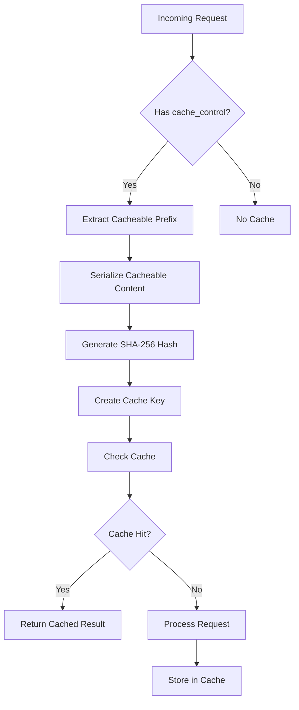
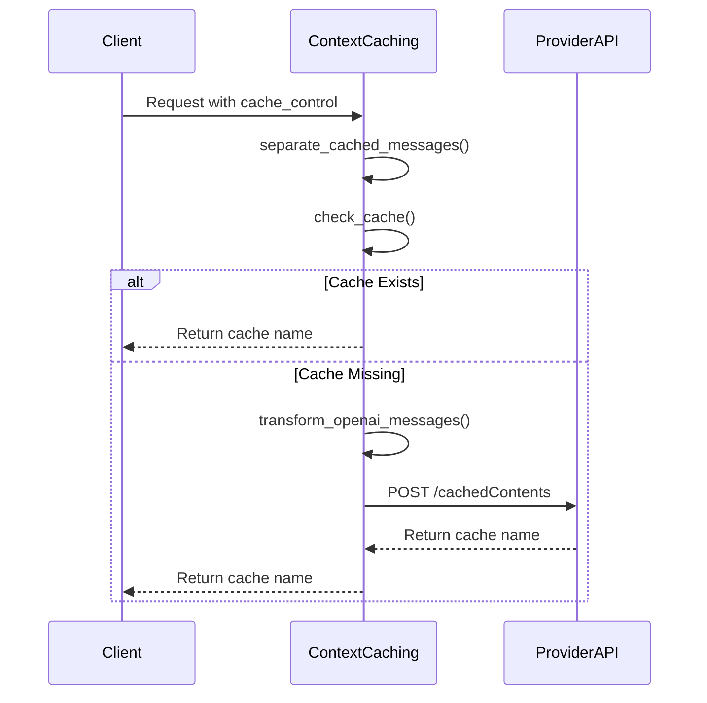
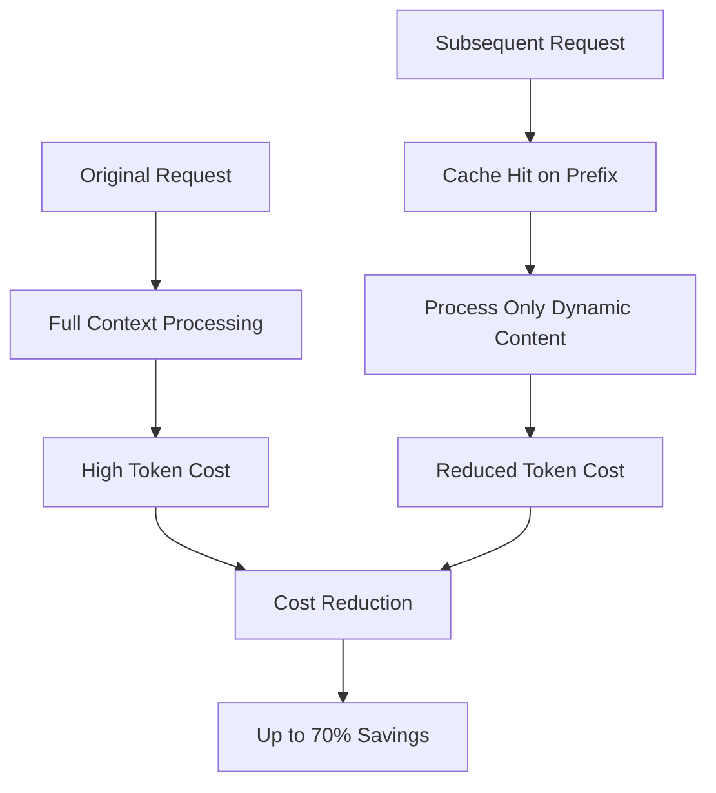

# Prompt Caching

<cite>
**Referenced Files in This Document**   
- [caching_handler.py](file://litellm/caching/caching_handler.py)
- [prompt_caching_cache.py](file://litellm/router_utils/prompt_caching_cache.py)
- [vertex_ai_context_caching.py](file://litellm/llms/vertex_ai/context_caching/vertex_ai_context_caching.py)
- [transformation.py](file://litellm/llms/vertex_ai/context_caching/transformation.py)
- [passthrough_endpoint_router.py](file://litellm/proxy/pass_through_endpoints/passthrough_endpoint_router.py)
</cite>

## Table of Contents
1. [Introduction](#introduction)
2. [Core Caching Implementation](#core-caching-implementation)
3. [Context-Aware Cache Key Management](#context-aware-cache-key-management)
4. [Provider-Specific Context Caching Integration](#provider-specific-context-caching-integration)
5. [Passthrough Endpoint Routing](#passthrough-endpoint-routing)
6. [Cache Configuration and Lifecycle Management](#cache-configuration-and-lifecycle-management)
7. [Cost Optimization and Token Efficiency](#cost-optimization-and-token-efficiency)
8. [Common Issues and Best Practices](#common-issues-and-best-practices)

## Introduction
Prompt caching in LiteLLM provides a sophisticated mechanism for optimizing LLM interactions by intelligently caching prompt context. This system enables significant cost reduction and performance improvements by avoiding redundant processing of repeated context across LLM calls. The implementation supports context-aware caching that identifies cacheable prefixes within message sequences, allowing dynamic prompts with shared context to leverage cached representations. The architecture integrates with provider-specific context caching APIs, particularly for Vertex AI and Gemini, while maintaining compatibility across different LLM providers through a unified interface.

## Core Caching Implementation

The LLMCachingHandler class serves as the central component for managing prompt cache operations in LiteLLM. This handler acts as a wrapper around the core caching functionality, providing specialized methods for handling LLM API requests including completions, embeddings, and text processing. The implementation supports both synchronous and asynchronous cache operations through the _async_get_cache and _sync_get_cache methods, which determine cache eligibility based on request parameters and caching configuration.

The caching system evaluates whether caching should be performed by checking the 'caching' parameter in the request kwargs and the global litellm.cache configuration. When caching is enabled and not explicitly disabled with 'no-cache', the handler proceeds to retrieve cached results. For embedding requests, the system handles partial cache hits where some elements in a batch may be cached while others require fresh processing. The handler also manages streaming responses, converting cached results into appropriate streaming wrapper objects when necessary.

**Section sources**
- [caching_handler.py](file://litellm/caching/caching_handler.py#L88-L800)

## Context-Aware Cache Key Management

LiteLLM implements a sophisticated cache key management system that identifies and extracts cacheable prefixes from message sequences. The PromptCachingCache class in the router_utils module handles this functionality, using the extract_cacheable_prefix method to determine which portions of a conversation can be cached. The cacheable prefix includes all content up to and including the last block with cache_control set to 'ephemeral', ensuring that stable context is preserved while allowing dynamic elements to vary.

The get_prompt_caching_cache_key method generates stable cache keys by serializing the cacheable prefix and creating a SHA-256 hash of the serialized data. This approach ensures consistent cache key generation across requests with identical context. The system uses a DualCache pattern when Redis is configured, combining RedisCache with InMemoryCache for optimal performance. The cache key generation process handles various data types including Pydantic models, dictionaries, and lists, ensuring consistent serialization through the serialize_object helper method.

**Diagram sources **
- [prompt_caching_cache.py](file://litellm/router_utils/prompt_caching_cache.py#L31-L237)

**Section sources**
- [prompt_caching_cache.py](file://litellm/router_utils/prompt_caching_cache.py#L31-L237)

## Provider-Specific Context Caching Integration

LiteLLM provides specialized integration with provider-specific context caching APIs through the ContextCachingEndpoints class in the vertex_ai context_caching module. This implementation supports both Vertex AI and Gemini providers, handling the differences in their API endpoints and authentication mechanisms. The _get_token_and_url_context_caching method determines the appropriate endpoint URL and authentication token based on the provider type, with different URLs for Google AI Studio (Gemini) versus Vertex AI deployments.

The check_and_create_cache method orchestrates the complete caching workflow, first separating cached and non-cached messages using the separate_cached_messages function. It then checks if a cache entry already exists by calling the check_cache method, which queries the provider's cache listing endpoint. If no existing cache is found, the system creates a new cache entry by transforming the OpenAI-formatted messages into the provider-specific format using the transform_openai_messages_to_gemini_context_caching function.

**Diagram sources **
- [vertex_ai_context_caching.py](file://litellm/llms/vertex_ai/context_caching/vertex_ai_context_caching.py#L31-L505)
- [transformation.py](file://litellm/llms/vertex_ai/context_caching/transformation.py#L1-L197)

**Section sources**
- [vertex_ai_context_caching.py](file://litellm/llms/vertex_ai/context_caching/vertex_ai_context_caching.py#L31-L505)

## Passthrough Endpoint Routing

The PassthroughEndpointRouter class manages credentials and routing for pass-through endpoints, enabling direct access to provider-specific APIs including context caching functionality. This router maintains a mapping of deployment keys to their corresponding Vertex AI credentials, allowing for fine-grained control over authentication for different projects and locations. The set_pass_through_credentials and get_credentials methods handle the storage and retrieval of API keys for various providers.

For Vertex AI specifically, the router supports both default configuration through environment variables (DEFAULT_VERTEXAI_PROJECT, DEFAULT_VERTEXAI_LOCATION, DEFAULT_GOOGLE_APPLICATION_CREDENTIALS) and per-deployment configuration. The add_vertex_credentials and get_vertex_credentials methods manage the deployment-specific credentials, using a deployment key format of "{project_id}-{location}" to uniquely identify each deployment. This architecture enables secure, multi-tenant access to Vertex AI context caching APIs while maintaining isolation between different projects and locations.

**Section sources**
- [passthrough_endpoint_router.py](file://litellm/proxy/pass_through_endpoints/passthrough_endpoint_router.py#L13-L213)

## Cache Configuration and Lifecycle Management

LiteLLM implements comprehensive cache lifecycle management with configurable TTL (Time To Live) settings. The transformation module includes TTL extraction and validation functionality through the extract_ttl_from_cached_messages and _is_valid_ttl_format functions. These utilities parse TTL values from cache_control parameters, validating that they follow the required format of a positive number followed by 's' (e.g., "3600s" for one hour).

The system extracts the first valid TTL found in the cached messages and applies it to the cache entry creation request. Invalid TTL formats are ignored, ensuring robustness against malformed input. The default TTL for prompt caching entries is 300 seconds (5 minutes), configured in the add_model_id and async_add_model_id methods of the PromptCachingCache class. This short TTL balances the benefits of caching with the need to refresh context periodically, preventing staleness while still providing significant cost savings for frequently repeated patterns.

**Section sources**
- [transformation.py](file://litellm/llms/vertex_ai/context_caching/transformation.py#L51-L115)

## Cost Optimization and Token Efficiency

Prompt caching in LiteLLM delivers substantial cost reduction by eliminating redundant processing of repeated context in expensive LLM operations. When a cache hit occurs, the system avoids the computational cost of processing the cached context, significantly reducing both latency and token consumption. For operations involving large context windows (such as processing lengthy documents or complex instructions), this can result in dramatic cost savings.

The context-aware caching approach maximizes efficiency by identifying the cacheable prefix - the portion of the conversation up to the last cache_control block. This allows applications to maintain dynamic conversations where only the variable portions are processed fresh, while the stable context is served from cache. The system's ability to handle partial cache hits for embedding requests further optimizes costs by caching individual embedding inputs rather than requiring all-or-nothing caching.

**Diagram sources **
- [caching_handler.py](file://litellm/caching/caching_handler.py#L111-L253)
- [prompt_caching_cache.py](file://litellm/router_utils/prompt_caching_cache.py#L124-L157)

## Common Issues and Best Practices

Several common issues arise with prompt caching implementation, along with corresponding best practices for mitigation. Context staleness can occur when cached content becomes outdated; this is addressed by the default 5-minute TTL and the ability to configure custom TTL values. Cache quota limits on provider APIs can be managed by monitoring cache usage and implementing cache invalidation strategies.

Compatibility across LLM providers requires careful attention to differences in context caching APIs. The LiteLLM abstraction layer handles these differences, but developers should validate behavior with their target providers. Best practices include marking only stable, frequently repeated content with cache_control, avoiding caching of sensitive or user-specific information, and monitoring cache hit rates to optimize cache key strategies.

For optimal performance, applications should structure conversations to maximize cache utilization by placing stable context at the beginning of message sequences and using consistent formatting for cacheable content. Regular monitoring of cache metrics helps identify opportunities for further optimization and ensures the caching strategy aligns with application requirements.

**Section sources**
- [caching_handler.py](file://litellm/caching/caching_handler.py#L1-L800)
- [prompt_caching_cache.py](file://litellm/router_utils/prompt_caching_cache.py#L1-L237)