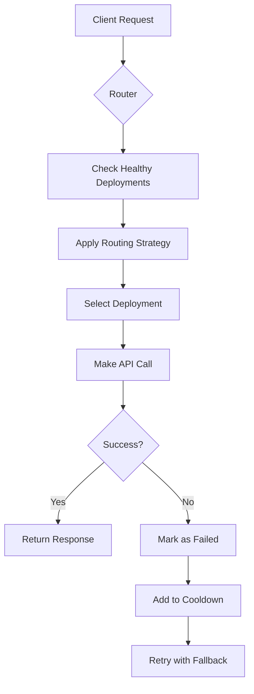
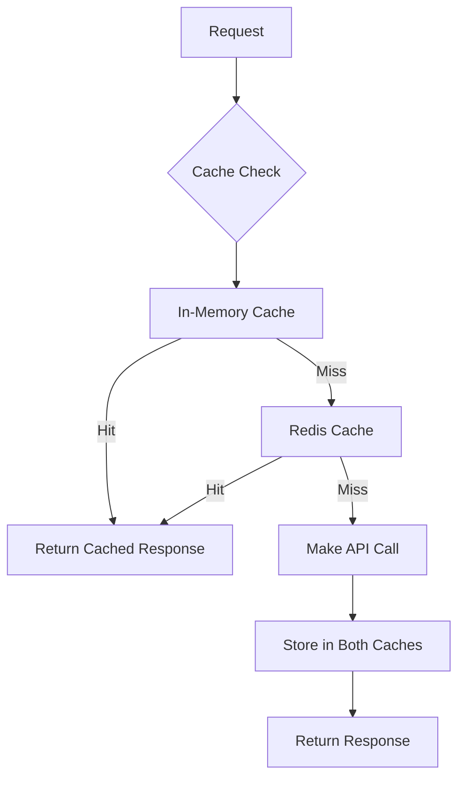

# Core Concepts

<cite>
**Referenced Files in This Document**   
- [router.py](file://litellm/router.py)
- [caching.py](file://litellm/caching/caching.py)
- [types/router.py](file://litellm/types/router.py)
- [types/caching.py](file://litellm/types/caching.py)
- [responses/main.py](file://litellm/responses/main.py)
</cite>

## Table of Contents
1. [Unified API Concept](#unified-api-concept)
2. [Routing Architecture](#routing-architecture)
3. [Caching System](#caching-system)
4. [Key Data Models](#key-data-models)
5. [Component Relationships](#component-relationships)
6. [Performance Considerations](#performance-considerations)

## Unified API Concept

LiteLLM's unified API concept provides a standardized interface for interacting with multiple Large Language Model (LLM) providers, abstracting away the differences between various LLM APIs. This abstraction allows developers to use a consistent interface regardless of the underlying provider, simplifying integration and reducing the complexity of managing multiple LLM services.

The core of this concept is the Router class, which acts as a middleware layer between the application and the various LLM providers. When a request is made through the unified API, the Router translates the standardized request format into the specific format required by the target provider, handles authentication, and manages the response translation back to the standard format.

This abstraction enables several key benefits:
- **Provider Agnosticism**: Applications can switch between providers without changing their codebase
- **Simplified Integration**: Developers only need to learn one API interface rather than multiple provider-specific APIs
- **Consistent Error Handling**: Standardized error responses across different providers
- **Feature Parity**: Common features like streaming, function calling, and embeddings are available through a consistent interface

The unified API supports various call types including completion, embedding, image generation, and moderation, ensuring comprehensive coverage of LLM capabilities while maintaining a consistent interface.

**Section sources**
- [router.py](file://litellm/router.py#L200-L288)
- [types/router.py](file://litellm/types/router.py#L301-L364)

## Routing Architecture

The routing architecture in LiteLLM is designed to efficiently distribute requests across multiple deployments while considering various factors such as availability, performance, and cost. The system uses a sophisticated routing strategy that can be configured based on specific requirements.

### Deployment Registration and Health Checking

Deployments are registered with the Router through a configuration that includes the model name, provider-specific parameters, and rate limits. The Router maintains a list of healthy deployments and performs health checks to ensure that only available endpoints receive traffic. When a deployment fails, it is temporarily placed in a cooldown period before being reconsidered for routing.

**Diagram sources **
- [router.py](file://litellm/router.py#L446-L454)
- [router.py](file://litellm/router.py#L464-L467)

### Strategy Selection

LiteLLM supports multiple routing strategies that can be selected based on the use case:

- **Simple Shuffle**: Randomly distributes requests across available deployments
- **Least Busy**: Routes requests to the deployment with the fewest concurrent requests
- **Usage-Based Routing**: Distributes requests based on tokens per minute (TPM) and requests per minute (RPM) usage
- **Latency-Based Routing**: Selects the deployment with the lowest response latency
- **Cost-Based Routing**: Chooses the most cost-effective deployment based on provider pricing

The routing strategy is configurable and can be set during Router initialization. Each strategy uses different metrics to determine the optimal deployment for each request, allowing for fine-tuned control over traffic distribution.

**Section sources**
- [router.py](file://litellm/router.py#L272-L282)
- [router.py](file://litellm/router.py#L708-L765)

## Caching System

LiteLLM implements a multi-layer caching system designed to improve performance and reduce costs by storing frequently accessed responses. The caching architecture supports multiple backend storage options and provides flexible configuration for different use cases.

### Multi-Layer Approach

The caching system follows a dual-cache pattern that combines in-memory caching with distributed caching:

- **In-Memory Cache**: Provides ultra-fast access to recently used responses using Python's built-in data structures
- **Distributed Cache**: Uses Redis for persistent storage across multiple instances, enabling cache sharing in distributed environments
- **Cloud Storage Backends**: Supports integration with cloud storage services like AWS S3, Google Cloud Storage, and Azure Blob Storage for long-term retention

**Diagram sources **
- [caching.py](file://litellm/caching/caching.py#L54-L239)
- [router.py](file://litellm/router.py#L414-L416)

### Backend Implementations

The caching system supports multiple backend implementations:

- **In-Memory Cache**: Implemented using Python dictionaries with LRU (Least Recently Used) eviction policy
- **Redis Cache**: Uses Redis for distributed caching with configurable TTL (Time To Live)
- **S3 Cache**: Stores cached responses in AWS S3 buckets for durable storage
- **GCS Cache**: Google Cloud Storage integration for cached responses
- **Azure Blob Cache**: Microsoft Azure Blob Storage integration

Each backend can be configured independently, allowing for hybrid caching strategies that combine the speed of in-memory caching with the persistence of cloud storage.

**Section sources**
- [caching.py](file://litellm/caching/caching.py#L1-L113)
- [types/caching.py](file://litellm/types/caching.py#L8-L17)

## Key Data Models

LiteLLM defines several key data models that form the foundation of its architecture. These models provide structure to the system's components and enable consistent data handling across different parts of the application.

### ModelResponse

The ModelResponse model represents the standardized response format returned by the unified API. It contains the generated content along with metadata such as usage statistics, processing time, and provider information. This model ensures consistency across different LLM providers by normalizing their diverse response formats into a single, predictable structure.

The ModelResponse includes:
- **Content**: The generated text or other output from the LLM
- **Usage**: Token counts for prompt, completion, and total tokens
- **Model**: The specific model that generated the response
- **Provider**: The LLM provider that fulfilled the request
- **Timestamps**: Timing information for request processing

### RouterConfig

The RouterConfig model defines the configuration for the Router component, including the list of available deployments, caching settings, and routing strategies. This model serves as the blueprint for how requests are distributed across multiple LLM providers.

Key configuration elements include:
- **Model List**: The collection of available deployments with their provider-specific parameters
- **Caching Settings**: Configuration for response caching, including Redis URL and TTL
- **Routing Strategy**: The algorithm used to select deployments for incoming requests
- **Fallback Configuration**: Settings for handling failed requests and automatic retries

**Section sources**
- [types/router.py](file://litellm/types/router.py#L42-L70)
- [types/utils.py](file://litellm/types/utils.py#L9-L14)

## Component Relationships

The components in LiteLLM work together in a coordinated manner to provide a seamless interface for LLM interactions. Understanding the relationships between these components is crucial for effective implementation and optimization.

### Routing and Caching Interaction

The routing and caching systems are tightly integrated, with routing decisions potentially impacting caching effectiveness. When a request is routed to a deployment, the system first checks the cache for a matching response. If found, the cached response is returned immediately, bypassing the need for an API call to the LLM provider.

This relationship creates an important consideration: consistent routing patterns can improve cache hit rates by ensuring that similar requests are handled by the same deployment, increasing the likelihood of cache hits. Conversely, random routing strategies may reduce cache effectiveness by distributing similar requests across multiple deployments with different response patterns.

### Performance Implications

The interaction between components has significant performance implications:

- **Cache Hit Rate**: The effectiveness of the caching system depends on routing consistency and request patterns
- **Latency**: Caching reduces latency by eliminating the need for external API calls when responses are available in the cache
- **Cost**: Effective caching reduces API call volume, directly impacting operational costs
- **Scalability**: The distributed nature of the caching system enables horizontal scaling of the application

Production implementations often optimize these relationships by:
- Using consistent routing strategies for predictable workloads
- Implementing appropriate TTL values based on content volatility
- Monitoring cache hit rates and adjusting strategies accordingly
- Balancing the cost of cache storage against the savings from reduced API calls

**Section sources**
- [router.py](file://litellm/router.py#L414-L416)
- [caching.py](file://litellm/caching/caching.py#L484-L522)

## Performance Considerations

When implementing LiteLLM's core concepts in production environments, several performance considerations should be addressed to ensure optimal operation.

### Caching Strategies

Effective caching strategies are crucial for maximizing performance:
- **TTL Configuration**: Set appropriate time-to-live values based on content freshness requirements
- **Cache Invalidation**: Implement mechanisms for invalidating stale cache entries
- **Memory Management**: Monitor memory usage, especially with in-memory caching
- **Hybrid Approaches**: Combine multiple cache backends for optimal performance and durability

### Routing Optimization

Routing decisions significantly impact overall system performance:
- **Strategy Selection**: Choose routing strategies based on specific performance goals (e.g., cost optimization vs. latency minimization)
- **Health Monitoring**: Ensure timely detection of failed deployments to maintain service availability
- **Load Distribution**: Balance load across deployments to prevent overloading individual endpoints
- **Fallback Management**: Configure appropriate fallback chains to handle deployment failures

Common implementation patterns in production environments include:
- Using Redis for distributed caching in multi-instance deployments
- Implementing circuit breakers to prevent cascading failures
- Monitoring performance metrics to adjust routing and caching configurations
- Using environment-specific configurations for development, staging, and production

**Section sources**
- [router.py](file://litellm/router.py#L414-L416)
- [caching.py](file://litellm/caching/caching.py#L249-L260)