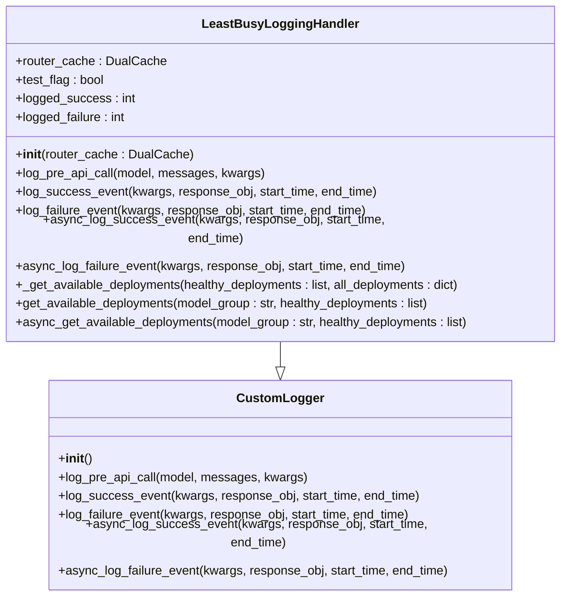
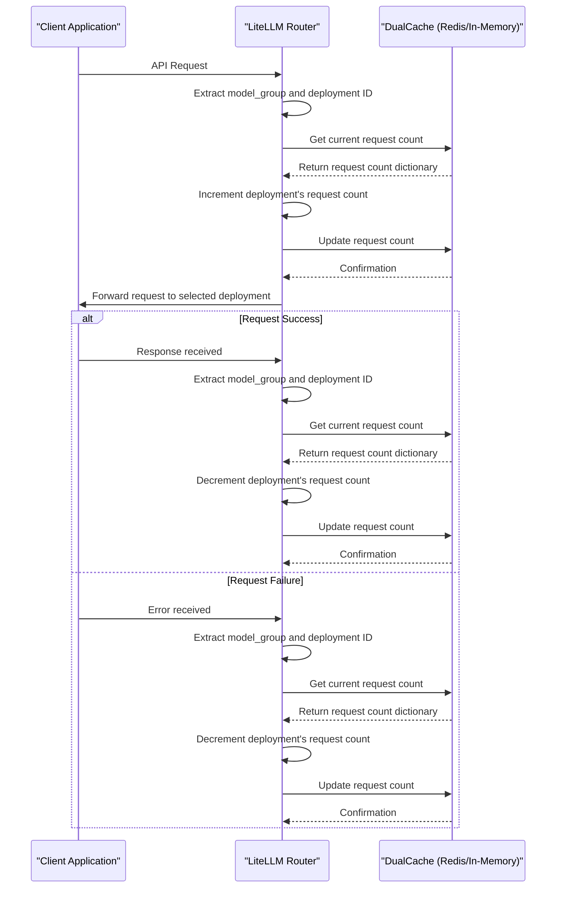
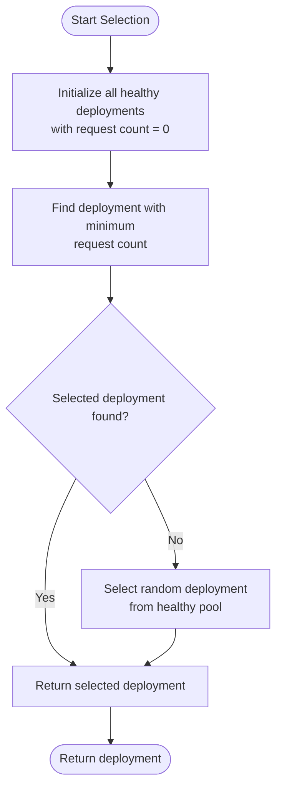
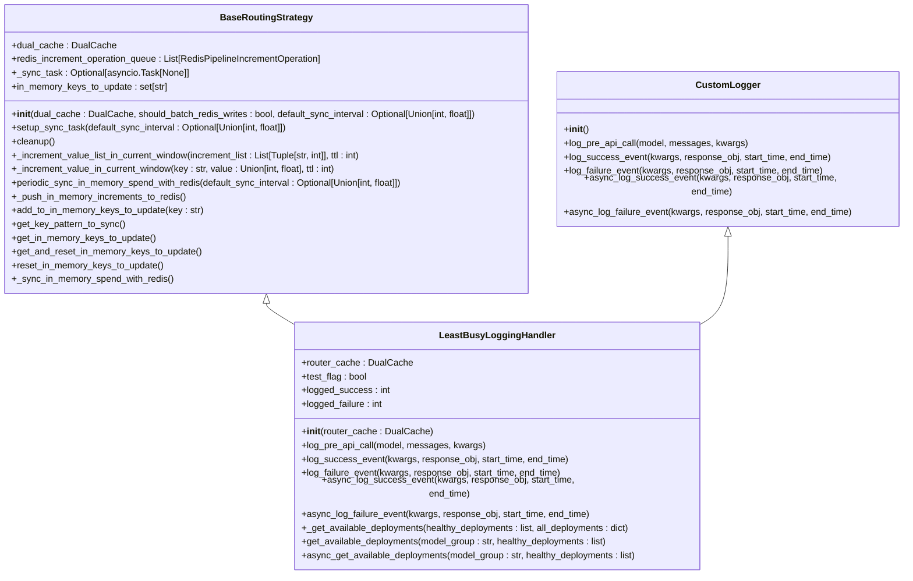
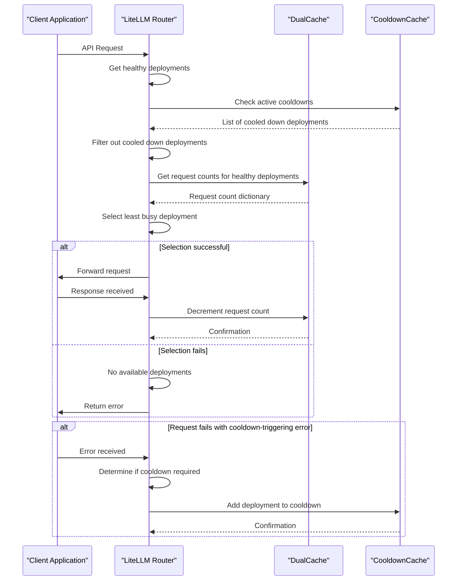
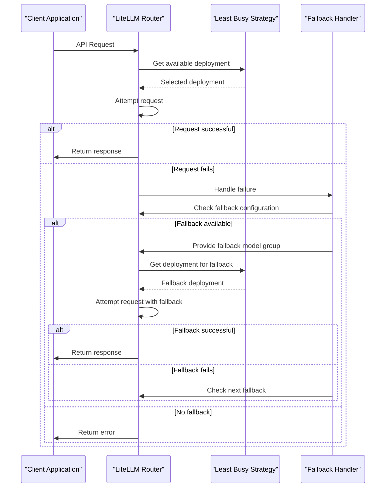
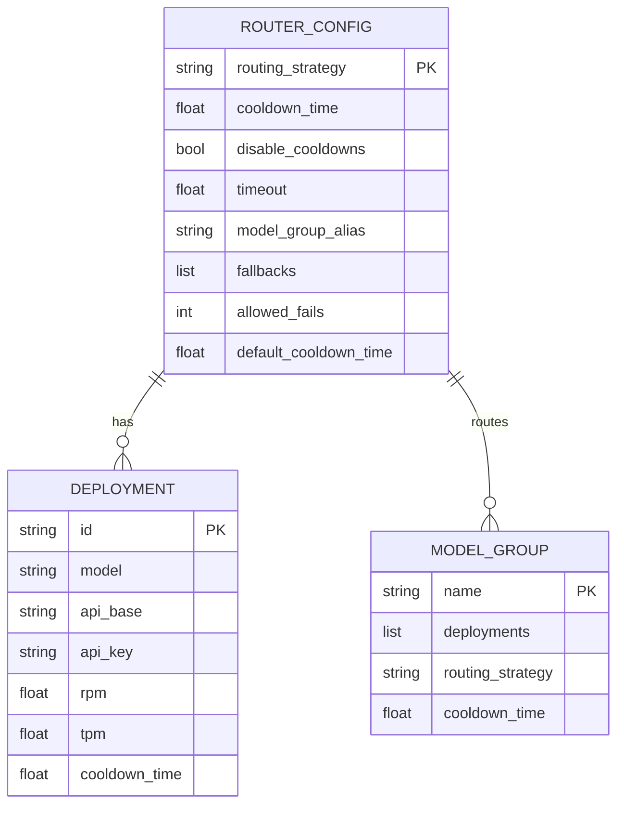
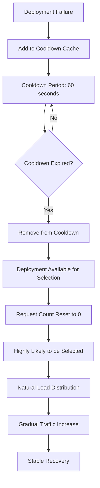

# Least Busy

<cite>
**Referenced Files in This Document**   
- [least_busy.py](file://litellm/router_strategy/least_busy.py)
- [base_routing_strategy.py](file://litellm/router_strategy/base_routing_strategy.py)
- [router.py](file://litellm/router.py)
- [cooldown_cache.py](file://litellm/router_utils/cooldown_cache.py)
- [cooldown_handlers.py](file://litellm/router_utils/cooldown_handlers.py)
</cite>

## Table of Contents
1. [Introduction](#introduction)
2. [Core Implementation](#core-implementation)
3. [Request Tracking Mechanism](#request-tracking-mechanism)
4. [Deployment Selection Logic](#deployment-selection-logic)
5. [Integration with Base Routing Strategy](#integration-with-base-routing-strategy)
6. [Health Monitoring and Cooldown System](#health-monitoring-and-cooldown-system)
7. [Fallback and Retry Mechanisms](#fallback-and-retry-mechanisms)
8. [Configuration Parameters](#configuration-parameters)
9. [Thundering Herd Problem and Solutions](#thundering-herd-problem-and-solutions)
10. [Strategy Comparison and Usage Guidance](#strategy-comparison-and-usage-guidance)

## Introduction
The Least Busy routing strategy in LiteLLM is designed to optimize load balancing by directing requests to the deployment with the fewest concurrent requests. This strategy is particularly effective in scenarios where request durations vary significantly, as it helps prevent any single deployment from becoming overwhelmed while others remain underutilized. The implementation leverages atomic counters to track active requests per deployment and integrates with LiteLLM's comprehensive fallback and retry mechanisms to ensure high availability and reliability.

The strategy operates by maintaining a real-time count of active requests for each deployment within a model group. Before each API call, the router evaluates the current request counts and selects the least busy deployment. This approach minimizes queuing delays and improves overall system throughput by distributing load more evenly across available resources.

**Section sources**
- [least_busy.py](file://litellm/router_strategy/least_busy.py#L1-L252)

## Core Implementation
The Least Busy strategy is implemented as a custom logging handler that extends LiteLLM's `CustomLogger` class. The core functionality revolves around tracking request counts using a dual cache system that supports both in-memory and Redis-based storage. The implementation consists of three main components: request counting, deployment selection, and integration with the router's lifecycle events.

The strategy uses the `DualCache` class to maintain request counts, allowing for efficient read and write operations across distributed instances. When a request is initiated, the strategy increments the request count for the selected deployment. Upon successful completion or failure of the request, the count is decremented. This atomic counting mechanism ensures accurate tracking of concurrent requests even under high load conditions.

The implementation is designed to be non-intrusive, leveraging LiteLLM's callback system to hook into the request lifecycle without modifying the core API call logic. This modular design allows the strategy to be easily enabled or disabled based on configuration settings.

**Diagram sources **
- [least_busy.py](file://litellm/router_strategy/least_busy.py#L16-L252)

**Section sources**
- [least_busy.py](file://litellm/router_strategy/least_busy.py#L1-L252)

## Request Tracking Mechanism
The request tracking mechanism in the Least Busy strategy is built around atomic counters that maintain the number of active requests for each deployment. The system uses a hierarchical key structure in the cache, where each model group has a dedicated key that maps deployment IDs to their current request counts. For example, a model group named "gpt-3.5-turbo" would have a cache key like "gpt-3.5-turbo_request_count" that stores a dictionary of deployment IDs and their respective request counts.

The tracking process begins when a request is about to be made to a model, triggered by the `log_pre_api_call` method. This method extracts the model group and deployment ID from the request metadata and increments the corresponding counter in the cache. The increment operation is atomic, ensuring thread safety and consistency across multiple concurrent requests.

When a request completes successfully or fails, the `log_success_event` and `log_failure_event` methods are called to decrement the request count. These methods follow the same pattern as the pre-call logging, extracting the model group and deployment ID to update the appropriate counter. The use of both synchronous and asynchronous versions of these methods ensures compatibility with both sync and async API calls.

The dual cache system provides resilience against cache failures. If Redis is unavailable, the system falls back to in-memory caching, maintaining functionality at the cost of reduced consistency across distributed instances. This design choice prioritizes availability while still providing effective load balancing in most deployment scenarios.

**Diagram sources **
- [least_busy.py](file://litellm/router_strategy/least_busy.py#L25-L191)

**Section sources**
- [least_busy.py](file://litellm/router_strategy/least_busy.py#L25-L191)

## Deployment Selection Logic
The deployment selection logic in the Least Busy strategy is implemented through the `_get_available_deployments` method, which analyzes the current request counts and selects the deployment with the lowest number of active requests. The algorithm follows a systematic approach to ensure optimal load distribution while handling edge cases such as new deployments and deployments with no recorded requests.

The selection process begins by ensuring all healthy deployments are represented in the request count dictionary. If a healthy deployment is not yet tracked in the cache, it is initialized with a request count of zero. This initialization step prevents new deployments from being overlooked due to lack of historical data.

The core selection algorithm iterates through all deployments in the model group, comparing their request counts to find the minimum value. The deployment with the fewest active requests is selected for the next API call. In cases where multiple deployments have the same lowest request count, the selection is effectively random, as the algorithm returns the first deployment encountered with the minimum count.

The implementation includes safeguards against edge cases. If no deployment can be selected (which should not occur under normal circumstances), the algorithm falls back to selecting a random deployment from the healthy pool. This fallback mechanism ensures that the system remains operational even if the primary selection logic encounters unexpected conditions.

The strategy also handles type conversions, ensuring that deployment IDs are consistently represented as strings regardless of their original format. This normalization prevents issues that could arise from comparing string and integer IDs in the cache.

**Diagram sources **
- [least_busy.py](file://litellm/router_strategy/least_busy.py#L193-L221)

**Section sources**
- [least_busy.py](file://litellm/router_strategy/least_busy.py#L193-L221)

## Integration with Base Routing Strategy
The Least Busy strategy integrates with LiteLLM's base routing system through the `BaseRoutingStrategy` class, which provides common functionality for all routing strategies. This integration enables the Least Busy strategy to leverage shared features such as batched Redis operations, cooldown management, and failure tracking while maintaining its unique request-counting logic.

The integration occurs at multiple levels. First, the Least Busy logging handler is registered with the router during initialization, allowing it to participate in the callback system. When the router processes a request, it invokes the appropriate methods on all registered logging handlers, including the Least Busy handler.

The strategy also integrates with the router's asynchronous capabilities through the `async_get_available_deployments` method, which provides non-blocking access to deployment selection. This asynchronous interface is crucial for maintaining high throughput, as it prevents the routing decision from becoming a bottleneck in the request processing pipeline.

The base routing strategy provides infrastructure for performance monitoring and error handling, which the Least Busy strategy utilizes to report its operations and handle exceptional conditions. For example, the base class manages the creation of OpenTelemetry spans for monitoring the duration of routing operations, while also providing standardized error handling for cache access failures.

This layered architecture allows the Least Busy strategy to focus on its core functionality—request counting and deployment selection—while relying on the base class for cross-cutting concerns like performance optimization, error recovery, and observability.

**Diagram sources **
- [base_routing_strategy.py](file://litellm/router_strategy/base_routing_strategy.py#L15-L262)
- [least_busy.py](file://litellm/router_strategy/least_busy.py#L16-L252)

**Section sources**
- [base_routing_strategy.py](file://litellm/router_strategy/base_routing_strategy.py#L15-L262)
- [least_busy.py](file://litellm/router_strategy/least_busy.py#L16-L252)

## Health Monitoring and Cooldown System
The Least Busy strategy integrates with LiteLLM's comprehensive health monitoring and cooldown system to ensure reliable operation and prevent repeated failures. When a deployment encounters errors, it is temporarily placed in a cooldown state to allow for recovery before receiving new requests. This system works in conjunction with the request counting mechanism to provide a robust load balancing solution.

The cooldown system is implemented through the `CooldownCache` class, which tracks deployments that have recently experienced failures. When a request fails, the system determines whether the failure warrants a cooldown period based on the error type and frequency. For example, rate limit errors (HTTP 429) and authentication errors (HTTP 401) typically trigger cooldowns, while transient network errors may not.

The cooldown duration is configurable and can be set globally or on a per-deployment basis. During the cooldown period, the deployment is excluded from the pool of available deployments, preventing the router from selecting it for new requests. This exclusion helps prevent cascading failures and gives the deployment time to recover from temporary issues.

The health monitoring system also tracks success and failure rates for each deployment, providing additional signals for the routing decision. Deployments with high failure rates may be deprioritized even if they appear to be the least busy, as their reliability is compromised. This multi-dimensional assessment ensures that the routing decision considers both load and reliability.

**Diagram sources **
- [cooldown_cache.py](file://litellm/router_utils/cooldown_cache.py#L31-L192)
- [cooldown_handlers.py](file://litellm/router_utils/cooldown_handlers.py#L260-L320)

**Section sources**
- [cooldown_cache.py](file://litellm/router_utils/cooldown_cache.py#L31-L192)
- [cooldown_handlers.py](file://litellm/router_utils/cooldown_handlers.py#L260-L320)

## Fallback and Retry Mechanisms
The Least Busy strategy integrates with LiteLLM's fallback and retry mechanisms to provide resilience against deployment failures. When the selected deployment is unavailable or returns an error, the system can automatically route the request to alternative deployments according to predefined fallback policies.

The fallback system is configured through the router's `fallbacks` parameter, which specifies alternative model groups to use when the primary selection fails. These fallbacks can be defined at multiple levels, including global defaults, model-specific rules, and wildcard patterns. For example, a configuration might specify that requests to "gpt-3.5-turbo" should fall back to "claude-3-haiku" if unavailable.

The retry mechanism works in conjunction with the fallback system, allowing for multiple attempts before escalating to the next fallback option. The number of retries can be configured globally or per-error type, enabling fine-grained control over the retry behavior. For instance, rate limit errors might trigger more retries than authentication errors, reflecting their transient nature.

The integration between the Least Busy strategy and the fallback system ensures that failed requests do not skew the request counting metrics. When a request fails and is retried on a different deployment, the original deployment's request count is properly decremented, maintaining accurate load information. This coordination prevents the system from incorrectly marking a deployment as busy due to failed requests.

The fallback process is logged through the callback system, providing visibility into routing decisions and failure patterns. These logs can be used for monitoring, debugging, and optimizing the fallback configuration based on real-world performance data.

**Diagram sources **
- [router.py](file://litellm/router.py#L7702-L7840)
- [fallback_event_handlers.py](file://litellm/router_utils/fallback_event_handlers.py#L85-L161)

**Section sources**
- [router.py](file://litellm/router.py#L7702-L7840)
- [fallback_event_handlers.py](file://litellm/router_utils/fallback_event_handlers.py#L85-L161)

## Configuration Parameters
The Least Busy routing strategy is configured through the router's initialization parameters, with specific settings controlling its behavior and integration with other system components. The primary configuration option is the `routing_strategy` parameter, which must be set to "least-busy" to enable this strategy.

Additional configuration parameters influence the behavior of the underlying systems that support the Least Busy strategy. The `cooldown_time` parameter specifies the default duration (in seconds) that a deployment remains in cooldown after a failure. This value can be overridden on a per-deployment basis to accommodate different recovery requirements.

The `disable_cooldowns` parameter provides a global override to disable the cooldown system entirely, which might be useful in development environments or when troubleshooting specific issues. When disabled, failed deployments remain available for selection immediately after a failure.

The strategy also respects the `timeout` parameter, which defines the maximum time to wait for a response from a deployment. Requests that exceed this timeout are treated as failures and trigger the appropriate cooldown and fallback mechanisms.

These configuration parameters can be set programmatically when initializing the router or through environment variables and configuration files, providing flexibility in different deployment scenarios.

**Diagram sources **
- [router.py](file://litellm/router.py#L266-L288)

**Section sources**
- [router.py](file://litellm/router.py#L266-L288)

## Thundering Herd Problem and Solutions
The Least Busy strategy addresses the thundering herd problem—the scenario where multiple requests simultaneously target a deployment that has just recovered from a failure—through its integrated cooldown and gradual traffic ramping mechanisms. When a deployment recovers from a cooldown period, it doesn't immediately receive full traffic, preventing the potential for immediate re-overload.

The cooldown system implements a time-based barrier that prevents immediate re-selection of a recovered deployment. Even after the cooldown period expires, the deployment starts with a clean request count, making it highly likely to be selected as the least busy option. However, the gradual nature of request distribution across multiple deployments naturally limits the rate at which traffic increases on any single recovered deployment.

The strategy also benefits from LiteLLM's broader health monitoring system, which tracks not just cooldown status but also recent failure rates and success patterns. A deployment that has just recovered may still show elevated failure rates in the metrics, causing the system to exercise caution in routing traffic to it until its reliability is re-established.

In high-traffic scenarios, the atomic request counting mechanism helps distribute the load more evenly, as multiple concurrent requests will each evaluate the current request counts and potentially select different deployments. This natural load spreading reduces the likelihood of a thundering herd effect even without explicit rate limiting on recovered deployments.

The combination of cooldown periods, request counting, and fallback mechanisms creates a robust defense against the thundering herd problem, ensuring stable system performance during deployment recovery events.

**Diagram sources **
- [cooldown_cache.py](file://litellm/router_utils/cooldown_cache.py#L31-L192)
- [least_busy.py](file://litellm/router_strategy/least_busy.py#L193-L221)

**Section sources**
- [cooldown_cache.py](file://litellm/router_utils/cooldown_cache.py#L31-L192)
- [least_busy.py](file://litellm/router_strategy/least_busy.py#L193-L221)

## Strategy Comparison and Usage Guidance
The Least Busy routing strategy is most effective in scenarios with highly variable request durations, where some requests may take significantly longer to process than others. In such environments, traditional round-robin or random selection strategies can lead to uneven load distribution, with some deployments becoming overloaded while others remain underutilized. The Least Busy strategy addresses this by dynamically routing requests to the deployment with the fewest active requests, effectively balancing the load based on real-time conditions.

Compared to other routing strategies in LiteLLM, the Least Busy approach has distinct advantages and trade-offs. The "simple-shuffle" strategy (default) provides excellent performance with minimal overhead but doesn't account for actual load. The "lowest-latency" strategy routes to the deployment with the best historical response times but may not reflect current conditions. The "usage-based-routing" strategies consider RPM/TPM limits but require more complex tracking and may not respond quickly to sudden load changes.

The Least Busy strategy is recommended when:
- Request processing times vary significantly
- There are occasional long-running requests that could block a deployment
- High throughput and low latency are critical requirements
- The system has multiple deployments with similar capabilities

The strategy is less suitable when:
- Request durations are very consistent and predictable
- The overhead of request counting is undesirable in high-throughput scenarios
- Simplicity and minimal configuration are prioritized over optimal load distribution

For optimal results, the Least Busy strategy should be combined with appropriate cooldown settings and fallback configurations to ensure resilience against deployment failures while maintaining balanced load distribution.

**Section sources**
- [router.py](file://litellm/router.py#L273-L279)
- [least_busy.py](file://litellm/router_strategy/least_busy.py#L1-L252)