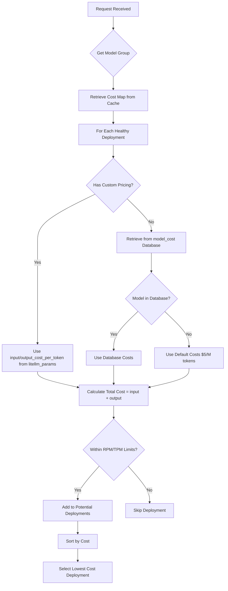
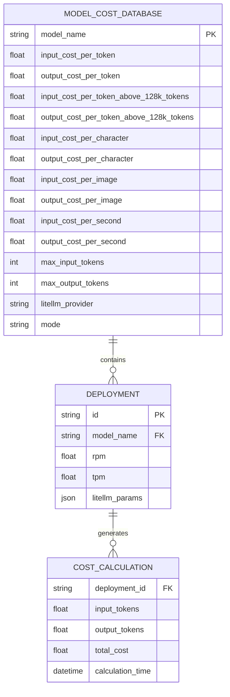
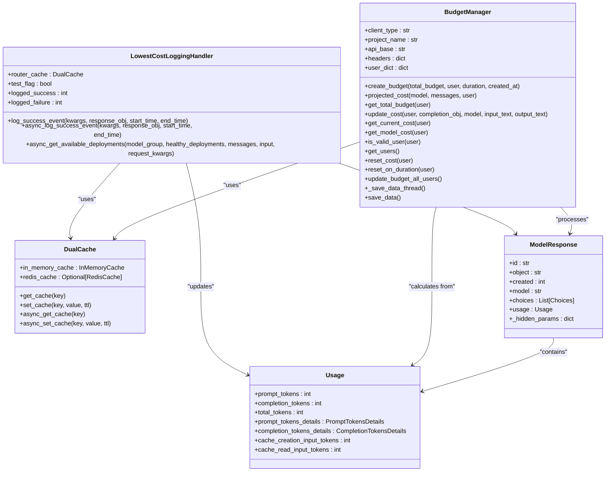

# Lowest Cost

<cite>
**Referenced Files in This Document**   
- [lowest_cost.py](file://litellm/router_strategy/lowest_cost.py)
- [cost_calculator.py](file://litellm/cost_calculator.py)
- [cost.json](file://litellm/cost.json)
- [model_prices_and_context_window.json](file://model_prices_and_context_window.json)
- [budget_manager.py](file://litellm/budget_manager.py)
- [utils.py](file://litellm/utils.py)
- [get_model_cost_map.py](file://litellm/litellm_core_utils/get_model_cost_map.py)
- [base_routing_strategy.py](file://litellm/router_strategy/base_routing_strategy.py)
</cite>

## Table of Contents
1. [Introduction](#introduction)
2. [Cost Calculation Mechanism](#cost-calculation-mechanism)
3. [Model Cost Database and Dynamic Pricing](#model-cost-database-and-dynamic-pricing)
4. [Cost Override Configuration](#cost-override-configuration)
5. [Domain Model of Cost Tracking](#domain-model-of-cost-tracking)
6. [Handling Stale Pricing Data](#handling-stale-pricing-data)
7. [Usage Guidance and Trade-offs](#usage-guidance-and-trade-offs)
8. [Conclusion](#conclusion)

## Introduction
The Lowest Cost routing strategy in LiteLLM is designed to optimize request distribution by selecting the most economical deployment for each API call. This strategy calculates per-token costs for each available deployment and routes requests to the option with the lowest total cost, making it ideal for cost-sensitive applications. The implementation leverages LiteLLM's comprehensive cost calculator module and integrates with a dynamic model cost database to ensure accurate pricing information. This document provides a detailed analysis of the strategy's implementation, including how it calculates costs, handles complex pricing models, and integrates with budget management systems.

**Section sources**
- [lowest_cost.py](file://litellm/router_strategy/lowest_cost.py#L1-L333)

## Cost Calculation Mechanism
The Lowest Cost routing strategy calculates per-token costs for each deployment using LiteLLM's cost calculator module. The process begins when the `async_get_available_deployments` method is invoked, which retrieves the current cost mapping for the model group from the router cache. For each healthy deployment, the strategy determines the input and output cost per token by first checking for custom pricing overrides in the deployment's `litellm_params`. If no overrides are present, it retrieves the cost from the global `model_cost` database using the model name.

The cost calculation follows a hierarchical approach:
1. Check for `input_cost_per_token` and `output_cost_per_token` in the deployment's `litellm_params`
2. If not found, retrieve costs from `litellm.model_cost` using the model identifier
3. Use default values of $5.0 per million tokens if the model is not in the cost database

The total cost for each deployment is calculated as the sum of input and output costs per token. This cost is then used to sort available deployments, with the lowest-cost option being selected for the request. The strategy also considers rate limits (RPM/TPM) when evaluating deployments, ensuring that the selected deployment can handle the request within its capacity constraints.



**Diagram sources **
- [lowest_cost.py](file://litellm/router_strategy/lowest_cost.py#L206-L331)

**Section sources**
- [lowest_cost.py](file://litellm/router_strategy/lowest_cost.py#L206-L331)
- [cost_calculator.py](file://litellm/cost_calculator.py#L156-L800)

## Model Cost Database and Dynamic Pricing
The Lowest Cost strategy relies on LiteLLM's model cost database to determine pricing for different LLM providers and models. The primary cost database is maintained in `model_prices_and_context_window.json`, which contains comprehensive pricing information for hundreds of models across various providers. This JSON file includes fields such as `input_cost_per_token`, `output_cost_per_token`, `max_input_tokens`, and provider-specific metadata.

The cost database is dynamically updated through the `get_model_cost_map.py` module, which periodically fetches the latest pricing information from a remote URL. This ensures that the routing strategy has access to current pricing data, even as providers update their rates. The system includes a fallback mechanism that uses a local backup file (`model_prices_and_context_window_backup.json`) if the remote fetch fails, ensuring reliability.

For providers with complex pricing models, such as tiered pricing or minimum charges, the database includes specialized fields. For example, models with tiered pricing above certain token thresholds use fields like `input_cost_per_token_above_128k_tokens` and `output_cost_per_token_above_128k_tokens`. The cost calculator automatically applies these tiered rates when the token count exceeds the specified threshold.



**Diagram sources **
- [model_prices_and_context_window.json](file://model_prices_and_context_window.json#L1-L200)
- [get_model_cost_map.py](file://litellm/litellm_core_utils/get_model_cost_map.py#L1-L46)

**Section sources**
- [model_prices_and_context_window.json](file://model_prices_and_context_window.json#L1-L200)
- [get_model_cost_map.py](file://litellm/litellm_core_utils/get_model_cost_map.py#L1-L46)
- [cost_calculator.py](file://litellm/cost_calculator.py#L156-L800)

## Cost Override Configuration
The Lowest Cost routing strategy supports cost overrides through the `litellm_params` configuration in deployment definitions. Users can specify custom pricing for individual deployments by setting `input_cost_per_token` and `output_cost_per_token` parameters. This feature is particularly useful for handling providers with complex pricing models or for applying custom discount rates.

To configure cost overrides, users define the custom pricing in the model list when initializing the router:

```python
model_list = [
    {
        "model_name": "gpt-3.5-turbo",
        "litellm_params": {
            "model": "azure/chatgpt-v-1",
            "input_cost_per_token": 0.000000001,
            "output_cost_per_token": 0.00000001,
        },
        "model_info": {"id": "chatgpt-v-1"},
    },
    {
        "model_name": "gpt-3.5-turbo",
        "litellm_params": {
            "model": "azure/chatgpt-v-5",
            "input_cost_per_token": 10,
            "output_cost_per_token": 12,
        },
        "model_info": {"id": "chatgpt-v-5"},
    },
]
```

When the routing strategy evaluates deployments, it first checks for these custom pricing parameters. If present, it uses them instead of the standard pricing from the model cost database. This allows organizations to implement custom pricing strategies, such as volume discounts or negotiated rates with providers.

The system also supports service tier pricing through parameters like `input_cost_per_token_flex` and `input_cost_per_token_priority`, which are used when the `service_tier` parameter is specified in the request. This enables routing decisions that consider different service levels offered by providers.

**Section sources**
- [lowest_cost.py](file://litellm/router_strategy/lowest_cost.py#L271-L291)
- [routing.md](file://docs/my-website/docs/routing.md#L781-L828)

## Domain Model of Cost Tracking
The cost tracking domain model in LiteLLM integrates the Lowest Cost routing strategy with broader budget management and spend logging systems. The core components include the `LowestCostLoggingHandler`, which extends `CustomLogger` to track successful requests and update cost metrics in the router cache, and the `BudgetManager`, which monitors overall spending against defined budgets.

The cost tracking system maintains a hierarchical data structure in the cache, organized by model group and deployment ID. For each deployment, it tracks usage metrics on a per-minute basis, including tokens per minute (TPM) and requests per minute (RPM). This granular tracking enables accurate cost calculations and helps enforce rate limits.

The domain model also includes integration with spend logging, where cost information is attached to the response object's `_hidden_params` field. This allows downstream systems to access cost data for billing, reporting, and analytics purposes. The `BudgetManager` class provides additional functionality for tracking spending by user or project, enabling organizations to set and enforce budget limits.



**Diagram sources **
- [lowest_cost.py](file://litellm/router_strategy/lowest_cost.py#L13-L333)
- [budget_manager.py](file://litellm/budget_manager.py#L26-L231)
- [utils.py](file://litellm/utils.py#L191-L192)

**Section sources**
- [lowest_cost.py](file://litellm/router_strategy/lowest_cost.py#L13-L333)
- [budget_manager.py](file://litellm/budget_manager.py#L26-L231)
- [utils.py](file://litellm/utils.py#L191-L192)

## Handling Stale Pricing Data
The Lowest Cost routing strategy includes mechanisms to handle stale pricing data and ensure the system remains resilient to pricing changes. The primary approach is the periodic update of the model cost database through the `get_model_cost_map.py` module, which fetches the latest pricing information from a remote source at regular intervals.

When the remote fetch fails, the system automatically falls back to a local backup file (`model_prices_and_context_window_backup.json`), ensuring that routing decisions can continue even when the primary pricing source is unavailable. This fallback mechanism prevents service disruptions while maintaining reasonable cost estimates.

For deployments with custom pricing overrides, the system relies on the configuration provided by the user, which is not subject to external changes. This provides stability for organizations that have negotiated specific rates with providers.

The strategy also includes debugging and logging features that help identify potential issues with cost calculations. The `verbose_router_logger` outputs detailed information about cost calculations, including the model ID, cost per token, and TPM/RPM usage, which can be used to verify that the correct pricing is being applied.

**Section sources**
- [get_model_cost_map.py](file://litellm/litellm_core_utils/get_model_cost_map.py#L1-L46)
- [lowest_cost.py](file://litellm/router_strategy/lowest_cost.py#L300-L302)

## Usage Guidance and Trade-offs
The Lowest Cost routing strategy is ideal for cost-sensitive applications where minimizing expenses is a primary concern. It should be used in scenarios where budget optimization is more important than performance metrics like latency or throughput. Typical use cases include batch processing, data analysis, and applications with predictable traffic patterns where cost savings can be significant over time.

However, this strategy involves important trade-offs. By prioritizing cost over performance, applications may experience higher latency or lower reliability if the cheapest deployment is also the most overloaded or geographically distant. Organizations should carefully evaluate their performance requirements before implementing this strategy.

For applications that require a balance between cost and performance, LiteLLM offers alternative routing strategies such as `lowest_latency` or `least_busy`, which prioritize response time or availability, respectively. The choice of strategy should align with the application's specific requirements and service level objectives.

When configuring the Lowest Cost strategy, organizations should:
1. Regularly review and update custom pricing overrides to reflect current provider rates
2. Monitor performance metrics to ensure cost savings don't compromise user experience
3. Set appropriate RPM/TPM limits to prevent overloading the cheapest deployments
4. Implement budget alerts to avoid unexpected cost overruns

**Section sources**
- [routing.md](file://docs/my-website/docs/routing.md#L740-L841)
- [lowest_cost.py](file://litellm/router_strategy/lowest_cost.py#L1-L333)

## Conclusion
The Lowest Cost routing strategy in LiteLLM provides a sophisticated solution for price-optimized request distribution. By leveraging a comprehensive cost calculator module and a dynamic model cost database, the strategy accurately calculates per-token costs for each deployment and selects the most economical option. The implementation supports custom pricing overrides, handles complex pricing models, and integrates with budget management systems to provide a complete cost optimization solution.

Organizations can use this strategy to significantly reduce their LLM API costs while maintaining reliable service. However, they should carefully consider the trade-offs between cost savings and performance requirements. With proper configuration and monitoring, the Lowest Cost strategy can be a powerful tool for optimizing AI infrastructure expenses in cost-sensitive applications.