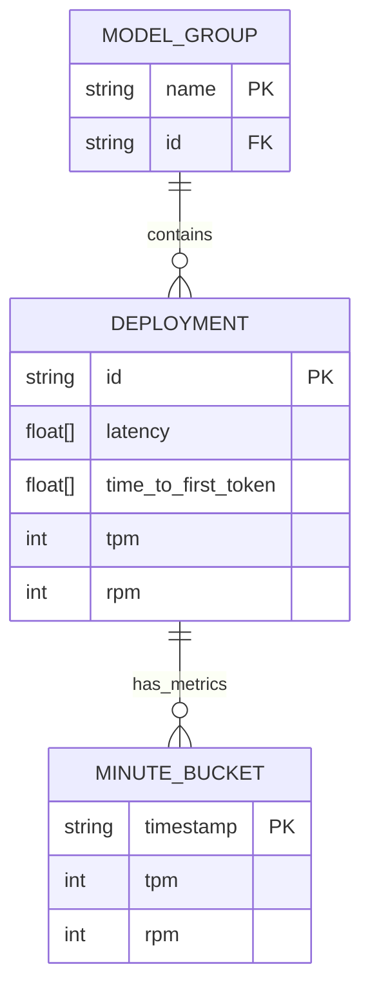
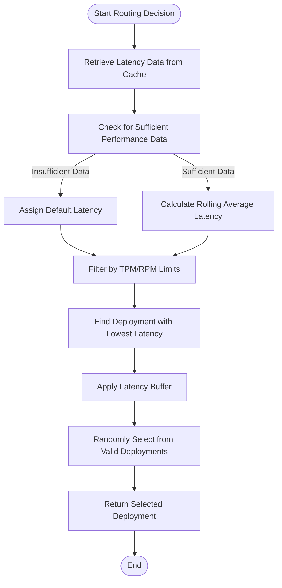
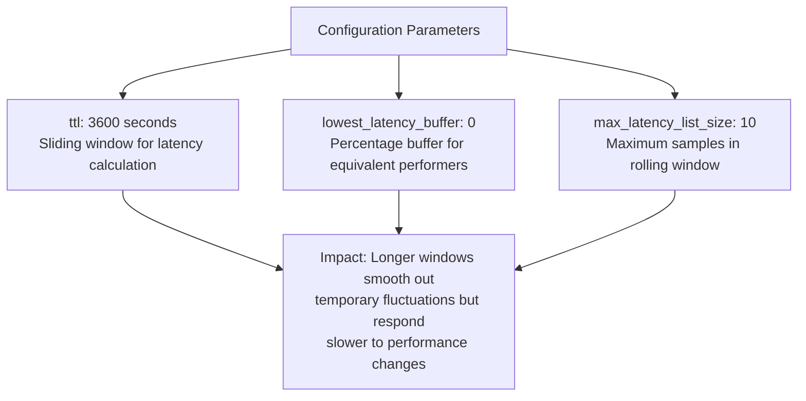
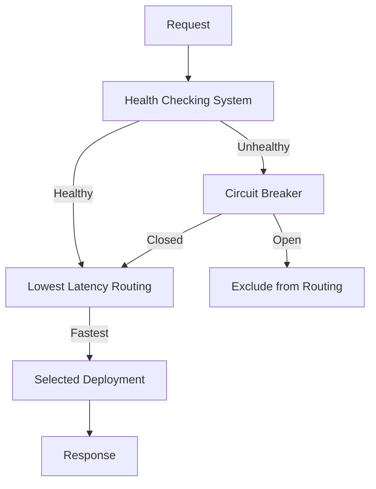

# Lowest Latency

<cite>
**Referenced Files in This Document**   
- [lowest_latency.py](file://litellm/router_strategy/lowest_latency.py)
- [router.py](file://litellm/router.py)
- [LatencyBasedConfiguration.tsx](file://ui/litellm-dashboard/src/components/router_settings/LatencyBasedConfiguration.tsx)
- [health_check.py](file://litellm/proxy/health_check.py)
- [base_routing_strategy.py](file://litellm/router_strategy/base_routing_strategy.py)
</cite>

## Table of Contents
1. [Introduction](#introduction)
2. [Latency Tracking Domain Model](#latency-tracking-domain-model)
3. [Implementation of Rolling Averages](#implementation-of-rolling-averages)
4. [Routing Decision Process](#routing-decision-process)
5. [Outlier Filtering and Failure Handling](#outlier-filtering-and-failure-handling)
6. [Configuration Parameters](#configuration-parameters)
7. [Integration with Performance Monitoring](#integration-with-performance-monitoring)
8. [Cold Start Mitigation](#cold-start-mitigation)
9. [Relationship with Health Checking and Circuit Breaking](#relationship-with-health-checking-and-circuit-breaking)
10. [Network Sensitivity and Usage Guidance](#network-sensitivity-and-usage-guidance)

## Introduction
The Lowest Latency routing strategy in LiteLLM is designed to optimize request distribution by selecting the fastest-performing deployment based on historical response time data. This strategy maintains rolling averages of response times for each deployment and uses this information to make intelligent routing decisions that minimize end-to-end latency. The implementation is particularly valuable for real-time applications where response time is critical. The strategy handles both regular completion requests and streaming requests, using time-to-first-token for the latter. It integrates with LiteLLM's performance monitoring system to continuously update latency metrics and adapts to changing performance characteristics of deployments over time.

**Section sources**
- [lowest_latency.py](file://litellm/router_strategy/lowest_latency.py#L1-L618)

## Latency Tracking Domain Model
The latency tracking system in LiteLLM's Lowest Latency routing strategy maintains a sophisticated domain model that captures performance metrics at multiple levels of granularity. The core data structure is organized around model groups, with each model group containing performance data for individual deployments identified by their unique IDs. For each deployment, the system tracks multiple performance metrics including raw latency, time-to-first-token for streaming requests, tokens-per-minute (TPM), and requests-per-minute (RPM). These metrics are stored in a hierarchical cache structure where the primary key is derived from the model group name suffixed with "_map". Within each deployment's record, latency measurements are maintained as a rolling list with a configurable maximum size, ensuring that only recent performance data influences routing decisions. The system also tracks usage metrics on a per-minute basis, allowing for rate limit enforcement alongside latency optimization.

**Diagram sources**
- [lowest_latency.py](file://litellm/router_strategy/lowest_latency.py#L64-L73)

## Implementation of Rolling Averages
The rolling average implementation in the Lowest Latency strategy uses a fixed-size sliding window approach to maintain response time history for each deployment. When a new successful request completes, its response time is added to the deployment's latency list. If the list exceeds the maximum configured size (default: 10 samples), the oldest measurement is discarded to make room for the new one. This creates a moving window of recent performance data that automatically ages out older measurements. For non-streaming requests, the complete response time is recorded, while for streaming requests, the time-to-first-token is used as the latency metric. The system normalizes latency by dividing response time by the number of completion tokens when usage data is available, providing a more accurate comparison across requests of different sizes. The rolling average is calculated on-demand when making routing decisions by summing all values in the window and dividing by the number of samples, ensuring that the most recent performance trends have the greatest influence on routing choices.

**Section sources**
- [lowest_latency.py](file://litellm/router_strategy/lowest_latency.py#L135-L144)

## Routing Decision Process
The routing decision process in the Lowest Latency strategy follows a multi-step algorithm designed to balance performance optimization with reliability. First, the system retrieves the current latency data for all healthy deployments within the target model group from the cache. Deployments with insufficient performance data are assigned a default latency value to prevent them from being unfairly penalized during the initial warm-up period. The algorithm then filters out any deployments that would exceed their configured TPM or RPM limits if the current request were routed to them. Among the remaining eligible deployments, the system identifies the one with the lowest average latency. To prevent over-concentration of traffic on a single "fastest" deployment and to provide some load distribution, the strategy includes a configurable buffer percentage. All deployments whose latency falls within this buffer of the fastest performer are considered valid options, and one is selected randomly from this pool. This approach combines the benefits of latency optimization with the resilience of load distribution.

**Diagram sources**
- [lowest_latency.py](file://litellm/router_strategy/lowest_latency.py#L428-L549)

## Outlier Filtering and Failure Handling
The Lowest Latency strategy incorporates robust mechanisms for handling outliers and failures to ensure routing decisions are based on reliable performance data. Timeout errors are specifically detected and treated as severe performance failures, with a penalty of 1000 seconds added to the deployment's latency history. This heavy penalty effectively removes chronically slow or unresponsive deployments from consideration for routing until their performance improves. The system distinguishes between different types of failures, only applying the timeout penalty for actual timeout exceptions rather than other error types. For successful requests, the system validates that both the model group and deployment ID are properly specified before recording latency data, preventing malformed or incomplete data from contaminating the performance metrics. The rolling window design inherently provides some outlier resistance, as a single anomalous measurement will be quickly aged out of the calculation window, preventing temporary network glitches from having a prolonged impact on routing decisions.

**Section sources**
- [lowest_latency.py](file://litellm/router_strategy/lowest_latency.py#L192-L259)

## Configuration Parameters
The Lowest Latency routing strategy exposes several configuration parameters that allow fine-tuning of its behavior to match specific deployment requirements and performance goals. The `ttl` parameter controls the time-to-live for latency data in the cache, effectively defining the historical window over which performance is averaged (default: 1 hour). The `max_latency_list_size` parameter determines the number of recent response time measurements retained for each deployment, balancing responsiveness to performance changes with stability of routing decisions (default: 10). The `lowest_latency_buffer` parameter specifies a percentage threshold within which deployments are considered equivalent in performance, enabling random selection among similarly fast options to distribute load (default: 0, meaning always select the single fastest). These parameters can be configured globally for the router or overridden on a per-model-group basis, providing flexibility to optimize different parts of the deployment topology according to their specific characteristics and requirements.

**Diagram sources**
- [lowest_latency.py](file://litellm/router_strategy/lowest_latency.py#L24-L26)
- [LatencyBasedConfiguration.tsx](file://ui/litellm-dashboard/src/components/router_settings/LatencyBasedConfiguration.tsx#L9-L12)

## Integration with Performance Monitoring
The Lowest Latency strategy is tightly integrated with LiteLLM's performance monitoring system through a custom logging handler that captures timing data from successful and failed requests. The `LowestLatencyLoggingHandler` class implements both synchronous and asynchronous logging interfaces, allowing it to integrate seamlessly with LiteLLM's callback system. On successful completion of a request, the handler calculates the response time by comparing the end time with the start time, and optionally extracts the time-to-first-token from streaming requests. This performance data is then stored in the router's cache under a model-group-specific key, organized by deployment ID and time period. The integration uses OpenTelemetry span context when available to ensure accurate tracing of performance data across distributed systems. For failed requests, particularly timeouts, the handler applies appropriate penalties to the deployment's performance record, ensuring that reliability issues are reflected in subsequent routing decisions.

**Section sources**
- [lowest_latency.py](file://litellm/router_strategy/lowest_latency.py#L29-L412)

## Cold Start Mitigation
The Lowest Latency strategy addresses cold start bias through several mechanisms that ensure new or underutilized deployments receive fair consideration during the initial phase of operation. When a deployment has no performance data in the system (indicating it is new or has been idle), it is automatically assigned a default latency value rather than being excluded from consideration. This prevents the routing system from completely ignoring new deployments simply because they lack historical performance data. The rolling window design also contributes to cold start mitigation, as a new deployment can quickly establish its performance characteristics with just a few successful requests. Additionally, the random selection among deployments within the latency buffer helps ensure that new deployments have an opportunity to prove their performance even if they are not immediately the fastest option. These mechanisms work together to create a self-correcting system where deployments are evaluated based on their actual recent performance rather than historical inertia.

**Section sources**
- [lowest_latency.py](file://litellm/router_strategy/lowest_latency.py#L443-L448)

## Relationship with Health Checking and Circuit Breaking
The Lowest Latency routing strategy operates in conjunction with LiteLLM's health checking and circuit breaking systems to provide a comprehensive reliability framework. While the latency strategy focuses on performance optimization, health checking ensures that only functionally operational deployments are considered for routing. The health check system periodically tests deployments with lightweight requests to verify their availability and responsiveness, marking unhealthy endpoints as unavailable to the router. Circuit breaking complements this by temporarily removing deployments that exhibit repeated failures from the routing pool, preventing cascading failures. The latency strategy respects these health and circuit breaker states, only considering deployments that pass health checks and are not in a circuit breaker open state. This layered approach ensures that routing decisions are made only among deployments that are both healthy and performing well, combining functional reliability with performance optimization.

**Diagram sources**
- [lowest_latency.py](file://litellm/router_strategy/lowest_latency.py#L530-L549)
- [health_check.py](file://litellm/proxy/health_check.py#L83-L129)

## Network Sensitivity and Usage Guidance
The Lowest Latency routing strategy is particularly sensitive to network conditions, as response times are directly influenced by network latency between the router and the target deployment. This makes the strategy most effective in environments with stable network conditions and when deployments are located in similar network proximity to the router. For geographically distributed deployments, network variability can introduce noise into the latency measurements, potentially leading to suboptimal routing decisions. The strategy is best suited for real-time applications such as chat interfaces, real-time analytics, and interactive AI systems where minimizing response time is critical to user experience. It should be used with caution in environments with highly variable network conditions or when deployments have significantly different network characteristics. For batch processing or non-time-sensitive workloads, simpler routing strategies like simple shuffle may provide adequate performance with less complexity. Monitoring of the latency data and routing decisions is recommended when first implementing this strategy to ensure it is providing the expected performance benefits.

**Section sources**
- [lowest_latency.py](file://litellm/router_strategy/lowest_latency.py#L491-L525)