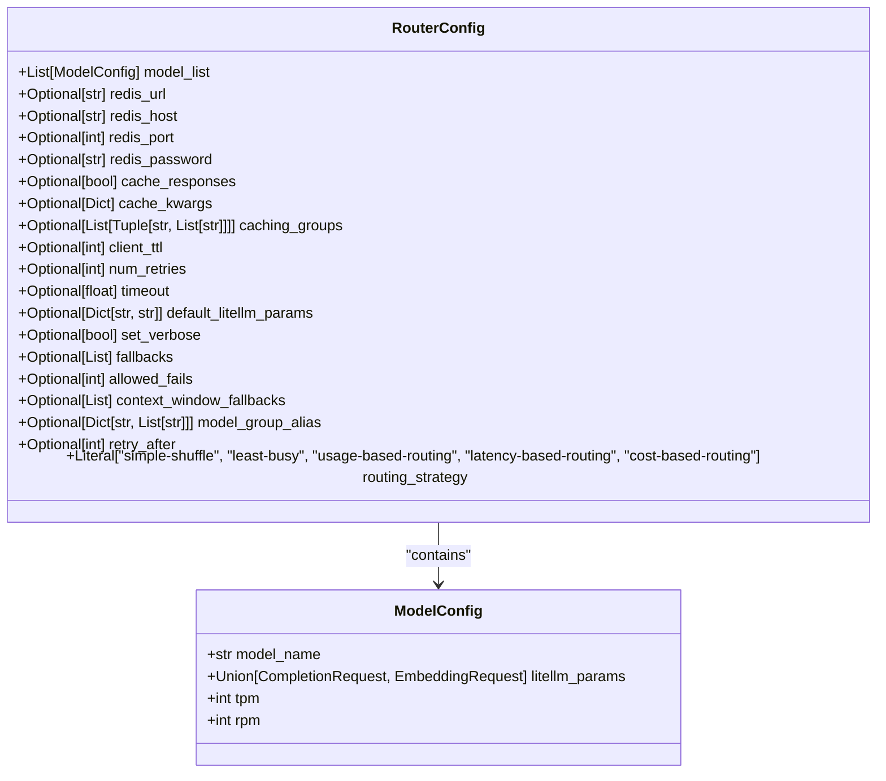
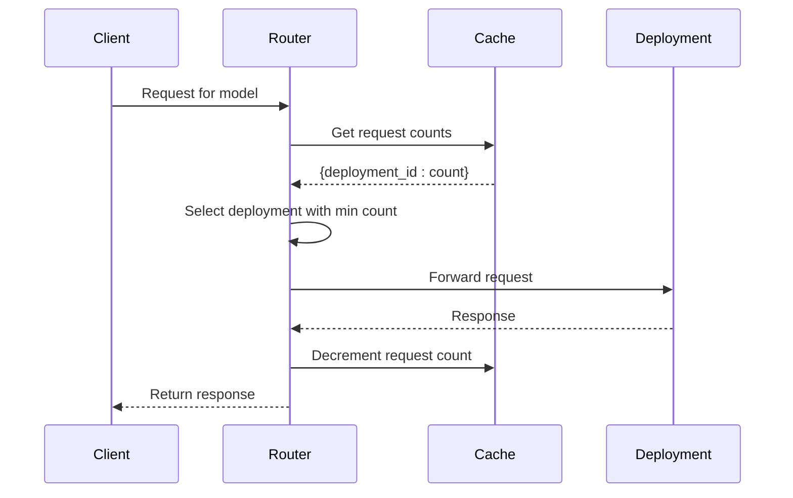
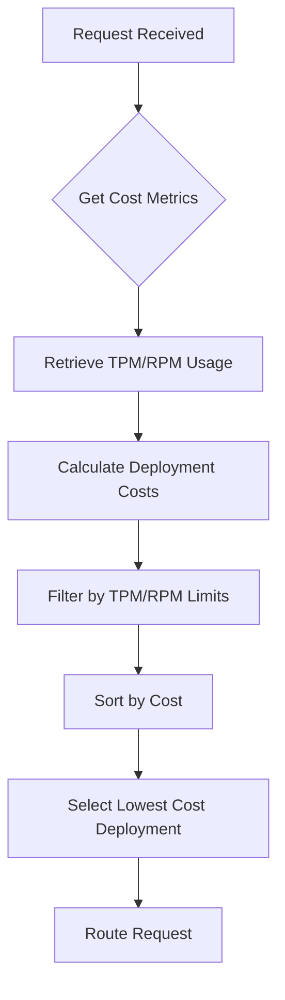
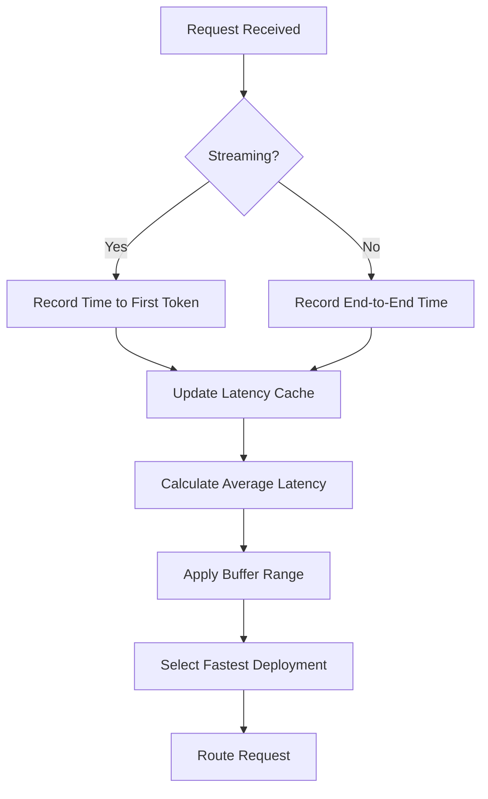
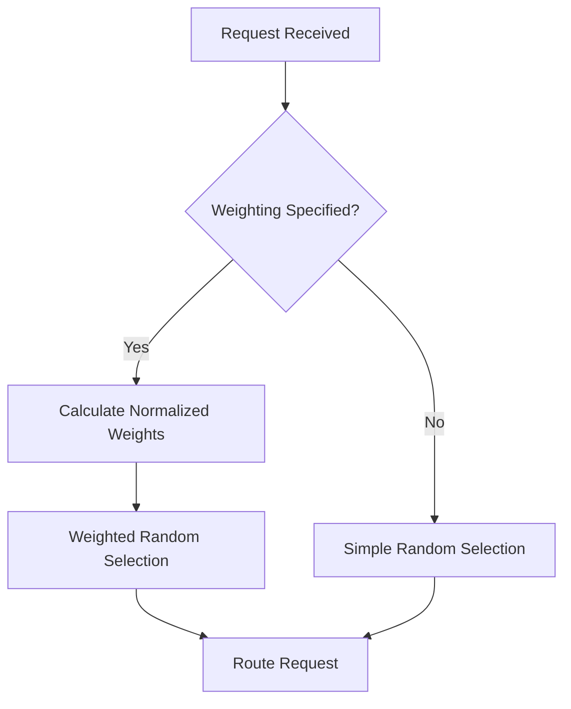
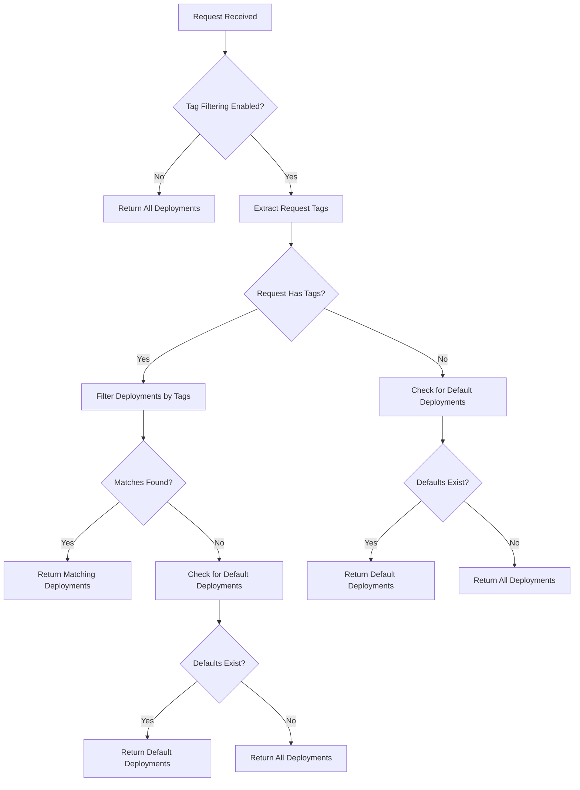
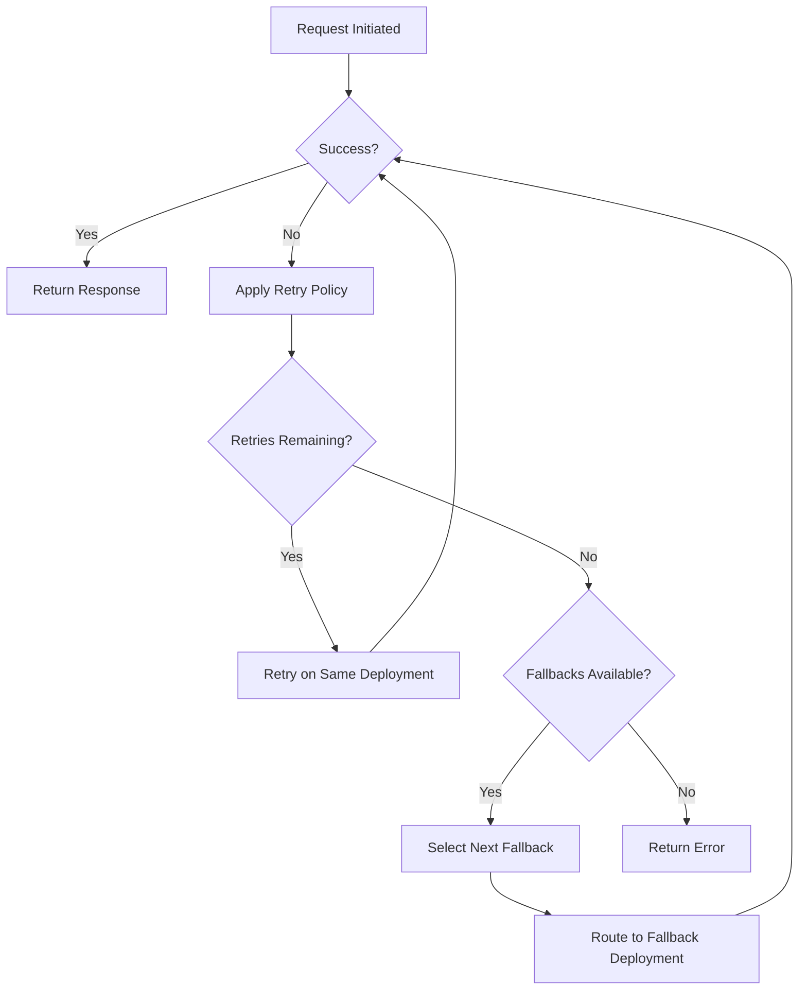

# Routing Strategies

<cite>
**Referenced Files in This Document**   
- [router.py](file://litellm/router.py)
- [base_routing_strategy.py](file://litellm/router_strategy/base_routing_strategy.py)
- [least_busy.py](file://litellm/router_strategy/least_busy.py)
- [lowest_cost.py](file://litellm/router_strategy/lowest_cost.py)
- [lowest_latency.py](file://litellm/router_strategy/lowest_latency.py)
- [simple_shuffle.py](file://litellm/router_strategy/simple_shuffle.py)
- [tag_based_routing.py](file://litellm/router_strategy/tag_based_routing.py)
- [router.py](file://litellm/types/router.py)
</cite>

## Table of Contents
1. [Introduction](#introduction)
2. [RouterConfig Data Model](#routerconfig-data-model)
3. [Routing Strategy Implementation](#routing-strategy-implementation)
   - [Least Busy Strategy](#least-busy-strategy)
   - [Lowest Cost Strategy](#lowest-cost-strategy)
   - [Lowest Latency Strategy](#lowest-latency-strategy)
   - [Simple Shuffle Strategy](#simple-shuffle-strategy)
   - [Tag-Based Routing Strategy](#tag-based-routing-strategy)
4. [Deployment Registration and Weighting](#deployment-registration-and-weighting)
5. [Fallback Policies and Error Handling](#fallback-policies-and-error-handling)
6. [Integration with Caching and Cost Tracking](#integration-with-caching-and-cost-tracking)
7. [Common Issues and Solutions](#common-issues-and-solutions)
8. [Strategy Selection Guidance](#strategy-selection-guidance)

## Introduction
LiteLLM's intelligent request distribution system provides multiple routing strategies to optimize LLM API calls based on different requirements such as performance, cost, and reliability. The routing system is designed to distribute requests across multiple deployments of LLMs, enabling load balancing, failover, and optimization based on various metrics. This document provides a comprehensive overview of the available routing strategies, their implementation details, configuration options, and best practices for deployment.

**Section sources**
- [router.py](file://litellm/router.py#L208-L356)

## RouterConfig Data Model
The RouterConfig data model defines the structure for configuring the routing system in LiteLLM. It includes parameters for model configuration, caching, reliability, and routing strategy selection. The model uses Pydantic for validation and type safety, ensuring that configurations are properly structured and validated.

The RouterConfig includes the following key components:
- **model_list**: A list of ModelConfig objects defining the available deployments
- **redis_url/redis_host/redis_port**: Configuration for Redis caching
- **cache_responses**: Flag to enable response caching
- **num_retries**: Number of retry attempts for failed requests
- **routing_strategy**: The selected routing strategy from available options
- **fallbacks**: List of fallback models for error recovery
- **allowed_fails**: Number of failures before a deployment is cooled down
- **cooldown_time**: Duration in seconds for cooling down failed deployments

The configuration supports both synchronous and asynchronous operations, with parameters that can be dynamically updated during runtime. The model also includes support for environment-specific configurations and advanced routing features like model group aliases and custom retry policies.

**Diagram sources**
- [router.py](file://litellm/types/router.py#L42-L70)

**Section sources**
- [router.py](file://litellm/types/router.py#L42-L70)

## Routing Strategy Implementation

### Least Busy Strategy
The least_busy routing strategy selects the deployment with the fewest active requests, effectively distributing load evenly across available models. This strategy is implemented through the LeastBusyLoggingHandler class, which tracks request counts for each deployment using a dual cache system (in-memory and Redis).

The implementation works by:
1. Logging pre-API calls to increment the request count for a deployment
2. Logging success and failure events to decrement the request count
3. Using the current request count to determine the least busy deployment
4. Supporting both synchronous and asynchronous operations

The strategy maintains a cache key in the format "{model_group}_request_count" that maps deployment IDs to their current request counts. When selecting a deployment, it iterates through healthy deployments and selects the one with the minimum request count. If multiple deployments have the same minimum count, one is selected randomly.

This approach ensures that no single deployment becomes overwhelmed with requests, providing consistent performance and preventing bottlenecks. The strategy is particularly effective in environments with variable request processing times, as it naturally balances the load based on actual utilization rather than theoretical capacity.

**Diagram sources**
- [least_busy.py](file://litellm/router_strategy/least_busy.py#L16-L252)

**Section sources**
- [least_busy.py](file://litellm/router_strategy/least_busy.py#L16-L252)

### Lowest Cost Strategy
The lowest_cost routing strategy selects deployments based on their cost efficiency, aiming to minimize expenses while maintaining service quality. This strategy is implemented through the LowestCostLoggingHandler class, which tracks cost metrics for each deployment and selects the most economical option.

The implementation collects and analyzes the following metrics:
- **Tokens per minute (TPM)**: Tracks token usage over time
- **Requests per minute (RPM)**: Monitors request frequency
- **Cost per token**: Uses model-specific pricing information
- **Input/output cost separation**: Differentiates between input and output token costs

The strategy works by:
1. Calculating the total cost for each deployment based on input and output token prices
2. Tracking usage metrics in a time-windowed cache (organized by date, hour, and minute)
3. Filtering out deployments that would exceed their TPM/RPM limits
4. Selecting the deployment with the lowest calculated cost

Cost information is retrieved from the litellm.model_cost dictionary, which contains pricing details for various LLM providers. Users can also specify custom pricing through input_cost_per_token and output_cost_per_token parameters in the deployment configuration. This allows for accurate cost calculations even with negotiated or custom pricing agreements.

The strategy is particularly valuable for cost-sensitive applications where budget optimization is a primary concern. It enables organizations to leverage multiple providers and deployment options while automatically selecting the most cost-effective option for each request.

**Diagram sources**
- [lowest_cost.py](file://litellm/router_strategy/lowest_cost.py#L13-L333)

**Section sources**
- [lowest_cost.py](file://litellm/router_strategy/lowest_cost.py#L13-L333)

### Lowest Latency Strategy
The lowest_latency routing strategy selects deployments based on their response time performance, prioritizing speed and responsiveness. This strategy is implemented through the LowestLatencyLoggingHandler class, which tracks latency metrics for each deployment and selects the fastest available option.

The implementation captures and analyzes the following latency metrics:
- **End-to-end response time**: Total time from request initiation to response completion
- **Time to first token (TTFT)**: For streaming requests, the time until the first token is received
- **Tokens per second**: Derived metric for throughput performance

The strategy uses a sliding window approach with configurable parameters:
- **ttl**: Time-to-live for cached latency data (default: 1 hour)
- **lowest_latency_buffer**: Percentage buffer for selecting within a range of the lowest latency
- **max_latency_list_size**: Maximum number of latency samples to retain

The implementation works by:
1. Recording response times during success events
2. Maintaining a rolling window of latency measurements for each deployment
3. Calculating average latency from the stored measurements
4. Selecting the deployment with the lowest average latency
5. Optionally applying a buffer to allow for some variation in selection

For streaming requests, the strategy specifically tracks time to first token, which is often more important than total response time for user experience. This makes the strategy particularly effective for interactive applications where quick initial responses are crucial.

The strategy also handles timeout errors by assigning a high penalty (1000 seconds) to failed deployments, effectively removing them from consideration until they demonstrate reliable performance.

**Diagram sources**
- [lowest_latency.py](file://litellm/router_strategy/lowest_latency.py#L29-L618)

**Section sources**
- [lowest_latency.py](file://litellm/router_strategy/lowest_latency.py#L29-L618)

### Simple Shuffle Strategy
The simple_shuffle routing strategy provides random distribution of requests across available deployments, with optional weighting based on deployment characteristics. This strategy is implemented as a standalone function rather than a class-based handler, making it lightweight and efficient.

The implementation supports three weighting methods:
- **Weight parameter**: Explicit weight values assigned to deployments
- **RPM (requests per minute)**: Weighting based on maximum request rate
- **TPM (tokens per minute)**: Weighting based on maximum token processing capacity

The strategy works by:
1. Checking if any weighting parameter (weight, rpm, tpm) is specified
2. If weighting is enabled, calculating normalized weights for each deployment
3. Performing a weighted random selection using the calculated weights
4. If no weighting is specified, performing a simple random selection

When weighting is applied, the function normalizes the weights by dividing each deployment's weight by the total sum of weights, creating a probability distribution. It then uses Python's random.choices() function to select a deployment according to these probabilities.

This approach provides flexibility in load distribution, allowing users to bias traffic toward deployments with higher capacity or priority. For example, a deployment with twice the TPM limit of another would receive approximately twice as many requests over time.

The simple shuffle strategy serves as the default routing method, providing basic load balancing without the overhead of tracking detailed metrics. It's particularly useful in scenarios where all deployments have similar performance characteristics or when the primary goal is even distribution rather than optimization.

**Diagram sources**
- [simple_shuffle.py](file://litellm/router_strategy/simple_shuffle.py#L21-L64)

**Section sources**
- [simple_shuffle.py](file://litellm/router_strategy/simple_shuffle.py#L21-L64)

### Tag-Based Routing Strategy
The tag_based_routing strategy enables metadata-driven request distribution, allowing requests to be routed based on tags associated with both deployments and requests. This strategy is implemented through the get_deployments_for_tag function, which filters deployments based on tag matching.

The implementation supports the following tagging features:
- **Request tags**: Tags specified in the request metadata
- **Deployment tags**: Tags assigned to individual deployments
- **Default deployments**: Deployments marked with a "default" tag
- **Subset matching**: Request tags must be a subset of deployment tags

The strategy works by:
1. Checking if tag filtering is enabled in the router configuration
2. Extracting tags from the request metadata
3. Filtering deployments that contain all request tags
4. Falling back to default deployments if tagged deployments are unavailable
5. Returning all healthy deployments if no defaults are specified

Deployments can be assigned multiple tags, creating a flexible categorization system. For example, deployments might be tagged by region ("us-west", "eu-central"), purpose ("production", "staging"), or performance tier ("high-performance", "cost-optimized").

The strategy also supports a hierarchical fallback system:
1. First, it attempts to match deployments based on the provided tags
2. If no matching deployments are found, it checks for default deployments
3. If no defaults exist, it returns all healthy deployments

This approach enables sophisticated routing policies, such as directing requests from specific user groups to dedicated infrastructure or implementing geographic routing based on user location. It also facilitates A/B testing by allowing different user segments to be routed to different model versions.

**Diagram sources**
- [tag_based_routing.py](file://litellm/router_strategy/tag_based_routing.py#L39-L120)

**Section sources**
- [tag_based_routing.py](file://litellm/router_strategy/tag_based_routing.py#L39-L120)

## Deployment Registration and Weighting
Deployments are registered with the router through the model_list configuration parameter, which contains a list of deployment specifications. Each deployment includes metadata such as weights, regions, and tags that influence routing decisions.

The deployment registration process involves:
1. Defining deployment specifications in the model_list
2. Assigning unique identifiers and model names
3. Configuring litellm_params with provider-specific settings
4. Setting performance limits (TPM, RPM)
5. Adding metadata (weights, regions, tags)

Weighting can be applied through several mechanisms:
- **Explicit weight parameter**: Direct assignment of weight values
- **RPM/TPM values**: Automatic weighting based on rate limits
- **Region-based filtering**: Geographic constraints on deployment selection
- **Tag-based prioritization**: Metadata-driven preference

The router maintains internal data structures to optimize deployment lookup and selection:
- **model_id_to_deployment_index_map**: O(1) lookup of deployment indices by ID
- **model_name_to_deployment_indices**: Mapping of model names to deployment lists
- **deployment_latency_map**: Tracking of performance metrics
- **deployment_stats**: Debugging information for load balancing analysis

When deployments are added or removed, the router updates these data structures to maintain consistency. The system also supports dynamic updates to deployment configurations, allowing for runtime adjustments to weights, limits, and metadata without requiring a restart.

Proper weighting is crucial for avoiding uneven load distribution. For example, deployments with higher capacity should be assigned proportionally higher weights to prevent underutilization. Similarly, geographic constraints can be enforced through region tags, ensuring that requests are routed to nearby infrastructure for reduced latency.

**Section sources**
- [router.py](file://litellm/router.py#L437-L445)
- [router.py](file://litellm/router.py#L1155-L1177)

## Fallback Policies and Error Handling
LiteLLM's routing system includes comprehensive fallback policies and error handling mechanisms to ensure reliability and graceful degradation. The system supports multiple levels of fallbacks, including generic fallbacks, context window fallbacks, and content policy fallbacks.

The fallback system is configured through the following parameters:
- **fallbacks**: Generic fallback models that can handle any request
- **context_window_fallbacks**: Models for handling requests that exceed context limits
- **content_policy_fallbacks**: Models for requests that trigger content policies
- **max_fallbacks**: Maximum number of fallback attempts before failing
- **retry_policy**: Custom retry policies for different exception types

When a request fails, the system follows this process:
1. Identifies the type of failure (timeout, rate limit, authentication, etc.)
2. Applies the appropriate retry policy based on the exception type
3. Attempts the request on the primary deployment according to retry policy
4. If retries are exhausted, selects the next fallback deployment
5. Repeats the process until a response is obtained or all options are exhausted

The system also implements cooldown mechanisms to prevent repeated failures on problematic deployments:
- **allowed_fails**: Number of failures before a deployment is cooled down
- **cooldown_time**: Duration of the cooldown period
- **failed_calls cache**: Tracking of recent failures for cooldown decisions

Custom retry policies can be defined for specific exception types, allowing fine-grained control over retry behavior. For example, timeout errors might have more aggressive retry policies than authentication errors.

The fallback system integrates with monitoring and alerting features, allowing teams to be notified of repeated failures or degraded performance. This enables proactive intervention before issues impact end users.

**Section sources**
- [router.py](file://litellm/router.py#L488-L512)
- [router.py](file://litellm/router.py#L589-L626)

## Integration with Caching and Cost Tracking
The routing strategies are tightly integrated with LiteLLM's caching and cost tracking systems, creating a cohesive optimization framework. This integration enables routing decisions that consider not only immediate performance but also long-term efficiency and cost-effectiveness.

The caching system uses a dual cache architecture:
- **In-memory cache**: Fast, local storage for frequently accessed data
- **Redis cache**: Distributed storage for multi-instance environments

Routing decisions affect cache hit rates through consistency:
- **Least busy strategy**: May reduce cache hits due to uneven request distribution
- **Simple shuffle**: Provides moderate cache consistency
- **Sticky strategies**: Maximize cache hits by consistently routing similar requests

Cost tracking is implemented through the BaseRoutingStrategy class, which provides common functionality for cost-based routing:
- **Batched Redis operations**: Optimized writes to reduce network overhead
- **Periodic synchronization**: Background tasks to sync in-memory and Redis caches
- **Sliding windows**: Time-based aggregation of usage metrics

The system tracks costs at multiple levels:
- **Per-deployment costs**: Individual deployment usage and expenses
- **Per-provider budgets**: Provider-specific spending limits
- **Global cost tracking**: Overall system expenditure

This integration allows for sophisticated optimization scenarios, such as:
- Avoiding deployments that would exceed budget limits
- Preferring cached responses to reduce both cost and latency
- Balancing cost and performance based on real-time usage patterns

The system also provides debugging information through the deployment_stats dictionary, which tracks metrics like request counts, average latency, and success/failure rates for each deployment.

**Section sources**
- [base_routing_strategy.py](file://litellm/router_strategy/base_routing_strategy.py#L15-L262)
- [router.py](file://litellm/router.py#L382-L416)

## Common Issues and Solutions
Several common issues can arise when implementing LiteLLM's routing strategies, along with their corresponding solutions:

**Uneven Load Distribution**
- **Issue**: Some deployments receive significantly more traffic than others
- **Solution**: Implement proper weighting based on deployment capacity (TPM/RPM)
- **Prevention**: Use the simple_shuffle strategy with appropriate weights

**Cache Inefficiency**
- **Issue**: Low cache hit rates despite caching being enabled
- **Solution**: Use routing strategies that provide request consistency
- **Prevention**: Consider sticky routing or increase cache TTL

**Fallback Loops**
- **Issue**: Requests cycling through multiple fallbacks without success
- **Solution**: Set appropriate max_fallbacks limits
- **Prevention**: Configure fallbacks in order of capability and reliability

**Budget Exceedance**
- **Issue**: Unexpected costs due to routing decisions
- **Solution**: Implement provider budget limits
- **Prevention**: Use cost-based routing with accurate pricing information

**Geographic Performance Issues**
- **Issue**: High latency due to cross-region requests
- **Solution**: Use tag-based routing with region tags
- **Prevention**: Deploy region-specific models and configure routing accordingly

**Deployment Overload**
- **Issue**: Individual deployments becoming overwhelmed
- **Solution**: Adjust allowed_fails and cooldown_time settings
- **Prevention**: Monitor deployment_stats and adjust routing strategy

The system provides debugging tools through the verbose_router_logger, which can be set to DEBUG level to trace routing decisions. Additionally, the deployment_stats dictionary offers insights into actual traffic patterns and performance metrics.

**Section sources**
- [router.py](file://litellm/router.py#L455-L467)
- [router.py](file://litellm/router.py#L512-L523)

## Strategy Selection Guidance
Selecting the appropriate routing strategy depends on the specific requirements and constraints of your application. The following guidance can help determine the optimal strategy:

**Cost Optimization**
- Use **lowest_cost** strategy for budget-sensitive applications
- Ensure accurate pricing information is configured
- Combine with provider budget limits for cost control
- Monitor cost tracking metrics regularly

**Performance Optimization**
- Use **lowest_latency** strategy for latency-sensitive applications
- Configure appropriate buffer values to prevent over-optimization
- Consider time-to-first-token for streaming use cases
- Monitor response time metrics and adjust TTL as needed

**Reliability and Availability**
- Use **least_busy** strategy for consistent load balancing
- Configure appropriate fallback policies and retry limits
- Set reasonable cooldown times to prevent flapping
- Monitor deployment health and failure rates

**Simple Load Distribution**
- Use **simple_shuffle** strategy for basic load balancing
- Apply weights based on deployment capacity
- Suitable for homogeneous deployment environments
- Provides predictable distribution patterns

**Policy-Driven Routing**
- Use **tag_based_routing** for complex routing requirements
- Implement metadata-based policies for user segmentation
- Support geographic routing and compliance requirements
- Enable A/B testing and canary deployments

In many cases, a combination of strategies may be appropriate. For example, using tag-based routing for broad categorization followed by cost-based routing within categories. The system also supports dynamic strategy switching based on time of day, load conditions, or other factors.

**Section sources**
- [router.py](file://litellm/router.py#L272-L279)
- [router.py](file://litellm/types/router.py#L745-L752)