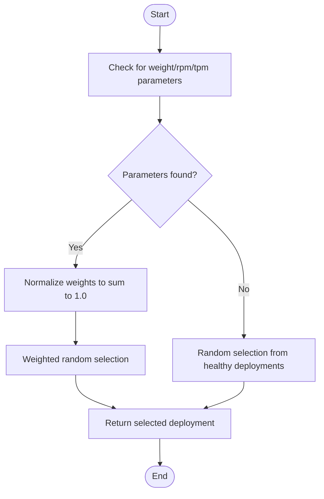
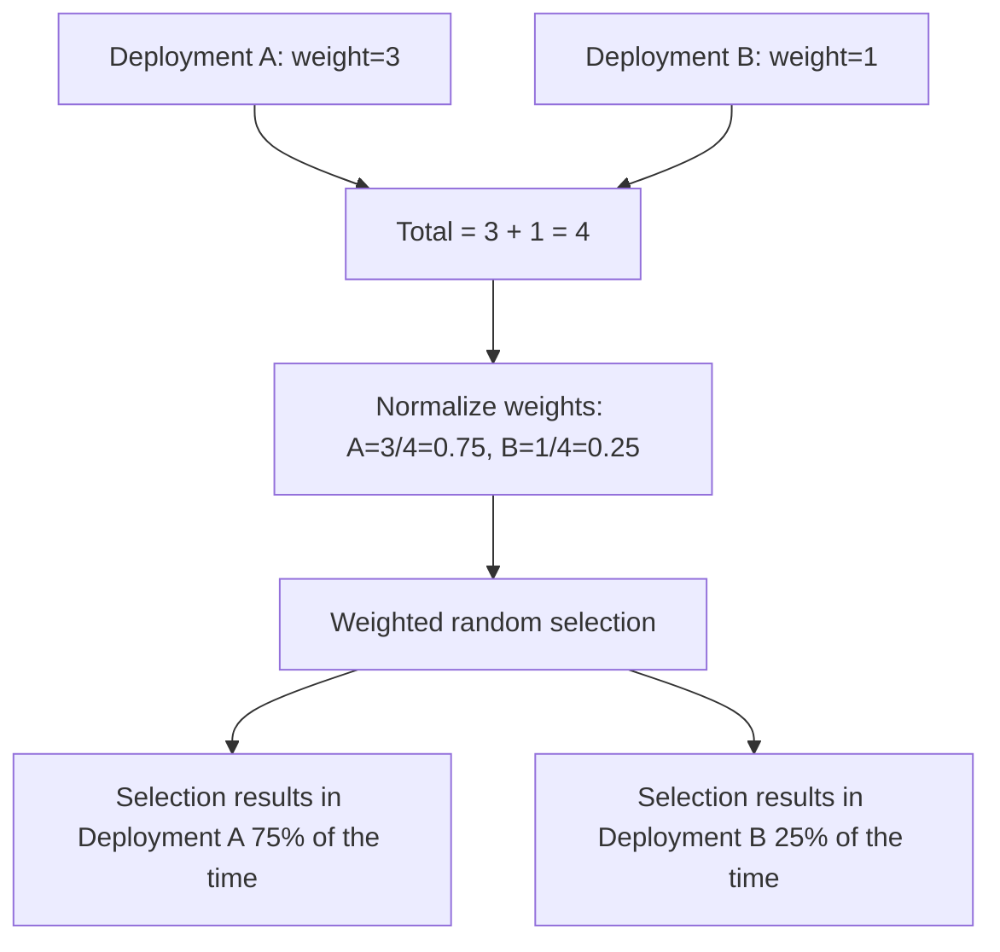

# Simple Shuffle

<cite>
**Referenced Files in This Document**   
- [simple_shuffle.py](file://litellm/router_strategy/simple_shuffle.py)
- [router.py](file://litellm/router.py)
- [routing.md](file://docs/my-website/docs/routing.md)
- [health_check.py](file://litellm/proxy/health_check.py)
</cite>

## Table of Contents
1. [Introduction](#introduction)
2. [Core Implementation](#core-implementation)
3. [Weighted Distribution Mechanics](#weighted-distribution-mechanics)
4. [Deployment Registry Integration](#deployment-registry-integration)
5. [Traffic Shifting Patterns](#traffic-shifting-patterns)
6. [Health Checking Integration](#health-checking-integration)
7. [Statistical Considerations](#statistical-considerations)
8. [Usage Recommendations](#usage-recommendations)

## Introduction

The Simple Shuffle routing strategy in LiteLLM implements a random distribution approach for load balancing requests across multiple LLM deployments. As the default routing strategy, it provides optimal performance with minimal latency overhead while supporting weighted distribution based on configured parameters. The strategy intelligently selects from healthy deployments using either uniform random distribution or weighted random selection based on deployment weights, RPM (requests per minute), or TPM (tokens per minute) configurations.

**Section sources**
- [routing.md](file://docs/my-website/docs/routing.md#L157-L163)

## Core Implementation

The Simple Shuffle strategy is implemented as a standalone function that integrates with LiteLLM's router architecture. The implementation follows a two-phase approach: first checking for weighted distribution parameters, and falling back to uniform random selection when weights are not specified. The function operates on a list of healthy deployments filtered by the router's health checking system, ensuring only operational endpoints are considered for request routing.

The core logic resides in the `simple_shuffle` function, which takes the router instance, list of healthy deployments, and model name as parameters. It returns a single deployment dictionary that will handle the incoming request. The implementation leverages Python's built-in `random` module for both weighted and uniform selection operations.



**Diagram sources **
- [simple_shuffle.py](file://litellm/router_strategy/simple_shuffle.py#L21-L64)

**Section sources**
- [simple_shuffle.py](file://litellm/router_strategy/simple_shuffle.py#L1-L64)

## Weighted Distribution Mechanics

The Simple Shuffle strategy supports three types of weighting parameters: custom `weight`, `rpm` (requests per minute), and `tpm` (tokens per minute). When any of these parameters are specified in a deployment's configuration, the strategy performs a weighted random selection rather than uniform random selection.

The weighting algorithm follows these steps:
1. Identify which weighting parameter to use (checking in order: weight, rpm, tpm)
2. Extract the weight values for all healthy deployments
3. Calculate the total sum of weights
4. Normalize individual weights by dividing each by the total sum
5. Perform weighted random selection using the normalized weights

This approach ensures that deployments with higher weights receive proportionally more traffic. For example, if one deployment has a weight of 3 and another has a weight of 1, the first deployment will receive approximately 75% of the traffic while the second receives 25%.



**Diagram sources **
- [simple_shuffle.py](file://litellm/router_strategy/simple_shuffle.py#L42-L58)

**Section sources**
- [simple_shuffle.py](file://litellm/router_strategy/simple_shuffle.py#L42-L58)
- [routing.md](file://docs/my-website/docs/routing.md#L164-L169)

## Deployment Registry Integration

The Simple Shuffle strategy integrates with LiteLLM's deployment registry through the router's `get_available_deployment` method. When the routing strategy is set to "simple-shuffle", the router delegates deployment selection to the `simple_shuffle` function, passing the router instance, list of healthy deployments, and model name.

The deployment registry maintains a list of all configured deployments, including their metadata and routing parameters. The Simple Shuffle strategy accesses deployment weights through the `litellm_params` dictionary within each deployment configuration. This integration allows for dynamic weight adjustments without requiring changes to the routing logic itself.

The invocation flow is as follows:
1. Router receives a request for a specific model
2. Router identifies all deployments associated with that model
3. Router filters deployments to include only healthy endpoints
4. Router calls `simple_shuffle` with the healthy deployments list
5. Simple Shuffle returns a selected deployment
6. Router routes the request to the selected deployment

**Section sources**
- [router.py](file://litellm/router.py#L7948-L7955)

## Traffic Shifting Patterns

The Simple Shuffle strategy enables traffic shifting for deployment patterns such as blue-green deployments and canary releases through weight configuration. By adjusting the weight parameters of different deployments, operators can gradually shift traffic between versions.

For blue-green deployments, weights can be used to quickly switch traffic from the old (blue) environment to the new (green) environment. Initially, the green deployment might have a low weight (e.g., 1) while the blue deployment has a high weight (e.g., 9). As confidence in the green deployment grows, the weights can be adjusted to shift more traffic, eventually reaching a 1:9 ratio before fully retiring the blue deployment.

For canary releases, a new version can be introduced with a small weight (e.g., 1) while the stable version maintains a much higher weight (e.g., 99). This directs approximately 1% of traffic to the canary deployment, allowing for monitoring and validation before gradually increasing the canary's weight.

Example configuration for a canary release:
```yaml
model_list:
  - model_name: gpt-3.5-turbo
    litellm_params:
      model: azure/chatgpt-v-2
      api_key: os.environ/AZURE_API_KEY
      weight: 99
  - model_name: gpt-3.5-turbo
    litellm_params:
      model: azure/chatgpt-canary
      api_key: os.environ/AZURE_API_KEY
      weight: 1
```

**Section sources**
- [routing.md](file://docs/my-website/docs/routing.md#L176-L191)

## Health Checking Integration

The Simple Shuffle strategy integrates with LiteLLM's health checking system to ensure requests are only routed to operational deployments. Before the selection process begins, the router filters out any deployments that are currently in a cooldown state due to previous failures.

The health checking system periodically tests each deployment's availability and responsiveness. When a deployment fails a health check, it is added to a cooldown list for a configurable period. During this time, the Simple Shuffle strategy will not select the deployment, effectively removing it from the rotation.

This integration ensures that the weighted distribution only applies to healthy endpoints, maintaining service reliability even when some deployments experience issues. The health checking occurs independently of the routing process, with the router simply receiving a filtered list of healthy deployments to choose from.

**Section sources**
- [router.py](file://litellm/router.py#L5233-L5254)
- [health_check.py](file://litellm/proxy/health_check.py#L83-L224)

## Statistical Considerations

While the Simple Shuffle strategy aims to distribute traffic according to configured weights, statistical variations can occur, especially with small sample sizes. In scenarios with low request volumes, the actual traffic distribution may deviate significantly from the expected distribution due to the inherent randomness of the selection process.

For example, with a 75%/25% weight distribution, a small number of requests (e.g., 10) might result in an 80%/20% or 70%/30% split purely by chance. This uneven distribution becomes less pronounced as the sample size increases, converging toward the expected distribution with larger request volumes.

To mitigate this issue, operators should:
1. Calibrate weights based on observed traffic patterns rather than theoretical expectations
2. Monitor actual traffic distribution over representative time periods
3. Adjust weights incrementally to achieve desired traffic ratios
4. Consider request volume when planning traffic shifting strategies

For applications requiring precise traffic distribution, alternative strategies or additional load balancing layers may be necessary, though they typically come with increased complexity and potential latency costs.

**Section sources**
- [simple_shuffle.py](file://litellm/router_strategy/simple_shuffle.py#L42-L58)

## Usage Recommendations

The Simple Shuffle strategy is recommended for most production scenarios due to its optimal performance characteristics and simplicity. It should be the default choice unless specific requirements necessitate alternative routing strategies.

Use Simple Shuffle when:
- Maximizing performance and minimizing latency overhead is a priority
- Implementing gradual rollout strategies like canary releases or blue-green deployments
- Load testing different deployment configurations
- Distributing traffic across geographically distributed endpoints
- The application can tolerate minor statistical variations in traffic distribution

Consider alternative strategies when:
- Strict rate limiting and usage-based routing are required
- Latency optimization is the primary concern (use latency-based routing)
- Predictable, deterministic routing is necessary
- Complex load balancing policies based on real-time metrics are needed

The strategy's support for RPM and TPM-based weighting makes it particularly suitable for environments with varying deployment capacities, allowing operators to proportionally distribute traffic based on each deployment's rated throughput limits.

**Section sources**
- [routing.md](file://docs/my-website/docs/routing.md#L157-L163)
- [simple_shuffle.py](file://litellm/router_strategy/simple_shuffle.py#L1-L64)