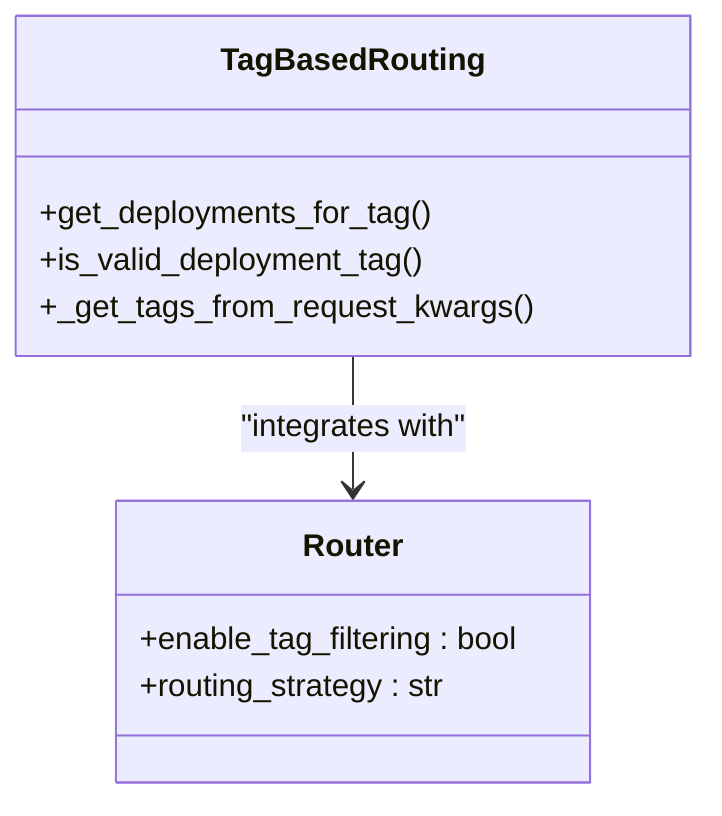
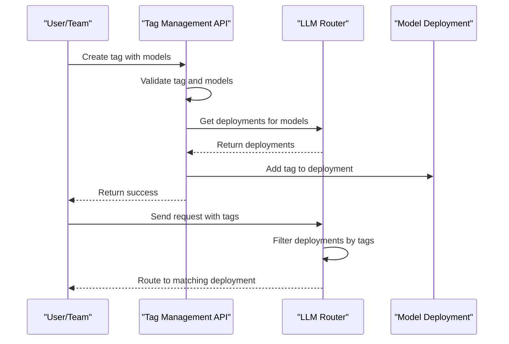
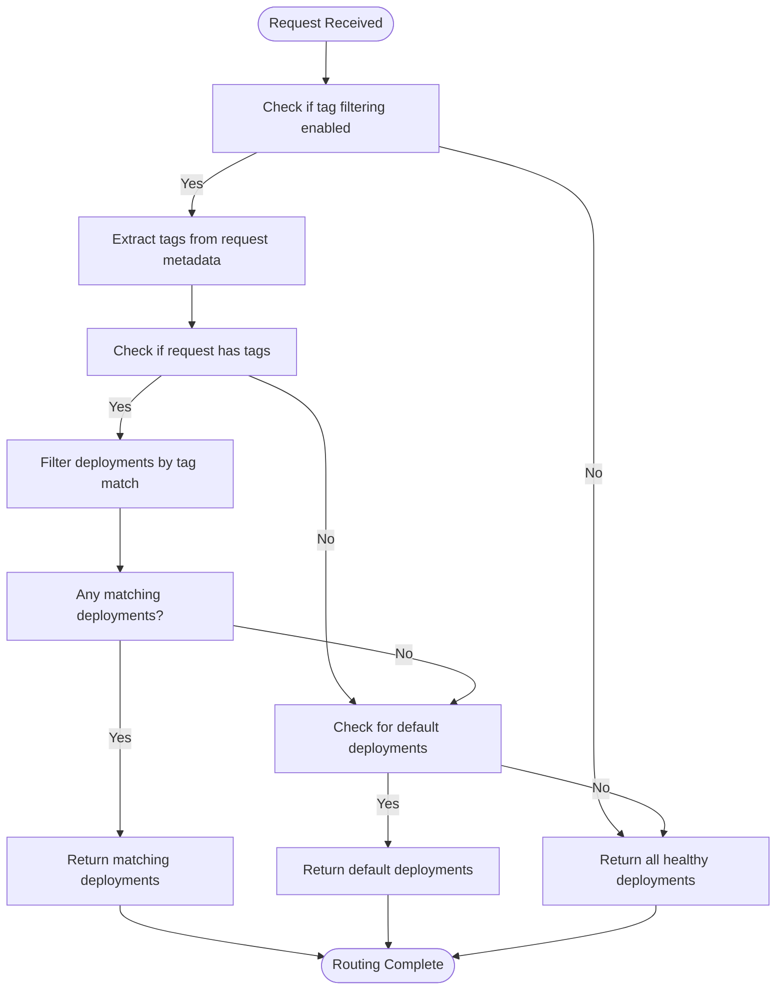
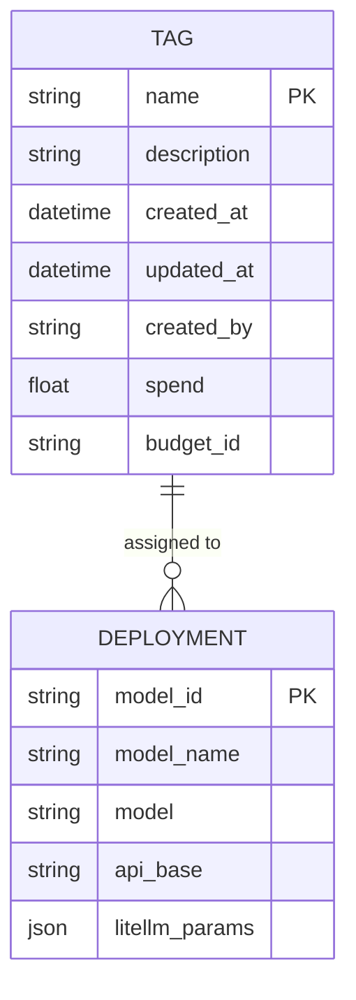

# Tag Based Routing

<cite>
**Referenced Files in This Document**   
- [tag_based_routing.py](file://litellm/router_strategy/tag_based_routing.py)
- [tag_management.py](file://litellm/types/tag_management.py)
- [tag_management_endpoints.py](file://litellm/proxy/management_endpoints/tag_management_endpoints.py)
- [router.py](file://litellm/router.py)
- [test_router_tag_routing.py](file://tests/test_litellm/router_strategy/test_router_tag_routing.py)
- [tag_routing.md](file://docs/my-website/docs/proxy/tag_routing.md)
</cite>

## Table of Contents
1. [Introduction](#introduction)
2. [Core Implementation](#core-implementation)
3. [Tag Assignment and Model Registration](#tag-assignment-and-model-registration)
4. [Routing Logic and Algorithm](#routing-logic-and-algorithm)
5. [Configuration Examples](#configuration-examples)
6. [Domain Model and Inheritance](#domain-model-and-inheritance)
7. [Tag Governance and Best Practices](#tag-governance-and-best-practices)
8. [Integration with Other Routing Strategies](#integration-with-other-routing-strategies)
9. [Troubleshooting Common Issues](#troubleshooting-common-issues)
10. [Use Cases and Recommendations](#use-cases-and-recommendations)

## Introduction

Tag Based Routing in LiteLLM provides a metadata-driven approach to request distribution across different LLM deployments. This strategy enables fine-grained control over which models handle specific requests based on tags assigned to both requests and deployments. The system supports various use cases including multi-tenant architectures, regulatory compliance requirements, and tiered service offerings (such as free vs. paid tiers). Tags can represent attributes like region, model type, compliance level, team affiliation, or any other metadata relevant to routing decisions.

The implementation allows for flexible routing configurations where requests are matched to deployments based on tag inclusion rather than exact matching, providing a powerful mechanism for implementing complex routing policies. The system also supports default routing behavior for untagged requests and provides comprehensive error handling when no suitable deployments are found for a given set of tags.

**Section sources**
- [tag_routing.md](file://docs/my-website/docs/proxy/tag_routing.md#L1-L20)

## Core Implementation

The Tag Based Routing strategy is implemented as a dedicated routing module within LiteLLM's router system. The core functionality resides in the `tag_based_routing.py` file, which contains the primary functions for tag-based deployment selection. The implementation follows a modular design that integrates with LiteLLM's overall routing architecture while maintaining separation of concerns.

The routing strategy is activated by setting the `enable_tag_filtering` parameter to `True` in the router configuration. When enabled, the system intercepts requests and evaluates their tags against the tags assigned to available deployments. The implementation supports multiple metadata sources within requests, allowing tags to be specified in different locations within the request structure.

Key components of the implementation include:
- The `get_deployments_for_tag` function that performs the core routing logic
- The `is_valid_deployment_tag` helper function that determines tag compatibility
- The `_get_tags_from_request_kwargs` utility for extracting tags from various request locations

The system is designed to be non-disruptive when tag filtering is disabled, falling back to standard routing behavior to ensure backward compatibility.



**Diagram sources **
- [tag_based_routing.py](file://litellm/router_strategy/tag_based_routing.py#L1-L148)
- [router.py](file://litellm/router.py#L1-L200)

**Section sources**
- [tag_based_routing.py](file://litellm/router_strategy/tag_based_routing.py#L1-L148)
- [router.py](file://litellm/router.py#L1-L200)

## Tag Assignment and Model Registration

Tags are assigned to deployments during model registration through the configuration of the `litellm_params` object. Each deployment can have a list of tags specified in its configuration, which are then used during the routing process to match requests to appropriate deployments. The tag assignment occurs at the deployment level, allowing different instances of the same model type to have different tag sets based on their intended use case or characteristics.

The system supports dynamic tag management through API endpoints that allow for the creation, updating, and deletion of tags. When a tag is created or updated, it can be associated with specific models, and the system automatically updates the deployments to include the new tag information. This integration between tag management and model registration ensures that the routing system has up-to-date information about which deployments are available for each tag.

The tag management system also supports the concept of default tags, which are used to route untagged requests to specific deployments. This provides a fallback mechanism for requests that don't specify any tags, ensuring that all requests can be handled appropriately.



**Diagram sources **
- [tag_management_endpoints.py](file://litellm/proxy/management_endpoints/tag_management_endpoints.py#L1-L200)
- [tag_based_routing.py](file://litellm/router_strategy/tag_based_routing.py#L1-L148)

**Section sources**
- [tag_management_endpoints.py](file://litellm/proxy/management_endpoints/tag_management_endpoints.py#L1-L200)
- [tag_management.py](file://litellm/types/tag_management.py#L1-L70)

## Routing Logic and Algorithm

The Tag Based Routing algorithm follows a specific decision process to determine which deployments should handle a given request. The core logic is implemented in the `get_deployments_for_tag` function, which evaluates the tags in the incoming request against the tags assigned to available deployments.

The algorithm operates as follows:
1. If tag filtering is not enabled, return all healthy deployments
2. Extract tags from the request metadata
3. For each deployment, check if any of the request tags are present in the deployment's tag list
4. If matches are found, return only the matching deployments
5. If no matches are found but default deployments exist, return the default deployments
6. If no matches and no defaults, raise an error

The matching logic uses a subset relationship rather than requiring exact tag matches. This means that if a request contains any tag that exists in a deployment's tag list, that deployment is considered a valid candidate for routing. This approach provides flexibility in routing configurations and allows for hierarchical tag structures.

The system also handles edge cases such as requests with no tags or deployments with no tags, ensuring predictable behavior in all scenarios. When a request has no tags, the system will use default deployments if they are configured, otherwise falling back to all available deployments.



**Diagram sources **
- [tag_based_routing.py](file://litellm/router_strategy/tag_based_routing.py#L39-L120)
- [test_router_tag_routing.py](file://tests/test_litellm/router_strategy/test_router_tag_routing.py#L30-L250)

**Section sources**
- [tag_based_routing.py](file://litellm/router_strategy/tag_based_routing.py#L22-L148)
- [test_router_tag_routing.py](file://tests/test_litellm/router_strategy/test_router_tag_routing.py#L30-L250)

## Configuration Examples

The Tag Based Routing strategy can be configured through YAML configuration files or programmatically through the LiteLLM API. The configuration specifies both the deployments and their associated tags, as well as global routing settings.

A basic configuration example shows how to set up free and paid tiers:

```yaml
model_list:
  - model_name: gpt-4
    litellm_params:
      model: openai/fake
      api_key: fake-key
      api_base: https://exampleopenaiendpoint-production.up.railway.app/
      tags: ["free"]
  - model_name: gpt-4
    litellm_params:
      model: openai/gpt-4o
      api_key: os.environ/OPENAI_API_KEY
      tags: ["paid"]
  - model_name: gpt-4
    litellm_params:
      model: openai/gpt-4o
      api_key: os.environ/OPENAI_API_KEY
      tags: ["default"]

router_settings:
  enable_tag_filtering: True
```

Requests can specify tags either in the request body or through headers. For example, a request with the "free" tag would be routed to the deployment with the "free" tag:

```shell
curl -i http://localhost:4000/v1/chat/completions \
  -H "Content-Type: application/json" \
  -H "Authorization: Bearer sk-1234" \
  -d '{
    "model": "gpt-4",
    "messages": [
      {"role": "user", "content": "Hello!"}
    ],
    "tags": ["free"]
  }'
```

Alternatively, tags can be specified in the request header:

```shell
curl -L -X POST 'http://0.0.0.0:4000/v1/chat/completions' \
-H 'Content-Type: application/json' \
-H 'Authorization: Bearer sk-1234' \
-H 'x-litellm-tags: free,my-custom-tag' \
-d '{
  "model": "gpt-4",
  "messages": [
    {
      "role": "user",
      "content": "Hey, how's it going?"
    }
  ]
}'
```

The system also supports complex tag expressions and fallback policies through the combination of multiple tags and default routing configurations.

**Section sources**
- [tag_routing.md](file://docs/my-website/docs/proxy/tag_routing.md#L16-L200)
- [test_router_tag_routing.py](file://tests/test_litellm/router_strategy/test_router_tag_routing.py#L30-L250)

## Domain Model and Inheritance

The domain model for Tag Based Routing consists of several key entities that work together to enable metadata-driven request distribution. The core entities include Tags, Deployments, and the Router itself, each with specific responsibilities and relationships.

Tags are defined as metadata labels that can be attached to deployments and used for routing decisions. Each tag has a name and optional metadata such as description and associated models. The system supports tag inheritance through the concept of default tags, which serve as a fallback for untagged requests.

Deployments represent individual LLM instances or endpoints that can handle requests. Each deployment has a set of tags that define its characteristics and intended use cases. The relationship between tags and deployments is many-to-many, allowing a single deployment to have multiple tags and a single tag to be applied to multiple deployments.

The Router acts as the orchestrator, evaluating incoming requests against the available deployments based on their tags. It integrates with other components such as team-based routing and customer isolation systems, allowing for layered routing strategies where tag-based routing is one of several criteria used to determine the appropriate deployment.

The domain model also includes budget and spend tracking capabilities associated with tags, enabling cost allocation and usage monitoring at the tag level. This integration allows organizations to track and manage spending for different teams, projects, or service tiers.



**Diagram sources **
- [tag_management.py](file://litellm/types/tag_management.py#L7-L70)
- [tag_management_endpoints.py](file://litellm/proxy/management_endpoints/tag_management_endpoints.py#L1-L200)

**Section sources**
- [tag_management.py](file://litellm/types/tag_management.py#L7-L70)
- [tag_management_endpoints.py](file://litellm/proxy/management_endpoints/tag_management_endpoints.py#L1-L200)

## Tag Governance and Best Practices

Effective tag governance is critical for maintaining a scalable and manageable Tag Based Routing system. Without proper governance, organizations can experience "tag sprawl" where an excessive number of inconsistent or redundant tags make the system difficult to manage and understand.

Key best practices for tag governance include:

1. **Consistent Naming Conventions**: Establish and enforce a standard naming convention for tags. This might include using lowercase letters, avoiding special characters, and following a consistent pattern (e.g., "team:engineering" rather than mixing "engineering", "eng", and "Engineering").

2. **Hierarchical Structure**: Use a hierarchical structure for tags to enable both broad and granular filtering. For example, using prefixes like "env:production", "team:backend", and "service:api" allows for flexible querying and grouping.

3. **Limited Scope**: Define a controlled vocabulary of approved tags rather than allowing free-form tag creation. This prevents duplication and ensures consistency across the organization.

4. **Regular Audits**: Periodically review existing tags to identify and remove unused or redundant tags. This helps maintain a clean and efficient tagging system.

5. **Documentation**: Maintain documentation for each tag, including its purpose, intended use cases, and any associated policies or restrictions.

6. **Access Controls**: Implement appropriate access controls for tag creation and modification, ensuring that only authorized personnel can create or modify tags that affect routing behavior.

The system supports these governance practices through its API endpoints and configuration options, allowing organizations to implement policies that align with their specific needs and compliance requirements.

**Section sources**
- [tag_management_endpoints.py](file://litellm/proxy/management_endpoints/tag_management_endpoints.py#L1-L200)
- [tag_routing.md](file://docs/my-website/docs/proxy/tag_routing.md#L394-L419)

## Integration with Other Routing Strategies

Tag Based Routing integrates seamlessly with other routing strategies in LiteLLM, allowing for sophisticated multi-dimensional routing policies. The system supports combining tag-based routing with other strategies such as least busy, lowest cost, and latency-based routing.

When multiple routing strategies are configured, they are applied in a specific order. Tag Based Routing typically serves as the first filtering layer, narrowing down the pool of available deployments based on tag matching. Subsequent routing strategies then operate on this filtered set to make the final selection.

For example, an organization might configure a routing policy that first filters deployments by team tag, then selects among the remaining deployments based on lowest latency. This allows for both isolation between teams and optimal performance within each team's allocated resources.

The integration is implemented through LiteLLM's modular routing architecture, where each strategy is a pluggable component that can be enabled or disabled independently. This design allows organizations to mix and match routing strategies based on their specific requirements without creating tight coupling between different routing dimensions.

The system also supports fallback policies, where if no deployments match the specified tags, it can fall back to other routing strategies or default deployments. This provides resilience in the routing system and ensures that requests can be handled even when the ideal deployment is unavailable.

**Section sources**
- [router.py](file://litellm/router.py#L1-L200)
- [tag_based_routing.py](file://litellm/router_strategy/tag_based_routing.py#L1-L148)

## Troubleshooting Common Issues

Several common issues can arise when implementing Tag Based Routing, along with their solutions:

1. **No Deployments Found for Tags**: This occurs when a request specifies tags that don't match any available deployments. Solutions include:
   - Verify that deployments have the correct tags configured
   - Check for typos in tag names
   - Ensure tag filtering is enabled in the router configuration
   - Consider adding default deployments for unhandled cases

2. **Tag Sprawl**: When too many inconsistent tags are created, making the system difficult to manage. Solutions include:
   - Implement tag governance policies
   - Regularly audit and clean up unused tags
   - Establish a controlled vocabulary of approved tags
   - Provide training on proper tag usage

3. **Performance Issues**: With a large number of tags and deployments, routing decisions can become slow. Solutions include:
   - Optimize tag indexing and lookup
   - Implement caching for common routing decisions
   - Limit the number of tags evaluated per request

4. **Configuration Errors**: Incorrect YAML syntax or misplaced tag definitions. Solutions include:
   - Validate configuration files before deployment
   - Use configuration management tools
   - Implement automated testing of routing configurations

5. **Unexpected Routing Behavior**: Requests being routed to unexpected deployments. Solutions include:
   - Enable verbose logging to trace routing decisions
   - Verify tag matching logic
   - Check for overlapping or conflicting tags

The system provides diagnostic capabilities through logging and monitoring, allowing administrators to trace the routing decision process and identify the root cause of issues.

**Section sources**
- [tag_based_routing.py](file://litellm/router_strategy/tag_based_routing.py#L1-L148)
- [test_router_tag_routing.py](file://tests/test_litellm/router_strategy/test_router_tag_routing.py#L257-L312)

## Use Cases and Recommendations

Tag Based Routing is particularly well-suited for several key use cases:

1. **Multi-tenant Systems**: In multi-tenant environments, tags can be used to isolate different customers or teams, ensuring that each tenant's requests are routed to their designated deployments. This provides both performance isolation and security boundaries.

2. **Regulatory Compliance**: Tags can enforce compliance requirements by routing requests to deployments in specific geographic regions or with particular security certifications. For example, requests containing PII could be automatically routed to deployments in GDPR-compliant regions.

3. **Tiered Service Offerings**: Organizations can implement free and paid service tiers by routing requests with different tags to deployments with varying capabilities or cost structures. This allows for differentiated service levels while using the same underlying infrastructure.

4. **A/B Testing and Canary Deployments**: Tags can be used to gradually roll out new models or configurations to specific subsets of users, enabling controlled experimentation and risk mitigation.

5. **Cost Allocation and Budgeting**: By associating tags with teams, projects, or departments, organizations can track and allocate costs accurately, enabling chargeback models and budget enforcement.

Best practices for implementing Tag Based Routing include starting with a simple tagging scheme and gradually expanding as needed, documenting tag meanings and usage policies, and regularly reviewing and optimizing the tag structure. Organizations should also consider the performance implications of complex tag expressions and ensure that their monitoring and alerting systems can handle tag-based metrics.

**Section sources**
- [tag_routing.md](file://docs/my-website/docs/proxy/tag_routing.md#L1-L20)
- [tag_budgets.md](file://docs/my-website/docs/proxy/tag_budgets.md#L195-L247)