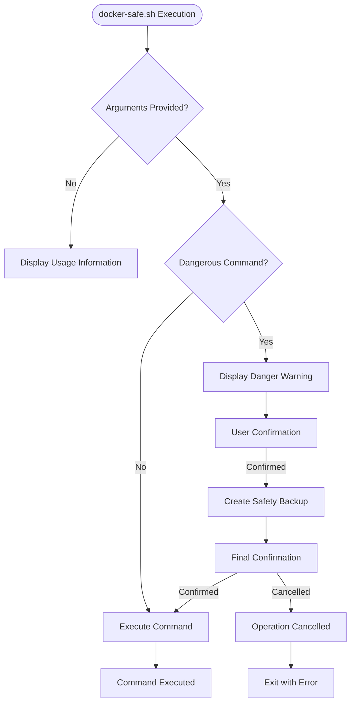
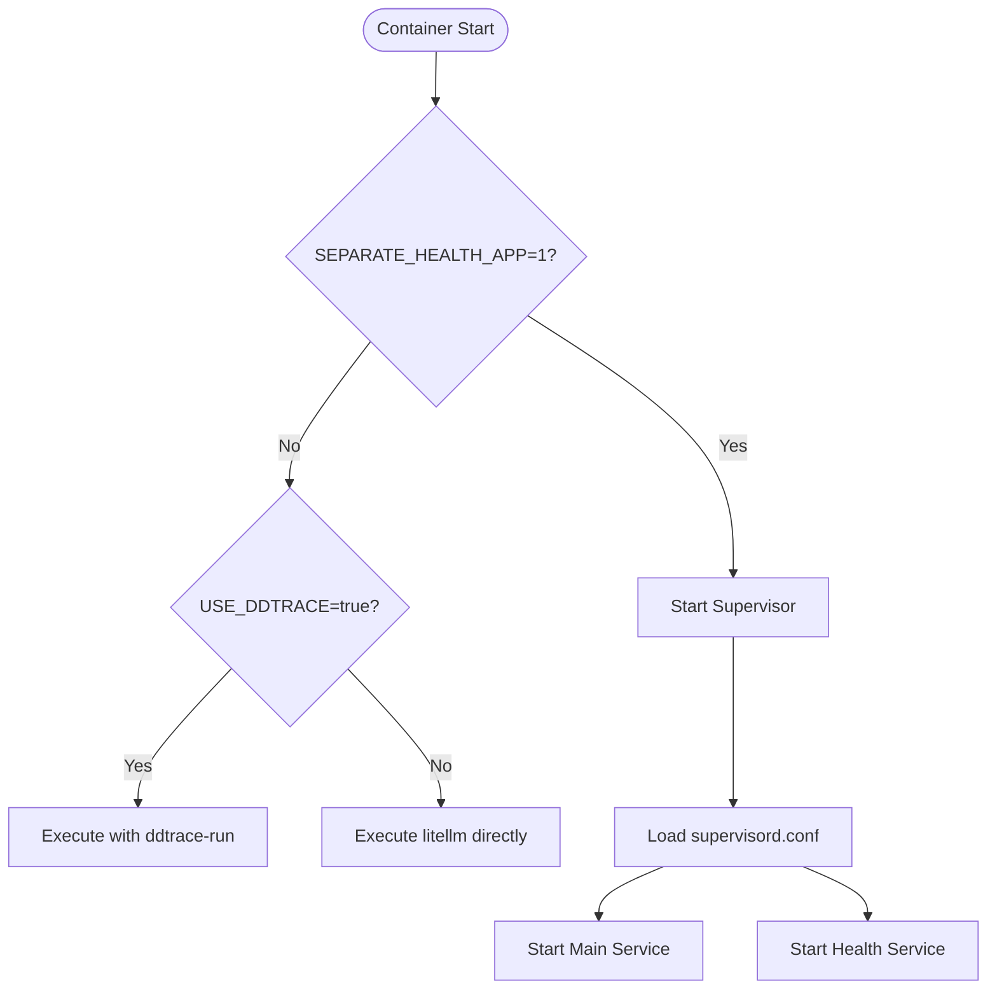
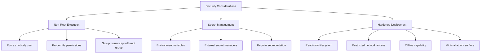
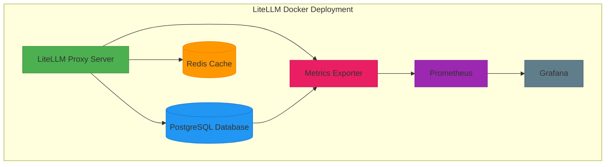

# Docker Deployment

<cite>
**Referenced Files in This Document**   
- [Dockerfile.alpine](file://docker/Dockerfile.alpine)
- [Dockerfile.dev](file://docker/Dockerfile.dev)
- [Dockerfile.database](file://docker/Dockerfile.database)
- [Dockerfile.non_root](file://docker/Dockerfile.non_root)
- [.env.example](file://docker/.env.example)
- [entrypoint.sh](file://docker/entrypoint.sh)
- [prod_entrypoint.sh](file://docker/prod_entrypoint.sh)
- [docker-safe.sh](file://scripts/docker-safe.sh)
- [supervisord.conf](file://docker/supervisord.conf)
- [build_admin_ui.sh](file://docker/build_admin_ui.sh)
- [install_auto_router.sh](file://docker/install_auto_router.sh)
- [README.md](file://docker/README.md)
- [docker-compose.yml](file://docker-compose.yml)
- [Dockerfile](file://Dockerfile)
- [nonroot.yaml](file://docker/tests/nonroot.yaml)
- [Dockerfile.ghcr_base](file://deploy/Dockerfile.ghcr_base)
- [backup.sh](file://scripts/backup.sh)
</cite>

## Table of Contents
1. [Introduction](#introduction)
2. [Dockerfile Variants](#dockerfile-variants)
3. [Build Process](#build-process)
4. [Entrypoint Configuration](#entrypoint-configuration)
5. [Environment Configuration](#environment-configuration)
6. [Security Considerations](#security-considerations)
7. [Architecture Integration](#architecture-integration)
8. [Troubleshooting Guide](#troubleshooting-guide)
9. [Performance Optimization](#performance-optimization)

## Introduction
LiteLLM provides a comprehensive Docker-based deployment system with multiple Dockerfile variants to support different deployment scenarios and requirements. The Docker deployment system is designed to be flexible, secure, and production-ready, with support for various environments from development to hardened production deployments. The system includes specialized Dockerfiles for different use cases, a robust build process using the docker-safe.sh script, and comprehensive entrypoint configurations for different runtime environments.

The Docker deployment integrates with the overall LiteLLM architecture, including the proxy server, database, and monitoring components. The deployment system emphasizes security through non-root user execution, proper secret management, and hardened configurations for production environments. This documentation provides comprehensive guidance on deploying LiteLLM using Docker, covering all aspects from configuration to troubleshooting.

**Section sources**
- [README.md](file://docker/README.md#L1-L90)
- [docker-compose.yml](file://docker-compose.yml#L1-L169)

## Dockerfile Variants
LiteLLM provides multiple Dockerfile variants to support different deployment scenarios and requirements. Each variant is optimized for specific use cases, balancing security, performance, and functionality.

### Alpine Variant
The Alpine variant (Dockerfile.alpine) uses the lightweight Alpine Linux distribution as its base image, providing a minimal footprint for production deployments. This variant is optimized for size and security, using a multi-stage build process to separate build and runtime dependencies. The build stage installs necessary compilation tools and builds the LiteLLM package, while the runtime stage contains only the required runtime dependencies. This approach reduces the attack surface and image size, making it ideal for production environments where minimalism and security are priorities.

**Section sources**
- [Dockerfile.alpine](file://docker/Dockerfile.alpine#L1-L57)

### Development Variant
The development variant (Dockerfile.dev) is designed for local development and testing. It uses a Debian-based slim image as its base, providing a more complete development environment with additional tools and libraries. This variant includes build-time optimizations such as layer caching for Python dependencies, which speeds up rebuilds during development. It also builds the Admin UI during the build process, enabling full functionality for development and testing. The development variant is not recommended for production use due to its larger size and inclusion of development tools.

**Section sources**
- [Dockerfile.dev](file://docker/Dockerfile.dev#L1-L90)

### Database Variant
The database variant (Dockerfile.database) is specifically designed for deployments that require database integration and migration capabilities. This variant includes additional tools and configurations for database management, including Prisma for database schema management and migrations. It uses the Wolfi base image from Chainguard, which is optimized for security and minimalism. The database variant includes Supervisor for process management, allowing multiple processes to run within the container, including the main LiteLLM service and health monitoring endpoints.

**Section sources**
- [Dockerfile.database](file://docker/Dockerfile.database#L1-L93)

### Non-Root Variant
The non-root variant (Dockerfile.non_root) is the most secure deployment option, designed for production environments with strict security requirements. This variant runs the LiteLLM service as a non-root user (nobody), significantly reducing the potential impact of security vulnerabilities. It includes comprehensive security hardening measures, including proper file permissions, group ownership, and read-only filesystem configurations. The non-root variant also includes pre-cached Prisma binaries and Node.js toolchain to support offline deployments and reduce network dependencies during startup.

**Section sources**
- [Dockerfile.non_root](file://docker/Dockerfile.non_root#L1-L184)

## Build Process
The Docker build process for LiteLLM is managed through the docker-safe.sh script, which provides a wrapper around docker compose commands with additional safety features. This script prevents accidental data loss by detecting and warning about dangerous commands that could delete volumes or containers.

### docker-safe.sh Script
The docker-safe.sh script implements several safety mechanisms to protect against accidental data loss. It detects dangerous commands such as docker compose down -v or docker compose rm -f and prompts for confirmation before execution. When a dangerous command is detected, the script automatically creates a safety backup using the backup.sh script before proceeding. The confirmation process requires explicit user input to prevent accidental execution.

The script also provides helpful alternatives for common operations, suggesting safer commands that achieve the same result without data loss. For example, it recommends using docker compose restart instead of docker compose down -v for service restarts. The script includes comprehensive usage documentation and can be integrated with shell aliases for convenient access to common commands.

**Diagram sources **
- [docker-safe.sh](file://scripts/docker-safe.sh#L1-L234)
- [backup.sh](file://scripts/backup.sh#L1-L421)

**Section sources**
- [docker-safe.sh](file://scripts/docker-safe.sh#L1-L234)

## Entrypoint Configuration
LiteLLM uses a two-stage entrypoint configuration system with entrypoint.sh for initialization tasks and prod_entrypoint.sh for the main runtime execution.

### Initialization Entrypoint
The entrypoint.sh script handles initialization tasks that need to be performed before the main application starts. Currently, it executes the Prisma migration script (prisma_migration.py) to ensure the database schema is up to date. The script includes error handling to verify the migration completed successfully and exits with an error code if the migration fails. This ensures the application only starts with a properly configured database schema.

**Section sources**
- [entrypoint.sh](file://docker/entrypoint.sh#L1-L14)

### Production Entrypoint
The prod_entrypoint.sh script serves as the main entrypoint for the container, handling runtime configuration and execution. It supports two execution modes: a single-process mode for standard deployments and a multi-process mode using Supervisor for deployments with separate health monitoring endpoints.

When the SEPARATE_HEALTH_APP environment variable is set to "1", the script starts Supervisor with the supervisord.conf configuration, which manages both the main LiteLLM service and a separate health monitoring application. This allows health checks to be performed independently of the main application.

For deployments using Datadog APM tracing, the script detects the USE_DDTRACE environment variable and uses ddtrace-run to execute the LiteLLM service with distributed tracing enabled. This integration allows for comprehensive monitoring and performance analysis of the deployed service.

**Diagram sources **
- [prod_entrypoint.sh](file://docker/prod_entrypoint.sh#L1-L13)
- [supervisord.conf](file://docker/supervisord.conf#L1-L42)

**Section sources**
- [prod_entrypoint.sh](file://docker/prod_entrypoint.sh#L1-L13)
- [supervisord.conf](file://docker/supervisord.conf#L1-L42)

## Environment Configuration
LiteLLM's Docker deployment uses environment variables for configuration, with a comprehensive .env.example file providing documentation and defaults for all configurable parameters.

### Environment Variables
The .env.example file defines several categories of environment variables:

- **Secrets**: The LITELLM_MASTER_KEY is required for token signing and validation. This key must be changed before production deployment.
- **Database**: The DATABASE_URL specifies the PostgreSQL database connection string for persistent storage.
- **User Authentication**: SMTP configuration variables enable email-based authentication for user key management.

The Docker deployment loads environment variables from a .env file in the project root, allowing for easy configuration without modifying Dockerfiles or compose files.

### Configuration Through docker-compose.yml
The docker-compose.yml file defines the complete deployment configuration, including services, networks, and volumes. The main services include:

- **litellm**: The main LiteLLM proxy service, configured to use the non-root Dockerfile by default.
- **db**: A PostgreSQL database service for persistent storage of keys, usage data, and configuration.
- **prometheus**: A monitoring service for collecting metrics from the LiteLLM deployment.
- **redis**: A caching service for improving performance of repeated requests.
- **grafana**: A visualization service for monitoring and analyzing LiteLLM metrics.

The compose file includes health checks for all services, ensuring proper startup and availability. It also defines named volumes for persistent data storage, preventing data loss during container restarts.

**Section sources**
- [.env.example](file://docker/.env.example#L1-L23)
- [docker-compose.yml](file://docker-compose.yml#L1-L169)

## Security Considerations
LiteLLM's Docker deployment includes several security features and best practices to protect against common container security risks.

### Non-Root User Execution
The non-root variant (Dockerfile.non_root) runs the LiteLLM service as the nobody user, significantly reducing the potential impact of security vulnerabilities. This approach follows the principle of least privilege, ensuring the application has only the minimum permissions necessary to function.

The Dockerfile includes comprehensive permission management, setting appropriate ownership and group permissions for all files and directories. It also includes group ownership with group ID 0 (root group) to allow for proper file access while maintaining security.

### Secret Management
The deployment uses environment variables for secret management, with the LITELLM_MASTER_KEY as the primary secret. The .env.example file provides a template for configuring secrets, with clear warnings to change default values before production deployment.

For production deployments, it is recommended to use external secret management solutions such as Hashicorp Vault, AWS Secrets Manager, or Kubernetes Secrets rather than environment variables in files.

### Hardened Deployment
The deployment supports hardened configurations through the docker-compose.hardened.yml file, which enables additional security features:

- Read-only root filesystem
- Restricted network egress
- Pre-cached dependencies to reduce network dependencies
- Non-root user execution

These features are designed to meet strict security requirements for production deployments in regulated environments.

**Diagram sources **
- [Dockerfile.non_root](file://docker/Dockerfile.non_root#L1-L184)
- [nonroot.yaml](file://docker/tests/nonroot.yaml#L1-L19)

**Section sources**
- [Dockerfile.non_root](file://docker/Dockerfile.non_root#L1-L184)
- [nonroot.yaml](file://docker/tests/nonroot.yaml#L1-L19)

## Architecture Integration
The Docker deployment of LiteLLM integrates with the overall architecture through several key components and services.

### Proxy Server Integration
The LiteLLM proxy server is the core component of the deployment, handling API requests and routing them to appropriate LLM providers. The Docker deployment configures the proxy server with persistent storage for keys and usage data, caching for improved performance, and comprehensive monitoring for observability.

The proxy server is configured to use the database service for persistent storage, allowing for reliable key management and usage tracking across container restarts.

### Database Integration
The deployment includes a PostgreSQL database service for persistent storage of configuration, keys, and usage data. The database is configured with a named volume (postgres_data) to ensure data persistence across container restarts.

The Prisma ORM is used for database schema management and migrations, with the entrypoint.sh script ensuring migrations are applied on startup. This ensures the database schema is always up to date with the application requirements.

### Monitoring Integration
The deployment includes a comprehensive monitoring stack with Prometheus for metrics collection and Grafana for visualization. The litellm-metrics-exporter service collects usage metrics from the database and exposes them in Prometheus format.

The monitoring configuration includes health checks for all services, ensuring proper operation and availability. The Grafana service is pre-configured with dashboards for monitoring LiteLLM performance and usage.

**Diagram sources **
- [docker-compose.yml](file://docker-compose.yml#L1-L169)
- [Dockerfile](file://Dockerfile#L1-L84)

**Section sources**
- [docker-compose.yml](file://docker-compose.yml#L1-L169)
- [Dockerfile](file://Dockerfile#L1-L84)

## Troubleshooting Guide
This section provides guidance for common issues encountered during Docker deployment of LiteLLM.

### Common Issues
**Master Key Not Initialized**: This error occurs when the LITELLM_MASTER_KEY environment variable is not set. Ensure a .env file exists in the project root with a properly configured MASTER_KEY.

**Database Migration Failures**: If database migrations fail on startup, check the database service logs for connectivity issues. Ensure the DATABASE_URL is correctly configured and the database service is running.

**Admin UI Build Failures**: If the Admin UI fails to build during the Docker build process, ensure Node.js and npm are properly installed in the build environment. The build_admin_ui.sh script includes platform-specific installation logic for different operating systems.

### Debugging Commands
The docker-safe.sh script provides several useful commands for troubleshooting:

- `./scripts/docker-safe.sh logs -f litellm`: View real-time logs from the LiteLLM service
- `./scripts/docker-safe.sh ps`: List running containers and their status
- `./scripts/docker-safe.sh restart`: Restart all services without losing data
- `./scripts/docker-safe.sh down`: Stop and remove containers (without deleting volumes)

For detailed debugging, the prod_entrypoint.sh script supports the --detailed_debug flag, which enables verbose logging output.

**Section sources**
- [README.md](file://docker/README.md#L88-L90)
- [docker-safe.sh](file://scripts/docker-safe.sh#L1-L234)

## Performance Optimization
This section provides recommendations for optimizing the performance of containerized LiteLLM deployments.

### Caching Strategies
The deployment includes Redis as a caching layer to improve performance of repeated requests. Ensure the Redis service is properly configured and monitor cache hit rates to optimize performance.

For high-traffic deployments, consider increasing the Redis memory allocation and tuning eviction policies based on access patterns.

### Resource Allocation
Proper resource allocation is critical for optimal performance. Monitor container resource usage and adjust CPU and memory limits based on observed usage patterns.

For production deployments, consider using Kubernetes or Docker Swarm for automated scaling based on resource utilization.

### Connection Pooling
The LiteLLM proxy server uses connection pooling for database connections. Ensure the connection pool size is appropriately configured for the expected load, balancing resource usage with performance requirements.

### Monitoring and Metrics
Regularly monitor performance metrics through the integrated Grafana dashboards. Key metrics to monitor include:

- Request latency
- Error rates
- Cache hit ratio
- Database query performance
- Resource utilization (CPU, memory, network)

Use these metrics to identify performance bottlenecks and optimize configuration accordingly.

**Section sources**
- [docker-compose.yml](file://docker-compose.yml#L1-L169)
- [Dockerfile](file://Dockerfile#L1-L84)