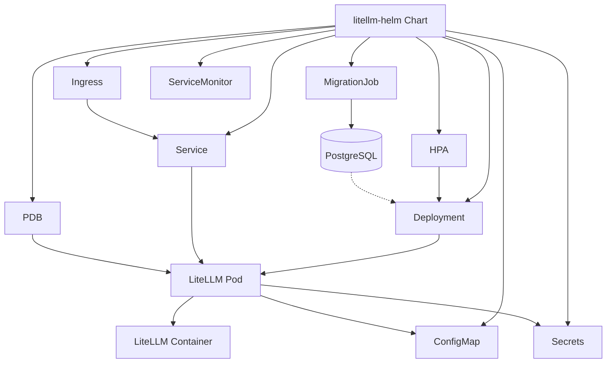
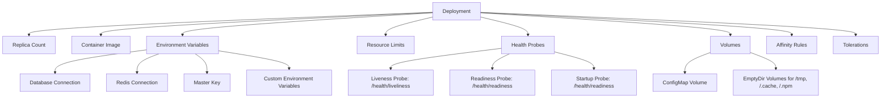
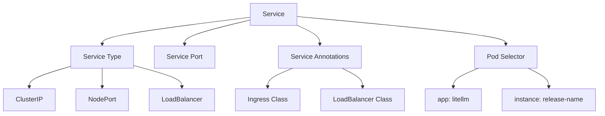
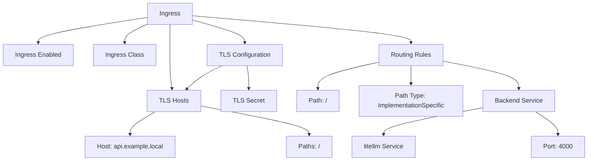
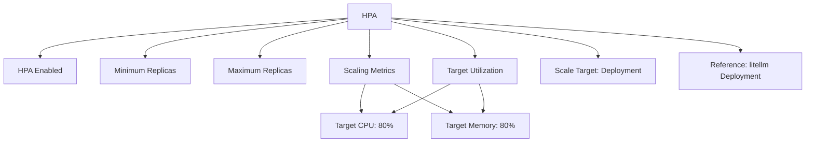
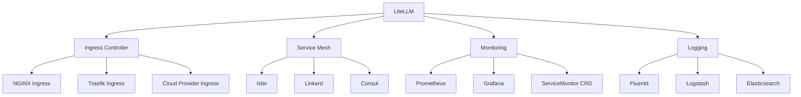
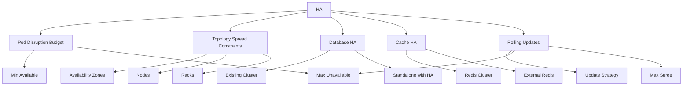
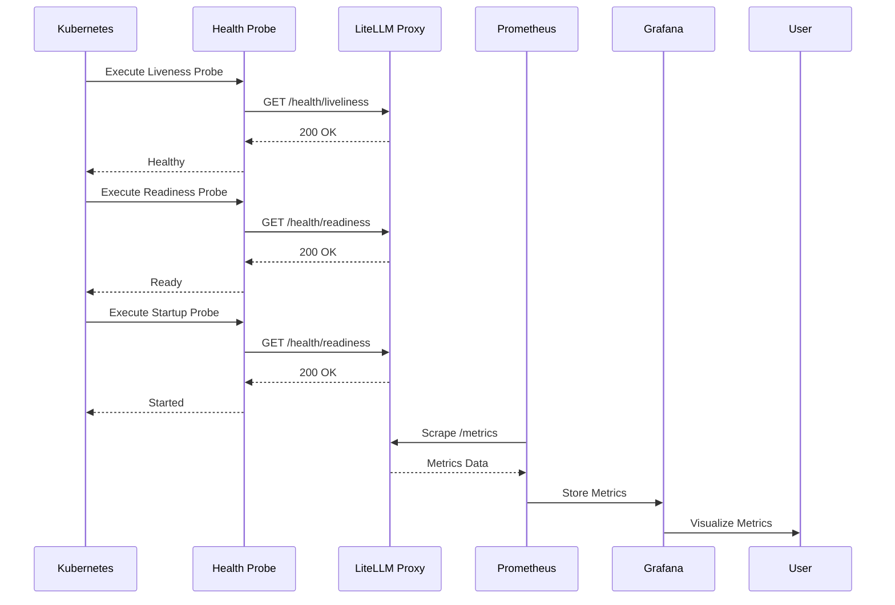

# Kubernetes Deployment

<cite>
**Referenced Files in This Document**   
- [Chart.yaml](file://deploy/charts/litellm-helm/Chart.yaml)
- [values.yaml](file://deploy/charts/litellm-helm/values.yaml)
- [deployment.yaml](file://deploy/charts/litellm-helm/templates/deployment.yaml)
- [service.yaml](file://deploy/charts/litellm-helm/templates/service.yaml)
- [ingress.yaml](file://deploy/charts/litellm-helm/templates/ingress.yaml)
- [hpa.yaml](file://deploy/charts/litellm-helm/templates/hpa.yaml)
- [poddisruptionbudget.yaml](file://deploy/charts/litellm-helm/templates/poddisruptionbudget.yaml)
- [configmap-litellm.yaml](file://deploy/charts/litellm-helm/templates/configmap-litellm.yaml)
- [migrations-job.yaml](file://deploy/charts/litellm-helm/templates/migrations-job.yaml)
- [secret-dbcredentials.yaml](file://deploy/charts/litellm-helm/templates/secret-dbcredentials.yaml)
- [secret-masterkey.yaml](file://deploy/charts/litellm-helm/templates/secret-masterkey.yaml)
- [servicemonitor.yaml](file://deploy/charts/litellm-helm/templates/servicemonitor.yaml)
- [extra-resources.yaml](file://deploy/charts/litellm-helm/templates/extra-resources.yaml)
- [kubernetes/service.yaml](file://deploy/kubernetes/service.yaml)
</cite>

## Table of Contents
1. [Introduction](#introduction)
2. [Helm Chart Structure](#helm-chart-structure)
3. [Deployment Configuration](#deployment-configuration)
4. [Service Configuration](#service-configuration)
5. [Ingress Configuration](#ingress-configuration)
6. [Horizontal Pod Autoscaler](#horizontal-pod-autoscaler)
7. [Configuration Options in values.yaml](#configuration-options-in-valuesyaml)
8. [Environment-Specific Customization](#environment-specific-customization)
9. [Integration with Kubernetes Services](#integration-with-kubernetes-services)
10. [High Availability Considerations](#high-availability-considerations)
11. [Health Checks and Metrics Integration](#health-checks-and-metrics-integration)
12. [Monitoring and Logging](#monitoring-and-logging)
13. [Troubleshooting Common Issues](#troubleshooting-common-issues)

## Introduction
This document provides comprehensive guidance on deploying LiteLLM using the Helm chart in Kubernetes environments. The Helm chart offers a complete solution for deploying the LiteLLM proxy server with all necessary components, including database integration, caching, and monitoring capabilities. The deployment is designed to be highly configurable, allowing for customization across different environments from development to production.

**Section sources**
- [Chart.yaml](file://deploy/charts/litellm-helm/Chart.yaml)
- [values.yaml](file://deploy/charts/litellm-helm/values.yaml)

## Helm Chart Structure
The LiteLLM Helm chart follows a standard structure with templates for all necessary Kubernetes resources. The chart includes deployment, service, ingress, horizontal pod autoscaler, pod disruption budget, and various supporting resources. The chart is designed to be modular, allowing components to be enabled or disabled based on requirements.

The chart dependencies include PostgreSQL and Redis, which can be deployed as standalone services when enabled. The chart uses Helm's conditional templating to include or exclude components based on configuration values. This modular approach allows for flexible deployment scenarios, from simple single-instance deployments to highly available, production-grade setups.

**Diagram sources**
- [Chart.yaml](file://deploy/charts/litellm-helm/Chart.yaml)
- [deployment.yaml](file://deploy/charts/litellm-helm/templates/deployment.yaml)
- [service.yaml](file://deploy/charts/litellm-helm/templates/service.yaml)
- [ingress.yaml](file://deploy/charts/litellm-helm/templates/ingress.yaml)
- [hpa.yaml](file://deploy/charts/litellm-helm/templates/hpa.yaml)
- [poddisruptionbudget.yaml](file://deploy/charts/litellm-helm/templates/poddisruptionbudget.yaml)

**Section sources**
- [Chart.yaml](file://deploy/charts/litellm-helm/Chart.yaml)
- [values.yaml](file://deploy/charts/litellm-helm/values.yaml)
- [deployment.yaml](file://deploy/charts/litellm-helm/templates/deployment.yaml)
- [service.yaml](file://deploy/charts/litellm-helm/templates/service.yaml)
- [ingress.yaml](file://deploy/charts/litellm-helm/templates/ingress.yaml)
- [hpa.yaml](file://deploy/charts/litellm-helm/templates/hpa.yaml)
- [poddisruptionbudget.yaml](file://deploy/charts/litellm-helm/templates/poddisruptionbudget.yaml)

## Deployment Configuration
The deployment configuration defines the LiteLLM proxy server as a Kubernetes Deployment resource. The deployment template includes comprehensive configuration options for container settings, environment variables, and pod specifications. The deployment is designed to be highly configurable, with support for resource limits, security contexts, and custom commands.

The deployment includes liveness, readiness, and startup probes that integrate with the LiteLLM health check endpoints. These probes ensure that the application is properly initialized before receiving traffic and that unhealthy instances are automatically restarted. The probes use different endpoints for liveness and readiness, allowing for more granular health monitoring.

**Diagram sources**
- [deployment.yaml](file://deploy/charts/litellm-helm/templates/deployment.yaml)
- [values.yaml](file://deploy/charts/litellm-helm/values.yaml)

**Section sources**
- [deployment.yaml](file://deploy/charts/litellm-helm/templates/deployment.yaml)
- [values.yaml](file://deploy/charts/litellm-helm/values.yaml)

## Service Configuration
The service configuration defines how the LiteLLM proxy server is exposed within the Kubernetes cluster and optionally to external clients. The service template supports multiple service types, including ClusterIP, NodePort, and LoadBalancer, allowing for flexible networking configurations.

The service configuration includes support for custom annotations and load balancer classes, enabling integration with various ingress controllers and cloud provider load balancers. The service exposes the LiteLLM proxy on port 4000 by default, which can be customized through the values.yaml configuration.

**Diagram sources**
- [service.yaml](file://deploy/charts/litellm-helm/templates/service.yaml)
- [values.yaml](file://deploy/charts/litellm-helm/values.yaml)

**Section sources**
- [service.yaml](file://deploy/charts/litellm-helm/templates/service.yaml)
- [values.yaml](file://deploy/charts/litellm-helm/values.yaml)

## Ingress Configuration
The ingress configuration enables external access to the LiteLLM proxy server through an ingress controller. The ingress resource is disabled by default and can be enabled through the values.yaml configuration. When enabled, the ingress resource supports multiple hosts and paths, allowing for flexible routing rules.

The ingress configuration includes support for TLS termination through Kubernetes secrets, enabling secure HTTPS access to the LiteLLM proxy. The ingress resource is compatible with various ingress controllers, including NGINX, Traefik, and cloud provider ingress controllers.

**Diagram sources**
- [ingress.yaml](file://deploy/charts/litellm-helm/templates/ingress.yaml)
- [values.yaml](file://deploy/charts/litellm-helm/values.yaml)

**Section sources**
- [ingress.yaml](file://deploy/charts/litellm-helm/templates/ingress.yaml)
- [values.yaml](file://deploy/charts/litellm-helm/values.yaml)

## Horizontal Pod Autoscaler
The horizontal pod autoscaler (HPA) configuration enables automatic scaling of the LiteLLM deployment based on resource utilization. The HPA is disabled by default and can be enabled through the values.yaml configuration. When enabled, the HPA scales the deployment based on CPU utilization by default, with optional support for memory utilization.

The HPA configuration includes minimum and maximum replica counts, allowing for control over scaling behavior. The target CPU utilization percentage can be customized to balance performance and resource efficiency. The HPA integrates with Kubernetes metrics server to collect resource utilization data for scaling decisions.

**Diagram sources**
- [hpa.yaml](file://deploy/charts/litellm-helm/templates/hpa.yaml)
- [values.yaml](file://deploy/charts/litellm-helm/values.yaml)

**Section sources**
- [hpa.yaml](file://deploy/charts/litellm-helm/templates/hpa.yaml)
- [values.yaml](file://deploy/charts/litellm-helm/values.yaml)

## Configuration Options in values.yaml
The values.yaml file provides comprehensive configuration options for the LiteLLM Helm chart. The configuration is organized into logical sections, including replica count, image settings, service configuration, ingress settings, resource limits, and autoscaling.

Key configuration options include:
- **replicaCount**: Number of pod replicas to deploy
- **image**: Container image repository, tag, and pull policy
- **service**: Service type and port configuration
- **ingress**: Ingress controller configuration
- **resources**: CPU and memory limits and requests
- **autoscaling**: Horizontal pod autoscaler configuration
- **db**: Database configuration, including standalone deployment or existing database
- **redis**: Redis configuration for caching
- **proxy_config**: LiteLLM proxy configuration in YAML format

The values.yaml file also includes advanced configuration options for pod disruption budgets, topology spread constraints, affinity rules, and tolerations, enabling fine-grained control over pod placement and availability.

**Section sources**
- [values.yaml](file://deploy/charts/litellm-helm/values.yaml)

## Environment-Specific Customization
The Helm chart supports environment-specific customization through values files and command-line overrides. Different environments can be configured using separate values files (e.g., values-dev.yaml, values-prod.yaml) that override the default values.yaml configuration.

For development environments, the configuration can be simplified with minimal resource requirements and disabled security features. For production environments, the configuration should include resource limits, high availability settings, and security hardening.

Example customization for different environments:
- **Development**: Single replica, minimal resources, disabled autoscaling, no TLS
- **Staging**: Multiple replicas, moderate resources, enabled autoscaling, self-signed TLS
- **Production**: Multiple replicas, adequate resources, enabled autoscaling, proper TLS certificates, high availability settings

Customization can be applied using the --values flag with helm install or helm upgrade commands, allowing for flexible deployment across different environments.

**Section sources**
- [values.yaml](file://deploy/charts/litellm-helm/values.yaml)

## Integration with Kubernetes Services
The LiteLLM Helm chart integrates with various Kubernetes services and ecosystem components. The chart supports integration with ingress controllers, service meshes, and monitoring solutions.

For ingress controllers, the chart supports NGINX, Traefik, and cloud provider ingress controllers through standard Kubernetes ingress resources. For service meshes like Istio or Linkerd, the deployment is compatible with sidecar injection and service mesh policies.

The chart also supports integration with monitoring solutions through the ServiceMonitor resource, which enables scraping metrics by Prometheus. The LiteLLM proxy exposes metrics on the /metrics endpoint, which can be collected and visualized using Prometheus and Grafana.

**Diagram sources**
- [servicemonitor.yaml](file://deploy/charts/litellm-helm/templates/servicemonitor.yaml)
- [values.yaml](file://deploy/charts/litellm-helm/values.yaml)

**Section sources**
- [servicemonitor.yaml](file://deploy/charts/litellm-helm/templates/servicemonitor.yaml)
- [values.yaml](file://deploy/charts/litellm-helm/values.yaml)

## High Availability Considerations
The LiteLLM Helm chart includes several features to support high availability deployments. The pod disruption budget (PDB) resource ensures that a minimum number of pods are available during voluntary disruptions, such as node maintenance or upgrades.

The deployment supports topology spread constraints, which can be used to distribute pods across different failure domains (e.g., availability zones). This helps to ensure that the application remains available even if an entire availability zone fails.

For database high availability, the chart supports integration with existing PostgreSQL clusters or standalone deployment with Bitnami's PostgreSQL chart, which supports high availability configurations. For caching, Redis can be deployed in standalone or clustered mode, depending on availability requirements.

Rolling update strategies are supported through Kubernetes deployment update strategies, allowing for zero-downtime updates. The deployment can be configured with maxUnavailable and maxSurge settings to control the update process and minimize impact on availability.

**Diagram sources**
- [poddisruptionbudget.yaml](file://deploy/charts/litellm-helm/templates/poddisruptionbudget.yaml)
- [values.yaml](file://deploy/charts/litellm-helm/values.yaml)

**Section sources**
- [poddisruptionbudget.yaml](file://deploy/charts/litellm-helm/templates/poddisruptionbudget.yaml)
- [values.yaml](file://deploy/charts/litellm-helm/values.yaml)

## Health Checks and Metrics Integration
The LiteLLM deployment includes comprehensive health checks and metrics integration. The deployment configuration includes liveness, readiness, and startup probes that integrate with the LiteLLM health check endpoints.

The health check endpoints provide different levels of health verification:
- **/health/liveliness**: Basic liveness check
- **/health/readiness**: Readiness check, verifying the application is ready to serve traffic
- **/metrics**: Metrics endpoint for monitoring and observability

The health checks can be configured to use separate ports for health checks, allowing for more granular monitoring and reducing the impact of health checks on the main application port.

The metrics endpoint exposes Prometheus-compatible metrics, including request rates, latencies, error rates, and resource utilization. These metrics can be scraped by Prometheus and visualized using Grafana dashboards.

**Diagram sources**
- [deployment.yaml](file://deploy/charts/litellm-helm/templates/deployment.yaml)
- [servicemonitor.yaml](file://deploy/charts/litellm-helm/templates/servicemonitor.yaml)

**Section sources**
- [deployment.yaml](file://deploy/charts/litellm-helm/templates/deployment.yaml)
- [servicemonitor.yaml](file://deploy/charts/litellm-helm/templates/servicemonitor.yaml)

## Monitoring and Logging
The LiteLLM deployment supports comprehensive monitoring and logging in Kubernetes environments. The ServiceMonitor resource enables integration with Prometheus for metrics collection, while standard Kubernetes logging mechanisms can be used for log collection.

Key metrics exposed by the LiteLLM proxy include:
- Request rate (requests per second)
- Request latency (p50, p90, p99)
- Error rate (error requests per second)
- Token usage (input/output tokens)
- Cache hit/miss ratio
- Database query performance

For logging, the LiteLLM proxy outputs structured logs that can be collected by log aggregation solutions like Fluentd, Logstash, or Datadog. The logs include request details, response information, and error messages, enabling detailed analysis and troubleshooting.

Monitoring best practices include:
- Setting up alerts for high error rates or latency
- Monitoring resource utilization to identify scaling needs
- Tracking token usage for cost management
- Monitoring cache performance to optimize caching strategy
- Using dashboards to visualize key metrics and trends

**Section sources**
- [servicemonitor.yaml](file://deploy/charts/litellm-helm/templates/servicemonitor.yaml)
- [values.yaml](file://deploy/charts/litellm-helm/values.yaml)

## Troubleshooting Common Issues
Common issues when deploying LiteLLM with the Helm chart include:

**Database Connection Issues**
- Verify database credentials in the secret
- Check database connectivity from the pod
- Ensure database is running and accessible
- Verify database URL format

**Redis Connection Issues**
- Verify Redis credentials in the secret
- Check Redis connectivity from the pod
- Ensure Redis is running and accessible
- Verify Redis URL format

**Health Check Failures**
- Check application logs for errors
- Verify health check endpoints are accessible
- Increase startup probe timeout for slow initialization
- Check resource limits and requests

**Scaling Issues**
- Verify HPA metrics are available
- Check resource utilization metrics
- Adjust target utilization percentages
- Verify minimum and maximum replica counts

**Ingress Issues**
- Verify ingress controller is installed
- Check ingress resource status
- Verify TLS certificates are valid
- Check DNS configuration

Troubleshooting steps include checking pod logs, describing Kubernetes resources, and verifying configuration values. The Helm chart provides detailed error messages and status information to aid in troubleshooting.

**Section sources**
- [deployment.yaml](file://deploy/charts/litellm-helm/templates/deployment.yaml)
- [values.yaml](file://deploy/charts/litellm-helm/values.yaml)
- [migrations-job.yaml](file://deploy/charts/litellm-helm/templates/migrations-job.yaml)
- [secret-dbcredentials.yaml](file://deploy/charts/litellm-helm/templates/secret-dbcredentials.yaml)
- [secret-masterkey.yaml](file://deploy/charts/litellm-helm/templates/secret-masterkey.yaml)