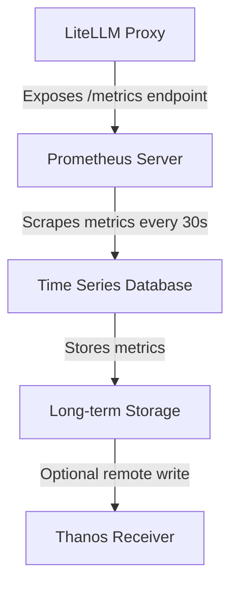
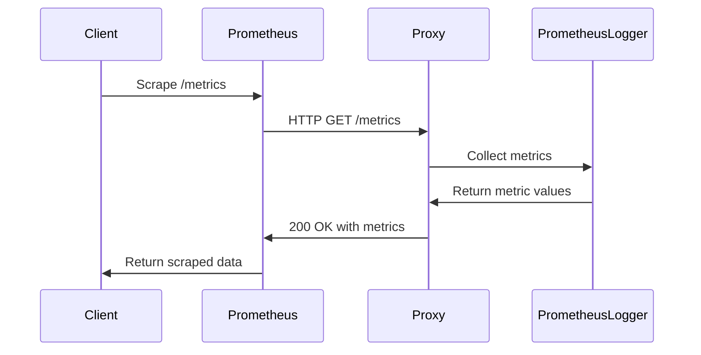
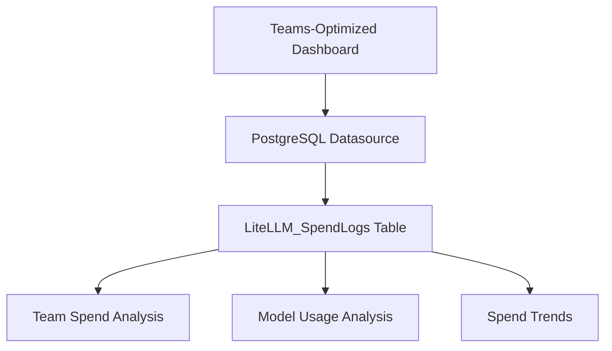
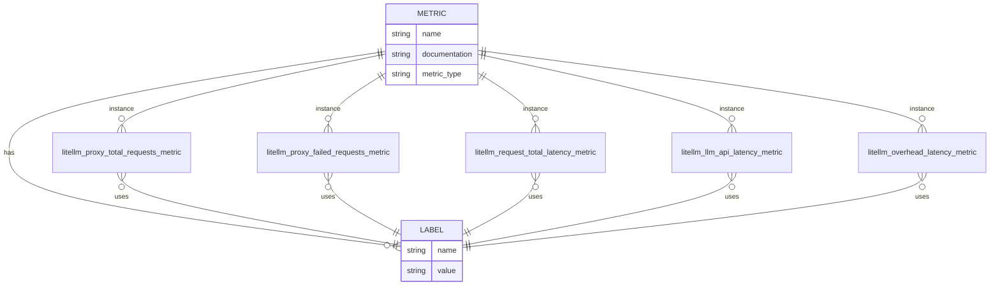
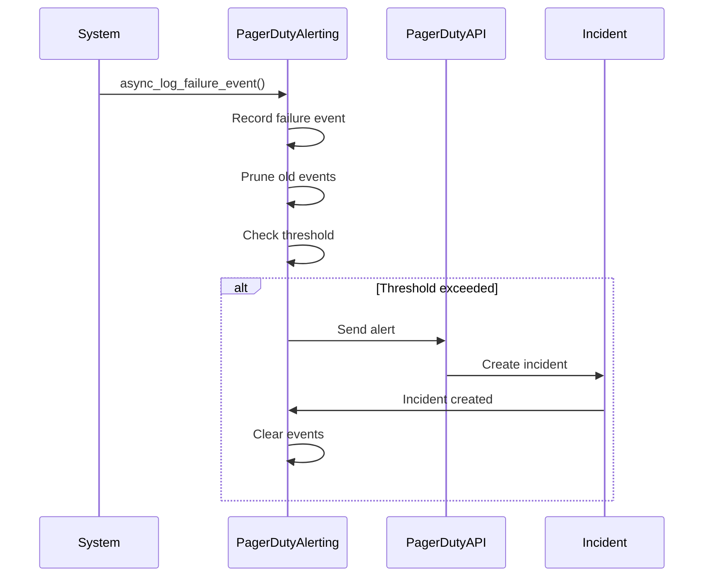
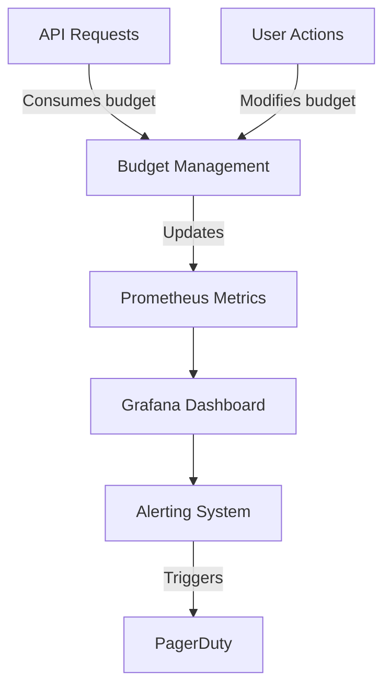

# Monitoring and Observability

<cite>
**Referenced Files in This Document**   
- [prometheus.yml](file://prometheus.yml)
- [grafana/provisioning/datasources/prometheus.yml](file://grafana/provisioning/datasources/prometheus.yml)
- [grafana/provisioning/dashboards/dashboard.yml](file://grafana/provisioning/dashboards/dashboard.yml)
- [grafana/provisioning/dashboards/teams-optimized.json](file://grafana/provisioning/dashboards/teams-optimized.json)
- [grafana/provisioning/dashboards/openwebui-simple-dashboard.json](file://grafana/provisioning/dashboards/openwebui-simple-dashboard.json)
- [litellm/integrations/prometheus.py](file://litellm/integrations/prometheus.py)
- [litellm/types/integrations/prometheus.py](file://litellm/types/integrations/prometheus.py)
- [enterprise/litellm_enterprise/enterprise_callbacks/pagerduty/pagerduty.py](file://enterprise/litellm_enterprise/enterprise_callbacks/pagerduty/pagerduty.py)
- [litellm/proxy/proxy_server.py](file://litellm/proxy/proxy_server.py)
</cite>

## Table of Contents
1. [Introduction](#introduction)
2. [Prometheus Configuration](#prometheus-configuration)
3. [Grafana Dashboard Provisioning](#grafana-dashboard-provisioning)
4. [Metrics Exposed by the System](#metrics-exposed-by-the-system)
5. [Alerting Configuration](#alerting-configuration)
6. [Integration with Rate Limiting and Budget Management](#integration-with-rate-limiting-and-budget-management)
7. [Troubleshooting Monitoring Setup](#troubleshooting-monitoring-setup)
8. [Performance Optimization for Metrics Collection](#performance-optimization-for-metrics-collection)
9. [Conclusion](#conclusion)

## Introduction
The LiteLLM platform provides comprehensive monitoring and observability capabilities for tracking the performance, usage, and cost of LLM deployments. This documentation covers the complete monitoring stack, including Prometheus metrics collection, Grafana dashboard provisioning, alerting through PagerDuty integration, and how monitoring integrates with other system components like rate limiting and budget management.

The monitoring system is designed to provide visibility into key metrics such as request rates, latency, error rates, and cost tracking across different organizational units (teams, users, models). The architecture leverages Prometheus for metrics collection and storage, Grafana for visualization, and PagerDuty for alerting on production issues.

**Section sources**
- [prometheus.yml](file://prometheus.yml#L1-L54)
- [litellm/integrations/prometheus.py](file://litellm/integrations/prometheus.py#L1-L800)

## Prometheus Configuration

### Metrics Collection Setup
The Prometheus configuration in LiteLLM is designed to collect metrics from the proxy server and expose them through a dedicated metrics endpoint. The configuration file `prometheus.yml` defines the scraping jobs and retention policies for the collected metrics.

The configuration includes:
- Global scrape interval of 30 seconds
- Multiple scrape configurations for different services
- Metric relabeling rules to categorize metrics by retention tier
- Support for remote write to long-term storage systems



**Diagram sources**
- [prometheus.yml](file://prometheus.yml#L1-L54)
- [litellm/integrations/prometheus.py](file://litellm/integrations/prometheus.py#L1-L800)

### Integration with Prometheus Middleware
The LiteLLM proxy integrates with Prometheus through a custom middleware that exposes metrics at the `/metrics` endpoint. The middleware can be configured to require authentication for accessing the metrics endpoint, which is controlled by the `require_auth_for_metrics_endpoint` setting.

When authentication is required, the middleware uses the `PrometheusAuthMiddleware` to validate API keys before allowing access to the metrics. This ensures that only authorized users can access potentially sensitive monitoring data.

The Prometheus integration is implemented as a custom logger class `PrometheusLogger` that inherits from `CustomLogger`. This logger creates various metric types (Counters, Gauges, Histograms) for tracking different aspects of the system's behavior.



**Diagram sources**
- [litellm/integrations/prometheus.py](file://litellm/integrations/prometheus.py#L51-L800)
- [litellm/proxy/proxy_server.py](file://litellm/proxy/proxy_server.py#L351-L351)

### Custom Metrics from Proxy Server
The LiteLLM proxy server exposes a comprehensive set of custom metrics that provide insights into the system's performance and usage patterns. These metrics are categorized into several groups:

- **Request metrics**: Track the total number of requests and failed requests
- **Latency metrics**: Measure request processing time at different stages
- **Token metrics**: Track input, output, and total tokens processed
- **Spend metrics**: Monitor the cost of LLM API calls
- **Budget metrics**: Track remaining and maximum budgets for teams and API keys
- **Deployment metrics**: Monitor the state and performance of LLM deployments

The metrics are implemented using the Prometheus client library and are exposed through the `/metrics` endpoint. Each metric includes relevant labels that allow for detailed filtering and aggregation, such as model, team, user, and API key.

**Section sources**
- [litellm/integrations/prometheus.py](file://litellm/integrations/prometheus.py#L68-L311)
- [litellm/types/integrations/prometheus.py](file://litellm/types/integrations/prometheus.py#L155-L188)

## Grafana Dashboard Provisioning

### Dashboard Configuration
Grafana dashboards in LiteLLM are provisioned through configuration files in the `grafana/provisioning` directory. The provisioning system automatically loads dashboards and datasources without requiring manual import through the UI.

The datasource configuration in `grafana/provisioning/datasources/prometheus.yml` defines the connection to the Prometheus server:

```yaml
apiVersion: 1
datasources:
  - name: Prometheus
    type: prometheus
    access: proxy
    url: http://prometheus:9090
    isDefault: true
    editable: false
```

This configuration sets up Prometheus as the default datasource with proxy access mode, allowing Grafana to query the Prometheus server at `http://prometheus:9090`.

**Section sources**
- [grafana/provisioning/datasources/prometheus.yml](file://grafana/provisioning/datasources/prometheus.yml#L1-L15)
- [grafana/provisioning/dashboards/dashboard.yml](file://grafana/provisioning/dashboards/dashboard.yml#L1-L12)

### Provided Dashboards
LiteLLM provides several pre-configured Grafana dashboards for monitoring different aspects of the system:

#### Teams-Optimized Dashboard
The `teams-optimized.json` dashboard is designed for monitoring usage and costs across different teams or projects. It includes:

- Total spend by team
- Monthly spend projections
- Cost distribution by team
- Model usage distribution
- Spend trends over time
- Detailed team and model tables

The dashboard uses PostgreSQL as a datasource to query the `LiteLLM_SpendLogs` table directly, providing detailed cost analysis with filters for team selection.



**Diagram sources**
- [grafana/provisioning/dashboards/teams-optimized.json](file://grafana/provisioning/dashboards/teams-optimized.json#L1-L426)

#### OpenWebUI-Simple Dashboard
The `openwebui-simple-dashboard.json` dashboard is tailored for the OpenWebUI integration, providing a simplified view of usage metrics. It includes:

- Total spend and request counts
- Token usage statistics
- User engagement metrics
- Model performance comparisons
- Cost efficiency metrics

This dashboard is specifically designed for the OpenWebUI team (identified by `user_api_key_team_alias = 'OpenWebUI'`) and includes user-level filtering to analyze individual user behavior.

**Section sources**
- [grafana/provisioning/dashboards/openwebui-simple-dashboard.json](file://grafana/provisioning/dashboards/openwebui-simple-dashboard.json#L1-L705)

### Customizing Dashboards
Dashboards can be customized to meet specific monitoring needs by modifying the JSON configuration files or creating new ones. The dashboard structure follows Grafana's standard format with panels, templating variables, and datasource queries.

To customize a dashboard:
1. Copy an existing dashboard JSON file
2. Modify the title, description, and tags
3. Adjust the templating variables for your use case
4. Update panel queries to reflect your metrics
5. Add or remove panels as needed
6. Place the modified file in the `grafana/provisioning/dashboards` directory

The templating system allows for dynamic filtering based on labels such as team, user, or model, making it easy to create reusable dashboards that can be adapted to different contexts.

**Section sources**
- [grafana/provisioning/dashboards/teams-optimized.json](file://grafana/provisioning/dashboards/teams-optimized.json#L1-L426)
- [grafana/provisioning/dashboards/openwebui-simple-dashboard.json](file://grafana/provisioning/dashboards/openwebui-simple-dashboard.json#L1-L705)

## Metrics Exposed by the System

### Request and Latency Metrics
The system exposes comprehensive metrics for monitoring request patterns and latency. These metrics include:

- `litellm_proxy_total_requests_metric`: Total number of requests made to the proxy server
- `litellm_proxy_failed_requests_metric`: Total number of failed responses from the proxy
- `litellm_request_total_latency_metric`: Total latency for requests to LiteLLM
- `litellm_llm_api_latency_metric`: Latency for LLM API calls
- `litellm_overhead_latency_metric`: Latency overhead added by LiteLLM processing

These metrics include labels for filtering by model, team, user, and other dimensions, enabling detailed analysis of performance characteristics across different segments of the system.



**Diagram sources**
- [litellm/integrations/prometheus.py](file://litellm/integrations/prometheus.py#L68-L99)
- [litellm/types/integrations/prometheus.py](file://litellm/types/integrations/prometheus.py#L191-L220)

### Error Rate and Cost Tracking
The monitoring system provides detailed metrics for tracking error rates and costs associated with LLM usage:

- `litellm_deployment_failure_responses`: Total number of failed LLM API calls
- `litellm_deployment_state`: State of LLM deployments (0=healthy, 1=partial outage, 2=complete outage)
- `litellm_spend_metric`: Total spend on LLM requests
- `litellm_remaining_team_budget_metric`: Remaining budget for teams
- `litellm_team_max_budget_metric`: Maximum budget set for teams

Error metrics include labels for exception status and class, allowing for detailed analysis of failure patterns. Cost metrics track spending at various levels of granularity, from individual requests to team-level budgets.

**Section sources**
- [litellm/integrations/prometheus.py](file://litellm/integrations/prometheus.py#L240-L259)
- [litellm/integrations/prometheus.py](file://litellm/integrations/prometheus.py#L117-L141)

### Token Usage Metrics
Token usage is tracked through several metrics that provide visibility into both input and output token consumption:

- `litellm_total_tokens_metric`: Total number of input + output tokens
- `litellm_input_tokens_metric`: Total number of input tokens
- `litellm_output_tokens_metric`: Total number of output tokens

These metrics are essential for understanding the efficiency of LLM usage and for cost allocation, as many LLM providers charge based on token consumption. The metrics include labels for model, team, and user, enabling detailed analysis of token usage patterns.

**Section sources**
- [litellm/integrations/prometheus.py](file://litellm/integrations/prometheus.py#L124-L141)

## Alerting Configuration

### PagerDuty Integration
LiteLLM integrates with PagerDuty for alerting on production issues through the `PagerDutyAlerting` class. This integration is built on top of the Slack alerting system and provides separate tracking for failed requests and hanging requests.

The PagerDuty alerting system is configured with the following parameters:
- `PAGERDUTY_API_KEY`: Required API key for authentication
- `failure_threshold`: Number of failures that trigger an alert
- `failure_threshold_window_seconds`: Time window for failure counting
- `hanging_threshold_seconds`: Duration after which a request is considered hanging
- `hanging_threshold_window_seconds`: Time window for hanging request counting



**Diagram sources**
- [enterprise/litellm_enterprise/enterprise_callbacks/pagerduty/pagerduty.py](file://enterprise/litellm_enterprise/enterprise_callbacks/pagerduty/pagerduty.py#L45-L278)

### Setting Up Meaningful Alerts
To set up effective alerts for production environments, consider the following guidelines:

1. **Failure Rate Alerts**: Configure alerts based on the failure threshold and window. For example, alert when there are more than 10 failures in a 5-minute window.

2. **Hanging Request Alerts**: Set up alerts for requests that exceed expected processing time. For example, alert when requests hang for more than 30 seconds.

3. **Budget Alerts**: Configure alerts when teams or users approach their budget limits.

4. **Latency Alerts**: Set thresholds for acceptable latency and alert when they are exceeded.

5. **Deployment State Alerts**: Monitor the `litellm_deployment_state` metric and alert on partial or complete outages.

Alerts should be configured with appropriate severity levels and escalation policies to ensure timely response to issues while avoiding alert fatigue.

**Section sources**
- [enterprise/litellm_enterprise/enterprise_callbacks/pagerduty/pagerduty.py](file://enterprise/litellm_enterprise/enterprise_callbacks/pagerduty/pagerduty.py#L45-L278)

## Integration with Rate Limiting and Budget Management

### Rate Limiting Integration
The monitoring system integrates with LiteLLM's rate limiting capabilities by exposing metrics that track remaining rate limits for API keys and models:

- `litellm_remaining_api_key_requests_for_model`: Remaining requests API key can make for a model
- `litellm_remaining_api_key_tokens_for_model`: Remaining tokens API key can make for a model
- `litellm_remaining_requests_metric`: Remaining requests for model from LLM API provider
- `litellm_remaining_tokens_metric`: Remaining tokens for model from LLM API provider

These metrics enable monitoring of rate limit usage and can be used to trigger alerts when limits are approaching exhaustion. The metrics are updated in real-time as requests are processed and rate limits are consumed.

**Section sources**
- [litellm/integrations/prometheus.py](file://litellm/integrations/prometheus.py#L197-L230)

### Budget Management Integration
The monitoring system is tightly integrated with LiteLLM's budget management features, providing real-time visibility into budget usage:

- `litellm_remaining_team_budget_metric`: Remaining budget for teams
- `litellm_team_max_budget_metric`: Maximum budget set for teams
- `litellm_team_budget_remaining_hours_metric`: Remaining hours until team budget reset
- `litellm_remaining_api_key_budget_metric`: Remaining budget for API keys
- `litellm_api_key_max_budget_metric`: Maximum budget set for API keys

These metrics are synchronized with the budget management system and reflect the current state of budget consumption. They can be used to create dashboards that show budget utilization over time and to set up alerts when budgets are nearing their limits.



**Diagram sources**
- [litellm/integrations/prometheus.py](file://litellm/integrations/prometheus.py#L143-L192)
- [litellm/budget_manager.py](file://litellm/budget_manager.py#L1-L231)

## Troubleshooting Monitoring Setup

### Common Issues and Solutions
When setting up monitoring for LiteLLM deployments, several common issues may arise:

1. **Metrics Endpoint Not Accessible**: Ensure that the `/metrics` endpoint is exposed and accessible. Check that the Prometheus middleware is properly configured and that authentication requirements are met if enabled.

2. **Missing Metrics**: Verify that the Prometheus logger is properly initialized and that the required dependencies are installed. Check the proxy server logs for any errors during metrics collection.

3. **Dashboard Data Not Loading**: Confirm that the Grafana datasource is correctly configured and can connect to the Prometheus server. Verify that the metric names in dashboard queries match the actual metrics being exposed.

4. **Authentication Issues**: When `require_auth_for_metrics_endpoint` is enabled, ensure that the correct API keys are provided when scraping metrics.

5. **Performance Impact**: If metrics collection is affecting proxy performance, consider adjusting the scrape interval or disabling less critical metrics.

**Section sources**
- [litellm/integrations/prometheus.py](file://litellm/integrations/prometheus.py#L332-L334)
- [litellm/proxy/proxy_server.py](file://litellm/proxy/proxy_server.py#L351-L351)

### Debugging Tools and Techniques
Several tools and techniques can be used to debug monitoring setup issues:

1. **Direct Metrics Endpoint Access**: Access the `/metrics` endpoint directly to verify that metrics are being exposed correctly.

2. **Prometheus Target Status**: Check the Prometheus web UI to verify that the LiteLLM target is up and being scraped successfully.

3. **Log Analysis**: Examine the proxy server logs for any errors or warnings related to metrics collection.

4. **Metric Validation**: Use the `DEFINED_PROMETHEUS_METRICS` literal in `litellm/types/integrations/prometheus.py` to validate that metric names are correct.

5. **Configuration Validation**: The Prometheus logger includes built-in validation for metric configurations, which will raise descriptive errors if invalid metrics or labels are configured.

**Section sources**
- [litellm/integrations/prometheus.py](file://litellm/integrations/prometheus.py#L336-L467)
- [litellm/types/integrations/prometheus.py](file://litellm/types/integrations/prometheus.py#L155-L188)

## Performance Optimization for Metrics Collection

### Efficient Metric Collection
To optimize the performance of metrics collection in high-traffic environments:

1. **Selective Metric Exposure**: Use the `prometheus_metrics_config` to enable only the metrics that are actually needed for monitoring and alerting.

2. **Appropriate Scrape Intervals**: Adjust the scrape interval based on the required granularity of monitoring. For most use cases, 30 seconds is sufficient.

3. **Label Cardinality Management**: Be cautious with high-cardinality labels (e.g., user IDs, request IDs) as they can significantly increase memory usage.

4. **Metric Caching**: The Prometheus logger uses a factory pattern to create metrics, which helps reduce overhead for disabled metrics.

5. **Asynchronous Processing**: The logging system is designed to handle metrics collection asynchronously to minimize impact on request processing.

**Section sources**
- [litellm/integrations/prometheus.py](file://litellm/integrations/prometheus.py#L737-L749)
- [prometheus.yml](file://prometheus.yml#L1-L54)

### Resource Considerations
When deploying the monitoring stack in production environments, consider the following resource requirements:

1. **Prometheus Server**: Allocate sufficient memory and storage based on the expected metric volume and retention period.

2. **Grafana Server**: Ensure adequate CPU and memory for rendering dashboards, especially when dealing with complex queries.

3. **Network Bandwidth**: Account for the network traffic generated by scraping metrics from multiple proxy instances.

4. **Retention Policies**: Configure appropriate retention policies to balance storage costs with historical data requirements.

5. **High Availability**: For critical production environments, consider deploying Prometheus and Grafana in high-availability configurations.

**Section sources**
- [prometheus.yml](file://prometheus.yml#L8-L13)
- [grafana/provisioning/datasources/prometheus.yml](file://grafana/provisioning/datasources/prometheus.yml#L1-L15)

## Conclusion
The monitoring and observability setup in LiteLLM provides a comprehensive solution for tracking the performance, usage, and cost of LLM deployments. By leveraging Prometheus for metrics collection, Grafana for visualization, and PagerDuty for alerting, organizations can gain deep insights into their LLM operations and ensure reliable service delivery.

The system exposes a rich set of metrics covering request rates, latency, error rates, token usage, and cost tracking, with integration to rate limiting and budget management features. The pre-configured Grafana dashboards provide immediate visibility into key performance indicators, while the flexible configuration allows for customization to meet specific monitoring needs.

By following the best practices outlined in this documentation, organizations can effectively monitor their LiteLLM deployments, set up meaningful alerts for production environments, and optimize the performance of their monitoring infrastructure.

**Section sources**
- [prometheus.yml](file://prometheus.yml#L1-L54)
- [litellm/integrations/prometheus.py](file://litellm/integrations/prometheus.py#L1-L800)
- [grafana/provisioning/dashboards/teams-optimized.json](file://grafana/provisioning/dashboards/teams-optimized.json#L1-L426)
- [enterprise/litellm_enterprise/enterprise_callbacks/pagerduty/pagerduty.py](file://enterprise/litellm_enterprise/enterprise_callbacks/pagerduty/pagerduty.py#L45-L278)