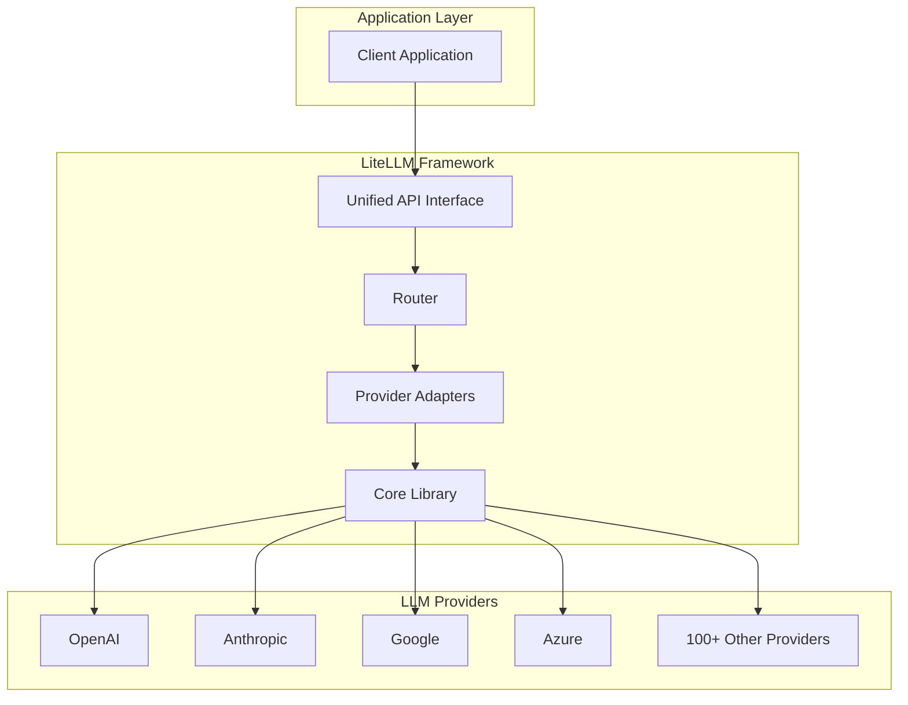
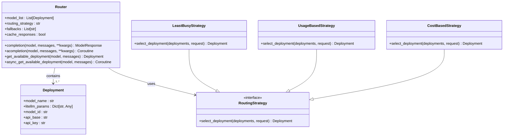
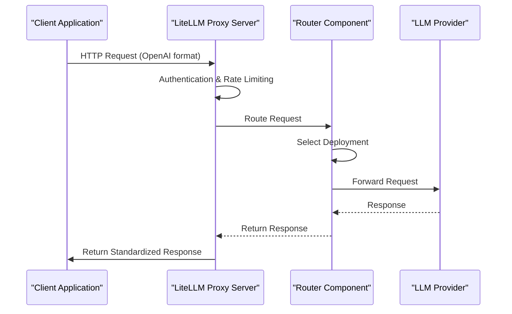

# Project Overview

<cite>
**Referenced Files in This Document**   
- [__init__.py](file://litellm/__init__.py)
- [main.py](file://litellm/main.py)
- [router.py](file://litellm/router.py)
- [proxy_server.py](file://litellm/proxy/proxy_server.py)
- [index.md](file://docs/my-website/docs/index.md)
- [pyproject.toml](file://pyproject.toml)
- [proxy_config.yaml](file://litellm/proxy/proxy_config.yaml)
</cite>

## Table of Contents
1. [Introduction](#introduction)
2. [Core Architecture](#core-architecture)
3. [Router Component](#router-component)
4. [Proxy Server](#proxy-server)
5. [Provider Adapters](#provider-adapters)
6. [Enterprise Features](#enterprise-features)
7. [Key Benefits](#key-benefits)
8. [Use Cases](#use-cases)
9. [Conclusion](#conclusion)

## Introduction

LiteLLM is a comprehensive framework designed to provide a unified API layer for over 100 different Large Language Model (LLM) providers. It enables developers to interact with diverse LLMs using a standardized interface, primarily modeled after the OpenAI API format. This standardization simplifies the integration process, allowing applications to seamlessly switch between providers or leverage multiple models without significant code changes. The framework is built around three core components: the core library for direct Python integration, the proxy server for centralized API management, and enterprise features for advanced deployment scenarios.

The primary value proposition of LiteLLM lies in its ability to abstract the complexities of interacting with various LLM APIs. It handles the translation of standardized requests into provider-specific formats and normalizes the responses back into a consistent structure. This approach not only reduces development time but also enhances application resilience through features like intelligent routing, automatic retries, and failover mechanisms. The framework supports a wide range of LLM functionalities, including chat completions, embeddings, image generation, audio transcription, and more, making it a versatile tool for building AI-powered applications.

**Section sources**
- [index.md](file://docs/my-website/docs/index.md#L1-L690)

## Core Architecture

The LiteLLM framework is structured as a multi-layered system designed for flexibility and scalability. At its foundation is the core library, which provides the essential functionality for interacting with LLMs. This library is built on a modular architecture where each LLM provider is implemented as a separate adapter. These adapters handle the specific API requirements, authentication methods, and response formats of their respective providers. The core library exposes a unified interface, primarily through the `completion()` function, which accepts standardized parameters and routes the request to the appropriate provider adapter.

The architecture is designed to be extensible, allowing for the easy addition of new provider integrations. The framework uses a dynamic routing system to determine the correct provider based on the model name specified in the request (e.g., "openai/gpt-4" or "anthropic/claude-3"). This routing is facilitated by a set of configuration parameters that map model aliases to their underlying provider implementations. The system also incorporates a robust error handling mechanism that translates provider-specific errors into standardized OpenAI-compatible exceptions, ensuring consistent error management across different services.

A key architectural principle of LiteLLM is separation of concerns. The core library focuses solely on API translation and request handling, while additional features like caching, rate limiting, and observability are implemented as pluggable components. This modular design allows users to enable or disable specific features based on their needs. The framework also supports both synchronous and asynchronous operations, providing flexibility for different application requirements. The architecture is further enhanced by a comprehensive logging and callback system that enables detailed monitoring and integration with external observability tools.

**Diagram sources **
- [__init__.py](file://litellm/__init__.py#L1-L800)
- [main.py](file://litellm/main.py#L1-L800)

**Section sources**
- [__init__.py](file://litellm/__init__.py#L1-L800)
- [main.py](file://litellm/main.py#L1-L800)

## Router Component

The Router is a central component of the LiteLLM framework that enables intelligent deployment selection and load balancing across multiple LLM endpoints. It acts as a sophisticated traffic director, allowing users to define a pool of model deployments and automatically selecting the optimal endpoint for each request based on various routing strategies. The Router is initialized with a `model_list` parameter that defines the available deployments, each with its own configuration including the provider, model name, API keys, and other parameters.

The Router supports several routing strategies to optimize performance and cost. The "simple-shuffle" strategy randomly selects from available deployments, providing basic load distribution. The "least-busy" strategy monitors the current load on each deployment and routes requests to the least utilized endpoint, helping to prevent any single deployment from becoming a bottleneck. More advanced strategies include "usage-based-routing" which considers tokens per minute (TPM) and requests per minute (RPM) limits, "latency-based-routing" which prioritizes the fastest responding deployments, and "cost-based-routing" which selects the most economical option.

The Router also implements comprehensive reliability features. It supports automatic retries and fallbacks, allowing requests to be redirected to alternative deployments if the primary choice fails. This is configured through parameters like `fallbacks`, `context_window_fallbacks`, and `content_policy_fallbacks`. The component includes built-in cooldown mechanisms that temporarily remove failing deployments from rotation to prevent repeated failures. Additionally, the Router provides detailed metrics and logging to monitor deployment performance, track success and failure rates, and analyze latency patterns.

**Diagram sources **
- [router.py](file://litellm/router.py#L1-L800)
- [router.py](file://litellm/router.py#L800-L1599)

**Section sources**
- [router.py](file://litellm/router.py#L1-L1599)

## Proxy Server

The LiteLLM Proxy Server is a standalone application that provides a centralized gateway for accessing multiple LLM providers. It operates as a reverse proxy, exposing a unified API endpoint that clients can use to interact with various LLMs without needing direct access to individual provider APIs. The proxy is implemented as a FastAPI application and can be deployed using various methods, including Docker containers, Kubernetes, or directly via Python. It serves as a critical component for enterprise deployments, offering enhanced security, monitoring, and management capabilities.

The proxy server is configured through a YAML configuration file that defines the available models, their routing parameters, and global settings. This configuration allows administrators to map model aliases to specific provider endpoints, set up authentication mechanisms, and define routing policies. The proxy supports virtual API keys, which provide a secure way to manage access to the LLM gateway. These keys can be associated with specific users, teams, or projects, enabling fine-grained access control and usage tracking.

Beyond basic routing, the proxy server offers a comprehensive suite of enterprise features. It includes built-in support for authentication and authorization, rate limiting, cost tracking, and budget management. The server integrates with various observability tools like Langfuse, Helicone, and MLflow, allowing organizations to monitor LLM usage, track costs, and analyze performance. The proxy also provides a web-based admin interface for managing keys, viewing usage statistics, and configuring system settings. This centralized management capability makes it an ideal solution for organizations that need to provide LLM access to multiple teams while maintaining control over costs and security.

**Diagram sources **
- [proxy_server.py](file://litellm/proxy/proxy_server.py#L1-L800)
- [proxy_config.yaml](file://litellm/proxy/proxy_config.yaml#L1-L10)

**Section sources**
- [proxy_server.py](file://litellm/proxy/proxy_server.py#L1-L800)
- [proxy_config.yaml](file://litellm/proxy/proxy_config.yaml#L1-L10)

## Provider Adapters

Provider adapters are the fundamental building blocks of the LiteLLM framework that enable communication with individual LLM services. Each adapter is responsible for translating the standardized LiteLLM API calls into the specific format required by its corresponding provider and converting the provider's response back into the standardized LiteLLM format. These adapters are organized within the `litellm/llms` directory, with subdirectories for each provider (e.g., `openai`, `anthropic`, `azure`, `vertex_ai`).

The adapter architecture follows a consistent pattern across all providers. Each adapter implements the core functionality for the main LLM operations: chat completions, embeddings, image generation, and audio transcription. The implementation handles provider-specific requirements such as authentication headers, endpoint URLs, parameter naming conventions, and response structures. For example, the OpenAI adapter manages the `Authorization: Bearer <api_key>` header, while the Azure adapter handles API versioning and regional endpoints.

Adapters also manage provider-specific features and limitations. They handle differences in token counting methods, context window sizes, and supported parameters. Some adapters implement additional functionality to work around provider limitations or enhance capabilities. For instance, the framework includes adapters for open-source models running on platforms like Ollama and Hugging Face, as well as for specialized services like Google's Vertex AI and Amazon's Bedrock. The adapter system is designed to be extensible, allowing developers to create custom adapters for new or proprietary LLM services.

**Section sources**
- [main.py](file://litellm/main.py#L1-L800)
- [__init__.py](file://litellm/__init__.py#L1-L800)

## Enterprise Features

LiteLLM provides a comprehensive set of enterprise-grade features designed to meet the needs of organizations deploying LLMs at scale. These features extend beyond the core functionality to address critical concerns around security, cost management, observability, and operational efficiency. The enterprise capabilities are particularly evident in the proxy server implementation, which serves as a centralized gateway for LLM access across an organization.

One of the key enterprise features is comprehensive cost tracking and budget management. The framework can track usage and costs across multiple providers and projects, allowing organizations to set budgets and receive alerts when spending thresholds are approached. This is particularly valuable for managing costs across different teams or departments. The system supports both soft and hard budgets, with configurable reset intervals (e.g., daily, monthly). Detailed usage reports can be generated to analyze spending patterns and optimize resource allocation.

Security and access control are addressed through a robust authentication and authorization system. The proxy server supports virtual API keys that can be scoped to specific users, teams, or projects. These keys can have associated rate limits, model restrictions, and expiration dates. The framework also supports integration with enterprise identity providers through SSO (Single Sign-On) and can enforce organization-wide policies such as banned keywords or content moderation. Additional security features include support for Azure Key Vault and AWS KMS for secure credential management.

Observability and monitoring are enhanced through integrations with popular tools like Langfuse, Helicone, MLflow, and Datadog. These integrations allow organizations to track LLM usage, monitor performance metrics, and analyze the quality of model outputs. The framework supports detailed logging of both input prompts and output responses, which can be invaluable for debugging, auditing, and compliance purposes. Enterprise users also benefit from a web-based admin interface that provides a centralized dashboard for managing keys, viewing usage statistics, and configuring system settings.

**Section sources**
- [proxy_server.py](file://litellm/proxy/proxy_server.py#L1-L800)
- [pyproject.toml](file://pyproject.toml#L1-L183)

## Key Benefits

LiteLLM offers several significant benefits that make it a valuable tool for developers and organizations working with LLMs. The primary advantage is standardization, which allows developers to write code once and deploy it across multiple LLM providers. This reduces vendor lock-in and provides flexibility to switch providers based on cost, performance, or feature requirements. The unified API interface means that applications can leverage the strengths of different models (e.g., using GPT-4 for complex reasoning and Claude for long-context tasks) without significant code changes.

Intelligent routing and failover capabilities enhance application reliability and performance. The Router component can automatically distribute load across multiple deployments, preventing any single endpoint from becoming overwhelmed. In the event of a provider outage or rate limit being reached, the system can automatically fail over to alternative deployments, ensuring continuous service availability. This resilience is critical for production applications where downtime can have significant business impacts.

Cost optimization is another major benefit. By supporting multiple providers and implementing cost-based routing, LiteLLM helps organizations minimize their LLM expenses. The framework can automatically select the most economical option for a given request, and the detailed cost tracking features enable proactive budget management. This is particularly valuable for applications with high LLM usage, where even small cost savings can translate into significant financial benefits over time.

The framework's extensibility and integration capabilities further enhance its value. With support for over 100 providers and numerous observability tools, LiteLLM can be adapted to fit a wide range of use cases and existing technology stacks. The modular architecture allows organizations to enable only the features they need, keeping the system lightweight and efficient. The comprehensive documentation and active community support make it easier for teams to adopt and effectively use the framework.

**Section sources**
- [index.md](file://docs/my-website/docs/index.md#L1-L690)
- [pyproject.toml](file://pyproject.toml#L1-L183)

## Use Cases

LiteLLM is designed to support a wide range of use cases, from simple development scenarios to complex enterprise deployments. One common use case is multi-provider setups, where organizations want to leverage the strengths of different LLM providers. For example, a company might use GPT-4 for high-quality text generation, Claude for processing long documents, and a cost-effective open-source model for simpler tasks. LiteLLM's routing capabilities make it easy to implement such hybrid architectures, automatically directing requests to the most appropriate model based on the task requirements.

Failover configurations are another important use case, particularly for mission-critical applications. By defining fallback models in the configuration, organizations can ensure that their applications remain functional even if a primary provider experiences an outage or rate limiting. For instance, a configuration might specify that if OpenAI's API is unavailable, requests should be routed to Anthropic's Claude models. This redundancy improves application reliability and user experience.

The framework is also well-suited for organizations implementing LLM gateways for multiple teams or departments. The proxy server can serve as a centralized entry point, providing consistent access to LLMs while enabling centralized management of costs, security policies, and usage tracking. This is particularly valuable for large enterprises where different teams might have varying LLM requirements but need to adhere to organization-wide policies and budget constraints.

Other common use cases include A/B testing of different models, gradual migration from one provider to another, and implementing cost-optimization strategies. Developers can use LiteLLM to easily compare the performance and output quality of different models, making data-driven decisions about which models to use for specific tasks. The framework's flexibility also makes it ideal for prototyping and experimentation, allowing teams to quickly test new models or providers without significant integration effort.

**Section sources**
- [index.md](file://docs/my-website/docs/index.md#L1-L690)
- [proxy_config.yaml](file://litellm/proxy/proxy_config.yaml#L1-L10)

## Conclusion

LiteLLM has established itself as a critical tool in the LLM ecosystem by addressing the fragmentation and complexity inherent in working with multiple language model providers. Its position as a unified API layer fills a significant gap, providing developers and organizations with a standardized interface that simplifies integration, enhances reliability, and optimizes costs. The framework's value proposition is particularly strong for enterprises that need to manage LLM usage across multiple teams, enforce security policies, and control costs at scale.

The project's architecture, centered around the core library, proxy server, and enterprise features, demonstrates a thoughtful approach to solving real-world problems in LLM deployment. The Router component's intelligent routing and failover capabilities provide resilience and performance optimization, while the proxy server offers centralized management and enhanced security. The extensive support for provider adapters ensures compatibility with a wide range of models, from major commercial providers to open-source alternatives.

Looking ahead, LiteLLM is well-positioned to continue evolving with the rapidly changing LLM landscape. Its modular design and active development community suggest that it will remain adaptable to new providers, features, and use cases. For developers, it offers a powerful tool to accelerate AI application development, while for enterprises, it provides the governance and cost management capabilities needed for responsible LLM adoption. As the use of language models becomes increasingly pervasive, frameworks like LiteLLM will play a crucial role in making these technologies accessible, reliable, and manageable.

**Section sources**
- [index.md](file://docs/my-website/docs/index.md#L1-L690)
- [pyproject.toml](file://pyproject.toml#L1-L183)