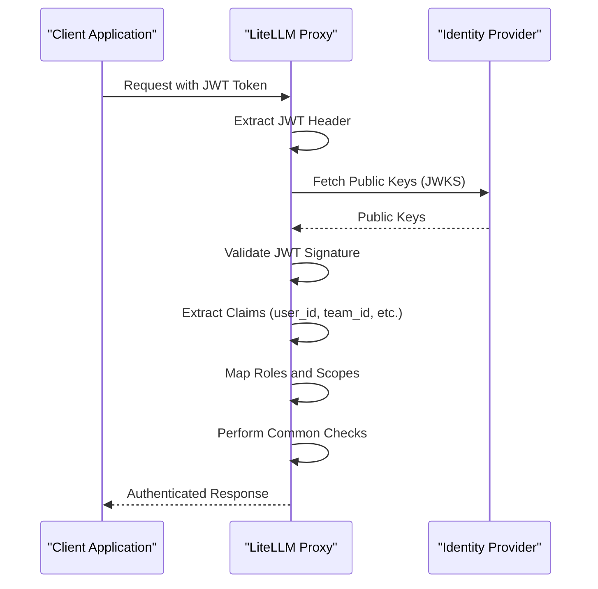
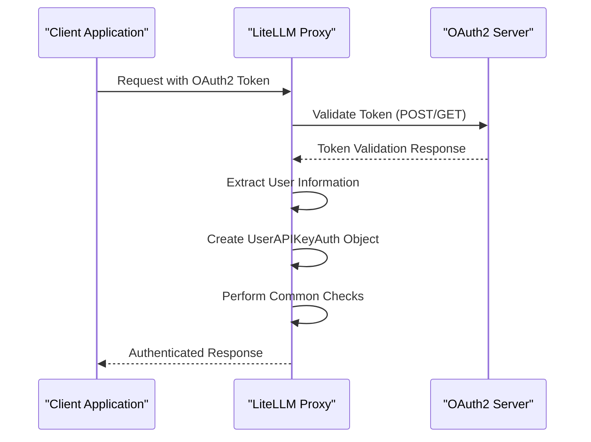
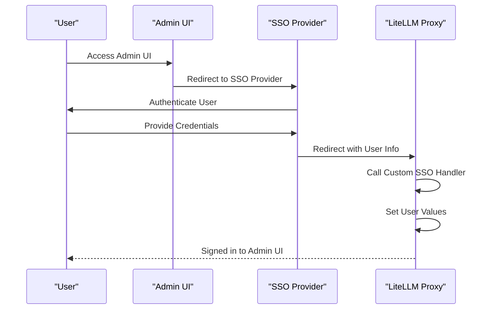
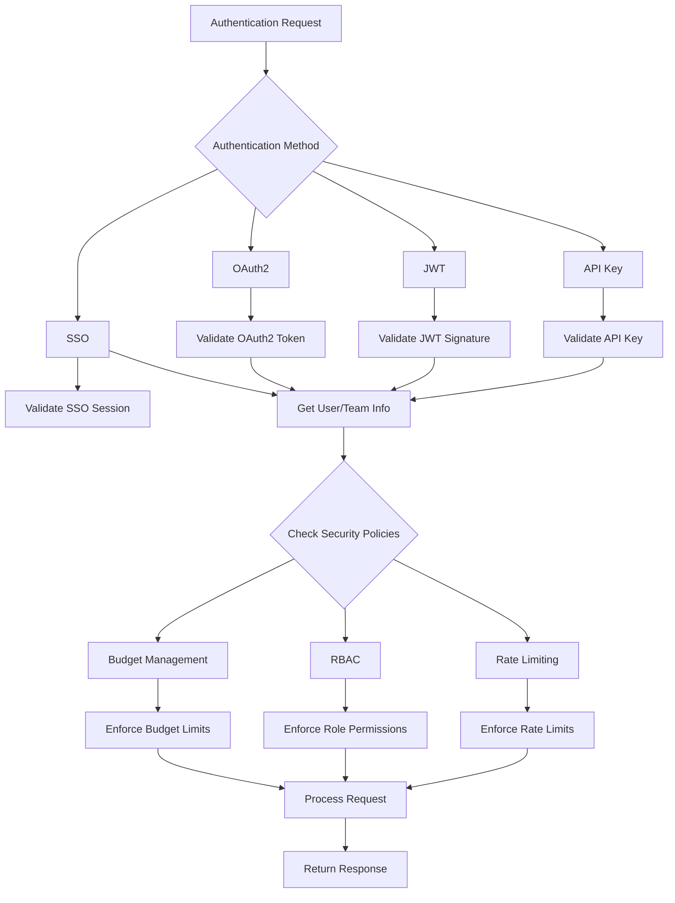
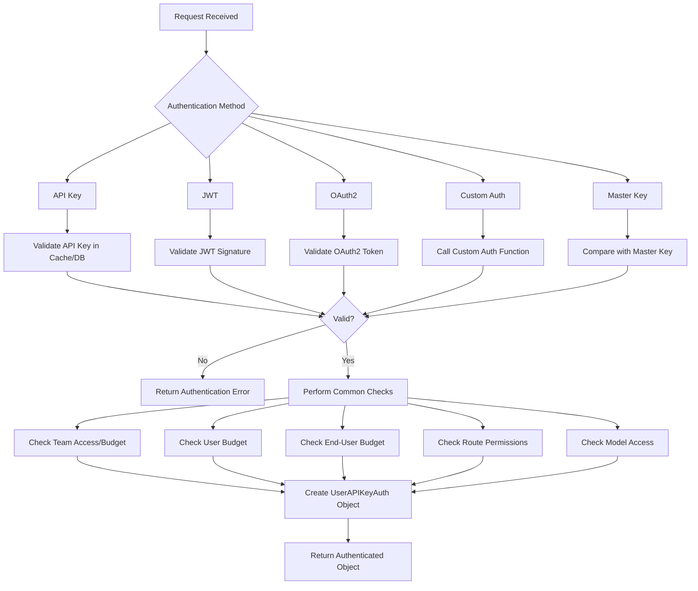

# Authentication

<cite>
**Referenced Files in This Document**   
- [user_api_key_auth.py](file://litellm/proxy/auth/user_api_key_auth.py)
- [handle_jwt.py](file://litellm/proxy/auth/handle_jwt.py)
- [oauth2_check.py](file://litellm/proxy/auth/oauth2_check.py)
- [oauth2_proxy_hook.py](file://litellm/proxy/auth/oauth2_proxy_hook.py)
- [custom_sso.py](file://litellm/proxy/custom_sso.py)
- [auth_utils.py](file://litellm/proxy/auth/auth_utils.py)
- [auth_checks.py](file://litellm/proxy/auth/auth_checks.py)
- [route_checks.py](file://litellm/proxy/auth/route_checks.py)
- [proxy_config.yaml](file://litellm/proxy/proxy_config.yaml)
- [custom_auth_auto.py](file://litellm/proxy/custom_auth_auto.py)
- [custom_validate.py](file://litellm/proxy/custom_validate.py)
</cite>

## Table of Contents
1. [Introduction](#introduction)
2. [API Key Authentication](#api-key-authentication)
3. [JWT-Based Authentication](#jwt-based-authentication)
4. [OAuth2 Authentication](#oauth2-authentication)
5. [SSO Integration](#sso-integration)
6. [Configuration Examples](#configuration-examples)
7. [Security Integration](#security-integration)
8. [Common Issues and Best Practices](#common-issues-and-best-practices)
9. [Authentication Flow](#authentication-flow)

## Introduction

LiteLLM provides a comprehensive multi-method authentication system that supports various authentication mechanisms including API keys, JWT tokens, OAuth2, and SSO integration. The authentication system is designed to be flexible and secure, allowing organizations to implement the authentication method that best fits their security requirements and infrastructure.

The authentication system is implemented in the `litellm/proxy/auth` directory and integrates with various components of the LiteLLM proxy server. It supports both simple and enterprise-grade authentication scenarios, from basic API key validation to complex role-based access control with JWT tokens and OAuth2 integration.

This document provides a detailed explanation of the authentication sub-features in LiteLLM, focusing on the implementation and configuration of different authentication methods, their lifecycle management, and integration with other security features.

**Section sources**
- [user_api_key_auth.py](file://litellm/proxy/auth/user_api_key_auth.py#L1-L800)
- [handle_jwt.py](file://litellm/proxy/auth/handle_jwt.py#L1-L800)

## API Key Authentication

API key authentication is the primary method for authenticating requests to the LiteLLM proxy. The system supports various API key formats and provides comprehensive lifecycle management for API keys including generation, validation, rotation, and revocation.

The authentication process begins with the extraction of the API key from the request headers. LiteLLM supports multiple header formats including the standard `Authorization: Bearer <api_key>` format, as well as custom headers like `X-LiteLLM-Key`. The `user_api_key_auth.py` file contains the core logic for API key authentication, handling the validation of API keys against the database or cache.

API key validation involves several steps:
1. Extracting the API key from the request headers
2. Checking if the API key is a master key (admin access)
3. Validating the API key against the database or cache
4. Performing common checks such as team access, budget limits, and rate limiting

The system also supports virtual keys, which are API keys with specific permissions and restrictions. Virtual keys can be configured with allowed routes, model access, and rate limits, providing fine-grained control over API access.

For API key lifecycle management, LiteLLM provides endpoints for generating new keys, rotating existing keys, and revoking compromised keys. The system also supports key expiration, where API keys can be configured to expire after a certain period, enhancing security by automatically invalidating old keys.

**Section sources**
- [user_api_key_auth.py](file://litellm/proxy/auth/user_api_key_auth.py#L108-L130)
- [auth_utils.py](file://litellm/proxy/auth/auth_utils.py#L622-L624)

## JWT-Based Authentication

JWT-based authentication in LiteLLM provides a robust mechanism for secure authentication using JSON Web Tokens. This authentication method is particularly useful for enterprise deployments where integration with existing identity providers is required.

The JWT authentication system is implemented in the `handle_jwt.py` file and is controlled by the `enable_jwt_auth` configuration option in the proxy configuration. When enabled, the system validates JWT tokens presented in the `Authorization: Bearer <token>` header.

The JWT authentication process involves several key components:

1. **Token Validation**: The system validates the JWT signature using public keys obtained from a configured JWKS (JSON Web Key Set) endpoint. The public keys are cached to improve performance and reduce the number of external requests.

2. **Role Mapping**: JWT tokens can contain role information that is mapped to LiteLLM's internal user roles. The system supports custom role mapping through the `role_mappings` configuration, allowing organizations to map their existing roles to LiteLLM roles.

3. **Scope-Based Access**: The system can enforce access control based on JWT scopes. This allows fine-grained control over which routes and models a user can access based on their token scopes.

4. **User Information Extraction**: The system extracts user information from JWT claims, including user ID, team ID, organization ID, and email. This information is used for rate limiting, budget tracking, and audit logging.

The JWT authentication system also supports OIDC (OpenID Connect) integration, allowing users to authenticate through identity providers that support the OIDC protocol. This is configured using the `oidc_userinfo_endpoint` setting, which specifies the endpoint to retrieve user information.



**Diagram sources**
- [handle_jwt.py](file://litellm/proxy/auth/handle_jwt.py#L1-L800)
- [user_api_key_auth.py](file://litellm/proxy/auth/user_api_key_auth.py#L500-L535)

**Section sources**
- [handle_jwt.py](file://litellm/proxy/auth/handle_jwt.py#L1-L800)
- [user_api_key_auth.py](file://litellm/proxy/auth/user_api_key_auth.py#L460-L604)

## OAuth2 Authentication

LiteLLM supports OAuth2 authentication through two different mechanisms: standard OAuth2 token validation and OAuth2 proxy authentication. These mechanisms are designed to integrate with existing OAuth2 infrastructure and provide secure authentication for machine-to-machine (M2M) communication.

The standard OAuth2 authentication is implemented in the `oauth2_check.py` file and is controlled by the `enable_oauth2_auth` configuration option. This mechanism validates OAuth2 access tokens by making requests to a token introspection endpoint or a token info endpoint.

The OAuth2 authentication process supports two types of endpoints:

1. **Token Introspection Endpoint (RFC 7662)**: This is a POST endpoint that requires client authentication. The proxy sends the token to be validated along with client credentials, and the endpoint returns information about the token's validity and associated user information.

2. **Token Info Endpoint**: This is a GET endpoint that uses the Bearer token for authentication. The proxy sends a request with the token in the Authorization header, and the endpoint returns user information if the token is valid.

The OAuth2 proxy authentication, implemented in `oauth2_proxy_hook.py`, is designed to work with OAuth2 proxy solutions like Google's Identity-Aware Proxy (IAP). This mechanism extracts user information from HTTP headers set by the OAuth2 proxy and creates a `UserAPIKeyAuth` object based on this information.

The OAuth2 authentication system extracts user information from the token response, including user ID, user role, and team ID. This information is used for access control, rate limiting, and audit logging. The system also supports custom field names for these attributes through environment variables like `OAUTH_USER_ID_FIELD_NAME` and `OAUTH_USER_ROLE_FIELD_NAME`.



**Diagram sources**
- [oauth2_check.py](file://litellm/proxy/auth/oauth2_check.py#L1-L223)
- [oauth2_proxy_hook.py](file://litellm/proxy/auth/oauth2_proxy_hook.py#L1-L46)

**Section sources**
- [oauth2_check.py](file://litellm/proxy/auth/oauth2_check.py#L1-L223)
- [oauth2_proxy_hook.py](file://litellm/proxy/auth/oauth2_proxy_hook.py#L1-L46)

## SSO Integration

LiteLLM provides flexible SSO (Single Sign-On) integration capabilities that allow organizations to integrate the proxy with their existing identity providers. The SSO system is designed to be extensible, allowing custom SSO handlers to be implemented for specific identity providers.

The SSO integration is implemented through the `custom_sso.py` file, which provides an example of a custom SSO handler. This handler is called after LiteLLM has retrieved user information from the identity provider, allowing custom logic to be executed before the user is signed in to the Admin UI.

The SSO flow works as follows:
1. The user lands on the Admin UI
2. LiteLLM redirects the user to the configured SSO provider
3. The SSO provider authenticates the user and redirects back to LiteLLM
4. LiteLLM retrieves user information from the identity provider
5. The custom SSO handler is called with the user information
6. The handler returns an `SSOUserDefinedValues` object with user-specific settings
7. The user is signed in to the Admin UI

The custom SSO handler can perform various tasks, such as:
- Checking if the user exists in the LiteLLM proxy database
- Setting default values for the user (models, budget, role, etc.)
- Implementing custom business logic for user provisioning

The system supports multiple SSO providers through environment variables like `MICROSOFT_CLIENT_ID`, `GOOGLE_CLIENT_ID`, and `GENERIC_CLIENT_ID`. These variables configure the connection to the respective identity providers.



**Diagram sources**
- [custom_sso.py](file://litellm/proxy/custom_sso.py#L1-L45)

**Section sources**
- [custom_sso.py](file://litellm/proxy/custom_sso.py#L1-L45)
- [auth_utils.py](file://litellm/proxy/auth/auth_utils.py#L502-L517)

## Configuration Examples

The authentication system in LiteLLM is configured through the `proxy_config.yaml` file, which allows administrators to enable and configure different authentication methods. The configuration file supports various settings for authentication, including enabling specific authentication methods and setting up integration with external services.

Here are examples of configuration for different authentication methods:

**JWT Authentication Configuration:**
```yaml
general_settings:
  enable_jwt_auth: true
  jwt_public_key_url: "https://your-domain.com/.well-known/jwks.json"
  jwt_audience: "your-audience"
  jwt_admin_scope: "litellm_proxy_admin"
  user_allowed_email_domain: "your-company.com"
```

**OAuth2 Authentication Configuration:**
```yaml
general_settings:
  enable_oauth2_auth: true
  oauth_token_info_endpoint: "https://your-oauth-server.com/token_info"
  oauth_client_id: "your-client-id"
  oauth_client_secret: "your-client-secret"
  oauth_user_id_field_name: "sub"
  oauth_user_role_field_name: "role"
  oauth_user_team_id_field_name: "team_id"
```

**OAuth2 Proxy Authentication Configuration:**
```yaml
general_settings:
  enable_oauth2_proxy_auth: true
  oauth2_config_mappings:
    user_id: "X-Goog-Authenticated-User-Email"
    user_email: "X-Goog-Authenticated-User-Email"
    max_budget: "X-Custom-Budget"
    models: "X-Custom-Models"
```

**Custom Authentication Configuration:**
```yaml
general_settings:
  custom_auth: "path.to.your.custom_auth_function"
  allow_user_auth: true
  public_routes:
    - "LiteLLMRoutes.public_routes"
    - "/spend/calculate"
    - "/api/*"
```

The configuration also supports advanced settings for role-based access control, route restrictions, and budget management. For example, administrators can define allowed routes for specific roles or configure default budgets for end users.

**Section sources**
- [proxy_config.yaml](file://litellm/proxy/proxy_config.yaml#L1-L10)
- [custom_auth_auto.py](file://litellm/proxy/custom_auth_auto.py#L1-L32)
- [custom_validate.py](file://litellm/proxy/custom_validate.py#L1-L6)

## Security Integration

The authentication system in LiteLLM is tightly integrated with other security features such as rate limiting, RBAC (Role-Based Access Control), and budget management. This integration ensures that authenticated users are subject to appropriate security controls based on their roles and permissions.

**Rate Limiting Integration:**
The authentication system provides user and team information that is used by the rate limiting system to enforce rate limits at different levels:
- Global rate limits for the entire proxy
- Team-level rate limits based on the team associated with the API key
- User-level rate limits for individual users
- Model-specific rate limits for specific models

The rate limiting system uses the `UserAPIKeyAuth` object returned by the authentication system to determine the appropriate rate limits for each request.

**RBAC Integration:**
The authentication system implements a comprehensive RBAC model with several user roles:
- `PROXY_ADMIN`: Full administrative access to all routes and functionality
- `TEAM`: Access to team-specific routes and functionality
- `INTERNAL_USER`: Access to internal user routes and functionality
- `CUSTOMER`: Customer-specific access with limited permissions

The RBAC system enforces access control based on the user's role, ensuring that users can only access routes and functionality appropriate to their role. The system also supports custom roles through JWT token claims and OAuth2 scopes.

**Budget Management Integration:**
The authentication system integrates with the budget management system to enforce spending limits at multiple levels:
- Global proxy budget (`litellm.max_budget`)
- Team budgets (`team_object.max_budget`)
- User budgets (`user_object.max_budget`)
- End-user budgets (`end_user_object.litellm_budget_table.max_budget`)

When a user exceeds their budget, the system raises a `BudgetExceededError`, preventing further usage until the budget is increased or reset.

The authentication system also supports virtual key budget checks, where API keys can have soft and hard budget limits that trigger alerts or block usage when exceeded.



**Diagram sources**
- [auth_checks.py](file://litellm/proxy/auth/auth_checks.py#L76-L282)
- [user_api_key_auth.py](file://litellm/proxy/auth/user_api_key_auth.py#L588-L600)

**Section sources**
- [auth_checks.py](file://litellm/proxy/auth/auth_checks.py#L76-L282)
- [user_api_key_auth.py](file://litellm/proxy/auth/user_api_key_auth.py#L588-L600)

## Common Issues and Best Practices

When implementing and managing the authentication system in LiteLLM, several common issues may arise. Understanding these issues and following best practices can help ensure a secure and reliable authentication setup.

**Token Expiration:**
One common issue is token expiration, particularly with JWT and OAuth2 tokens. To handle this:
- Implement token refresh mechanisms in client applications
- Set appropriate token expiration times based on security requirements
- Monitor for `Token Expired` errors and implement retry logic with token refresh
- Use short-lived tokens for higher security and longer-lived tokens for better performance

**Key Leakage Prevention:**
Preventing API key leakage is critical for security. Best practices include:
- Never hardcode API keys in source code or configuration files
- Use environment variables or secret management systems to store API keys
- Rotate API keys regularly and revoke compromised keys immediately
- Implement logging controls to prevent API keys from being logged
- Use the `abbreviate_api_key` function to display only the last four characters of API keys in logs and UI

**Secure Storage of Credentials:**
For secure storage of credentials:
- Use dedicated secret management systems like Hashicorp Vault, AWS Secrets Manager, or Google Secret Manager
- Implement encryption at rest for stored credentials
- Use environment variables for development and testing environments
- Implement access controls for who can view or modify credentials
- Regularly audit credential usage and access

**Configuration Best Practices:**
- Enable only the authentication methods that are required
- Use strong, randomly generated master keys
- Implement proper error handling to avoid leaking sensitive information
- Regularly review and update authentication configurations
- Test authentication flows thoroughly in staging environments before deploying to production

**Section sources**
- [auth_utils.py](file://litellm/proxy/auth/auth_utils.py#L622-L624)
- [user_api_key_auth.py](file://litellm/proxy/auth/user_api_key_auth.py#L731-L753)

## Authentication Flow

The authentication flow in LiteLLM is a comprehensive process that handles various authentication methods and performs multiple validation checks. The flow begins when a request is received by the proxy and ends when an authenticated `UserAPIKeyAuth` object is returned or an authentication error is raised.

The authentication flow can be summarized as follows:

1. **Request Reception**: The proxy receives a request with authentication credentials in the headers.

2. **Authentication Method Detection**: The system determines which authentication method to use based on the configuration and request headers.

3. **Credential Extraction**: The authentication credentials are extracted from the request headers.

4. **Authentication Processing**: The appropriate authentication handler processes the credentials:
   - For API keys: Validate against database or cache
   - For JWT: Validate signature and extract claims
   - For OAuth2: Validate token with external service
   - For SSO: Process SSO callback and user information

5. **Common Checks**: After successful authentication, the system performs common checks including:
   - Team access and budget limits
   - User budget limits
   - End-user budget limits
   - Route access permissions
   - Model access permissions

6. **UserAPIKeyAuth Object Creation**: A `UserAPIKeyAuth` object is created with the authenticated user's information and permissions.

7. **Response**: The authenticated `UserAPIKeyAuth` object is returned for further processing, or an authentication error is raised.

The authentication flow is implemented in the `_user_api_key_auth_builder` function in `user_api_key_auth.py`, which orchestrates the entire process and handles the different authentication methods based on the configuration.



**Diagram sources**
- [user_api_key_auth.py](file://litellm/proxy/auth/user_api_key_auth.py#L375-L800)
- [auth_checks.py](file://litellm/proxy/auth/auth_checks.py#L76-L282)

**Section sources**
- [user_api_key_auth.py](file://litellm/proxy/auth/user_api_key_auth.py#L375-L800)
- [auth_checks.py](file://litellm/proxy/auth/auth_checks.py#L76-L282)