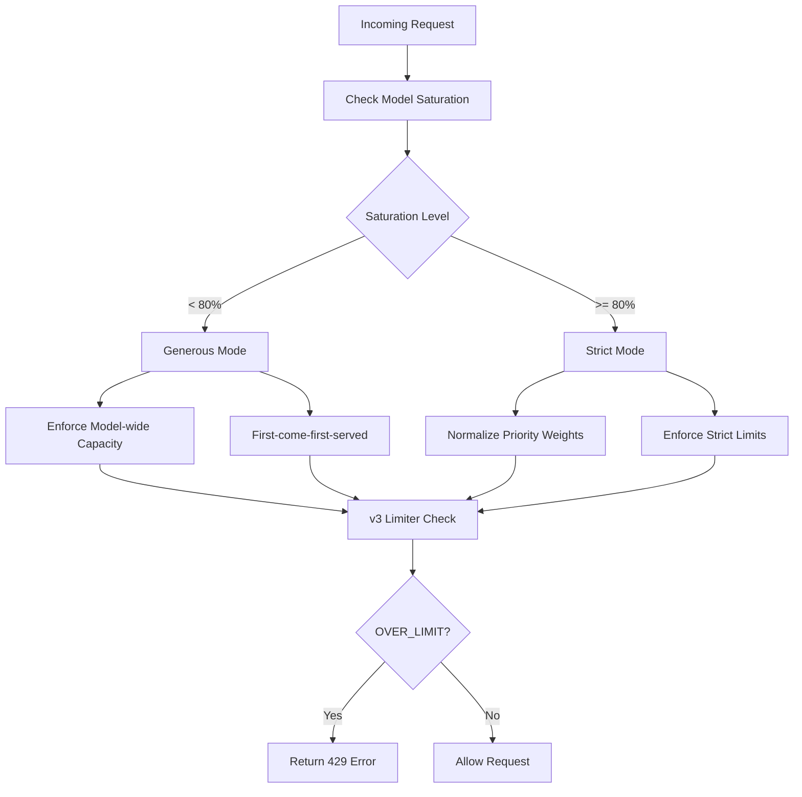
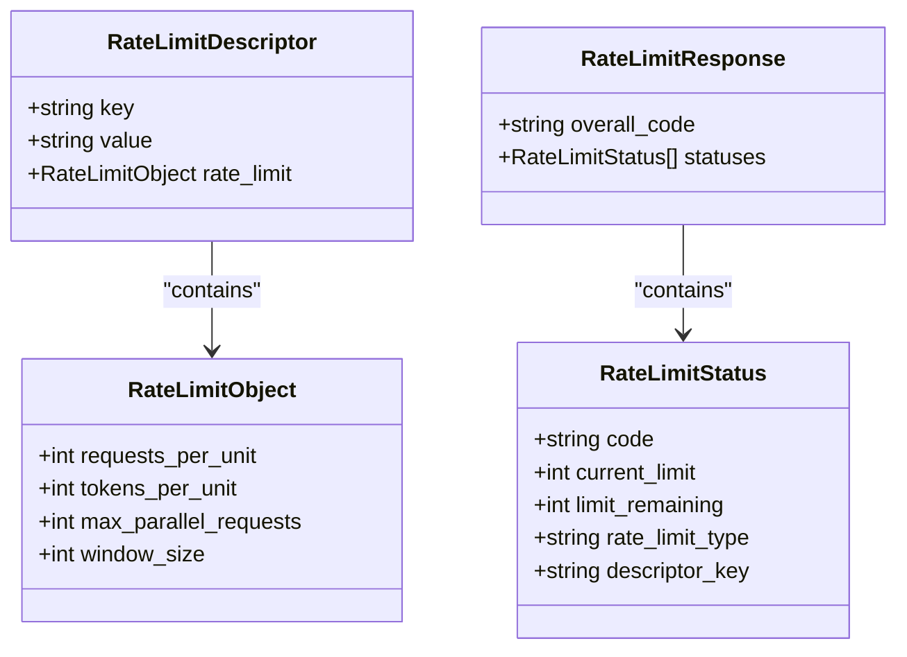
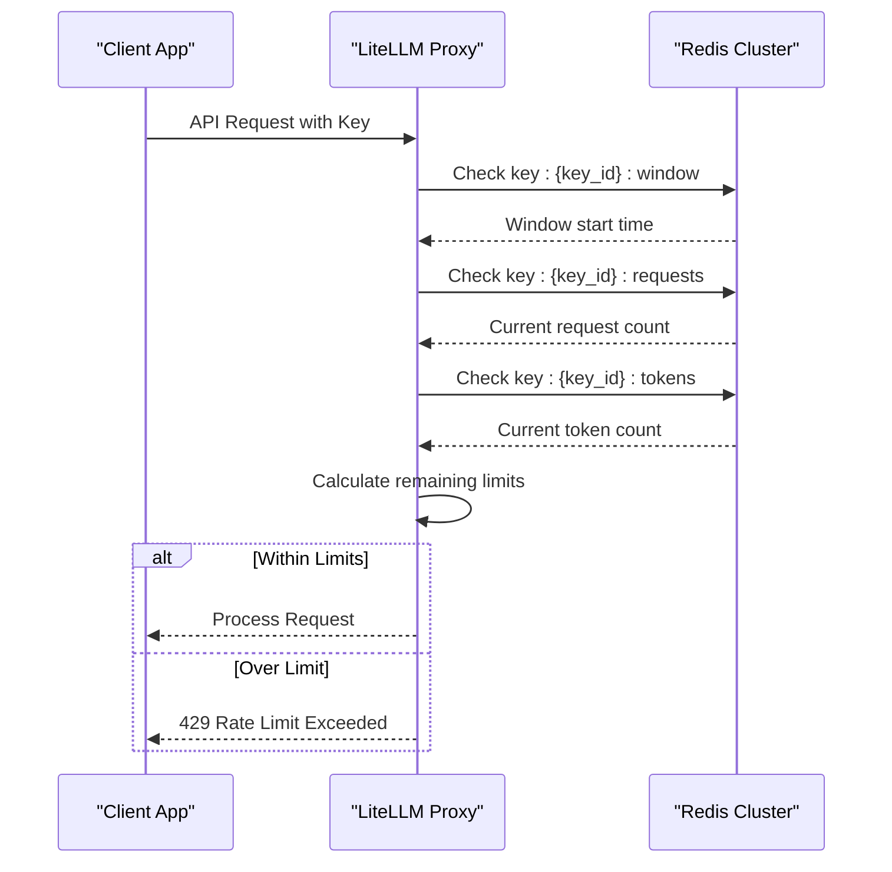
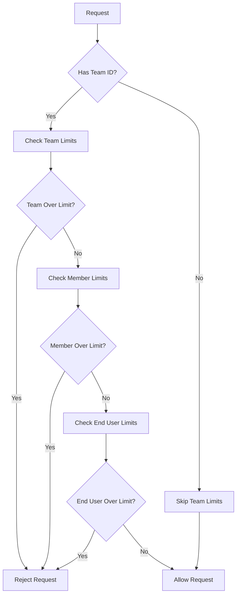
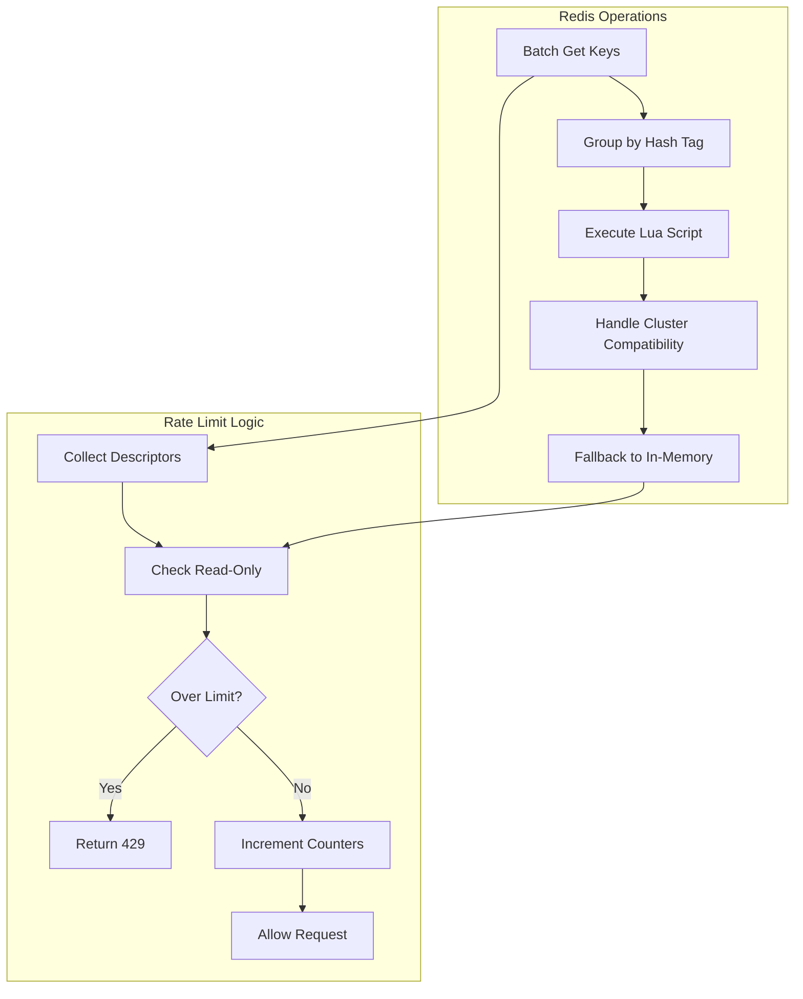
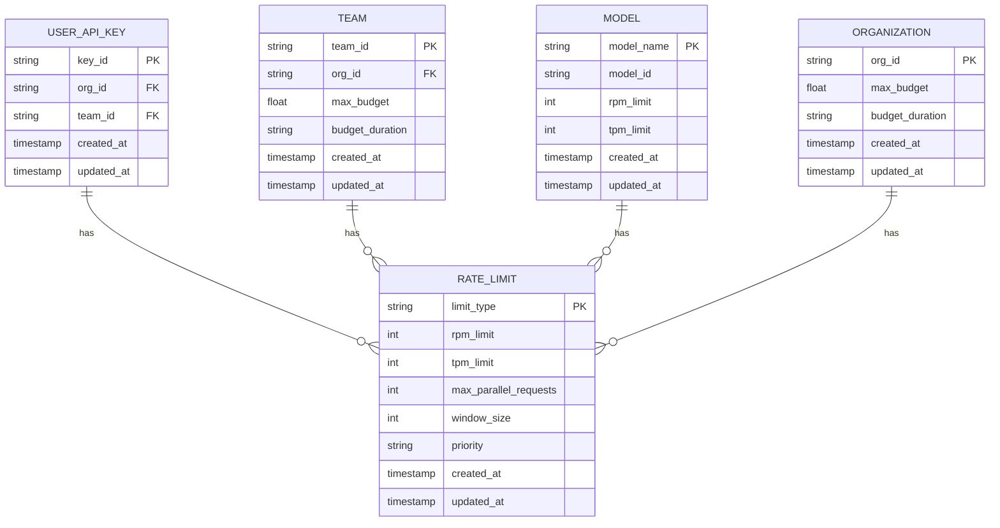
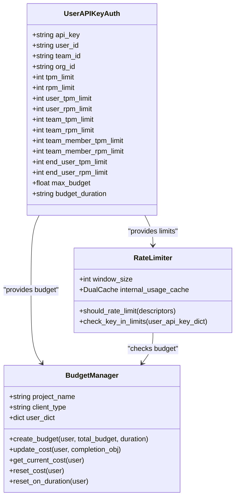
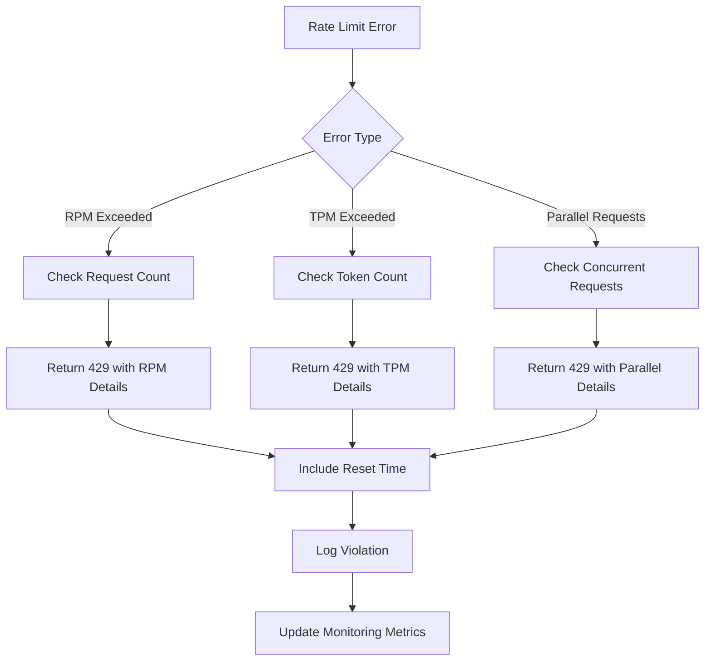

# Rate Limiting

<cite>
**Referenced Files in This Document**   
- [parallel_request_limiter_v3.py](file://litellm/proxy/hooks/parallel_request_limiter_v3.py)
- [dynamic_rate_limiter_v3.py](file://litellm/proxy/hooks/dynamic_rate_limiter_v3.py)
- [model_config.yaml](file://litellm/proxy/model_config.yaml)
- [proxy_server.py](file://litellm/proxy/proxy_server.py)
- [user_api_key_auth.py](file://litellm/proxy/auth/user_api_key_auth.py)
- [budget_manager.py](file://litellm/budget_manager.py)
- [README.dynamic_rate_limiter_v3.md](file://litellm/proxy/hooks/README.dynamic_rate_limiter_v3.md)
</cite>

## Table of Contents
1. [Introduction](#introduction)
2. [Rate Limiting Architecture](#rate-limiting-architecture)
3. [Global Rate Limits](#global-rate-limits)
4. [Per-Key Rate Limits](#per-key-rate-limits)
5. [Team-Based Rate Limiting](#team-based-rate-limiting)
6. [Dynamic Rate Limiting Implementation](#dynamic-rate-limiting-implementation)
7. [Configuration Options](#configuration-options)
8. [Relationship with Authentication and Budget Management](#relationship-with-authentication-and-budget-management)
9. [Common Issues and Solutions](#common-issues-and-solutions)
10. [Performance Considerations](#performance-considerations)
11. [Monitoring and Troubleshooting](#monitoring-and-troubleshooting)

## Introduction

LiteLLM's rate limiting system provides comprehensive request throttling capabilities designed to manage API usage across various dimensions including global, per-key, and team-based limits. The system implements both RPM (requests per minute) and TPM (tokens per minute) limits using Redis and in-memory stores for distributed rate limiting in clustered environments. This documentation details the architecture, configuration, and implementation of LiteLLM's rate limiting sub-feature, providing guidance for deployment and optimization.

**Section sources**
- [parallel_request_limiter_v3.py](file://litellm/proxy/hooks/parallel_request_limiter_v3.py#L1-L100)
- [dynamic_rate_limiter_v3.py](file://litellm/proxy/hooks/dynamic_rate_limiter_v3.py#L1-L50)

## Rate Limiting Architecture

LiteLLM's rate limiting architecture is built around a hierarchical system of descriptors that define rate limits at different levels of granularity. The system uses Redis for distributed rate limiting across clustered environments, with fallback to in-memory caching when Redis is unavailable. The architecture follows a two-phase approach: first checking limits in read-only mode, then enforcing them if necessary.

**Diagram sources**
- [README.dynamic_rate_limiter_v3.md](file://litellm/proxy/hooks/README.dynamic_rate_limiter_v3.md#L15-L77)

**Section sources**
- [parallel_request_limiter_v3.py](file://litellm/proxy/hooks/parallel_request_limiter_v3.py#L448-L463)
- [dynamic_rate_limiter_v3.py](file://litellm/proxy/hooks/dynamic_rate_limiter_v3.py#L434-L458)

## Global Rate Limits

Global rate limits in LiteLLM are applied at the organization level and provide a top-level constraint on API usage. These limits are configured through the UserAPIKeyAuth object and can be set for both RPM and TPM. The system checks organization-wide limits before processing individual requests, ensuring that no single organization can exceed its allocated quota.

Global limits are implemented using Redis counters with sliding window algorithms to provide accurate rate tracking. The system supports both hard limits (which immediately reject requests when exceeded) and soft limits (which allow temporary bursts within defined parameters).

**Diagram sources**
- [parallel_request_limiter_v3.py](file://litellm/proxy/hooks/parallel_request_limiter_v3.py#L115-L139)

**Section sources**
- [parallel_request_limiter_v3.py](file://litellm/proxy/hooks/parallel_request_limiter_v3.py#L591-L611)
- [user_api_key_auth.py](file://litellm/proxy/auth/user_api_key_auth.py#L638-L656)

## Per-Key Rate Limits

Per-key rate limits in LiteLLM provide granular control over API usage for individual API keys. These limits can be configured for both RPM and TPM and are enforced at the key level. The system supports model-specific rate limits, allowing different limits to be set for different models accessed through the same API key.

The implementation uses Redis hash tags to ensure that all rate limit counters for a given key are stored on the same Redis node in a cluster environment. This prevents cross-node operations and ensures atomicity of rate limit checks and updates.

**Diagram sources**
- [parallel_request_limiter_v3.py](file://litellm/proxy/hooks/parallel_request_limiter_v3.py#L472-L483)
- [parallel_request_limiter_v3.py](file://litellm/proxy/hooks/parallel_request_limiter_v3.py#L841-L856)

**Section sources**
- [parallel_request_limiter_v3.py](file://litellm/proxy/hooks/parallel_request_limiter_v3.py#L668-L727)
- [custom_auth.md](file://docs/my-website/docs/proxy/custom_auth.md#L70-L88)

## Team-Based Rate Limiting

Team-based rate limiting in LiteLLM allows organizations to allocate quotas to teams and individual team members. This hierarchical approach enables fine-grained control over API usage across different teams and members within an organization. The system supports team-level limits, team member limits, and end-user limits.

Team-based limits are implemented using composite keys that combine team ID and user ID. This allows the system to enforce both team-wide limits and per-member limits simultaneously. The implementation also supports end-user tracking, enabling rate limits to be applied at the end-user level regardless of which API key is used.

**Diagram sources**
- [parallel_request_limiter_v3.py](file://litellm/proxy/hooks/parallel_request_limiter_v3.py#L858-L910)

**Section sources**
- [parallel_request_limiter_v3.py](file://litellm/proxy/hooks/parallel_request_limiter_v3.py#L841-L910)
- [custom_auth.md](file://docs/my-website/docs/proxy/custom_auth.md#L91-L101)

## Dynamic Rate Limiting Implementation

LiteLLM's dynamic rate limiting system uses Redis and Lua scripts to provide high-performance, distributed rate limiting. The implementation uses a sliding window algorithm with Redis counters to track usage over time. The system supports both in-memory and Redis-based storage, with automatic fallback to in-memory caching when Redis is unavailable.

The dynamic rate limiter uses a two-phase approach: first checking limits in read-only mode, then enforcing them if necessary. This prevents unnecessary counter increments when a request would be rejected anyway. The system also supports priority-based rate limiting, allowing certain keys to reserve capacity even when the system is under heavy load.

**Diagram sources**
- [parallel_request_limiter_v3.py](file://litellm/proxy/hooks/parallel_request_limiter_v3.py#L406-L446)
- [parallel_request_limiter_v3.py](file://litellm/proxy/hooks/parallel_request_limiter_v3.py#L448-L463)

**Section sources**
- [parallel_request_limiter_v3.py](file://litellm/proxy/hooks/parallel_request_limiter_v3.py#L406-L483)
- [parallel_request_limiter_v3.py](file://litellm/proxy/hooks/parallel_request_limiter_v3.py#L448-L463)

## Configuration Options

Rate limiting in LiteLLM can be configured through both the model_config.yaml file and the management API. The configuration supports RPM and TPM limits at multiple levels: global, per-key, per-team, and per-model. The system also supports different rate limiting modes including guaranteed throughput, best effort, and dynamic.

Configuration options include:
- RPM (requests per minute) limits
- TPM (tokens per minute) limits
- Max parallel requests
- Window size for rate limiting
- Priority-based reservations
- Burst handling parameters

**Diagram sources**
- [model_config.yaml](file://litellm/proxy/model_config.yaml#L1-L11)
- [proxy_server.py](file://litellm/proxy/proxy_server.py#L1-L200)

**Section sources**
- [model_config.yaml](file://litellm/proxy/model_config.yaml#L1-L11)
- [proxy_server.py](file://litellm/proxy/proxy_server.py#L1-L200)
- [RateLimitTypeFormItem.tsx](file://ui/litellm-dashboard/src/components/common_components/RateLimitTypeFormItem.tsx#L80-L110)

## Relationship with Authentication and Budget Management

Rate limiting in LiteLLM is tightly integrated with the authentication system and budget management. The UserAPIKeyAuth object contains all rate limit information, linking authentication credentials directly to usage limits. This integration allows for per-user, per-team, and per-organization rate limits to be enforced based on authentication tokens.

The system also integrates with budget management, allowing rate limits to be adjusted based on remaining budget. When a user or team approaches their budget limit, rate limits can be automatically tightened to prevent overspending. This creates a cohesive system where rate limiting and budget management work together to control API usage.

**Diagram sources**
- [user_api_key_auth.py](file://litellm/proxy/auth/user_api_key_auth.py#L638-L656)
- [budget_manager.py](file://litellm/budget_manager.py#L1-L231)

**Section sources**
- [user_api_key_auth.py](file://litellm/proxy/auth/user_api_key_auth.py#L638-L656)
- [budget_manager.py](file://litellm/budget_manager.py#L1-L231)
- [spend_management_endpoints.py](file://litellm/proxy/spend_tracking/spend_management_endpoints.py#L2844-L2876)

## Common Issues and Solutions

Common issues with rate limiting in LiteLLM include burst handling, distributed rate limiting in clustered environments, and monitoring rate limit violations. The system addresses these issues through several mechanisms:

1. **Burst Handling**: The sliding window algorithm allows for controlled bursts within defined limits. The system calculates remaining limits based on the current window, allowing requests to be processed as long as they don't exceed the window's capacity.

2. **Distributed Rate Limiting**: In clustered environments, the system uses Redis hash tags to ensure that all rate limit counters for a given key are stored on the same Redis node. This prevents cross-node operations and ensures atomicity.

3. **Monitoring Violations**: The system provides detailed error messages when rate limits are exceeded, including information about which limit was exceeded and the current usage. This helps users understand and resolve rate limit issues.

**Diagram sources**
- [parallel_request_limiter_v3.py](file://litellm/proxy/hooks/parallel_request_limiter_v3.py#L314-L354)
- [batch_rate_limiter.py](file://litellm/proxy/hooks/batch_rate_limiter.py#L107-L134)

**Section sources**
- [parallel_request_limiter_v3.py](file://litellm/proxy/hooks/parallel_request_limiter_v3.py#L314-L354)
- [batch_rate_limiter.py](file://litellm/proxy/hooks/batch_rate_limiter.py#L107-L134)
- [dynamic_rate_limit.md](file://docs/my-website/docs/proxy/dynamic_rate_limit.md#L288-L306)

## Performance Considerations

Performance considerations for LiteLLM's rate limiting system include optimizing Redis operations, minimizing latency, and handling high-throughput scenarios. The system uses several techniques to ensure high performance:

1. **Batch Operations**: The system batches Redis operations to reduce network overhead and improve throughput.
2. **Lua Scripts**: Complex rate limit calculations are performed in Redis using Lua scripts, reducing round-trip times.
3. **In-Memory Fallback**: When Redis is unavailable, the system falls back to in-memory caching to maintain availability.
4. **Connection Pooling**: The system uses connection pooling to minimize the overhead of establishing Redis connections.

For high-throughput systems, it's recommended to tune the window size and use Redis clusters to distribute the load. The system also supports priority-based rate limiting, which can help ensure that critical requests are processed even under heavy load.

**Section sources**
- [parallel_request_limiter_v3.py](file://litellm/proxy/hooks/parallel_request_limiter_v3.py#L406-L446)
- [parallel_request_limiter_v3.py](file://litellm/proxy/hooks/parallel_request_limiter_v3.py#L92-L108)

## Monitoring and Troubleshooting

Monitoring and troubleshooting rate limiting in LiteLLM involves tracking key metrics, analyzing error patterns, and using the provided diagnostic tools. The system provides several mechanisms for monitoring rate limit usage:

1. **Rate Limit Headers**: The system includes rate limit information in response headers, showing remaining requests and tokens.
2. **Detailed Error Messages**: When rate limits are exceeded, the system provides detailed error messages explaining which limit was exceeded.
3. **Prometheus Metrics**: The system exports rate limit metrics to Prometheus for monitoring and alerting.
4. **Logging**: Detailed logs are available to track rate limit checks and violations.

Troubleshooting common issues involves checking Redis connectivity, verifying configuration settings, and analyzing usage patterns. The system's modular design makes it easy to isolate and resolve rate limiting issues.

**Section sources**
- [router.py](file://litellm/router.py#L6652-L6680)
- [team_info.tsx](file://ui/litellm-dashboard/src/components/team/team_info.tsx#L523-L551)
- [dynamic_rate_limit.md](file://docs/my-website/docs/proxy/dynamic_rate_limit.md#L288-L306)