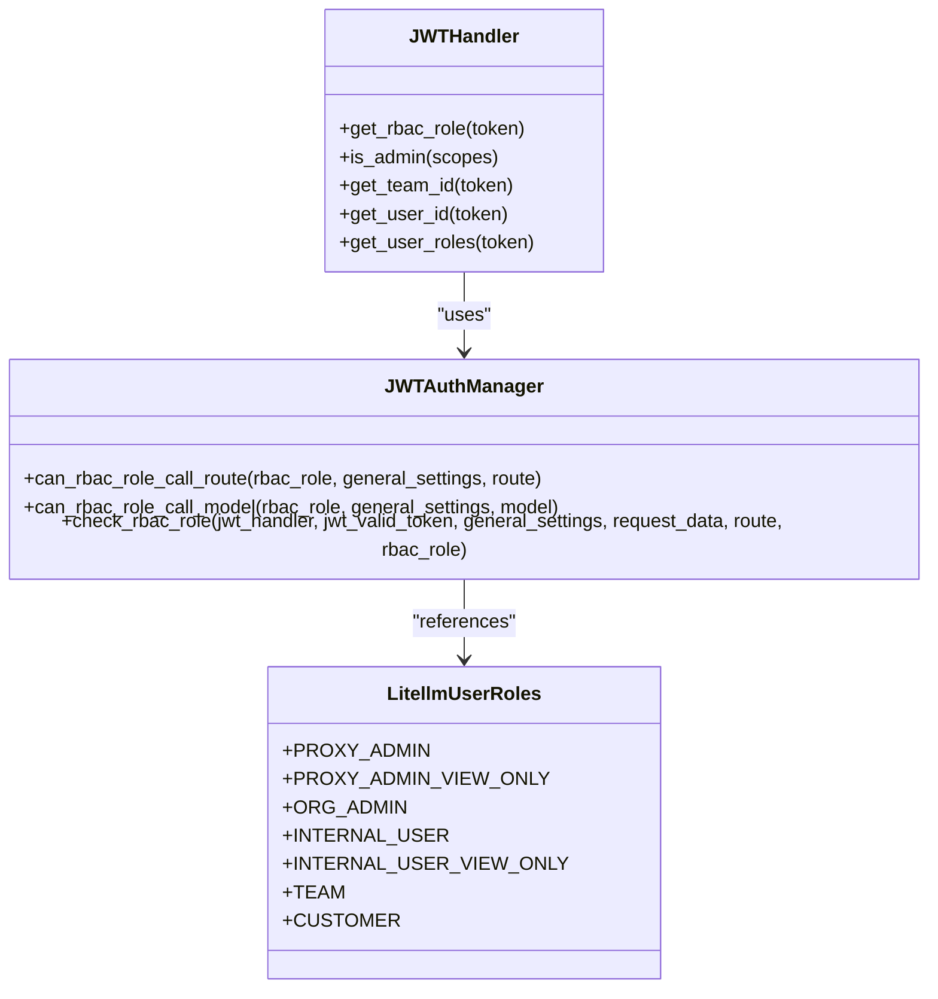
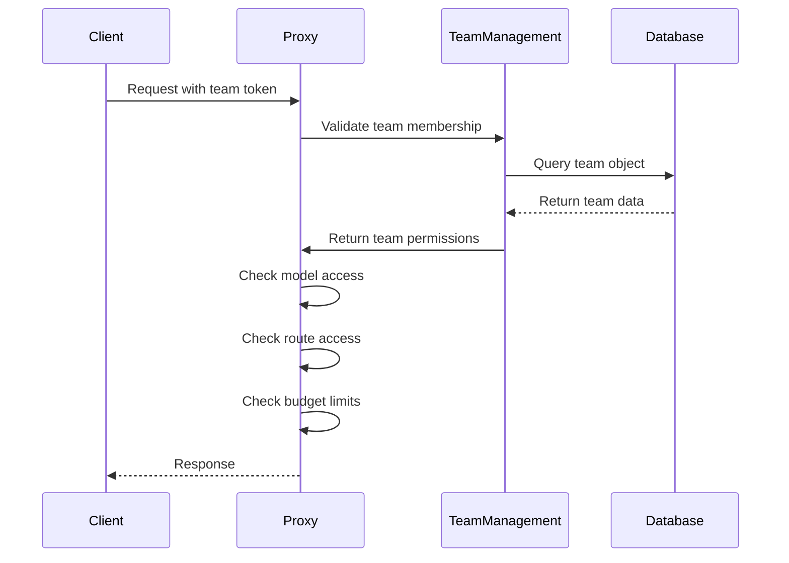
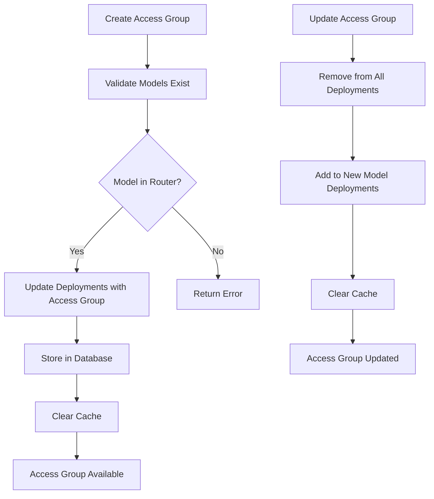
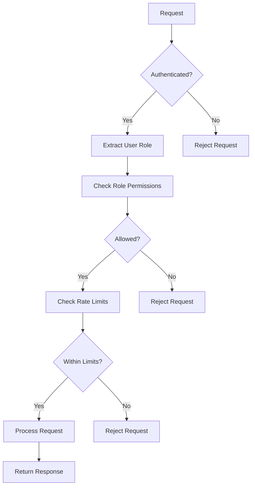

# Role-Based Access Control

<cite>
**Referenced Files in This Document**   
- [proxy_config.yaml](file://litellm/proxy/proxy_config.yaml)
- [auth_checks.py](file://litellm/proxy/auth/auth_checks.py)
- [handle_jwt.py](file://litellm/proxy/auth/handle_jwt.py)
- [team_endpoints.py](file://litellm/proxy/management_endpoints/team_endpoints.py)
- [model_access_group_management_endpoints.py](file://litellm/proxy/management_endpoints/model_access_group_management_endpoints.py)
- [_types.py](file://litellm/proxy/_types.py)
</cite>

## Table of Contents
1. [Introduction](#introduction)
2. [User Roles and RBAC Architecture](#user-roles-and-rbac-architecture)
3. [Team-Based Access Control](#team-based-access-control)
4. [Model Access Groups](#model-access-groups)
5. [Configuration and Management](#configuration-and-management)
6. [Integration with Authentication and Rate Limiting](#integration-with-authentication-and-rate-limiting)
7. [Security and Auditing](#security-and-auditing)
8. [Best Practices for Multi-Tenant Deployments](#best-practices-for-multi-tenant-deployments)
9. [Troubleshooting Common Issues](#troubleshooting-common-issues)
10. [Conclusion](#conclusion)

## Introduction

LiteLLM's Role-Based Access Control (RBAC) system provides a comprehensive framework for managing access to AI models and API endpoints. This granular permission system enables organizations to implement sophisticated access policies that align with their security requirements and operational workflows. The RBAC implementation in LiteLLM supports multiple layers of access control, including user roles, team-based access, and model access groups, allowing for fine-grained control over who can access what resources.

The system is designed to support enterprise-grade security requirements, including multi-tenant deployments, hierarchical permission structures, and integration with existing authentication systems. By leveraging JWT-based authentication and database-backed policy management, LiteLLM provides a flexible and scalable solution for controlling access to AI resources across diverse organizational structures.

**Section sources**
- [proxy_config.yaml](file://litellm/proxy/proxy_config.yaml#L1-L10)
- [auth_checks.py](file://litellm/proxy/auth/auth_checks.py#L1-L800)

## User Roles and RBAC Architecture

LiteLLM implements a hierarchical role-based access control system with multiple predefined roles that determine the scope of permissions for users and teams. The core user roles are defined in the `LitellmUserRoles` enum and include:

- **PROXY_ADMIN**: Full administrative privileges over the entire proxy system
- **PROXY_ADMIN_VIEW_ONLY**: Read-only access to view all keys and spend data
- **ORG_ADMIN**: Administrative privileges within a specific organization
- **INTERNAL_USER**: Standard internal users with ability to manage their own keys
- **INTERNAL_USER_VIEW_ONLY**: Internal users with read-only access to their resources
- **TEAM**: Role used for JWT authentication with team-scoped access
- **CUSTOMER**: External users or customers of the proxy service

The RBAC architecture is implemented through a combination of JWT authentication and database-stored policies. When a request is received, the system validates the JWT token and extracts the user's role, which is then used to determine the allowed models and routes. The `JWTHandler` class in `handle_jwt.py` is responsible for parsing JWT tokens and mapping external roles to internal LiteLLM roles through configurable role mappings.

Role-based permissions are defined in the general settings configuration and can be customized to meet specific organizational requirements. The system supports both model-level and route-level permissions, allowing administrators to control not only which models a role can access but also which API endpoints they can invoke.

**Diagram sources **
- [handle_jwt.py](file://litellm/proxy/auth/handle_jwt.py#L59-L800)
- [_types.py](file://litellm/proxy/_types.py#L87-L124)

**Section sources**
- [_types.py](file://litellm/proxy/_types.py#L87-L124)
- [handle_jwt.py](file://litellm/proxy/auth/handle_jwt.py#L59-L800)
- [auth_checks.py](file://litellm/proxy/auth/auth_checks.py#L918-L975)

## Team-Based Access Control

Team-based access control in LiteLLM provides a mechanism for organizing users into logical groups with shared access policies. Teams are managed through dedicated endpoints in the management API and can be configured with specific model access, rate limits, and budget constraints. The team management system supports hierarchical organization structures, allowing teams to be nested within organizations with inherited permissions.

Key features of the team-based access control include:

- **Team creation and management**: Teams can be created through the `/team/new` endpoint with configurable parameters including team alias, members with roles, and access policies
- **Member roles**: Team members can be assigned as administrators or regular members with different permission levels
- **Model restrictions**: Teams can be restricted to specific models, ensuring compliance with organizational policies
- **Budget controls**: Teams can have spending limits and budget durations configured to manage costs
- **Rate limiting**: Teams can have RPM (requests per minute) and TPM (tokens per minute) limits applied at both the team and individual member levels

The team system integrates with the broader RBAC framework, allowing team-level policies to be combined with user-level and organization-level policies. When a request is made with a team-scoped token, the system evaluates the team's permissions in addition to the individual user's permissions to determine access.

**Diagram sources **
- [team_endpoints.py](file://litellm/proxy/management_endpoints/team_endpoints.py#L636-L800)
- [auth_checks.py](file://litellm/proxy/auth/auth_checks.py#L116-L129)

**Section sources**
- [team_endpoints.py](file://litellm/proxy/management_endpoints/team_endpoints.py#L636-L800)
- [auth_checks.py](file://litellm/proxy/auth/auth_checks.py#L116-L129)

## Model Access Groups

Model access groups in LiteLLM provide a mechanism for organizing models into logical collections that can be referenced by teams and users for simplified access control. This feature allows administrators to define named groups of models that share common access policies, reducing the complexity of managing individual model permissions across multiple teams.

Access groups are managed through dedicated endpoints in the management API:
- **POST /access_group/new**: Create a new access group with multiple model names
- **GET /access_group/list**: List all access groups
- **GET /access_group/{access_group}/info**: Get information about a specific access group
- **PUT /access_group/{access_group}/update**: Update an access group's model names
- **DELETE /access_group/{access_group}/delete**: Delete an access group

When an access group is created, it is associated with one or more model names in the deployment configuration. The system validates that all specified models exist in the router before creating the access group. Access groups can only be managed for database-stored models, not for configuration-based models.

The implementation uses a database-backed approach where access group information is stored in the `model_info` field of the deployment records. When a request is made, the router checks the team's access groups and resolves them to the constituent models to determine if access should be granted.

**Diagram sources **
- [model_access_group_management_endpoints.py](file://litellm/proxy/management_endpoints/model_access_group_management_endpoints.py#L212-L333)
- [model_access_group_management_endpoints.py](file://litellm/proxy/management_endpoints/model_access_group_management_endpoints.py#L448-L585)

**Section sources**
- [model_access_group_management_endpoints.py](file://litellm/proxy/management_endpoints/model_access_group_management_endpoints.py#L1-L689)

## Configuration and Management

The RBAC system in LiteLLM can be configured through both the proxy configuration file and the management API. The primary configuration file `proxy_config.yaml` contains general settings that define the overall behavior of the access control system, including role-based permissions and default team settings.

Key configuration options include:
- **role_permissions**: Defines the models and routes allowed for each user role
- **store_model_in_db**: Controls whether models are stored in the database
- **default_team_settings**: Specifies default values for team creation

The management API provides a comprehensive set of endpoints for dynamically managing access control policies. These endpoints allow administrators to create and modify teams, configure model access groups, and manage user permissions without requiring server restarts. The API follows RESTful principles and returns standardized responses with detailed error information.

Configuration of RBAC through the management API offers several advantages:
- **Dynamic updates**: Changes take effect immediately without service interruption
- **Audit logging**: All changes are logged for compliance and troubleshooting
- **Programmatic access**: Policies can be managed through automation scripts
- **Fine-grained control**: Individual aspects of access control can be modified independently

The system also supports environment variable configuration for certain settings, allowing for flexible deployment across different environments. This multi-layered configuration approach enables organizations to implement consistent access policies while accommodating environment-specific requirements.

**Section sources**
- [proxy_config.yaml](file://litellm/proxy/proxy_config.yaml#L1-L10)
- [config.yaml](file://config.yaml#L1-L30)
- [team_endpoints.py](file://litellm/proxy/management_endpoints/team_endpoints.py#L636-L800)

## Integration with Authentication and Rate Limiting

LiteLLM's RBAC system is tightly integrated with the authentication and rate limiting subsystems to provide a comprehensive security framework. The authentication system, primarily based on JWT tokens, serves as the foundation for RBAC by establishing the user's identity and role, which are then used to determine access permissions.

The integration with authentication works as follows:
1. JWT tokens are validated and parsed to extract user information
2. The user's role is determined based on the token claims and configured role mappings
3. The role is used to look up the corresponding permissions in the RBAC policy
4. Access decisions are made based on the combination of authentication and authorization data

Rate limiting is implemented as a tiered system where limits can be applied at multiple levels:
- **User level**: Individual users have rate limits based on their role
- **Team level**: Teams have aggregate rate limits for all members
- **Organization level**: Organizations have overarching limits that constrain team limits
- **Model level**: Specific models can have rate limits applied

The system enforces hierarchical rate limiting, where a request must pass all applicable limits at each level. For example, a team member's request must comply with their individual rate limit, their team's rate limit, and any organization-wide limits. This multi-layered approach provides fine-grained control over resource usage while preventing abuse.

**Diagram sources **
- [auth_checks.py](file://litellm/proxy/auth/auth_checks.py#L76-L282)
- [team_endpoints.py](file://litellm/proxy/management_endpoints/team_endpoints.py#L107-L230)

**Section sources**
- [auth_checks.py](file://litellm/proxy/auth/auth_checks.py#L76-L282)
- [team_endpoints.py](file://litellm/proxy/management_endpoints/team_endpoints.py#L107-L230)

## Security and Auditing

The RBAC implementation in LiteLLM includes comprehensive security features and auditing capabilities to ensure the integrity and traceability of access control decisions. The system is designed with security best practices in mind, including protection against common vulnerabilities and mechanisms for monitoring and investigating access patterns.

Key security features include:
- **Permission inheritance validation**: The system validates that team permissions do not exceed organization or user limits, preventing privilege escalation
- **Access escalation prevention**: Strict checks ensure that users cannot gain access to resources beyond their assigned permissions
- **Secure token handling**: JWT tokens are validated using industry-standard cryptographic methods
- **Input validation**: All configuration inputs are validated to prevent injection attacks

Auditing capabilities are built into the system to provide visibility into access control changes and usage patterns. The audit logs capture:
- Creation and modification of teams and access groups
- Changes to user roles and permissions
- Authentication events and access decisions
- Rate limiting and budget enforcement actions

The system also includes mechanisms for detecting and preventing common security issues such as:
- **Permission inheritance conflicts**: When team policies conflict with organization policies
- **Access escalation attempts**: When users attempt to gain unauthorized access
- **Configuration errors**: When access policies are misconfigured

These security and auditing features make LiteLLM suitable for deployment in regulated environments where compliance and accountability are critical requirements.

**Section sources**
- [team_endpoints.py](file://litellm/proxy/management_endpoints/team_endpoints.py#L459-L560)
- [auth_checks.py](file://litellm/proxy/auth/auth_checks.py#L110-L115)

## Best Practices for Multi-Tenant Deployments

For multi-tenant deployments, LiteLLM's RBAC system provides several features and best practices to ensure secure and efficient operation. The key considerations for multi-tenant deployments include:

**Organization and Team Structure**
- Use organizations to separate tenants with completely isolated resources
- Implement team hierarchies within organizations to reflect internal departmental structures
- Leverage model access groups to standardize access policies across similar tenant types

**Security Isolation**
- Ensure strict separation between tenant data and configurations
- Use separate database schemas or partitions for each tenant when possible
- Implement network-level isolation for highly sensitive deployments

**Resource Management**
- Configure budget limits at the organization and team levels to prevent cost overruns
- Implement tiered rate limiting to ensure fair resource allocation
- Use tags for tracking spend across different tenants and services

**Operational Efficiency**
- Automate team and access group creation through the management API
- Implement standardized templates for common tenant configurations
- Use environment variables for deployment-specific settings

**Compliance and Governance**
- Enable comprehensive audit logging for all access control changes
- Implement regular security reviews of access policies
- Use role-based access to limit administrative privileges

These best practices help ensure that multi-tenant deployments are secure, scalable, and maintainable while providing the necessary isolation and resource management capabilities.

**Section sources**
- [team_endpoints.py](file://litellm/proxy/management_endpoints/team_endpoints.py#L459-L560)
- [model_access_group_management_endpoints.py](file://litellm/proxy/management_endpoints/model_access_group_management_endpoints.py#L1-L689)

## Troubleshooting Common Issues

When implementing and managing RBAC in LiteLLM, several common issues may arise. Understanding these issues and their solutions is critical for maintaining a secure and functional system.

**Permission Inheritance Issues**
- **Symptom**: Teams cannot access models that should be allowed by their organization
- **Cause**: Organization-level model restrictions are more restrictive than team policies
- **Solution**: Verify that the organization's allowed models include all models needed by teams

**Access Escalation Prevention**
- **Symptom**: Users are unable to access resources despite having appropriate roles
- **Cause**: Overly restrictive role-based permissions in the configuration
- **Solution**: Review and update the `role_permissions` configuration to ensure necessary access

**JWT Authentication Problems**
- **Symptom**: Valid JWT tokens are rejected
- **Cause**: Misconfigured JWT public key URL or audience
- **Solution**: Verify JWT configuration settings and ensure public keys are accessible

**Rate Limiting Conflicts**
- **Symptom**: Requests are rate limited despite being within expected limits
- **Cause**: Conflicting rate limits at different levels (user, team, organization)
- **Solution**: Review the hierarchical rate limiting configuration and adjust limits accordingly

**Model Access Group Errors**
- **Symptom**: Access group creation fails with "model not found" errors
- **Cause**: Specified models do not exist in the router or are not database-stored models
- **Solution**: Verify model names and ensure models are properly configured in the database

**Configuration Validation**
- Always validate configuration changes before deployment
- Use the management API to test access policies
- Monitor audit logs for unexpected access patterns

By following these troubleshooting guidelines, administrators can quickly identify and resolve common RBAC issues, ensuring smooth operation of the access control system.

**Section sources**
- [auth_checks.py](file://litellm/proxy/auth/auth_checks.py#L116-L129)
- [team_endpoints.py](file://litellm/proxy/management_endpoints/team_endpoints.py#L459-L560)
- [model_access_group_management_endpoints.py](file://litellm/proxy/management_endpoints/model_access_group_management_endpoints.py#L273-L284)

## Conclusion

LiteLLM's Role-Based Access Control system provides a comprehensive and flexible framework for managing access to AI models and API endpoints. The system's multi-layered approach, combining user roles, team-based access, and model access groups, enables organizations to implement sophisticated access policies that meet their security and operational requirements.

Key strengths of the RBAC implementation include:
- **Granular control**: Fine-grained permissions at the model, route, and resource level
- **Scalability**: Support for large organizations with complex hierarchical structures
- **Integration**: Seamless integration with authentication and rate limiting systems
- **Flexibility**: Multiple configuration methods including YAML files and management API
- **Security**: Comprehensive protection against common vulnerabilities and privilege escalation

The system is particularly well-suited for enterprise and multi-tenant deployments where security, compliance, and resource management are critical concerns. By following the best practices outlined in this documentation, organizations can effectively leverage LiteLLM's RBAC capabilities to build secure and efficient AI infrastructure.

As AI adoption continues to grow, robust access control systems like LiteLLM's RBAC will become increasingly important for ensuring responsible and secure use of AI technologies. The ongoing development of these capabilities will play a crucial role in enabling organizations to harness the power of AI while maintaining appropriate governance and control.

[No sources needed since this section summarizes without analyzing specific files]