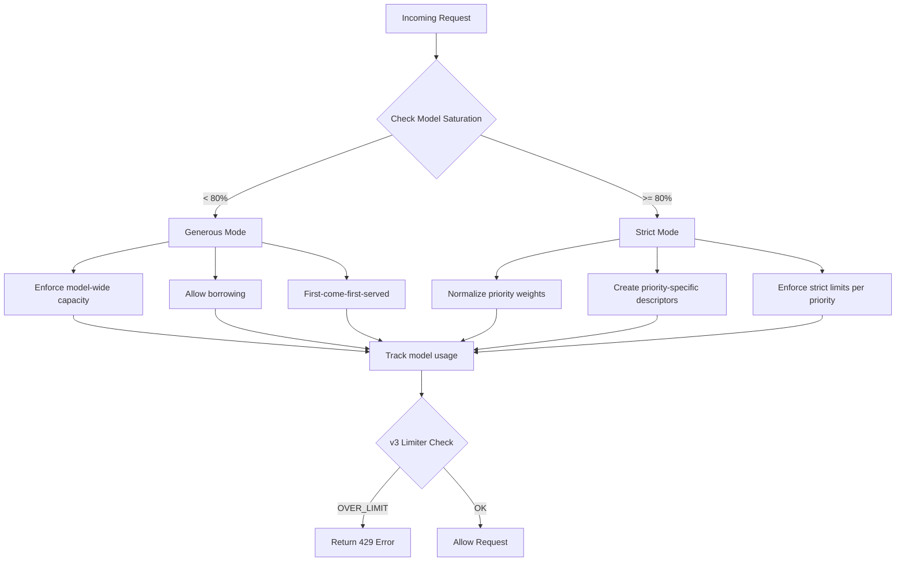
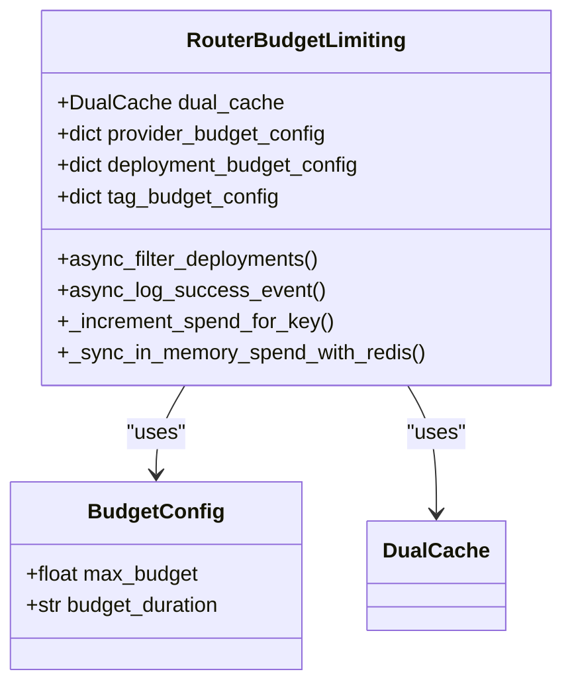

# Security

<cite>
**Referenced Files in This Document**   
- [user_api_key_auth.py](file://litellm/proxy/auth/user_api_key_auth.py)
- [handle_jwt.py](file://litellm/proxy/auth/handle_jwt.py)
- [oauth2_check.py](file://litellm/proxy/auth/oauth2_check.py)
- [auth_checks.py](file://litellm/proxy/auth/auth_checks.py)
- [budget_manager.py](file://litellm/budget_manager.py)
- [budget_limiter.py](file://litellm/router_strategy/budget_limiter.py)
- [route_checks.py](file://litellm/proxy/auth/route_checks.py)
- [dynamic_rate_limiter_v3.md](file://litellm/proxy/hooks/README.dynamic_rate_limiter_v3.md)
</cite>

## Table of Contents
1. [Authentication Mechanisms](#authentication-mechanisms)
2. [API Key Management](#api-key-management)
3. [JWT-Based Authentication](#jwt-based-authentication)
4. [SSO Integration](#sso-integration)
5. [Authorization and Role-Based Access Control](#authorization-and-role-based-access-control)
6. [Rate Limiting Implementation](#rate-limiting-implementation)
7. [Budget Management](#budget-management)
8. [Security Best Practices](#security-best-practices)

## Authentication Mechanisms

LiteLLM implements a comprehensive authentication framework that supports multiple authentication methods including API keys, JWT tokens, and OAuth2. The authentication system is designed to be flexible and extensible, allowing integration with various identity providers and custom authentication schemes.

The core authentication logic is implemented in the `user_api_key_auth.py` file, which handles the validation of API keys and JWT tokens. The system supports multiple authentication headers including standard Bearer tokens, Azure API keys, Anthropic authorization, and Google AI Studio keys. Authentication is performed through a series of checks that validate the token against the configured authentication method.

For API key authentication, LiteLLM uses a secure comparison mechanism to prevent timing attacks when validating the master key. The system also supports custom authentication headers and pass-through endpoints, allowing for integration with existing authentication systems.

**Section sources**
- [user_api_key_auth.py](file://litellm/proxy/auth/user_api_key_auth.py#L1-L800)

## API Key Management

LiteLLM provides a robust API key management system that supports key generation, rotation, and revocation. API keys are the primary method of authentication for accessing the LiteLLM proxy and can be configured with various permissions and restrictions.

The API key system supports virtual keys that can be associated with specific teams, users, or end-users. Each API key can be configured with specific permissions, including allowed routes, model access, and rate limits. Keys can be generated through the management API or CLI, and can be associated with specific budget limits and usage restrictions.

Key rotation is supported through the key regeneration endpoint, which allows for the creation of new keys while invalidating the old ones. Revocation is handled by marking keys as blocked in the database, which prevents their use for future requests. The system also supports key expiration, allowing administrators to set time-limited keys for specific use cases.

API keys can be associated with metadata that defines their permissions and restrictions. This includes allowed routes, model access, and rate limits. The system also supports team-based key management, where keys can be associated with specific teams and inherit the team's permissions and restrictions.

**Section sources**
- [user_api_key_auth.py](file://litellm/proxy/auth/user_api_key_auth.py#L1-L800)
- [auth_checks.py](file://litellm/proxy/auth/auth_checks.py#L1-L800)

## JWT-Based Authentication

LiteLLM supports JWT-based authentication for secure and scalable user authentication. The JWT authentication system is implemented in the `handle_jwt.py` file and provides enterprise-grade authentication capabilities.

The JWT system supports multiple algorithms including RS256, RS384, RS512, PS256, PS384, PS512, ES256, ES384, ES512, and EdDSA. Public keys are retrieved from a configured URL and cached for performance. The system supports key rotation through the use of key IDs (kid) in the JWT header.

JWT tokens are validated against a configured public key URL, and the system supports caching of public keys to reduce latency. The authentication process includes validation of the token signature, expiration, and audience claims. The system also supports leeway for clock skew between the issuer and the LiteLLM proxy.

The JWT system supports role-based access control through the use of scopes and roles in the token. Administrators can configure which scopes grant proxy admin access, and the system supports mapping of JWT roles to internal LiteLLM roles. The system also supports team-based authentication through the use of team IDs in the token.

**Section sources**
- [handle_jwt.py](file://litellm/proxy/auth/handle_jwt.py#L1-L800)
- [user_api_key_auth.py](file://litellm/proxy/auth/user_api_key_auth.py#L1-L800)

## SSO Integration

LiteLLM supports integration with Single Sign-On (SSO) systems through OAuth2 and OpenID Connect (OIDC). The SSO integration is designed to work seamlessly with existing identity providers and supports both machine-to-machine (M2M) authentication and user authentication.

The OAuth2 integration is implemented in the `oauth2_check.py` file and supports both introspection endpoints and token info endpoints. The system can validate OAuth2 tokens by making requests to the token introspection endpoint or token info endpoint of the identity provider. The system supports both POST-based introspection and GET-based token info requests.

For OIDC integration, LiteLLM can retrieve user information from the OIDC UserInfo endpoint. This allows for the retrieval of user attributes such as email, name, and roles, which can be used for authorization decisions. The system caches UserInfo responses to reduce the number of requests to the identity provider.

The SSO integration supports custom field mapping, allowing administrators to configure which JWT claims contain the user ID, role, team ID, and other attributes. This provides flexibility in integrating with different identity providers that may use different claim names.

**Section sources**
- [oauth2_check.py](file://litellm/proxy/auth/oauth2_check.py#L1-L223)
- [handle_jwt.py](file://litellm/proxy/auth/handle_jwt.py#L1-L800)

## Authorization and Role-Based Access Control

LiteLLM implements a comprehensive role-based access control (RBAC) system that governs access to models, routes, and administrative functions. The authorization system is built on a hierarchy of roles including proxy admin, team, and internal user.

The RBAC system is implemented in the `auth_checks.py` and `route_checks.py` files and provides fine-grained control over what actions users can perform. Each role has a defined set of allowed routes and model access, which can be configured through the proxy settings.

Proxy administrators have full access to all routes and models, while team members have access to routes associated with their team. Internal users have access to routes associated with their user account. The system also supports custom roles through the use of role mappings in the JWT configuration.

The authorization system includes checks for team model access, team budget limits, and user budget limits. When a request is made, the system verifies that the team or user has access to the requested model and is within their budget limits. The system also checks that the requested route is allowed for the user's role.

The system supports organization-based access control, where users can be assigned to organizations and have access controlled at the organization level. This allows for multi-tenant deployments where different organizations have isolated access to models and resources.

**Section sources**
- [auth_checks.py](file://litellm/proxy/auth/auth_checks.py#L1-L800)
- [route_checks.py](file://litellm/proxy/auth/route_checks.py#L1-L629)

## Rate Limiting Implementation

LiteLLM provides a sophisticated rate limiting system that operates at both global and per-key levels. The rate limiting implementation is designed to prevent abuse while ensuring fair access to resources.

The rate limiting system includes multiple components, with the v3 dynamic rate limiter providing saturation-aware priority-based rate limiting. This system balances resource efficiency with fairness guarantees by allowing unused capacity to be borrowed during low load while enforcing strict limits during high load.

The rate limiter operates in two modes based on system saturation:
- **Generous mode** (under 80% capacity): Allows priority borrowing and operates on a first-come, first-served basis
- **Strict mode** (at/above 80% capacity): Enforces normalized priority limits to ensure fairness

Rate limits can be configured at multiple levels including global, team, user, and key levels. The system supports both RPM (requests per minute) and TPM (tokens per minute) limits, allowing for fine-grained control over usage.

The rate limiting system is integrated with the authentication system, so rate limits are enforced based on the authenticated user or key. When a rate limit is exceeded, the system returns a 429 error with details about the limit that was exceeded.

**Diagram sources** 
- [README.dynamic_rate_limiter_v3.md](file://litellm/proxy/hooks/README.dynamic_rate_limiter_v3.md#L1-L77)

**Section sources**
- [README.dynamic_rate_limiter_v3.md](file://litellm/proxy/hooks/README.dynamic_rate_limiter_v3.md#L1-L77)
- [auth_checks.py](file://litellm/proxy/auth/auth_checks.py#L1-L800)

## Budget Management

LiteLLM includes comprehensive budget management capabilities that allow administrators to set spending limits at multiple levels including global, provider, deployment, and tag levels.

The budget management system is implemented in the `budget_limiter.py` file and provides filtering of deployments based on budget limits. The system tracks spending in real-time and prevents requests that would exceed budget limits.

Budgets can be configured with specific time periods including daily, weekly, monthly, and yearly. The system automatically resets budgets at the end of each period. Budgets can be set at multiple levels:

- **Provider budgets**: Limit spending per provider (e.g., OpenAI, Anthropic)
- **Deployment budgets**: Limit spending per specific deployment
- **Tag budgets**: Limit spending for requests with specific tags

The system uses a dual caching strategy with in-memory and Redis caching to ensure low latency while maintaining consistency across multiple instances. Spending increments are batched and synchronized with Redis to optimize performance.

The budget system is integrated with the routing system, so deployments that have exceeded their budget limits are filtered out before routing decisions are made. This ensures that requests are only routed to deployments that are within their budget limits.

**Diagram sources** 
- [budget_limiter.py](file://litellm/router_strategy/budget_limiter.py#L1-L800)

**Section sources**
- [budget_limiter.py](file://litellm/router_strategy/budget_limiter.py#L1-L800)
- [budget_manager.py](file://litellm/budget_manager.py#L1-L231)

## Security Best Practices

To ensure secure deployment of LiteLLM in production environments, follow these best practices:

1. **Use HTTPS**: Always deploy LiteLLM behind HTTPS to encrypt traffic between clients and the proxy.

2. **Secure API keys**: Store API keys securely and rotate them regularly. Use environment variables or secret management systems rather than hardcoding keys.

3. **Implement rate limiting**: Configure appropriate rate limits to prevent abuse and ensure fair usage of resources.

4. **Set budget limits**: Configure budget limits at the global, provider, and deployment levels to control costs.

5. **Use role-based access control**: Assign the minimum necessary permissions to users and keys based on their role.

6. **Enable audit logging**: Enable detailed logging to monitor access and detect suspicious activity.

7. **Keep dependencies updated**: Regularly update LiteLLM and its dependencies to ensure you have the latest security patches.

8. **Use SSO/OAuth2**: Integrate with your existing identity provider using SSO or OAuth2 for centralized user management.

9. **Configure proper CORS**: Set appropriate CORS policies to prevent unauthorized cross-origin requests.

10. **Monitor and alert**: Set up monitoring and alerting for unusual activity, rate limit violations, and budget overages.

When configuring authentication, prefer JWT or OAuth2 over simple API keys for enhanced security. For API keys, use long, randomly generated keys and avoid using predictable values.

For production deployments, use a dedicated Redis instance for caching and rate limiting to ensure consistent performance across multiple instances of the LiteLLM proxy.

**Section sources**
- [user_api_key_auth.py](file://litellm/proxy/auth/user_api_key_auth.py#L1-L800)
- [handle_jwt.py](file://litellm/proxy/auth/handle_jwt.py#L1-L800)
- [oauth2_check.py](file://litellm/proxy/auth/oauth2_check.py#L1-L223)
- [auth_checks.py](file://litellm/proxy/auth/auth_checks.py#L1-L800)
- [budget_limiter.py](file://litellm/router_strategy/budget_limiter.py#L1-L800)