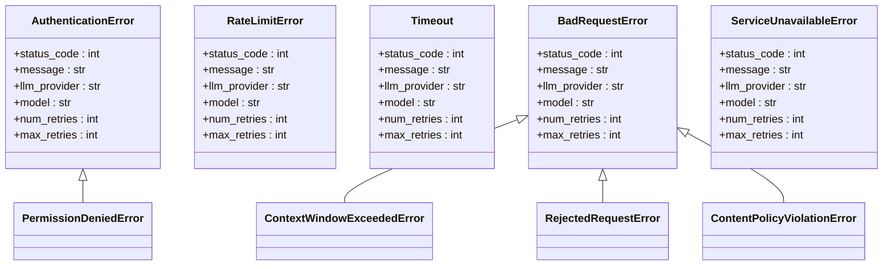
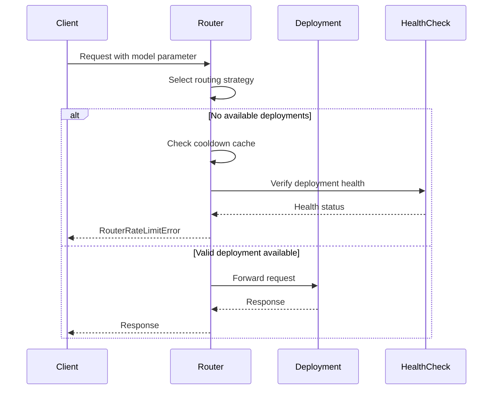
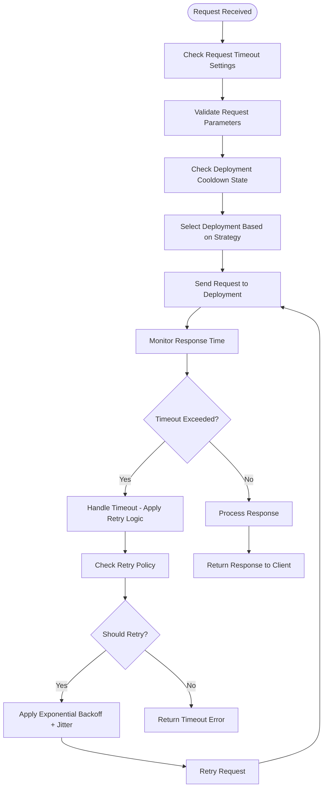

# Troubleshooting

<cite>
**Referenced Files in This Document**   
- [exceptions.py](file://litellm/exceptions.py)
- [_logging.py](file://litellm/_logging.py)
- [router.py](file://litellm/router.py)
- [router_utils/handle_error.py](file://litellm/router_utils/handle_error.py)
- [router_utils/get_retry_from_policy.py](file://litellm/router_utils/get_retry_from_policy.py)
- [proxy/health_check.py](file://litellm/proxy/health_check.py)
- [integrations/opentelemetry.py](file://litellm/integrations/opentelemetry.py)
- [utils.py](file://litellm/utils.py)
</cite>

## Table of Contents
1. [Introduction](#introduction)
2. [Error Classification and Root Causes](#error-classification-and-root-causes)
3. [Authentication Failures](#authentication-failures)
4. [Routing Problems](#routing-problems)
5. [Performance Bottlenecks and Timeouts](#performance-bottlenecks-and-timeouts)
6. [Diagnostic Techniques](#diagnostic-techniques)
7. [Request Flow Tracing](#request-flow-tracing)
8. [Systematic Problem Isolation](#systematic-problem-isolation)
9. [Common Scenarios Checklist](#common-scenarios-checklist)
10. [Escalation Procedures](#escalation-procedures)

## Introduction

This document provides comprehensive guidance for diagnosing and resolving common issues in LiteLLM. It covers error patterns, root causes, diagnostic techniques using logs and metrics, and practical approaches to problem isolation and resolution. The content addresses the relationship between different troubleshooting aspects, such as how performance issues may manifest as timeout errors, and provides systematic approaches to identify and fix problems efficiently.

**Section sources**
- [exceptions.py](file://litellm/exceptions.py#L1-L996)
- [_logging.py](file://litellm/_logging.py#L1-L193)

## Error Classification and Root Causes

LiteLLM categorizes errors into distinct types based on HTTP status codes and error semantics. Understanding these categories is essential for effective troubleshooting:

- **AuthenticationError (401)**: Invalid or missing credentials
- **PermissionDeniedError (403)**: Valid credentials but insufficient permissions
- **BadRequestError (400)**: Invalid request parameters or malformed requests
- **RateLimitError (429)**: Exceeded rate or token limits
- **Timeout (408)**: Request processing exceeded timeout threshold
- **ServiceUnavailableError (503)**: Temporary service unavailability
- **InternalServerError (500)**: Internal server errors

Each error type contains metadata about the LLM provider, model, and debugging information to aid in diagnosis. The exception classes extend OpenAI's exception types while adding LiteLLM-specific context and retry information.



**Diagram sources**
- [exceptions.py](file://litellm/exceptions.py#L20-L755)

**Section sources**
- [exceptions.py](file://litellm/exceptions.py#L10-L755)

## Authentication Failures

Authentication failures occur when LiteLLM cannot validate credentials with the target LLM provider. These issues typically stem from:

1. **Invalid API keys**: Incorrect or expired API keys for the LLM provider
2. **Missing credentials**: Required authentication parameters not provided
3. **Environment variable issues**: Credentials not properly loaded from environment
4. **Provider-specific authentication**: Incorrect configuration for providers requiring specialized auth (e.g., AWS Bedrock, Google Vertex AI)

The `AuthenticationError` class captures these failures with detailed context including the provider, model, and debugging information. When this error occurs, LiteLLM includes retry tracking to help identify persistent authentication issues.

To diagnose authentication problems:
1. Verify credentials are correctly configured in environment variables or configuration files
2. Check that the API key has appropriate permissions for the requested model
3. Validate that the provider-specific authentication parameters are correct
4. Review logs for specific error messages from the LLM provider

**Section sources**
- [exceptions.py](file://litellm/exceptions.py#L20-L63)
- [router.py](file://litellm/router.py#L46)

## Routing Problems

Routing issues in LiteLLM typically involve the router's inability to select an appropriate deployment for a request. Common causes include:

1. **No available deployments**: All potential models are in cooldown or marked as unhealthy
2. **Model alias misconfiguration**: Incorrect mapping between model aliases and actual models
3. **Region restrictions**: Deployment regions not allowed for the request
4. **Tag-based routing failures**: No deployments match the required tags

The router implements sophisticated routing strategies (least busy, lowest cost, lowest latency) that can fail when no suitable deployments are available. When routing fails, the system raises a `RouterRateLimitError` with information about the cooldown state of potential deployments.

Diagnosing routing problems involves:
1. Checking the health status of available deployments
2. Verifying model configuration and aliases
3. Reviewing cooldown states of deployments
4. Validating tag-based routing rules



**Diagram sources**
- [router.py](file://litellm/router.py#L199-L200)
- [router_utils/handle_error.py](file://litellm/router_utils/handle_error.py#L68-L95)

**Section sources**
- [router.py](file://litellm/router.py#L1-L200)
- [router_utils/handle_error.py](file://litellm/router_utils/handle_error.py#L1-L95)

## Performance Bottlenecks and Timeouts

Performance issues in LiteLLM often manifest as timeout errors or degraded response times. Key factors contributing to performance bottlenecks include:

1. **LLM provider latency**: Slow response times from the underlying LLM service
2. **Network connectivity**: Poor network conditions between LiteLLM and LLM providers
3. **Resource constraints**: Insufficient CPU, memory, or connection limits
4. **Concurrency limits**: Exceeding maximum concurrent requests
5. **Large context windows**: Processing requests with excessive token counts

The `Timeout` exception is raised when requests exceed the configured timeout threshold. LiteLLM implements retry mechanisms with jitter and respect for the `Retry-After` header from providers to handle transient performance issues.

To address performance bottlenecks:
1. Monitor response times and error rates across different providers
2. Implement appropriate retry policies with exponential backoff
3. Optimize request parameters (e.g., reduce max_tokens for faster responses)
4. Distribute load across multiple providers using routing strategies
5. Configure appropriate timeout values based on expected performance



**Diagram sources**
- [utils.py](file://litellm/utils.py#L5936-L5973)
- [exceptions.py](file://litellm/exceptions.py#L220-L263)

**Section sources**
- [utils.py](file://litellm/utils.py#L5936-L5973)
- [exceptions.py](file://litellm/exceptions.py#L220-L263)

## Diagnostic Techniques

Effective troubleshooting in LiteLLM relies on comprehensive diagnostic tools and techniques:

### Logging Configuration
LiteLLM supports both standard and JSON logging formats. Enable debug logging by setting the environment variable:
```
LITELLM_LOG=DEBUG
```

The logging system captures detailed information about requests, responses, and errors, with different loggers for proxy, router, and core functionality.

### Metrics and Monitoring
LiteLLM integrates with Prometheus for metrics collection, tracking:
- Request success/failure rates
- Latency percentiles
- Token usage
- Rate limit statistics

These metrics help identify performance trends and error patterns over time.

### Health Checking
The health check system validates the availability of configured deployments by sending test requests. This helps identify unhealthy endpoints before they affect production traffic.

```python
# Example health check usage
healthy, unhealthy = await perform_health_check(model_list)
```

### OpenTelemetry Integration
LiteLLM supports OpenTelemetry for distributed tracing, capturing structured error information including error codes and types in spans.

**Section sources**
- [_logging.py](file://litellm/_logging.py#L1-L193)
- [proxy/health_check.py](file://litellm/proxy/health_check.py#L1-L224)
- [integrations/opentelemetry.py](file://litellm/integrations/opentelemetry.py#L1112-L1142)

## Request Flow Tracing

Understanding the complete request flow is critical for diagnosing issues. LiteLLM processes requests through the following stages:

1. **Request reception**: The proxy receives the incoming request
2. **Authentication**: Validates API keys and permissions
3. **Pre-call checks**: Performs validation and security checks
4. **Routing**: Selects the appropriate deployment based on strategy
5. **Request forwarding**: Sends the request to the selected LLM provider
6. **Response processing**: Handles the response or error
7. **Response return**: Returns the result to the client

Each stage includes logging and error handling to facilitate tracing. When errors occur, the system preserves the original exception and adds contextual information to aid diagnosis.

The request flow can be traced using:
- Log entries with timestamps and operation details
- OpenTelemetry spans showing the complete call flow
- Structured error information with provider-specific details

**Section sources**
- [router.py](file://litellm/router.py#L1-L200)
- [proxy/health_check.py](file://litellm/proxy/health_check.py#L83-L129)

## Systematic Problem Isolation

A structured approach to problem isolation helps efficiently identify root causes:

### Step 1: Reproduce the Issue
- Identify the specific request pattern causing the problem
- Determine if the issue is consistent or intermittent
- Note the frequency and timing of occurrences

### Step 2: Check Error Type and Context
- Examine the specific error class and message
- Review the provider, model, and deployment information
- Check retry counts and history

### Step 3: Analyze Logs and Metrics
- Look for patterns in error logs
- Check metrics for correlated performance issues
- Identify affected components and time periods

### Step 4: Validate Configuration
- Verify model configurations and aliases
- Check routing strategy settings
- Validate authentication credentials

### Step 5: Test Components in Isolation
- Perform health checks on individual deployments
- Test requests directly to LLM providers
- Validate network connectivity and latency

This systematic approach helps avoid jumping to conclusions and ensures thorough investigation of potential causes.

**Section sources**
- [exceptions.py](file://litellm/exceptions.py#L1-L996)
- [router.py](file://litellm/router.py#L1-L200)
- [proxy/health_check.py](file://litellm/proxy/health_check.py#L1-L224)

## Common Scenarios Checklist

### Authentication Failure Checklist
- [ ] Verify API key is correctly set in environment variables
- [ ] Check that the key has appropriate permissions for the requested model
- [ ] Validate provider-specific authentication parameters
- [ ] Test the key directly with the LLM provider's API
- [ ] Check for typos or encoding issues in the key

### Routing Failure Checklist
- [ ] Verify model names and aliases in configuration
- [ ] Check health status of available deployments
- [ ] Review cooldown periods for failed deployments
- [ ] Validate routing strategy configuration
- [ ] Confirm tag-based routing rules are correct

### Timeout Error Checklist
- [ ] Check current timeout settings in configuration
- [ ] Review `Retry-After` headers in responses
- [ ] Verify network connectivity to LLM providers
- [ ] Monitor provider status for outages
- [ ] Consider implementing circuit breaker patterns

### High Error Rate Checklist
- [ ] Analyze error types and frequency patterns
- [ ] Check rate limit headers and usage metrics
- [ ] Review recent configuration changes
- [ ] Validate load balancing across providers
- [ ] Examine upstream provider status

**Section sources**
- [exceptions.py](file://litellm/exceptions.py#L1-L996)
- [router.py](file://litellm/router.py#L1-L200)
- [proxy/health_check.py](file://litellm/proxy/health_check.py#L1-L224)

## Escalation Procedures

When issues cannot be resolved through standard troubleshooting, follow these escalation procedures:

### Level 1: Configuration Review
- Double-check all configuration settings
- Validate environment variables and secrets
- Review recent changes to the system
- Consult documentation for correct setup

### Level 2: Diagnostic Data Collection
- Enable debug logging (LITELLM_LOG=DEBUG)
- Collect relevant log entries around the time of failure
- Gather metrics showing error rates and performance
- Document request/response patterns

### Level 3: Isolation Testing
- Test individual components in isolation
- Perform health checks on all deployments
- Test direct connections to LLM providers
- Validate network connectivity and firewall rules

### Level 4: Community and Support
- Search existing issues in the GitHub repository
- Post detailed information in the community Discord or Slack
- Include error messages, logs, and reproduction steps
- Contact support via provided channels

### Level 5: Code-Level Investigation
- Trace the request flow through the codebase
- Add temporary logging to identify failure points
- Review exception handling and retry logic
- Consider potential race conditions or edge cases

Following this escalation path ensures that issues are addressed systematically and that appropriate resources are engaged at each level.

**Section sources**
- [exceptions.py](file://litellm/exceptions.py#L1-L996)
- [_logging.py](file://litellm/_logging.py#L1-L193)
- [router.py](file://litellm/router.py#L1-L200)