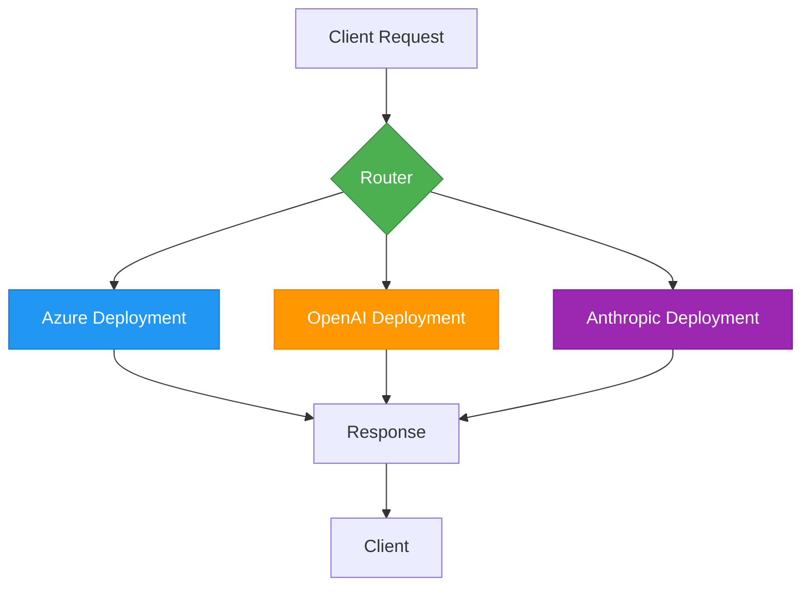
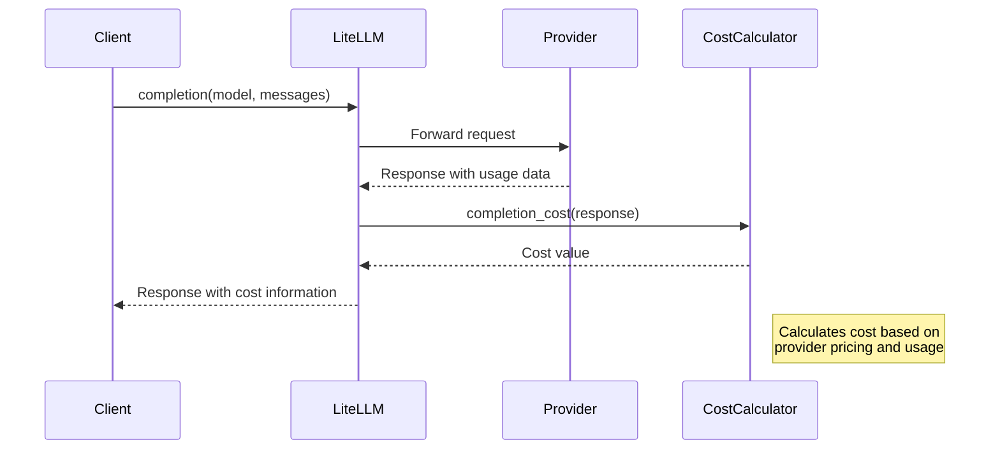
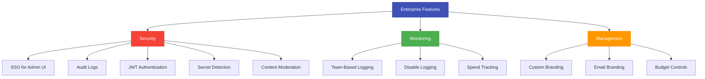
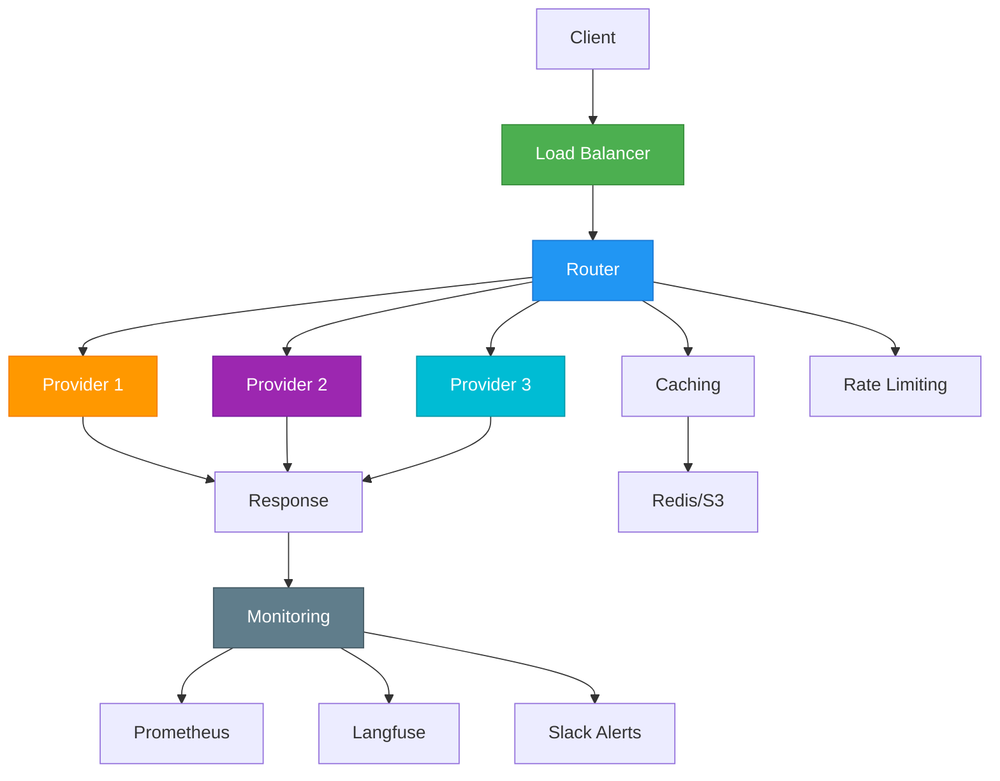
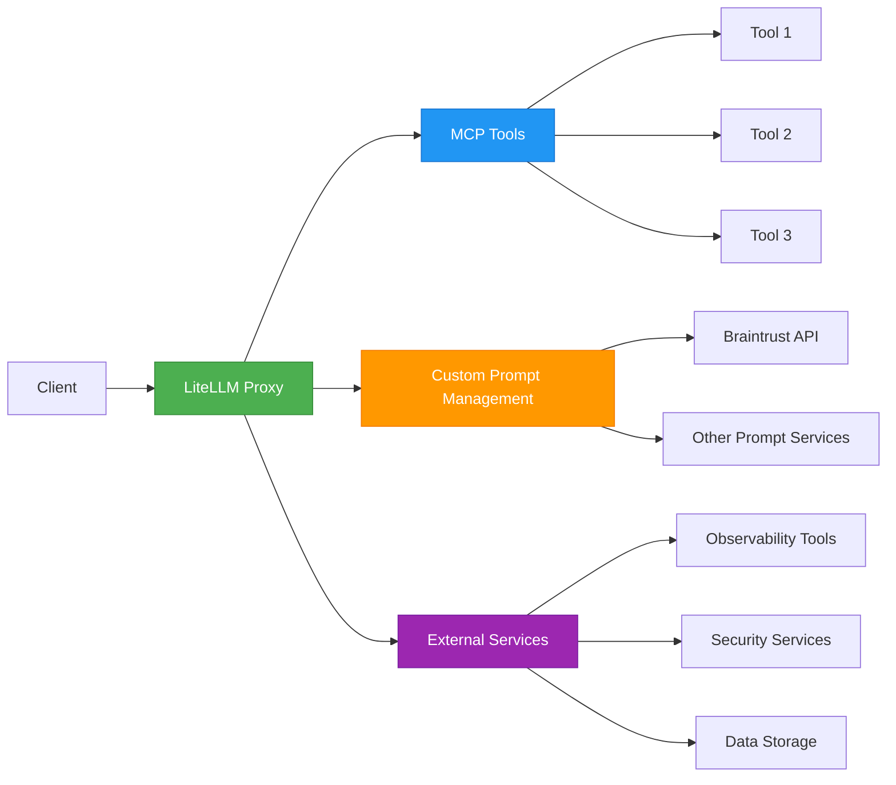

# Tutorials

<cite>
**Referenced Files in This Document**   
- [load_test_router.py](file://cookbook/litellm_router/load_test_router.py)
- [load_test_proxy.py](file://cookbook/litellm_router/load_test_proxy.py)
- [LiteLLM_Completion_Cost.ipynb](file://cookbook/LiteLLM_Completion_Cost.ipynb)
- [braintrust_prompt_wrapper_server.py](file://cookbook/litellm_proxy_server/braintrust_prompt_wrapper_server.py)
- [mcp_with_litellm_proxy.py](file://cookbook/litellm_proxy_server/mcp/mcp_with_litellm_proxy.py)
- [enterprise.md](file://docs/my-website/docs/proxy/enterprise.md)
- [router.py](file://litellm/router.py)
- [router_strategy](file://litellm/router_strategy)
- [proxy_server.py](file://litellm/proxy/proxy_server.py)
</cite>

## Table of Contents
1. [Introduction](#introduction)
2. [Multi-Provider Routing](#multi-provider-routing)
3. [Cost Tracking Implementation](#cost-tracking-implementation)
4. [Enterprise Features Configuration](#enterprise-features-configuration)
5. [Production-Grade LLM Gateway](#production-grade-llm-gateway)
6. [Integration Patterns](#integration-patterns)
7. [Troubleshooting Guide](#troubleshooting-guide)
8. [Performance Optimization](#performance-optimization)

## Introduction
This tutorial provides comprehensive guidance on implementing practical LiteLLM solutions for various use cases. The documentation covers step-by-step implementations of multi-provider routing, cost tracking, enterprise features, and production-grade LLM gateway configurations. The content is designed to help developers build robust LLM applications with failover mechanisms, monitoring capabilities, and optimized performance. The tutorial leverages examples from the cookbook directory to demonstrate complete implementations of common scenarios and integration patterns with popular frameworks and tools.

## Multi-Provider Routing

This section covers the implementation of multi-provider routing using LiteLLM's Router class, which enables load balancing and failover across multiple LLM providers. The Router allows you to define multiple model deployments and automatically routes requests based on various strategies such as least busy, lowest cost, or lowest latency.

The implementation involves creating a model list with different provider configurations and initializing the Router with this list. The Router handles the complexity of translating inputs to different provider formats, managing retries, and implementing fallback logic when a provider fails. This approach provides high availability and reliability for LLM applications by distributing requests across multiple providers and automatically failing over when necessary.

**Diagram sources**
- [load_test_router.py](file://cookbook/litellm_router/load_test_router.py#L17-L43)
- [router.py](file://litellm/router.py#L272-L279)

**Section sources**
- [load_test_router.py](file://cookbook/litellm_router/load_test_router.py#L11-L44)
- [router.py](file://litellm/router.py#L266-L3118)

## Cost Tracking Implementation

This section demonstrates how to implement cost tracking for LLM completions using LiteLLM's completion_cost function. The cost tracking feature allows you to calculate the cost of each completion call across different providers, enabling accurate budgeting and cost monitoring for your LLM applications.

The implementation involves making completion calls to various LLM providers and then using the completion_cost function to calculate the cost of each response. This feature supports multiple providers including OpenAI, Together AI, and Replicate, providing a unified way to track costs regardless of the underlying provider. The cost information can be used to optimize provider selection based on cost-effectiveness and to implement budget controls for your applications.

**Diagram sources**
- [LiteLLM_Completion_Cost.ipynb](file://cookbook/LiteLLM_Completion_Cost.ipynb#L50-L64)
- [cost_calculator.py](file://litellm/cost_calculator.py)

**Section sources**
- [LiteLLM_Completion_Cost.ipynb](file://cookbook/LiteLLM_Completion_Cost.ipynb#L1-L241)

## Enterprise Features Configuration

This section covers the configuration of enterprise features in LiteLLM, which provide enhanced security, monitoring, and management capabilities for production deployments. The enterprise features include SSO for admin UI, audit logs with retention policies, JWT authentication, and secret management integration with AWS Key Manager, Google Secret Manager, and Hashicorp Vault.

The implementation involves enabling these features through configuration settings and environment variables. For example, secret detection and redaction can be enabled by adding "hide_secrets" to the callbacks list in the configuration. Content moderation can be implemented using LLM Guard, LlamaGuard, or Google Text Moderation by configuring the appropriate callbacks. These enterprise features help organizations meet compliance requirements and implement robust security controls for their LLM applications.

**Diagram sources**
- [enterprise.md](file://docs/my-website/docs/proxy/enterprise.md#L14-L37)
- [proxy_server.py](file://litellm/proxy/proxy_server.py)

**Section sources**
- [enterprise.md](file://docs/my-website/docs/proxy/enterprise.md#L1-L800)

## Production-Grade LLM Gateway

This section demonstrates how to build a production-grade LLM gateway with failover and monitoring capabilities using LiteLLM. The implementation combines multi-provider routing, cost tracking, and enterprise features to create a robust and reliable LLM gateway suitable for production environments.

The gateway architecture includes load balancing across multiple providers, automatic failover when providers experience issues, comprehensive monitoring through integration with observability tools, and detailed logging for debugging and auditing purposes. The implementation also includes performance optimization techniques such as caching and rate limiting to ensure efficient resource utilization and prevent abuse.

**Diagram sources**
- [load_test_proxy.py](file://cookbook/litellm_router/load_test_proxy.py#L84-L87)
- [proxy_server.py](file://litellm/proxy/proxy_server.py)
- [prometheus.py](file://litellm/integrations/prometheus.py)

**Section sources**
- [load_test_proxy.py](file://cookbook/litellm_router/load_test_proxy.py#L11-L44)
- [proxy_server.py](file://litellm/proxy/proxy_server.py)

## Integration Patterns

This section covers integration patterns with popular frameworks and tools, demonstrating how to extend LiteLLM's capabilities through custom implementations and third-party service integration. The examples include implementing MCP (Model Control Protocol) tools, creating custom prompt management wrappers, and integrating with external services for enhanced functionality.

One key integration pattern is the MCP gateway, which allows using the same MCP tools across all LLM providers through the LiteLLM proxy. Another pattern is the custom prompt management integration, which demonstrates how to create a wrapper server that transforms Braintrust's prompt API response into the format expected by LiteLLM's generic prompt management client. These integration patterns showcase LiteLLM's extensibility and ability to work seamlessly with various tools and services in the AI ecosystem.

**Diagram sources**
- [mcp_with_litellm_proxy.py](file://cookbook/litellm_proxy_server/mcp/mcp_with_litellm_proxy.py#L8-L36)
- [braintrust_prompt_wrapper_server.py](file://cookbook/litellm_proxy_server/braintrust_prompt_wrapper_server.py#L26-L275)

**Section sources**
- [mcp_with_litellm_proxy.py](file://cookbook/litellm_proxy_server/mcp/mcp_with_litellm_proxy.py#L1-L37)
- [braintrust_prompt_wrapper_server.py](file://cookbook/litellm_proxy_server/braintrust_prompt_wrapper_server.py#L1-L275)

## Troubleshooting Guide

This section provides guidance for troubleshooting common implementation issues with LiteLLM. The most frequent issues include configuration errors, authentication problems, provider-specific limitations, and performance bottlenecks.

Common configuration issues often relate to incorrect model names, missing API keys, or improper routing strategy settings. Authentication problems typically involve invalid or expired API keys, incorrect environment variable settings, or misconfigured SSO integrations. Provider-specific limitations may include rate limits, request size constraints, or unsupported features. Performance bottlenecks can occur due to inefficient caching strategies, inadequate connection pooling, or suboptimal routing configurations.

The troubleshooting approach involves checking logs for error messages, verifying configuration settings, testing individual components in isolation, and using monitoring tools to identify performance issues. The LiteLLM proxy provides detailed logging and monitoring capabilities that can help diagnose and resolve these issues effectively.

**Section sources**
- [load_test_router.py](file://cookbook/litellm_router/load_test_router.py#L101-L105)
- [enterprise.md](file://docs/my-website/docs/proxy/enterprise.md#L287-L291)

## Performance Optimization

This section covers performance optimization tips for LiteLLM implementations. Key optimization strategies include implementing efficient caching mechanisms, optimizing routing strategies, managing connection pooling, and tuning timeout settings.

Caching can significantly improve performance by reducing redundant API calls to LLM providers. LiteLLM supports various caching backends including Redis, S3, and in-memory cache. Routing strategies should be selected based on the specific use case - for example, latency-based routing for real-time applications or cost-based routing for budget-conscious deployments.

Connection pooling helps manage concurrent requests efficiently, while appropriate timeout settings prevent hanging requests and improve overall system responsiveness. Additional optimization techniques include using streaming responses to reduce latency, implementing proper error handling and retry logic, and monitoring system performance to identify and address bottlenecks.

**Section sources**
- [router.py](file://litellm/router.py#L3088-L3118)
- [router_strategy](file://litellm/router_strategy)